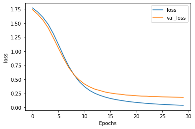

```python
import csv
import tensorflow as tf 
from tensorflow.keras.preprocessing.text import Tokenizer
```


```python
from tensorflow.keras.preprocessing.sequence import pad_sequences 
```


```python
#DATA cleaning and preperation 
```


```python
vocab_size= 1000 # only need i 1000 word
embedding_dim=16
max_length = 120 
trunc_type='post'
padding_type='post'
#when we have unclassified word it will be out of vocal
oov_tok='<OOV>'
#divid data 80% training and 20% test 
training_poration=0.8

```


```python
sentences=[] 
label=[]
Stop_lsit=['i', 'me', 'my', 'myself', 'we', 'our', 'ours', 'ourselves', 'you', "you're", "you've", "you'll", "you'd", 'your', 'yours', 'yourself', 'yourselves', 'he', 'him', 'his', 'himself', 'she', "she's", 'her', 'hers', 'herself', 'it', "it's", 'its', 'itself', 'they', 'them', 'their', 'theirs', 'themselves', 'what', 'which', 'who', 'whom', 'this', 'that', "that'll", 'these', 'those', 'am', 'is', 'are', 'was', 'were', 'be', 'been', 'being', 'have', 'has', 'had', 'having', 'do', 'does', 'did', 'doing', 'a', 'an', 'the', 'and', 'but', 'if', 'or', 'because', 'as', 'until', 'while', 'of', 'at', 'by', 'for', 'with', 'about', 'against', 'between', 'into', 'through', 'during', 'before', 'after', 'above', 'below', 'to', 'from', 'up', 'down', 'in', 'out', 'on', 'off', 'over', 'under', 'again', 'further', 'then', 'once', 'here', 'there', 'when', 'where', 'why', 'how', 'all', 'any', 'both', 'each', 'few', 'more', 'most', 'other', 'some', 'such', 'no', 'nor', 'not', 'only', 'own', 'same', 'so', 'than', 'too', 'very', 's', 't', 'can', 'will', 'just', 'don', "don't", 'should', "should've", 'now', 'd', 'll', 'm', 'o', 're', 've', 'y', 'ain', 'aren', "aren't", 'couldn', "couldn't", 'didn', "didn't", 'doesn', "doesn't", 'hadn', "hadn't", 'hasn', "hasn't", 'haven', "haven't", 'isn', "isn't", 'ma', 'mightn', "mightn't", 'mustn', "mustn't", 'needn', "needn't", 'shan', "shan't", 'shouldn', "shouldn't", 'wasn', "wasn't", 'weren', "weren't", 'won', "won't", 'wouldn', "wouldn't"]
```


```python
print(len(Stop_lsit))
```

    179
    


```python
with open (r"C:\Users\tahat\Downloads\bbc-text.csv",'r') as csvfile : 
    reader=csv.reader(csvfile,delimiter=',') 
    next(reader) 
    for row in reader : 
        label.append(row[0])
        sentence=row[1] 
        for word in Stop_lsit : 
            token=" " + word + " " 
            sentence=sentence.replace(token," ") 
        sentences.append(sentence)
print(sentences[0])
```

    tv future hands viewers home theatre systems  plasma high-definition tvs  digital video recorders moving living room  way people watch tv radically different five years  time.  according expert panel gathered annual consumer electronics show las vegas discuss new technologies impact one favourite pastimes. us leading trend  programmes content delivered viewers via home networks  cable  satellite  telecoms companies  broadband service providers front rooms portable devices.  one talked-about technologies ces digital personal video recorders (dvr pvr). set-top boxes  like us tivo uk sky+ system  allow people record  store  play  pause forward wind tv programmes want.  essentially  technology allows much personalised tv. also built-in high-definition tv sets  big business japan us  slower take europe lack high-definition programming. people forward wind adverts  also forget abiding network channel schedules  putting together a-la-carte entertainment. us networks cable satellite companies worried means terms advertising revenues well  brand identity  viewer loyalty channels. although us leads technology moment  also concern raised europe  particularly growing uptake services like sky+.  happens today  see nine months years  time uk   adam hume  bbc broadcast futurologist told bbc news website. likes bbc  issues lost advertising revenue yet. pressing issue moment commercial uk broadcasters  brand loyalty important everyone.  talking content brands rather network brands   said tim hanlon  brand communications firm starcom mediavest.  reality broadband connections  anybody producer content.  added:  challenge is hard promote programme much choice.   means  said stacey jolna  senior vice president tv guide tv group  way people find content want watch simplified tv viewers. means networks  us terms  channels could take leaf google book search engine future  instead scheduler help people find want watch. kind channel model might work younger ipod generation used taking control gadgets play them. might suit everyone  panel recognised. older generations comfortable familiar schedules channel brands know getting. perhaps want much choice put hands  mr hanlon suggested.  end  kids diapers pushing buttons already - everything possible available   said mr hanlon.  ultimately  consumer tell market want.   50 000 new gadgets technologies showcased ces  many enhancing tv-watching experience. high-definition tv sets everywhere many new models lcd (liquid crystal display) tvs launched dvr capability built  instead external boxes. one example launched show humax 26-inch lcd tv 80-hour tivo dvr dvd recorder. one us biggest satellite tv companies  directtv  even launched branded dvr show 100-hours recording capability  instant replay  search function. set pause rewind tv 90 hours. microsoft chief bill gates announced pre-show keynote speech partnership tivo  called tivotogo  means people play recorded programmes windows pcs mobile devices. reflect increasing trend freeing multimedia people watch want  want.
    


```python
# dividing the data 

train_size=int(len(sentences) * training_poration) 

training_sentences=sentences[:train_size] 
traing_lable=label[:train_size]

testing_sentences=sentences[train_size:] 
tesing_label=label[train_size:] 


```


```python

tekonizer=Tokenizer(num_words=vocab_size ,oov_token=oov_tok ) 
tekonizer.fit_on_texts(training_sentences)
word_index=tekonizer.word_index #give an index for every word  a dic 


```


```python
print(word_index)
```

    {'<OOV>': 1, 'said': 2, 'mr': 3, 'would': 4, 'year': 5, 'also': 6, 'people': 7, 'new': 8, 'us': 9, 'one': 10, 'could': 11, 'last': 12, 'first': 13, 'time': 14, 'two': 15, 'government': 16, 'world': 17, 'uk': 18, 'best': 19, 'years': 20, 'make': 21, 'film': 22, 'told': 23, 'made': 24, 'get': 25, 'music': 26, 'game': 27, 'like': 28, 'back': 29, 'many': 30, '000': 31, 'labour': 32, 'three': 33, 'well': 34, '1': 35, 'next': 36, 'bbc': 37, 'take': 38, 'set': 39, 'number': 40, 'added': 41, 'way': 42, 'market': 43, '2': 44, 'company': 45, 'may': 46, 'says': 47, 'election': 48, 'home': 49, 'party': 50, 'good': 51, 'going': 52, 'much': 53, 'work': 54, '2004': 55, 'still': 56, 'win': 57, 'show': 58, 'think': 59, 'games': 60, 'go': 61, 'top': 62, 'second': 63, 'million': 64, '6': 65, 'england': 66, 'firm': 67, 'since': 68, 'week': 69, 'say': 70, 'play': 71, 'part': 72, 'public': 73, 'use': 74, 'blair': 75, '3': 76, 'want': 77, 'minister': 78, 'however': 79, '10': 80, 'country': 81, 'technology': 82, 'see': 83, '4': 84, 'five': 85, 'british': 86, 'news': 87, 'european': 88, 'high': 89, 'group': 90, 'tv': 91, 'used': 92, 'end': 93, 'expected': 94, 'even': 95, 'players': 96, 'brown': 97, '5': 98, 'six': 99, 'old': 100, 'net': 101, 'already': 102, 'four': 103, 'plans': 104, 'put': 105, 'come': 106, 'half': 107, 'london': 108, 'sales': 109, 'growth': 110, 'long': 111, 'economy': 112, 'service': 113, 'right': 114, 'months': 115, 'chief': 116, 'day': 117, 'mobile': 118, 'former': 119, 'money': 120, 'britain': 121, 'director': 122, 'tax': 123, 'services': 124, '2005': 125, 'deal': 126, 'need': 127, 'help': 128, 'digital': 129, 'according': 130, 'big': 131, 'industry': 132, 'place': 133, 'companies': 134, 'users': 135, 'system': 136, 'business': 137, 'including': 138, 'team': 139, 'final': 140, 'based': 141, 'hit': 142, 'record': 143, 'report': 144, 'third': 145, 'called': 146, 'really': 147, 'international': 148, 'month': 149, 'move': 150, 'wales': 151, 'europe': 152, 'another': 153, '7': 154, 'life': 155, 'around': 156, 'economic': 157, 'start': 158, 'great': 159, 'future': 160, '2003': 161, 'firms': 162, 'came': 163, 'france': 164, 'open': 165, 'got': 166, 'spokesman': 167, 'software': 168, 'without': 169, 'general': 170, 'club': 171, 'up': 172, 'took': 173, 'ireland': 174, 'video': 175, 'howard': 176, 'know': 177, 'united': 178, 'online': 179, 'bank': 180, 'phone': 181, 'china': 182, 'far': 183, 'state': 184, 'campaign': 185, 'side': 186, 'law': 187, 'radio': 188, 'better': 189, 'court': 190, 'making': 191, 'decision': 192, 'executive': 193, 'real': 194, 'media': 195, 'offer': 196, 'give': 197, 'computer': 198, 'found': 199, 'action': 200, 'able': 201, 'president': 202, 'information': 203, 'despite': 204, 'office': 205, 'star': 206, 'lot': 207, 'national': 208, 'line': 209, 'countries': 210, 'likely': 211, 'using': 212, 'away': 213, 'player': 214, 'internet': 215, 'saying': 216, 'it': 217, 'every': 218, 'given': 219, 'security': 220, 'become': 221, 'left': 222, 'awards': 223, 'figures': 224, 'anti': 225, 'nations': 226, 'run': 227, 'eu': 228, '20': 229, 'cost': 230, 'prime': 231, 'role': 232, 'seen': 233, 'playing': 234, 'biggest': 235, 'man': 236, 'january': 237, 'data': 238, 'bill': 239, 'whether': 240, 'played': 241, 'later': 242, 'foreign': 243, 'although': 244, 'cup': 245, 'hard': 246, 'award': 247, 'rise': 248, 'broadband': 249, 'times': 250, 'match': 251, 'chancellor': 252, 'oil': 253, 'pay': 254, 'lost': 255, 'taking': 256, 'house': 257, 'due': 258, 'past': 259, 'interest': 260, 'early': 261, 'never': 262, 'lord': 263, 'leader': 264, 'support': 265, 'case': 266, 'prices': 267, 'look': 268, 'microsoft': 269, 'shares': 270, 'michael': 271, 'legal': 272, 'analysts': 273, 'control': 274, 'believe': 275, 'december': 276, 'less': 277, 'days': 278, 'cut': 279, 'recent': 280, 'season': 281, 'little': 282, 'children': 283, 'e': 284, 'ahead': 285, 'earlier': 286, 'increase': 287, 'thought': 288, 'free': 289, 'john': 290, 'face': 291, 'research': 292, 'scotland': 293, 'important': 294, 'something': 295, 'current': 296, 'strong': 297, 'went': 298, 'issue': 299, 'secretary': 300, 'south': 301, 'local': 302, 'tory': 303, 'rights': 304, 'working': 305, 'power': 306, 'budget': 307, 'financial': 308, 'spending': 309, '12': 310, 'quarter': 311, 'access': 312, 'currently': 313, 'held': 314, 'major': 315, 'chance': 316, 'change': 317, 'trade': 318, 'films': 319, 'find': 320, 'looking': 321, 'try': 322, 'following': 323, 'sunday': 324, '0': 325, 'full': 326, 'tories': 327, 'yet': 328, 'return': 329, 'series': 330, 'latest': 331, 'meeting': 332, 'share': 333, 'different': 334, 'website': 335, 'david': 336, 'winning': 337, 'almost': 338, 'injury': 339, 'sale': 340, 'must': 341, 'lead': 342, 'enough': 343, 'personal': 344, 'programme': 345, 'might': 346, 'police': 347, 'low': 348, 'band': 349, 'problems': 350, 'ever': 351, 'keep': 352, 'rate': 353, 'announced': 354, 'always': 355, 'key': 356, 'coach': 357, 'williams': 358, 'sold': 359, 'across': 360, 'performance': 361, 'dollar': 362, '11': 363, 'among': 364, 'behind': 365, 'ago': 366, 'list': 367, '8': 368, '9': 369, 'clear': 370, 'getting': 371, 'political': 372, 'victory': 373, '25': 374, 'mark': 375, 'chairman': 376, 'include': 377, 'women': 378, 'demand': 379, '30': 380, 'statement': 381, 'ms': 382, 'march': 383, 'february': 384, 'things': 385, 'term': 386, 'rather': 387, 'jobs': 388, 'minutes': 389, 'tuesday': 390, 'american': 391, 'chelsea': 392, 'claims': 393, 'done': 394, 'content': 395, 'continue': 396, 'point': 397, 'job': 398, 'manager': 399, 'means': 400, 'head': 401, 'problem': 402, 'title': 403, 'actor': 404, 'coming': 405, 'huge': 406, 'price': 407, 'asked': 408, 'released': 409, 'taken': 410, 'mail': 411, 'men': 412, 'union': 413, 'members': 414, 'india': 415, 'allow': 416, 'weeks': 417, 'wednesday': 418, 'act': 419, 'japan': 420, 'rugby': 421, 'plan': 422, 'tony': 423, 'global': 424, 'investment': 425, 'least': 426, 'result': 427, 'apple': 428, '50': 429, 'young': 430, 'network': 431, 'today': 432, 'within': 433, 'costs': 434, 'fans': 435, 'forward': 436, 'bid': 437, 'main': 438, 'french': 439, 'possible': 440, 'production': 441, 'needed': 442, 'running': 443, 'site': 444, 'beat': 445, 'november': 446, '18': 447, 'small': 448, 'war': 449, 'council': 450, 'consumer': 451, 'available': 452, 'saturday': 453, 'form': 454, 'warned': 455, 'thing': 456, 'monday': 457, 'cash': 458, 'vote': 459, 'hold': 460, 'several': 461, 'known': 462, 'wanted': 463, 'mps': 464, 'song': 465, 'pc': 466, 'issues': 467, 'total': 468, 'committee': 469, 'friday': 470, '15': 471, 'level': 472, 'live': 473, 'football': 474, 'though': 475, 'evidence': 476, 'policy': 477, 'prize': 478, 'version': 479, 'success': 480, 'led': 481, 'league': 482, 'search': 483, 'trying': 484, '2001': 485, 'human': 486, 'calls': 487, 'previous': 488, 'buy': 489, 'sir': 490, 'recently': 491, 'saw': 492, 'web': 493, 'sony': 494, 'rates': 495, 'family': 496, 'parties': 497, 'aid': 498, 'single': 499, 'album': 500, 'centre': 501, 'eight': 502, 'name': 503, 'customers': 504, 'rules': 505, 'meet': 506, 'close': 507, 'development': 508, 'ministers': 509, 'others': 510, 'thursday': 511, 'health': 512, 'book': 513, 'competition': 514, 'stock': 515, 'agreed': 516, 'call': 517, 'phones': 518, '100': 519, 'difficult': 520, 'short': 521, 'let': 522, 'race': 523, 'yukos': 524, 'consumers': 525, 'popular': 526, 'comes': 527, 'co': 528, 'fact': 529, 'charles': 530, 'event': 531, 'hope': 532, 'to': 533, 'failed': 534, 'fourth': 535, 'higher': 536, 'showed': 537, 'networks': 538, 'debt': 539, 'board': 540, 'actress': 541, 'commission': 542, 'trial': 543, 'city': 544, 'wants': 545, 'october': 546, 'italy': 547, 'choice': 548, 'york': 549, 'lib': 550, 'reported': 551, 'feel': 552, 'nothing': 553, 'conference': 554, 'project': 555, 'career': 556, 'bt': 557, 'sites': 558, 'boss': 559, 'points': 560, 'liberal': 561, 'late': 562, 'sure': 563, 'liverpool': 564, 'festival': 565, 'reports': 566, 'black': 567, 'received': 568, 'cannot': 569, 'annual': 570, 'together': 571, 'instead': 572, 'claim': 573, 'shows': 574, 'gaming': 575, 'tour': 576, 'on': 577, 'dvd': 578, 'break': 579, 'launch': 580, 'claimed': 581, 'paid': 582, 'mean': 583, 'devices': 584, 'christmas': 585, 'jones': 586, 'movie': 587, 'boost': 588, 'goal': 589, 'virus': 590, 'growing': 591, 'stage': 592, 'release': 593, 'age': 594, 'largest': 595, 'september': 596, 'large': 597, 'leading': 598, 'summer': 599, 'champion': 600, 'in': 601, '2002': 602, 'involved': 603, 'position': 604, 'arsenal': 605, 'west': 606, 'denied': 607, 'changes': 608, 'russian': 609, 'out': 610, 'believes': 611, 'manchester': 612, 'profits': 613, 'paul': 614, 'singer': 615, 'iraq': 616, 'needs': 617, 'fall': 618, 'television': 619, 'products': 620, 'idea': 621, 'stop': 622, 'them': 623, 'gordon': 624, 'parliament': 625, '17': 626, 'australian': 627, 'pressure': 628, 'sport': 629, 'love': 630, 'germany': 631, 'africa': 632, 'started': 633, 'create': 634, 'order': 635, 'scottish': 636, 'talks': 637, 'giant': 638, 'potential': 639, '13': 640, 'german': 641, 'test': 642, 'pre': 643, 'weekend': 644, '16': 645, 'quite': 646, 'round': 647, 'opening': 648, 'whole': 649, 'squad': 650, 'martin': 651, 'that': 652, 'association': 653, 'special': 654, 'senior': 655, 'launched': 656, 'box': 657, 'chart': 658, 'oscar': 659, 'seven': 660, 'street': 661, 'rose': 662, 'value': 663, 'conservative': 664, 'sent': 665, 'stars': 666, 'ball': 667, 'car': 668, 'v': 669, 'anything': 670, 'grand': 671, 'groups': 672, 'hours': 673, 'accused': 674, '40': 675, 'stand': 676, 'remain': 677, '2000': 678, 'cards': 679, 'either': 680, 'hopes': 681, 'ensure': 682, 'olympic': 683, 'simply': 684, 'robinson': 685, 'fight': 686, 'similar': 687, 'press': 688, 'smith': 689, 'range': 690, 'irish': 691, 'drive': 692, '2006': 693, 'exchange': 694, 'rock': 695, 'official': 696, '24': 697, '14': 698, 'results': 699, 'bit': 700, 'appeal': 701, 'turn': 702, 'dr': 703, 'provide': 704, 'ukip': 705, 'immigration': 706, 'period': 707, 'makes': 708, 'target': 709, 'helped': 710, 'investors': 711, 'standard': 712, 'wrong': 713, 'sell': 714, 'attack': 715, 'commons': 716, 'fell': 717, 'independent': 718, 'tsunami': 719, 'particularly': 720, 'meanwhile': 721, 'comedy': 722, 'proposals': 723, 'education': 724, 'average': 725, 'energy': 726, 'lords': 727, 'ban': 728, 'gave': 729, 'impact': 730, 'via': 731, 'moment': 732, 'compared': 733, 'school': 734, 'happy': 735, 'card': 736, 'forced': 737, 'charge': 738, 'attacks': 739, 'spam': 740, 'generation': 741, 'force': 742, 'brought': 743, 'amount': 744, 'private': 745, 'community': 746, 'sector': 747, 'per': 748, 'bring': 749, 'fraud': 750, 'became': 751, 'fund': 752, 'euros': 753, 'extra': 754, 'systems': 755, 'everyone': 756, 'speech': 757, 'admitted': 758, 'poll': 759, 'history': 760, 'message': 761, 'numbers': 762, 'included': 763, 'widely': 764, 'gadget': 765, 'entertainment': 766, 'windows': 767, 'debate': 768, 'speaking': 769, 'selling': 770, 'hand': 771, 'bad': 772, 'department': 773, 'laws': 774, 're': 775, 'workers': 776, 'date': 777, 'australia': 778, 'charges': 779, 'markets': 780, 'night': 781, 'audience': 782, 'named': 783, 'russia': 784, 'comments': 785, 'soon': 786, 'worked': 787, 'staff': 788, 'agency': 789, 'off': 790, 'view': 791, 'turned': 792, 'kilroy': 793, 'mike': 794, 'front': 795, 'member': 796, 'shot': 797, 'bush': 798, 'revealed': 799, 'areas': 800, 'download': 801, 'takes': 802, 'speed': 803, 'screen': 804, 'increased': 805, 'all': 806, 'opposition': 807, 'university': 808, 'battle': 809, 'civil': 810, 'kennedy': 811, 'spend': 812, 'air': 813, 'finance': 814, 'newspaper': 815, 'him': 816, 'opportunity': 817, 'concerns': 818, 'shown': 819, 'survey': 820, 'area': 821, 'cross': 822, 'white': 823, 'gone': 824, 'voters': 825, 'course': 826, 'original': 827, 'millions': 828, 'bought': 829, 'offered': 830, 'â£1': 831, 'poor': 832, 'alan': 833, 'followed': 834, 'east': 835, 'concerned': 836, 'leave': 837, 'often': 838, 'decided': 839, 'insisted': 840, 'authorities': 841, 'outside': 842, 'b': 843, 'favourite': 844, 'terms': 845, 'defence': 846, 'step': 847, 'whose': 848, 'june': 849, 'story': 850, 'reached': 851, 'analyst': 852, 'lives': 853, 'created': 854, 'designed': 855, 'mini': 856, 'process': 857, 'non': 858, 'risk': 859, '22': 860, 'america': 861, 'body': 862, 'quality': 863, 'easy': 864, 'spent': 865, 'cuts': 866, 'becoming': 867, 'remains': 868, 'unit': 869, 'majority': 870, 'raise': 871, 'pop': 872, 'attempt': 873, 'musical': 874, 'r': 875, 'drugs': 876, 'hollywood': 877, 'challenge': 878, 'experience': 879, 'example': 880, '19': 881, 'debut': 882, 'nominated': 883, 'states': 884, 'reach': 885, 'credit': 886, 'messages': 887, 'levels': 888, 'winner': 889, 'ray': 890, 'robert': 891, 'silk': 892, 'watch': 893, 'andy': 894, 'situation': 895, 'focus': 896, 'taxes': 897, 'euro': 898, 'songs': 899, 'organisation': 900, 'build': 901, 'everything': 902, 'believed': 903, 'april': 904, 'tough': 905, 'central': 906, 'anyone': 907, 'signed': 908, 'j': 909, 'pcs': 910, 'captain': 911, 'rival': 912, 'device': 913, 'indian': 914, 'confirmed': 915, 'james': 916, 'so': 917, 'titles': 918, 'businesses': 919, 'post': 920, 'technologies': 921, 'critics': 922, 'matter': 923, 'previously': 924, 'trading': 925, 'rest': 926, 'met': 927, 'began': 928, 'longer': 929, 'officials': 930, 'response': 931, 'probably': 932, 'nine': 933, 'hour': 934, 'row': 935, 'minute': 936, 'light': 937, 'cases': 938, 'magazine': 939, 'building': 940, 'worth': 941, 'account': 942, 'voice': 943, 'programs': 944, 'ask': 945, 'looked': 946, 'mp': 947, 'davis': 948, 'aviator': 949, 'threat': 950, 'trust': 951, 'confidence': 952, 'looks': 953, 'g': 954, 'chinese': 955, 'machine': 956, 'gold': 957, 'category': 958, 'computers': 959, 'premiership': 960, 'host': 961, 'measures': 962, 'fast': 963, 'person': 964, 'ruled': 965, 'towards': 966, 'artists': 967, 'double': 968, 'training': 969, 'missed': 970, 'felt': 971, 'care': 972, 'agreement': 973, 'allowed': 974, 'madrid': 975, 'scheme': 976, 'zealand': 977, 'fear': 978, 'theatre': 979, 'portable': 980, 'newcastle': 981, 'north': 982, 'serious': 983, 'spain': 984, 'management': 985, 'banks': 986, 'program': 987, 'figure': 988, 'johnson': 989, 'positive': 990, 'affected': 991, 'champions': 992, 'file': 993, 'deutsche': 994, 'google': 995, 'kept': 996, 'rising': 997, 'rule': 998, 'argued': 999, 'along': 1000, 'death': 1001, 'ceremony': 1002, 'code': 1003, 'income': 1004, 'near': 1005, 'approach': 1006, 'machines': 1007, 'built': 1008, 'domestic': 1009, 'moved': 1010, 'stay': 1011, 'profit': 1012, 'illegal': 1013, 'sound': 1014, 'de': 1015, 'doubt': 1016, 'confident': 1017, 'question': 1018, 'gadgets': 1019, 'defeat': 1020, 'dropped': 1021, 'lower': 1022, '27': 1023, 'described': 1024, 'society': 1025, 'effort': 1026, 'successful': 1027, 'websites': 1028, 'significant': 1029, 'thousands': 1030, 'wide': 1031, 'written': 1032, 'deficit': 1033, 'social': 1034, 'athens': 1035, 'crime': 1036, 'peter': 1037, 'predicted': 1038, 'couple': 1039, 'recovery': 1040, 'wireless': 1041, 'pair': 1042, 'announcement': 1043, 'protection': 1044, 'peer': 1045, 'mobiles': 1046, 'suggested': 1047, 'leaders': 1048, 'asia': 1049, 'daily': 1050, 'planning': 1051, 'appear': 1052, 'actually': 1053, 'giving': 1054, 'disaster': 1055, 'talk': 1056, 'democrats': 1057, 'offering': 1058, 'operating': 1059, 'files': 1060, 'someone': 1061, 'expect': 1062, 'parents': 1063, 'bankruptcy': 1064, 'taylor': 1065, 'send': 1066, 'judge': 1067, 'nearly': 1068, 'ways': 1069, 'effect': 1070, 'penalty': 1071, 'conservatives': 1072, 'present': 1073, 'talking': 1074, 'terror': 1075, 'richard': 1076, '5bn': 1077, 'controversial': 1078, 'takeover': 1079, 'speculation': 1080, 'road': 1081, 'clarke': 1082, 'facing': 1083, 'text': 1084, 'english': 1085, 'exports': 1086, 'child': 1087, 'drop': 1088, 'mac': 1089, 'leicester': 1090, 'ready': 1091, 'park': 1092, 'policies': 1093, 'spanish': 1094, 'edinburgh': 1095, 'golden': 1096, 'cabinet': 1097, 'massive': 1098, 'individual': 1099, 'add': 1100, 'died': 1101, 'especially': 1102, 'dems': 1103, 'students': 1104, 'blunkett': 1105, 'viewers': 1106, 'programmes': 1107, 'sullivan': 1108, 'airline': 1109, 'backed': 1110, 'stake': 1111, 'joined': 1112, 'hoping': 1113, 'ruling': 1114, 'king': 1115, 'suggests': 1116, 'wins': 1117, 'highest': 1118, 'voted': 1119, 'track': 1120, 'keen': 1121, '28': 1122, 'fox': 1123, 'thomas': 1124, 'mind': 1125, 'channel': 1126, 'shareholders': 1127, 'schools': 1128, 'id': 1129, 'seed': 1130, 'certainly': 1131, 'tournament': 1132, 'loss': 1133, 'continued': 1134, 'understand': 1135, 'elections': 1136, 'happen': 1137, 'billion': 1138, 'beyond': 1139, 'marketing': 1140, 'hands': 1141, 'common': 1142, '60': 1143, '21': 1144, 'fuel': 1145, 'unlikely': 1146, 'heart': 1147, 'accounts': 1148, 'finding': 1149, 'nominations': 1150, 'planned': 1151, 'paris': 1152, 'ferguson': 1153, 'compete': 1154, 'contract': 1155, 'sign': 1156, 'tried': 1157, 'maker': 1158, 'adding': 1159, 'politicians': 1160, 'gamers': 1161, 'ground': 1162, 'produced': 1163, 'kick': 1164, 'overall': 1165, 'producers': 1166, 'gm': 1167, 'criticised': 1168, 'damage': 1169, 'happened': 1170, 'copies': 1171, 'concern': 1172, 'commercial': 1173, 'producer': 1174, 'ability': 1175, 'save': 1176, 'receive': 1177, 'over': 1178, 'developed': 1179, 'field': 1180, 'chip': 1181, 'july': 1182, 'insurance': 1183, 'images': 1184, 'particular': 1185, 'pretty': 1186, 'separate': 1187, 'starting': 1188, 'suffered': 1189, 'manufacturing': 1190, 'poverty': 1191, 'follow': 1192, 'fair': 1193, 'drama': 1194, 'living': 1195, 'raised': 1196, 'faces': 1197, 'hits': 1198, 'comment': 1199, 'politics': 1200, 'stadium': 1201, 'operators': 1202, 'details': 1203, 'relief': 1204, 'orders': 1205, 'limited': 1206, 'nintendo': 1207, 'supporters': 1208, 'friends': 1209, 'picture': 1210, 'steve': 1211, 'buying': 1212, 'gerrard': 1213, 'moving': 1214, 'panel': 1215, 'kind': 1216, 'ipod': 1217, 'falling': 1218, 'shadow': 1219, 'sort': 1220, 'picked': 1221, 'offers': 1222, 'movies': 1223, 'powers': 1224, '500': 1225, 'seems': 1226, 'seconds': 1227, 'criminal': 1228, 'developing': 1229, 'experts': 1230, 'glazer': 1231, 'spyware': 1232, 'lack': 1233, 'a': 1234, 'protect': 1235, 'george': 1236, 'duty': 1237, 'families': 1238, 'closed': 1239, 'agree': 1240, 'singles': 1241, 'federal': 1242, 'homes': 1243, 'works': 1244, 'asian': 1245, 'subject': 1246, 'promised': 1247, 'unemployment': 1248, 'fellow': 1249, 'consider': 1250, 'referee': 1251, 'pensions': 1252, 'slam': 1253, 'product': 1254, 'advantage': 1255, 'straw': 1256, 'winners': 1257, 'ex': 1258, 'unveiled': 1259, 'lse': 1260, '26': 1261, 'decisions': 1262, 'progress': 1263, 'cardiff': 1264, 'matches': 1265, 'rejected': 1266, 'august': 1267, 'reason': 1268, 'published': 1269, 'capital': 1270, 'suspended': 1271, 'warning': 1272, 'xbox': 1273, 'woman': 1274, 'console': 1275, 'goes': 1276, 'limit': 1277, 'kelly': 1278, 'tackle': 1279, 'improve': 1280, 'true': 1281, 'urban': 1282, 'minimum': 1283, 'aimed': 1284, 'appeared': 1285, 'hunting': 1286, 'draw': 1287, 'travel': 1288, 'editor': 1289, 'slow': 1290, 'japanese': 1291, 'refused': 1292, 'standards': 1293, 'alongside': 1294, 'inquiry': 1295, 'changed': 1296, 'indoor': 1297, 'green': 1298, 'quickly': 1299, 'affairs': 1300, '23': 1301, 'campbell': 1302, 'definition': 1303, 'sky': 1304, 'straight': 1305, 'direct': 1306, 'andrew': 1307, 'lose': 1308, 'jamie': 1309, '200': 1310, 'targets': 1311, 'existing': 1312, 'the': 1313, 'spot': 1314, 'middle': 1315, 'increasing': 1316, 'sides': 1317, 'review': 1318, 'beginning': 1319, 'ended': 1320, 'writing': 1321, 'secure': 1322, 'traffic': 1323, 'certain': 1324, 'introduced': 1325, 'born': 1326, 'inflation': 1327, 'gets': 1328, 'reform': 1329, 'meant': 1330, 'technical': 1331, 'super': 1332, 'urged': 1333, 'more': 1334, 'argentina': 1335, 'wage': 1336, 'study': 1337, 'alone': 1338, 'starring': 1339, 'legislation': 1340, 'pension': 1341, 'earnings': 1342, 'feature': 1343, 'answer': 1344, 'efforts': 1345, '45': 1346, 'talent': 1347, 'housing': 1348, 'fears': 1349, 'advice': 1350, 'morgan': 1351, 'lions': 1352, 'tests': 1353, 'retail': 1354, 'hip': 1355, 'stone': 1356, 'design': 1357, 'pictures': 1358, 'revenue': 1359, 'tim': 1360, 'vice': 1361, 'decide': 1362, 'championship': 1363, 'fit': 1364, 'language': 1365, 'paper': 1366, 'operations': 1367, 'broken': 1368, 'bigger': 1369, 'gives': 1370, 'includes': 1371, 'conditions': 1372, 'baby': 1373, 'piracy': 1374, 'asylum': 1375, 'electronics': 1376, 'interested': 1377, 'proved': 1378, 'output': 1379, 'missing': 1380, 'waiting': 1381, 's': 1382, 'avoid': 1383, 'address': 1384, 'sports': 1385, 'source': 1386, 'oscars': 1387, 'considered': 1388, 'showing': 1389, 'telephone': 1390, 'electronic': 1391, 'dem': 1392, 'index': 1393, 'character': 1394, 'size': 1395, 'greater': 1396, 'mourinho': 1397, 'crucial': 1398, 'cable': 1399, 'perhaps': 1400, 'guilty': 1401, 'strategy': 1402, 'carry': 1403, 'dominated': 1404, 'losing': 1405, 'relationship': 1406, 'championships': 1407, 'increasingly': 1408, 'questions': 1409, 'capacity': 1410, 'uses': 1411, 'helping': 1412, 'onto': 1413, '3g': 1414, 'proposed': 1415, 'clearly': 1416, 'rivals': 1417, 'simon': 1418, 'property': 1419, 'records': 1420, 'fiat': 1421, 'hop': 1422, 'viruses': 1423, 'store': 1424, 'putting': 1425, 'tell': 1426, 'responsible': 1427, 'los': 1428, 'environment': 1429, 'red': 1430, 'there': 1431, 'seek': 1432, 'now': 1433, 'forecast': 1434, 'obviously': 1435, 'grow': 1436, '5m': 1437, 'continuing': 1438, 'justice': 1439, 'produce': 1440, 'voting': 1441, 'auction': 1442, 'too': 1443, 'jackson': 1444, 'operation': 1445, 'initially': 1446, 'terrorism': 1447, 'morning': 1448, 'driven': 1449, 'roddick': 1450, 'events': 1451, 'simple': 1452, 'benefit': 1453, 'harry': 1454, 't': 1455, 'powerful': 1456, 'drug': 1457, 'welsh': 1458, 'natural': 1459, 'blog': 1460, 'academy': 1461, 'scored': 1462, 'van': 1463, 'transport': 1464, 'model': 1465, 'officer': 1466, 'continues': 1467, 'william': 1468, 'tie': 1469, 'lee': 1470, 'executives': 1471, '1997': 1472, 'hoped': 1473, 'deliver': 1474, 'self': 1475, 'division': 1476, 'claiming': 1477, 'caused': 1478, '1999': 1479, 'gazprom': 1480, 'basis': 1481, 'critical': 1482, 'tipped': 1483, '70': 1484, 'broadcast': 1485, 'lawyer': 1486, 'economist': 1487, 'else': 1488, 'birmingham': 1489, 'owned': 1490, 'korea': 1491, 'accept': 1492, 'faster': 1493, 'miss': 1494, 'join': 1495, 'suggest': 1496, 'smaller': 1497, 'estimated': 1498, 'projects': 1499, 'user': 1500, 'robbie': 1501, 'decade': 1502, 'scott': 1503, 'teams': 1504, 'fifth': 1505, 'responsibility': 1506, 'african': 1507, 'northern': 1508, 'chances': 1509, 'funding': 1510, 'makers': 1511, 'investigation': 1512, 'difference': 1513, 'nation': 1514, 'worldwide': 1515, 'stephen': 1516, 'cause': 1517, 'population': 1518, 'visitors': 1519, 'corporate': 1520, 'food': 1521, 'reduce': 1522, 'space': 1523, 'fighting': 1524, 'activity': 1525, 'favour': 1526, 'ian': 1527, 'replace': 1528, 'connection': 1529, 'airlines': 1530, 'aware': 1531, 'sense': 1532, 'queen': 1533, 'again': 1534, 'chris': 1535, 'unless': 1536, 'goals': 1537, 'victims': 1538, 'issued': 1539, 'striker': 1540, 'thinking': 1541, 'completely': 1542, 'royal': 1543, 'prince': 1544, 'managed': 1545, 'remained': 1546, 'features': 1547, 'behaviour': 1548, 'twice': 1549, 'amid': 1550, '3bn': 1551, 'greek': 1552, 'boerse': 1553, '80': 1554, 'finished': 1555, 'spokeswoman': 1556, 'inside': 1557, '31': 1558, 'interests': 1559, 'trouble': 1560, 'mails': 1561, 'gmt': 1562, 'for': 1563, 'wrote': 1564, 'unions': 1565, 'linked': 1566, 'opportunities': 1567, 'â£2': 1568, 'brian': 1569, 'read': 1570, 'finals': 1571, 'san': 1572, 'station': 1573, 'quit': 1574, 'storage': 1575, 'pass': 1576, 'kenteris': 1577, 'room': 1578, 'trend': 1579, 'display': 1580, 'knew': 1581, 'steven': 1582, 'down': 1583, 'tennis': 1584, 'cutting': 1585, 'plays': 1586, 'throughout': 1587, 'presented': 1588, 'evening': 1589, 'democrat': 1590, 'pace': 1591, 'funds': 1592, 'treasury': 1593, 'charity': 1594, 'interview': 1595, 'format': 1596, 'monthly': 1597, 'treatment': 1598, 'sharing': 1599, 'parry': 1600, 'revenues': 1601, 'multimedia': 1602, 'skills': 1603, 'fa': 1604, 'seeing': 1605, 'downing': 1606, 'fly': 1607, 'arrest': 1608, 'leadership': 1609, 'cinema': 1610, 'prevent': 1611, 'alleged': 1612, 'land': 1613, 'worst': 1614, 'aim': 1615, 'jump': 1616, 'faced': 1617, 'supporting': 1618, 'places': 1619, 'broke': 1620, 'israel': 1621, 'owen': 1622, 'telecoms': 1623, 'is': 1624, 'models': 1625, 'ebbers': 1626, 'finally': 1627, 'matt': 1628, 'angeles': 1629, 'pledged': 1630, 'milburn': 1631, 'score': 1632, 'jason': 1633, 'reuters': 1634, 'beating': 1635, 'finish': 1636, 'increases': 1637, 'organisations': 1638, 'failing': 1639, 'style': 1640, '1bn': 1641, 'jose': 1642, 'culture': 1643, 'paying': 1644, 'modern': 1645, 'questioned': 1646, 'chosen': 1647, 'handed': 1648, 'fully': 1649, 'sri': 1650, 'traditional': 1651, 'tries': 1652, 'words': 1653, 'extremely': 1654, 'com': 1655, 'ibm': 1656, 'olympics': 1657, 'athletics': 1658, 'expectations': 1659, 'hunt': 1660, 'discuss': 1661, 'connections': 1662, 'drawn': 1663, 'me': 1664, 'fine': 1665, 'opera': 1666, 'decline': 1667, 'no': 1668, 'courts': 1669, 'spread': 1670, 'serve': 1671, 'creating': 1672, 'accepted': 1673, 'handheld': 1674, 'improving': 1675, 'expects': 1676, 'creative': 1677, 'immediately': 1678, 'strength': 1679, 'wing': 1680, 'surprise': 1681, 'benefits': 1682, 'gara': 1683, 'foxx': 1684, 'holding': 1685, 'manifesto': 1686, 'bond': 1687, 'wenger': 1688, 'aids': 1689, 'happens': 1690, 'watching': 1691, 'bringing': 1692, 'follows': 1693, 'arrested': 1694, 'returned': 1695, 'maybe': 1696, 'securities': 1697, 'fantastic': 1698, 'administration': 1699, '1998': 1700, 'contest': 1701, 'watchdog': 1702, 'improved': 1703, 'federer': 1704, 'rises': 1705, 'strike': 1706, 'criticism': 1707, 'prepared': 1708, 'parliamentary': 1709, 'hewitt': 1710, 'dutch': 1711, 'rap': 1712, 'committed': 1713, 'constitution': 1714, 'malicious': 1715, 'dvds': 1716, 'brand': 1717, 'reality': 1718, 'older': 1719, 'fun': 1720, 'brother': 1721, 'blue': 1722, 'cell': 1723, 'yen': 1724, 'seeking': 1725, 'studios': 1726, 'provided': 1727, 'remaining': 1728, 'grew': 1729, 'effectively': 1730, 'absolutely': 1731, 'appears': 1732, 'playstation': 1733, 'intel': 1734, 'listen': 1735, 'expensive': 1736, '4bn': 1737, 'failure': 1738, 'joint': 1739, 'tech': 1740, 'touch': 1741, 'soul': 1742, 'leaving': 1743, 'currency': 1744, 'deputy': 1745, 'lewis': 1746, 'yahoo': 1747, '90': 1748, 'recorded': 1749, 'assets': 1750, 'science': 1751, 'camp': 1752, 'proposal': 1753, 'developers': 1754, 'heard': 1755, 'handsets': 1756, 'lets': 1757, 'suspects': 1758, 'artist': 1759, 'jonathan': 1760, 'ds': 1761, 'vital': 1762, 'setting': 1763, 'swiss': 1764, 'iaaf': 1765, 'goods': 1766, 'jack': 1767, 'opinion': 1768, 'italian': 1769, 'speeds': 1770, 'gain': 1771, 'blogs': 1772, 'indonesia': 1773, 'link': 1774, 'highly': 1775, 'female': 1776, 'reasons': 1777, 'seats': 1778, 'novel': 1779, 'imf': 1780, 'hd': 1781, 'lawyers': 1782, 'clubs': 1783, 'tom': 1784, 'directed': 1785, 'cast': 1786, 'basic': 1787, 'sydney': 1788, 'slightly': 1789, 'fresh': 1790, 'trillion': 1791, 'specific': 1792, 'achieved': 1793, 'word': 1794, 'closer': 1795, 'driving': 1796, 'explained': 1797, 'greatest': 1798, 'dead': 1799, 'cap': 1800, 'roger': 1801, 'turning': 1802, 'medal': 1803, 'glasgow': 1804, 'commissioner': 1805, 'mass': 1806, 'names': 1807, 'choose': 1808, 'surprised': 1809, 'risks': 1810, 'easier': 1811, 'safety': 1812, 'write': 1813, 'agenda': 1814, 'institute': 1815, 'gas': 1816, 'knows': 1817, 'holmes': 1818, 'documentary': 1819, 'losses': 1820, 'option': 1821, 'replacement': 1822, 'visit': 1823, 'carried': 1824, 'performed': 1825, 'parts': 1826, '35': 1827, 'aged': 1828, 'develop': 1829, 'optimistic': 1830, 'respect': 1831, 'winter': 1832, 'wimbledon': 1833, 'sending': 1834, 'seem': 1835, 'consoles': 1836, 'prison': 1837, 'monitor': 1838, 'partner': 1839, 'ran': 1840, 'settlement': 1841, 'rangers': 1842, 'savings': 1843, 'clean': 1844, 'region': 1845, 'weak': 1846, 'rosneft': 1847, 'sees': 1848, 'edwards': 1849, 'charts': 1850, 'stability': 1851, 'wilson': 1852, 'henry': 1853, 'bath': 1854, 'compensation': 1855, 'worldcom': 1856, 'books': 1857, 'semi': 1858, 'studio': 1859, '1m': 1860, 'appearance': 1861, 'push': 1862, 'hodgson': 1863, 'calling': 1864, 'pushed': 1865, 'supply': 1866, 'wife': 1867, 'crisis': 1868, 'profile': 1869, 'fallen': 1870, 'directors': 1871, 'california': 1872, 'regular': 1873, 'hill': 1874, 'mtv': 1875, 'complete': 1876, 'attorney': 1877, 'filed': 1878, 'psp': 1879, 'scale': 1880, 'century': 1881, 'type': 1882, 'allowing': 1883, 'retirement': 1884, 'transfer': 1885, 'injured': 1886, 'murray': 1887, 'boys': 1888, 'alliance': 1889, 'eventually': 1890, 'welcomed': 1891, 'rapper': 1892, '1980s': 1893, 'employment': 1894, 'communities': 1895, 'reforms': 1896, 'camera': 1897, 'actors': 1898, 'flight': 1899, 'providing': 1900, 'angels': 1901, 'la': 1902, 'â£5': 1903, '8bn': 1904, 'everton': 1905, 'campaigning': 1906, 'passed': 1907, 'mid': 1908, 'killed': 1909, 'easily': 1910, 'charged': 1911, 'introduce': 1912, 'statistics': 1913, 'overseas': 1914, 'alex': 1915, 'and': 1916, 'waste': 1917, 'asking': 1918, 'stronger': 1919, 'wall': 1920, 'borders': 1921, 'direction': 1922, 'runs': 1923, 'competing': 1924, 'cars': 1925, 'package': 1926, 'forecasts': 1927, 'foot': 1928, 'pro': 1929, 'marathon': 1930, 'water': 1931, 'crowd': 1932, 'correspondent': 1933, 'republic': 1934, 'mp3': 1935, 'disappointing': 1936, 'cheaper': 1937, 'bellamy': 1938, 'views': 1939, 'material': 1940, 'delivered': 1941, 'jail': 1942, 'signing': 1943, 'acting': 1944, 'struggling': 1945, 'banking': 1946, 'deals': 1947, 'quick': 1948, 'cover': 1949, 'foundation': 1950, 'cameras': 1951, 'expansion': 1952, 'deep': 1953, 'of': 1954, 'willing': 1955, 'celtic': 1956, 'clash': 1957, 'p': 1958, 'larger': 1959, 'usually': 1960, 'graphics': 1961, 'fi': 1962, 'cent': 1963, 'sets': 1964, 'advertising': 1965, 'allegations': 1966, 'entry': 1967, 'medical': 1968, 'raising': 1969, 'sixth': 1970, 'stuff': 1971, 'employees': 1972, 'signs': 1973, 'task': 1974, 'l': 1975, 'veteran': 1976, 'aims': 1977, 'citizens': 1978, 'judges': 1979, 'writer': 1980, '60m': 1981, 'britons': 1982, 'reporters': 1983, 'hundreds': 1984, 'ten': 1985, 'lawsuit': 1986, 'learning': 1987, 'negotiations': 1988, 'steel': 1989, 'eye': 1990, 'c': 1991, 'journalists': 1992, 'influence': 1993, 'tool': 1994, 'lanka': 1995, 'useful': 1996, 'damages': 1997, 'davenport': 1998, 'image': 1999, 'owner': 2000, 'hotel': 2001, 'plus': 2002, 'thanou': 2003, 'athletes': 2004, 'directly': 2005, 'fiscal': 2006, 'worse': 2007, 'radcliffe': 2008, 'hiv': 2009, 'swank': 2010, 'satellite': 2011, 'allows': 2012, 'brands': 2013, 'false': 2014, 'whatever': 2015, 'backs': 2016, 'trip': 2017, 'famous': 2018, 'vision': 2019, 'replaced': 2020, 'heavy': 2021, 'attention': 2022, 'interesting': 2023, 'hopefully': 2024, 'merger': 2025, 'emerged': 2026, 'hugely': 2027, 'delighted': 2028, 'managing': 2029, 'classic': 2030, 'browser': 2031, 'factor': 2032, 'father': 2033, 'nice': 2034, 'donations': 2035, 'assembly': 2036, 'links': 2037, '300': 2038, 'thinks': 2039, 'associated': 2040, 'lists': 2041, 'phil': 2042, 'sun': 2043, 'payments': 2044, 'candidate': 2045, 'driscoll': 2046, 'fed': 2047, 'ross': 2048, 'hearing': 2049, 'approval': 2050, 'effects': 2051, 'yugansk': 2052, 'environmental': 2053, 'earned': 2054, 'upon': 2055, 'this': 2056, 'do': 2057, 'fees': 2058, 'scene': 2059, 'blues': 2060, 'christian': 2061, 'versions': 2062, 'innovation': 2063, 'desktop': 2064, 'computing': 2065, 'effective': 2066, 'poster': 2067, 'agencies': 2068, 'elected': 2069, 'worried': 2070, 'engine': 2071, 'reading': 2072, 'promise': 2073, 'considering': 2074, 'base': 2075, 'unable': 2076, 'audio': 2077, 'concert': 2078, 'sources': 2079, 'downloaded': 2080, 'professional': 2081, 'forsyth': 2082, 'class': 2083, '2007': 2084, 'risen': 2085, 'founder': 2086, 'encourage': 2087, 'cheap': 2088, 'attend': 2089, 'wait': 2090, 'lines': 2091, 'resources': 2092, 'challenges': 2093, 'corner': 2094, 'physical': 2095, 'sec': 2096, 'gap': 2097, 'relatively': 2098, 'enter': 2099, 'oliver': 2100, 'performances': 2101, 'pointed': 2102, 'speak': 2103, 'impressive': 2104, 'remember': 2105, 'adults': 2106, 'boeing': 2107, 'detailed': 2108, 'councils': 2109, 'prosecutors': 2110, '4m': 2111, 'frank': 2112, 'organised': 2113, 'definitely': 2114, 'demands': 2115, 'competitive': 2116, 'honour': 2117, 'scorsese': 2118, 'clive': 2119, 'opened': 2120, 'core': 2121, 'celebrity': 2122, 'marsh': 2123, 'votes': 2124, 'wider': 2125, 'reduced': 2126, 'tools': 2127, '75': 2128, '2bn': 2129, 'colleagues': 2130, 'with': 2131, 'wine': 2132, 'son': 2133, 'scrum': 2134, 'flanker': 2135, 'stopped': 2136, 'graham': 2137, 'targeted': 2138, 'comeback': 2139, 'originally': 2140, 'leg': 2141, 'hear': 2142, 'kevin': 2143, 'begin': 2144, 'boy': 2145, 'pick': 2146, 'ink': 2147, 'rumours': 2148, 'standing': 2149, 'interactive': 2150, 'doping': 2151, 'keeping': 2152, 'patents': 2153, 'door': 2154, 'davies': 2155, '29': 2156, 'controls': 2157, 'prove': 2158, 'thompson': 2159, '1994': 2160, 'actions': 2161, 'barcelona': 2162, 'rooney': 2163, 'murder': 2164, 'mci': 2165, 'communications': 2166, '1990s': 2167, 'spring': 2168, 'announce': 2169, 'contact': 2170, 'autumn': 2171, 'ideas': 2172, 'not': 2173, 'focused': 2174, 'partly': 2175, 'infected': 2176, 'exciting': 2177, 'suffering': 2178, 'friend': 2179, 'church': 2180, 'page': 2181, 'perform': 2182, 'everybody': 2183, 'episode': 2184, 'intended': 2185, 'crown': 2186, 'mortgage': 2187, 'art': 2188, 'wasps': 2189, 'defended': 2190, 'n': 2191, 'required': 2192, 'tobacco': 2193, 'offence': 2194, 'options': 2195, 'peace': 2196, 'nuclear': 2197, 'outstanding': 2198, 'employers': 2199, 'table': 2200, 'combined': 2201, '100m': 2202, '6bn': 2203, 'leigh': 2204, 'industries': 2205, 'laptop': 2206, 'euronext': 2207, 'engines': 2208, 'complex': 2209, 'factory': 2210, 'brazil': 2211, 'referendum': 2212, 'conducted': 2213, 'freedom': 2214, 'younger': 2215, 'flying': 2216, 'telling': 2217, '48': 2218, 'western': 2219, 'cope': 2220, 'recognise': 2221, 'multi': 2222, 'limits': 2223, 'dance': 2224, 'fixed': 2225, 'economists': 2226, 'slowdown': 2227, 'disappointed': 2228, 'yes': 2229, 'acts': 2230, 'solution': 2231, 'centres': 2232, 'determined': 2233, 'respond': 2234, 'gdp': 2235, 'dismissed': 2236, 'obvious': 2237, 'penalties': 2238, 'vera': 2239, 'safe': 2240, 'platform': 2241, 'backing': 2242, 'benitez': 2243, 'memory': 2244, 'stories': 2245, 'delta': 2246, 'attacked': 2247, 'milan': 2248, '32': 2249, '000m': 2250, 'joss': 2251, 'handle': 2252, 'sideways': 2253, 'balance': 2254, 'sheffield': 2255, 'beaten': 2256, 'leeds': 2257, 'session': 2258, 'wilkinson': 2259, 'moya': 2260, 'learn': 2261, 'ambitions': 2262, 'reducing': 2263, 'proper': 2264, 'defend': 2265, 'enjoy': 2266, 'changing': 2267, 'pulled': 2268, 'be': 2269, 'alternative': 2270, 'breakthrough': 2271, 'summit': 2272, 'expressed': 2273, 'apart': 2274, '800m': 2275, 'ministry': 2276, 'advance': 2277, 'fastest': 2278, 'controlled': 2279, 'phillips': 2280, 'thanks': 2281, 'vehicles': 2282, 'variety': 2283, 'houston': 2284, 'texas': 2285, 'mother': 2286, 'construction': 2287, 'nominees': 2288, 'sharp': 2289, 'sometimes': 2290, 'here': 2291, 'bafta': 2292, 'ethnic': 2293, 'granted': 2294, 'fan': 2295, 'spammers': 2296, 'drake': 2297, 'southern': 2298, 'owners': 2299, 'itunes': 2300, 'jewish': 2301, 'triple': 2302, 'collection': 2303, 'dublin': 2304, 'ea': 2305, 'ticket': 2306, 'movement': 2307, 'crude': 2308, 'cold': 2309, 'collins': 2310, 'necessary': 2311, 'desire': 2312, 'totally': 2313, 'bridge': 2314, 'shape': 2315, 'screens': 2316, 'vodafone': 2317, 'thailand': 2318, 'fee': 2319, 'assistant': 2320, 'capable': 2321, 'producing': 2322, 'neither': 2323, 'authority': 2324, 'reserve': 2325, 'shared': 2326, 'ferdinand': 2327, 'seriously': 2328, 'violence': 2329, 'therefore': 2330, 'edge': 2331, 'dollars': 2332, '34': 2333, 'hardware': 2334, 'feels': 2335, 'seat': 2336, 'khodorkovsky': 2337, 'joining': 2338, 'exactly': 2339, 'attacking': 2340, 'organisers': 2341, 'enjoyed': 2342, 'initiative': 2343, 'application': 2344, '200m': 2345, 'ones': 2346, 'blow': 2347, 'drinking': 2348, 'borrowing': 2349, 'disney': 2350, 'stores': 2351, 'arms': 2352, 'essential': 2353, 'gary': 2354, 'providers': 2355, 'likes': 2356, 'recognised': 2357, 'declared': 2358, 'struck': 2359, 'placed': 2360, 'estimates': 2361, 'westminster': 2362, 'governments': 2363, 'henman': 2364, 'charlie': 2365, 'secret': 2366, 'closely': 2367, '36': 2368, 'finances': 2369, 'dicaprio': 2370, 'achievement': 2371, 'intelligence': 2372, 'x': 2373, 'settle': 2374, 'badly': 2375, 'infrastructure': 2376, 'musicians': 2377, 'individuals': 2378, 'moves': 2379, 'manufacturers': 2380, 'afford': 2381, '7bn': 2382, 'visa': 2383, 'woodward': 2384, 'pitch': 2385, 'shops': 2386, 'readers': 2387, 'ballot': 2388, 'colour': 2389, 'illegally': 2390, 'regularly': 2391, 'normal': 2392, '400': 2393, 'perfect': 2394, 'headed': 2395, 'broadcasting': 2396, 'un': 2397, 'plant': 2398, 'highlighted': 2399, 'split': 2400, 'creation': 2401, 'kong': 2402, 'sporting': 2403, 'patent': 2404, 'documents': 2405, 'buyers': 2406, 'attempts': 2407, 'outlook': 2408, 'block': 2409, 'rural': 2410, 'bob': 2411, 'reaching': 2412, 'staunton': 2413, 'u2': 2414, 'automatically': 2415, 'downloads': 2416, 'potentially': 2417, 'usual': 2418, 'eastwood': 2419, 'bell': 2420, 'gathered': 2421, 'channels': 2422, 'suit': 2423, 'knee': 2424, 'southampton': 2425, 'express': 2426, 'weather': 2427, 'mrs': 2428, 'arm': 2429, 'under': 2430, 'berlin': 2431, 'listed': 2432, 'owns': 2433, 'shut': 2434, 'tend': 2435, 'â£4': 2436, 'invest': 2437, 'cole': 2438, 'closing': 2439, 'roles': 2440, 'terrorist': 2441, 'indeed': 2442, 'wish': 2443, 'sensitive': 2444, 'ons': 2445, 'topped': 2446, 'earning': 2447, '800': 2448, 'equal': 2449, 'researchers': 2450, 'hospital': 2451, 'lewsey': 2452, 'maintain': 2453, 'tight': 2454, 'related': 2455, 'audiences': 2456, 'rich': 2457, 'forum': 2458, 'recover': 2459, 'ulster': 2460, 'measure': 2461, 'agent': 2462, 'minority': 2463, 'label': 2464, 'letter': 2465, 'lots': 2466, '2010': 2467, 'status': 2468, 'muslim': 2469, 'pocket': 2470, 'injuries': 2471, 'whilst': 2472, 'safin': 2473, 'industrial': 2474, 'yards': 2475, 'wi': 2476, 'hero': 2477, 'walk': 2478, 'vulnerable': 2479, 'quoted': 2480, 'damaging': 2481, 'square': 2482, 'cities': 2483, 'established': 2484, 'possibility': 2485, 'iran': 2486, 'breaking': 2487, 'excellent': 2488, 'campaigners': 2489, 'agassi': 2490, 'apologise': 2491, 'forget': 2492, 'distance': 2493, 'sentence': 2494, 'switch': 2495, 'premier': 2496, 'norwich': 2497, 'swansea': 2498, 'distribution': 2499, 'ordinary': 2500, 'commitment': 2501, 'canada': 2502, 'virgin': 2503, 'collapse': 2504, 'creditors': 2505, 'opposed': 2506, 'venture': 2507, 'contracts': 2508, 'complaint': 2509, 'popularity': 2510, 'completed': 2511, 'contribution': 2512, 'prompted': 2513, 'threats': 2514, 'trials': 2515, 'st': 2516, 'hot': 2517, 'americans': 2518, 'banned': 2519, 'addition': 2520, 'solid': 2521, 'sweden': 2522, 'globe': 2523, 'author': 2524, 'equipment': 2525, 'praised': 2526, 'additional': 2527, 'guy': 2528, 'incident': 2529, '65': 2530, 'declined': 2531, 'fire': 2532, 'henson': 2533, 'peel': 2534, 'capt': 2535, 'reportedly': 2536, 'murphy': 2537, 'miller': 2538, 'achieve': 2539, 'ownership': 2540, 'belief': 2541, 'sex': 2542, 'island': 2543, 'letwin': 2544, 'keeper': 2545, 'controversy': 2546, 'hurt': 2547, 'letting': 2548, 'ruddock': 2549, 'welcome': 2550, 'evans': 2551, 'entirely': 2552, 'blacks': 2553, 'jean': 2554, 'wonderful': 2555, 'danger': 2556, 'remove': 2557, 'stade': 2558, '7m': 2559, 'mary': 2560, 'fake': 2561, 'ces': 2562, 'accounting': 2563, 'blackburn': 2564, 'pack': 2565, 'stressed': 2566, 'heineken': 2567, 'opens': 2568, 'telegraph': 2569, 'threatened': 2570, 'papers': 2571, 'wake': 2572, 'speaker': 2573, 'processor': 2574, 'operator': 2575, 'detainees': 2576, 'becomes': 2577, 'pleased': 2578, 'firefox': 2579, 'instance': 2580, 'duo': 2581, 'piece': 2582, 'albums': 2583, 'switzerland': 2584, 'gained': 2585, 'blamed': 2586, 'pensioners': 2587, 'households': 2588, 'newspapers': 2589, 'strongly': 2590, 'independence': 2591, 'daughter': 2592, 'uefa': 2593, 'lifted': 2594, 'keane': 2595, 'military': 2596, 'superb': 2597, 'largely': 2598, 'hong': 2599, 'abroad': 2600, 'commerce': 2601, 'wild': 2602, 'scheduled': 2603, 'nomination': 2604, 'testing': 2605, 'vast': 2606, 'nick': 2607, 'categories': 2608, 'tickets': 2609, 'shock': 2610, 'friendly': 2611, 'matters': 2612, 'represent': 2613, 'elvis': 2614, 'turkey': 2615, 'paula': 2616, 'lock': 2617, 'rover': 2618, 'passengers': 2619, 'jeeves': 2620, 'g8': 2621, 'legitimate': 2622, 'detained': 2623, 'leads': 2624, 'pushing': 2625, 'recording': 2626, 'gates': 2627, '8m': 2628, 'criminals': 2629, 'pull': 2630, 'returns': 2631, 'racist': 2632, 'stepped': 2633, 'falls': 2634, 'entire': 2635, 'helps': 2636, 'disease': 2637, 'practice': 2638, 'potter': 2639, 'fired': 2640, 'mouse': 2641, 'understood': 2642, 'efficient': 2643, '150': 2644, 'emergency': 2645, 'hughes': 2646, 'abuse': 2647, 'proving': 2648, 'dedicated': 2649, 'electoral': 2650, 'officers': 2651, 'suddenly': 2652, 'federation': 2653, 'arts': 2654, 'funded': 2655, 'investments': 2656, 'mcconnell': 2657, 'matthew': 2658, 'eyes': 2659, 'contrast': 2660, 'purchase': 2661, 'ukraine': 2662, 'kicked': 2663, 'moments': 2664, 'auto': 2665, 'ultimate': 2666, 'operate': 2667, 'discussions': 2668, 'â£3': 2669, 'remote': 2670, 'argentine': 2671, 'bay': 2672, '42': 2673, 'keys': 2674, 'mainstream': 2675, 'thank': 2676, 'desperate': 2677, 'lisbon': 2678, 'promises': 2679, 'earn': 2680, 'wanting': 2681, 'impossible': 2682, 'latin': 2683, 'universal': 2684, 'silver': 2685, 'trusted': 2686, 'seemed': 2687, 'screensaver': 2688, 'servers': 2689, 'seventh': 2690, 'nokia': 2691, 'smart': 2692, 'billions': 2693, 'premium': 2694, 'hi': 2695, 'adult': 2696, 'copy': 2697, 'male': 2698, 'prescott': 2699, 'kate': 2700, 'immediate': 2701, 'ronaldo': 2702, 'awarded': 2703, 'gardener': 2704, 'copyright': 2705, 'succeed': 2706, 'junk': 2707, 'edward': 2708, 'monetary': 2709, 'airport': 2710, 'resigned': 2711, 'tribunal': 2712, 'initial': 2713, 'laser': 2714, 'laptops': 2715, 'bnp': 2716, 'silicon': 2717, 'boom': 2718, 'bolton': 2719, 'holiday': 2720, 'bench': 2721, 'wars': 2722, 'ratings': 2723, '43': 2724, 'debts': 2725, 'importance': 2726, 'reputation': 2727, 'halo': 2728, 'ease': 2729, 'lowest': 2730, 'medium': 2731, 'loans': 2732, 'parker': 2733, 'select': 2734, 'constituency': 2735, 'candidates': 2736, 'welfare': 2737, 'prosecution': 2738, 'schemes': 2739, 'subsidies': 2740, 'ensuring': 2741, 'subscribers': 2742, 'cueto': 2743, 'conflict': 2744, 'scandal': 2745, 'w': 2746, 'prop': 2747, 'douglas': 2748, 'twickenham': 2749, 'smoking': 2750, 'era': 2751, 'extend': 2752, 'properly': 2753, 'honours': 2754, 'argue': 2755, 'yuganskneftegas': 2756, 'dispute': 2757, 'orange': 2758, 'alicia': 2759, 'goldsmith': 2760, 'resolution': 2761, 'ben': 2762, 'carefully': 2763, 'turns': 2764, 'knowledge': 2765, 'various': 2766, 'favourites': 2767, 'begun': 2768, 'stations': 2769, '2008': 2770, 'watched': 2771, 'lycos': 2772, 'encouraging': 2773, 'forces': 2774, 'defender': 2775, 'none': 2776, 'understanding': 2777, 'souness': 2778, 'simonetti': 2779, 'ac': 2780, 'laporte': 2781, 'flights': 2782, 'materials': 2783, 'affect': 2784, 'virtual': 2785, 'xp': 2786, 'streets': 2787, 'presley': 2788, 'da': 2789, 'pirated': 2790, 'dawson': 2791, 'promote': 2792, 'ordered': 2793, 'sequel': 2794, 'secured': 2795, 'guys': 2796, 'thrown': 2797, 'impressed': 2798, 'delayed': 2799, 'monitoring': 2800, 'overcome': 2801, 'loan': 2802, 'processing': 2803, 'anniversary': 2804, 'terrorists': 2805, '47': 2806, 'hosted': 2807, 'rome': 2808, 'bids': 2809, 'apology': 2810, 'extended': 2811, 'democracy': 2812, 'nature': 2813, 'prizes': 2814, 'bands': 2815, 'tested': 2816, 'indicated': 2817, 'argues': 2818, 'appointed': 2819, 'wto': 2820, 'regulator': 2821, 'aside': 2822, 'corp': 2823, 'netherlands': 2824, 'provides': 2825, 'shake': 2826, 'supported': 2827, 'sued': 2828, 'plenty': 2829, 'listing': 2830, 'attract': 2831, 'aiming': 2832, 'hilary': 2833, 'mixed': 2834, 'doubles': 2835, 'butler': 2836, 'kicking': 2837, 'recognition': 2838, 'selected': 2839, 'dial': 2840, 'export': 2841, 'signals': 2842, 'poorest': 2843, 'jim': 2844, 'elsewhere': 2845, 'stuart': 2846, 'angry': 2847, 'predict': 2848, 'boosted': 2849, 'provider': 2850, 'upgrade': 2851, 'relay': 2852, 'promising': 2853, 'adds': 2854, 'wonder': 2855, 'train': 2856, 'lies': 2857, 'commit': 2858, 'represents': 2859, 'photos': 2860, 'reveal': 2861, 'cd': 2862, 'motion': 2863, 'bmw': 2864, 'bloggers': 2865, 'boxes': 2866, 'slower': 2867, 'identity': 2868, 'broadcasters': 2869, 'ultimately': 2870, 'nobody': 2871, 'breaks': 2872, 'feeling': 2873, 'stocks': 2874, 'served': 2875, 'hague': 2876, 'dream': 2877, 'appropriate': 2878, 'lg': 2879, 'parent': 2880, 'purpose': 2881, 'approved': 2882, 'operates': 2883, 'wages': 2884, 'investigating': 2885, 'factors': 2886, 'keyboard': 2887, 'moore': 2888, 'chips': 2889, 'structure': 2890, 'spokesperson': 2891, 'scrutiny': 2892, 'generally': 2893, 'cleared': 2894, 'fewer': 2895, 'forms': 2896, 'resignation': 2897, 'chamber': 2898, 'mayor': 2899, 'departure': 2900, 'adopted': 2901, 'improvement': 2902, 'athlete': 2903, 'activities': 2904, 'arrived': 2905, 'franz': 2906, 'professor': 2907, 'receiving': 2908, 'joy': 2909, 'membership': 2910, 'complaints': 2911, 'proud': 2912, 'combination': 2913, 'malcolm': 2914, 'insists': 2915, 'craig': 2916, 'journalist': 2917, 'gains': 2918, '600': 2919, 'ofcom': 2920, 'customer': 2921, 'constitutional': 2922, 'disabled': 2923, 'removed': 2924, 'anfield': 2925, 'tribute': 2926, 'guantanamo': 2927, '39': 2928, 'spoke': 2929, 'ford': 2930, 'worrying': 2931, 'writers': 2932, 'tracks': 2933, 'reflects': 2934, 'runners': 2935, 'gallas': 2936, 'subs': 2937, 'bills': 2938, 'worry': 2939, 'sprinters': 2940, 'falconer': 2941, 'bernard': 2942, 'dogs': 2943, 'shop': 2944, 'drink': 2945, 'giggs': 2946, 'embargo': 2947, 'meetings': 2948, 'odds': 2949, '1500m': 2950, 'animals': 2951, 'aircraft': 2952, 'eastern': 2953, 'protected': 2954, 'compiled': 2955, 'items': 2956, 'bodies': 2957, 'betting': 2958, 'dec': 2959, 'commodore': 2960, 'kids': 2961, 'lane': 2962, 'tottenham': 2963, 'rings': 2964, 'dubbed': 2965, 'tells': 2966, 'judgement': 2967, 'headlines': 2968, 'perfectly': 2969, 'entitled': 2970, 'timing': 2971, 'equivalent': 2972, 'regime': 2973, 'shareholder': 2974, 'ambition': 2975, 'suffer': 2976, 'grown': 2977, 'amazing': 2978, 'surrounding': 2979, 'sacked': 2980, 'concluded': 2981, 'quarters': 2982, 'surge': 2983, 'detention': 2984, 'egypt': 2985, 'sensible': 2986, 'bruce': 2987, 'ill': 2988, 'retailers': 2989, 'sparked': 2990, 'estimate': 2991, 'initiatives': 2992, 'absence': 2993, 'returning': 2994, 'cool': 2995, 'predicts': 2996, 'scots': 2997, 'facilities': 2998, 'college': 2999, 'you': 3000, 'steps': 3001, 'gavin': 3002, 'harm': 3003, 'caught': 3004, 'retired': 3005, 'dramatic': 3006, 'publish': 3007, 'photo': 3008, 'callaghan': 3009, 'decades': 3010, 'genre': 3011, 'weapons': 3012, 'destruction': 3013, 'gloucester': 3014, 'crash': 3015, 'chicago': 3016, 'lift': 3017, 'assess': 3018, 'flat': 3019, 'jupiter': 3020, 'begins': 3021, 'anywhere': 3022, 'terry': 3023, 'reserves': 3024, 'wright': 3025, '37': 3026, '53': 3027, 'jumped': 3028, 'payment': 3029, 'g7': 3030, 'theme': 3031, 'performing': 3032, 'deeply': 3033, 'starts': 3034, 'francis': 3035, 'hybrid': 3036, 'assault': 3037, 'acquisition': 3038, 'somebody': 3039, 'shell': 3040, 'elderly': 3041, 'suggestions': 3042, 'qualifying': 3043, 'defending': 3044, 'airbus': 3045, 'bollywood': 3046, 'domain': 3047, 'cairn': 3048, 'truth': 3049, 'economies': 3050, 'fail': 3051, 'featured': 3052, 'realise': 3053, 'applications': 3054, 'gun': 3055, 'moody': 3056, 'army': 3057, 'veritas': 3058, 'anybody': 3059, 'pleaded': 3060, 'upbeat': 3061, 'hitting': 3062, 'behalf': 3063, 'tommy': 3064, 'scenes': 3065, 'town': 3066, '55': 3067, 'incredible': 3068, 'equity': 3069, 'acknowledged': 3070, 'genuine': 3071, 'possibly': 3072, 'jimmy': 3073, 'handset': 3074, 'downloading': 3075, 'starred': 3076, 'discussed': 3077, 'bar': 3078, 'sought': 3079, 'reaction': 3080, 'earth': 3081, 'praise': 3082, 'victim': 3083, '250': 3084, 'brit': 3085, 'protest': 3086, 'suspension': 3087, 'represented': 3088, 'stands': 3089, 'stick': 3090, 'apply': 3091, 'optimism': 3092, 'recession': 3093, 'widespread': 3094, 'supplies': 3095, 'brussels': 3096, 'relations': 3097, 'selection': 3098, 'patients': 3099, 'recall': 3100, 'rupees': 3101, 'launching': 3102, 'freeze': 3103, 'governing': 3104, 'vehicle': 3105, 'hamstring': 3106, 'convicted': 3107, 'subsidiary': 3108, 'saved': 3109, 'beijing': 3110, 'sister': 3111, 'convention': 3112, 'cuba': 3113, 'faith': 3114, 'mistake': 3115, 'blocking': 3116, 'serena': 3117, 'ending': 3118, 'duff': 3119, 'robben': 3120, 'pledge': 3121, 'holder': 3122, 'shooting': 3123, 'formats': 3124, 'pilot': 3125, 'gartner': 3126, 'student': 3127, 'saving': 3128, 'messaging': 3129, 'enormous': 3130, 'preparing': 3131, 'worries': 3132, 'imelda': 3133, 'argument': 3134, 'legend': 3135, 'grammy': 3136, 'featuring': 3137, 'struggle': 3138, 'affair': 3139, 'iptv': 3140, 'wave': 3141, 'regulation': 3142, 'outcome': 3143, 'sounds': 3144, 'departments': 3145, 'climate': 3146, 'stored': 3147, 'barkley': 3148, 'addresses': 3149, 'islamic': 3150, 'bittorrent': 3151, 'at': 3152, 'adverts': 3153, 'adam': 3154, 'hidden': 3155, 'divide': 3156, 'utd': 3157, 'boston': 3158, 'roberts': 3159, 'triumph': 3160, 'coverage': 3161, 'hospitals': 3162, 'officially': 3163, 'eighth': 3164, 'booked': 3165, 'jonny': 3166, 'dark': 3167, 'fought': 3168, 'corporation': 3169, '62': 3170, 'lived': 3171, 'consortium': 3172, 'passion': 3173, 'bosses': 3174, 'suspected': 3175, 'fbi': 3176, 'connected': 3177, 'internal': 3178, 'ankle': 3179, 'other': 3180, 'significantly': 3181, 'realised': 3182, 'formed': 3183, 'string': 3184, '56': 3185, 'treated': 3186, 'metal': 3187, 'explain': 3188, 'denies': 3189, 'contained': 3190, 'picking': 3191, 'foster': 3192, 'peers': 3193, 'pound': 3194, 'covered': 3195, 'regulations': 3196, 'affordable': 3197, 'nhs': 3198, 'asset': 3199, 'defeated': 3200, 'connell': 3201, 'shane': 3202, 'note': 3203, 'soap': 3204, 'lessons': 3205, 'gross': 3206, 'chase': 3207, 'racing': 3208, 'repeatedly': 3209, 'spirit': 3210, '700': 3211, 'rapid': 3212, 'deserved': 3213, 'consumption': 3214, 'happening': 3215, 'chain': 3216, 'corry': 3217, 'scoring': 3218, 'stevens': 3219, 'atmosphere': 3220, 'circumstances': 3221, 'jet': 3222, 'rarely': 3223, 'imports': 3224, 'appointment': 3225, 'header': 3226, '1993': 3227, 'colin': 3228, 'normally': 3229, 'ignore': 3230, 'disasters': 3231, 'worlds': 3232, 'blind': 3233, 'involving': 3234, 'bennett': 3235, 'motorola': 3236, 'theft': 3237, 'characters': 3238, 'posted': 3239, 'reliance': 3240, 'frost': 3241, 'liam': 3242, 'wood': 3243, 'toshiba': 3244, 'incomes': 3245, 'fashion': 3246, 'resort': 3247, 'planes': 3248, 'munster': 3249, 'sophisticated': 3250, 'alexander': 3251, 'regional': 3252, 'stamp': 3253, 'directive': 3254, 'battery': 3255, 'studies': 3256, 'hearts': 3257, 'upset': 3258, '64': 3259, 'p2p': 3260, 'expert': 3261, 'branded': 3262, 'jury': 3263, 'highlight': 3264, 'aston': 3265, 'villa': 3266, 'ham': 3267, '38': 3268, 'tactics': 3269, 'somewhere': 3270, 'sustained': 3271, 'rating': 3272, 'rush': 3273, 'usa': 3274, 'bottom': 3275, 'korean': 3276, 'types': 3277, 'remarks': 3278, 'ongoing': 3279, 'headquarters': 3280, 'offices': 3281, 'ken': 3282, 'struggled': 3283, 'shoot': 3284, 'advanced': 3285, 'gig': 3286, 'oaten': 3287, 'liberty': 3288, '1985': 3289, 'thirds': 3290, 'heads': 3291, 'attempted': 3292, 'conduct': 3293, 'â£10': 3294, 'introduction': 3295, 'eurozone': 3296, 'challenging': 3297, 'elements': 3298, 'require': 3299, 'troubled': 3300, 'labels': 3301, 'snow': 3302, 'registered': 3303, 'mutual': 3304, 'dealt': 3305, 'midfielder': 3306, 'polls': 3307, 'refuse': 3308, 'strategic': 3309, 'tait': 3310, 'midfield': 3311, 'joe': 3312, 'h': 3313, 'f': 3314, 'unique': 3315, 'doctors': 3316, 'cautious': 3317, 'ignored': 3318, 'surgery': 3319, 'copper': 3320, 'telecommunications': 3321, 'sectors': 3322, 'section': 3323, 'aol': 3324, 'by': 3325, 'singapore': 3326, 'motorcycle': 3327, 'gear': 3328, 'filing': 3329, 'clark': 3330, 'johnny': 3331, 'legally': 3332, 'have': 3333, 'formal': 3334, 'dent': 3335, '33': 3336, 'feet': 3337, 'improvements': 3338, 'stages': 3339, 'spin': 3340, 'globally': 3341, 'czech': 3342, 'harder': 3343, 'audit': 3344, 'combat': 3345, 'telecom': 3346, '44': 3347, 'properties': 3348, 'statements': 3349, '87': 3350, 'intervention': 3351, 'unacceptable': 3352, 'hide': 3353, 'before': 3354, 'stewart': 3355, 'allies': 3356, 'neverland': 3357, 'gb': 3358, 'brazilian': 3359, 'withdraw': 3360, 'spoken': 3361, 'deficits': 3362, 'shoppers': 3363, 'fined': 3364, 'k': 3365, 'gather': 3366, 'worm': 3367, 'stayed': 3368, 'clint': 3369, 'screenplay': 3370, 'aviation': 3371, 'concept': 3372, 'tourism': 3373, 'mirza': 3374, 'mcletchie': 3375, 'rebate': 3376, 'skype': 3377, 'las': 3378, 'replay': 3379, 'reflect': 3380, 'client': 3381, 'knocked': 3382, 'joins': 3383, '2m': 3384, 'stance': 3385, 'discipline': 3386, 'decent': 3387, 'teenage': 3388, 'dubai': 3389, 'nicolas': 3390, 'upper': 3391, 'pact': 3392, '41': 3393, 'carlos': 3394, 'kim': 3395, 'multiple': 3396, 'horse': 3397, 'accident': 3398, 'ends': 3399, 'heading': 3400, 'delays': 3401, 'partners': 3402, 'contains': 3403, 'click': 3404, 'analysis': 3405, 'fitness': 3406, '3d': 3407, 'otherwise': 3408, 'swap': 3409, 'mainly': 3410, 'proof': 3411, 'adaptation': 3412, 'married': 3413, 'explorer': 3414, 'ie': 3415, 'pages': 3416, 'osbourne': 3417, 'itv1': 3418, 'grounds': 3419, 'al': 3420, 'informed': 3421, 'pupils': 3422, 'regarding': 3423, 'hurdles': 3424, 'enable': 3425, 'discussion': 3426, 'mikhail': 3427, 'discovered': 3428, 'fundamental': 3429, 'grant': 3430, 'convinced': 3431, 'tackling': 3432, 'representatives': 3433, 'intention': 3434, 'check': 3435, 'anger': 3436, 'servants': 3437, 'deserve': 3438, 'keeps': 3439, 'paterson': 3440, 'doubled': 3441, 'handling': 3442, 'print': 3443, 'exchanges': 3444, 'route': 3445, 'percentage': 3446, 'competitors': 3447, 'blogger': 3448, 'economics': 3449, 'rely': 3450, 'mcdonald': 3451, 'morris': 3452, 'engineering': 3453, 'chapter': 3454, 'fines': 3455, 'easterby': 3456, 'motivated': 3457, 'visiting': 3458, 'encouraged': 3459, 'inspired': 3460, 'roll': 3461, 'personally': 3462, 'saudi': 3463, 'lansdowne': 3464, 'equally': 3465, 'jay': 3466, 'attracted': 3467, 'broadcaster': 3468, 'mexico': 3469, 'listeners': 3470, 'founded': 3471, 'epic': 3472, 'skipper': 3473, 'forthcoming': 3474, 'olds': 3475, 'drogba': 3476, 'agriculture': 3477, 'pressures': 3478, 'citigroup': 3479, 'document': 3480, 'disc': 3481, 'article': 3482, 'guard': 3483, 'catch': 3484, 'holds': 3485, 'functions': 3486, 'andreas': 3487, 'nissan': 3488, 'positions': 3489, 'lie': 3490, 'opponents': 3491, 'neil': 3492, 'hunts': 3493, 'reasonable': 3494, 'pence': 3495, 'ryan': 3496, 'adventure': 3497, 'succession': 3498, 'lucrative': 3499, 'europeans': 3500, 'carrying': 3501, 'sit': 3502, 'magic': 3503, 'dominate': 3504, 'distribute': 3505, 'presence': 3506, 'awareness': 3507, 'entered': 3508, 'livingstone': 3509, 'conte': 3510, 'israeli': 3511, 'coalition': 3512, 'hole': 3513, 'trick': 3514, 'memories': 3515, 'revolution': 3516, 'biarritz': 3517, 'blu': 3518, 'airways': 3519, 'bowl': 3520, 'vegas': 3521, 'familiar': 3522, 'replied': 3523, 'substantial': 3524, 'prefer': 3525, 'carling': 3526, '1960s': 3527, 'dan': 3528, 'margaret': 3529, 'activists': 3530, 'historical': 3531, 'barrel': 3532, '51': 3533, 'hosts': 3534, 'nervous': 3535, 'rafael': 3536, 'bail': 3537, 'avoided': 3538, 'values': 3539, 'fierce': 3540, 'bandwidth': 3541, 'subscription': 3542, 'lindsay': 3543, 'background': 3544, 'prospect': 3545, 'causes': 3546, 'efficiency': 3547, 'pledges': 3548, '20th': 3549, 'hall': 3550, 'involvement': 3551, 'talented': 3552, 'mood': 3553, 'husband': 3554, 'stood': 3555, 'publicly': 3556, 'dean': 3557, 'itv': 3558, 'errors': 3559, 'museum': 3560, 'boosting': 3561, 'voter': 3562, 'accessible': 3563, 'themselves': 3564, 'prospects': 3565, 'notice': 3566, 'trophy': 3567, '1995': 3568, 'tiny': 3569, 'ellis': 3570, 'brits': 3571, 'invited': 3572, 'intentions': 3573, 'tps': 3574, 'privacy': 3575, 'kaplan': 3576, 'representing': 3577, 'congress': 3578, 'luxury': 3579, 'window': 3580, 'serving': 3581, 'bet': 3582, 'byrne': 3583, 'successive': 3584, 'experienced': 3585, 'jeremy': 3586, 'blogging': 3587, 'msn': 3588, 'suspicion': 3589, 'jp': 3590, 'consecutive': 3591, 'entering': 3592, 'martyn': 3593, 'rbs': 3594, 'politically': 3595, 'shortly': 3596, 'attempting': 3597, 'releases': 3598, 'dam': 3599, 'yuan': 3600, 'sea': 3601, 'confidential': 3602, 'robin': 3603, 'absolute': 3604, 'delivery': 3605, 'heavily': 3606, 'negative': 3607, 'maria': 3608, 'ambitious': 3609, 'millan': 3610, 'exposure': 3611, 'lampard': 3612, 'mutu': 3613, 'further': 3614, 'linux': 3615, 'passport': 3616, '120': 3617, 'are': 3618, 'drm': 3619, 'encounter': 3620, 'greece': 3621, 'steal': 3622, 'comic': 3623, 'spider': 3624, 'iron': 3625, 'winger': 3626, 'chat': 3627, 'ranked': 3628, 'chose': 3629, 'offences': 3630, 'killing': 3631, 'shocked': 3632, 'advised': 3633, 'transactions': 3634, 'glad': 3635, 'wayne': 3636, 'imposed': 3637, 'die': 3638, '49': 3639, 'ashley': 3640, 'tonnes': 3641, 'prior': 3642, 'francisco': 3643, 'troops': 3644, 'wmc': 3645, 'mubanga': 3646, 'orchestra': 3647, 'simpson': 3648, 'wal': 3649, 'mart': 3650, 'sundance': 3651, 'southcorp': 3652, 'regiments': 3653, 'recorders': 3654, 'partnership': 3655, 'farrell': 3656, 'sunderland': 3657, 'blackpool': 3658, 'portsmouth': 3659, 'animated': 3660, 'marks': 3661, 'signal': 3662, 'afterwards': 3663, 'rob': 3664, 'sisters': 3665, 'patrick': 3666, '46': 3667, 'arrival': 3668, 'determination': 3669, 'schedule': 3670, 'moral': 3671, '52': 3672, 'merge': 3673, 'severe': 3674, 'attachment': 3675, 'breach': 3676, 'spell': 3677, 'celebrities': 3678, 'ice': 3679, 'admits': 3680, 'clients': 3681, 'guitarist': 3682, 'warnings': 3683, 'installed': 3684, 'cultural': 3685, 'brings': 3686, 'seeks': 3687, 'sufficient': 3688, 'sitting': 3689, 'idol': 3690, 'amounts': 3691, 'â£100': 3692, 'consultation': 3693, 'oppose': 3694, 'maintained': 3695, 'yushchenko': 3696, 'vickery': 3697, 'kerr': 3698, 'impose': 3699, 'motors': 3700, 'giants': 3701, 'aspects': 3702, 'grid': 3703, 'roy': 3704, 'connor': 3705, 'bus': 3706, 'robot': 3707, 'rebuild': 3708, 'underground': 3709, 'booming': 3710, 'typical': 3711, 'olivier': 3712, 'grewcock': 3713, 'revised': 3714, 'suggesting': 3715, 'doors': 3716, '233': 3717, 'innovative': 3718, 'workforce': 3719, 'muslims': 3720, 'screened': 3721, 'applied': 3722, 'productions': 3723, 'expand': 3724, 'unfair': 3725, 'beckham': 3726, 'takings': 3727, 'damien': 3728, 'revival': 3729, 'philip': 3730, 'petrol': 3731, 'goalkeeper': 3732, 'investigate': 3733, 'drives': 3734, 'insurers': 3735, '400m': 3736, 'through': 3737, 'islands': 3738, 'assessment': 3739, 'marked': 3740, 'collected': 3741, 'eddie': 3742, 'forgotten': 3743, 'innocent': 3744, 'amazon': 3745, 'reporter': 3746, 'connect': 3747, 'peston': 3748, 'sorts': 3749, 'counter': 3750, 'insist': 3751, 'employee': 3752, 'secondary': 3753, 'democratic': 3754, '1970s': 3755, 'hardly': 3756, 'florida': 3757, 'tale': 3758, 'melbourne': 3759, 'wembley': 3760, 'responded': 3761, 'worker': 3762, 'interface': 3763, 'enjoying': 3764, 'truly': 3765, 'consistently': 3766, 'findings': 3767, 'bomb': 3768, 'wearing': 3769, 'sessions': 3770, 'clothes': 3771, 'palestinian': 3772, 'surely': 3773, 'feud': 3774, 'carroll': 3775, 'correct': 3776, 'gervais': 3777, 'recommended': 3778, 'neville': 3779, 'posters': 3780, 'bening': 3781, 'ebay': 3782, 'comfortable': 3783, 'capability': 3784, 'request': 3785, 'investor': 3786, 'burnley': 3787, 'wolves': 3788, 'charlton': 3789, 'rid': 3790, 'damaged': 3791, 'guidance': 3792, 'tragedy': 3793, 'drew': 3794, 'recovered': 3795, 'peak': 3796, 'remarkable': 3797, 'clay': 3798, 'constantly': 3799, 'extending': 3800, 'briton': 3801, 'attitude': 3802, 'engage': 3803, 'manner': 3804, 'lay': 3805, 'knock': 3806, 'donate': 3807, 'dip': 3808, '57': 3809, 'attended': 3810, '95': 3811, 'presenter': 3812, 'sharon': 3813, 'appearing': 3814, 'principle': 3815, 'shift': 3816, 'crack': 3817, 'loose': 3818, 'â£7': 3819, 'manage': 3820, 'walked': 3821, 'exercise': 3822, 'musician': 3823, 'religious': 3824, 'identify': 3825, 'oxford': 3826, 'anticipated': 3827, 'barry': 3828, 'â£6': 3829, 'aggressive': 3830, 'marigny': 3831, 'regulators': 3832, 'afternoon': 3833, 'managers': 3834, 'guardian': 3835, 'brothers': 3836, 'attractive': 3837, 'reynolds': 3838, 'appeals': 3839, 'sue': 3840, 'units': 3841, 'slot': 3842, 'rebuilding': 3843, 'apparent': 3844, 'representative': 3845, 'delivering': 3846, 'licence': 3847, 'baikal': 3848, 'o': 3849, 'fiction': 3850, 'putin': 3851, 'register': 3852, 'kings': 3853, 'reflected': 3854, 'eve': 3855, 'khan': 3856, 'occasion': 3857, 'brilliant': 3858, 'pieces': 3859, 'unfortunately': 3860, 'proportion': 3861, 'commissioned': 3862, 'ranging': 3863, 'publication': 3864, 'household': 3865, 'mcclaren': 3866, 'shortlist': 3867, 'authors': 3868, 'mention': 3869, 'eminem': 3870, '1984': 3871, 'roma': 3872, 'girl': 3873, 'warm': 3874, 'gudjohnsen': 3875, '85': 3876, 'reviews': 3877, 'weight': 3878, 'coast': 3879, 'chasing': 3880, 'staged': 3881, 'schroeder': 3882, 'singing': 3883, 'visual': 3884, 'unlike': 3885, 'malaysia': 3886, 'anthony': 3887, 'maps': 3888, 'studying': 3889, 'jobless': 3890, 'dame': 3891, 'directing': 3892, 'interviews': 3893, 'adoption': 3894, 'delegates': 3895, 'suicide': 3896, 'buildings': 3897, 'veto': 3898, 'rift': 3899, 'winslet': 3900, 'draft': 3901, 'throw': 3902, 'travelling': 3903, 'battled': 3904, 'resolve': 3905, 'frankfurt': 3906, 'usher': 3907, 'tomorrow': 3908, '6m': 3909, 'beautiful': 3910, 'promoting': 3911, 'settled': 3912, 'shall': 3913, 'mcilroy': 3914, 'opted': 3915, 'kill': 3916, 'copying': 3917, 'luscombe': 3918, 'displays': 3919, 'broadcasts': 3920, 'reconstruction': 3921, 'dj': 3922, 'tindall': 3923, 'noon': 3924, 'similarly': 3925, 'satisfied': 3926, 'gareth': 3927, 'podcasting': 3928, 'curry': 3929, 'saints': 3930, 'fortunes': 3931, 'catholic': 3932, 'protests': 3933, 'sprinter': 3934, 'stolen': 3935, 'uncertainty': 3936, 'premiere': 3937, 'chartered': 3938, 'tourist': 3939, 'samsung': 3940, 'update': 3941, 'strikes': 3942, 'guarantee': 3943, 'redknapp': 3944, 'searching': 3945, 'midlands': 3946, 'm': 3947, 'doherty': 3948, 'telewest': 3949, 'vinci': 3950, 'leinster': 3951, 'harriers': 3952, 'pew': 3953, 'parmalat': 3954, 'toulousain': 3955, 'talked': 3956, 'about': 3957, 'guide': 3958, 'wells': 3959, 'trafford': 3960, 'had': 3961, 'alive': 3962, 'sharply': 3963, 'presidential': 3964, 'motor': 3965, 'rusedski': 3966, 'tokyo': 3967, 'solve': 3968, 'emerging': 3969, 'basically': 3970, 'impression': 3971, 'differences': 3972, 'fishing': 3973, 'honoured': 3974, 'pounds': 3975, 'nationals': 3976, 'dies': 3977, '3m': 3978, '1996': 3979, 'dinner': 3980, 'wedding': 3981, 'supreme': 3982, 'excited': 3983, 'extras': 3984, 'surplus': 3985, 'confirm': 3986, 'renewed': 3987, 'spitzer': 3988, 'bristol': 3989, 'sam': 3990, 'hotspots': 3991, 'deciding': 3992, 'barclays': 3993, 'primary': 3994, 'etc': 3995, 'lucky': 3996, 'extent': 3997, 'slipped': 3998, 'mentioned': 3999, 'richest': 4000, 'honest': 4001, 'possession': 4002, 'replacing': 4003, 'accusing': 4004, 'washington': 4005, 'pops': 4006, 'publicity': 4007, 'tremendous': 4008, 'modest': 4009, 'soaring': 4010, 'youth': 4011, 'humphreys': 4012, 'rally': 4013, 'drivers': 4014, 'arguments': 4015, 'profitable': 4016, 'puts': 4017, 'hickie': 4018, 'qualify': 4019, 'screening': 4020, 'millennium': 4021, 'halt': 4022, 'unusual': 4023, 'dangerous': 4024, 'mates': 4025, 'lleyton': 4026, 'highs': 4027, 'implications': 4028, 'girls': 4029, 'freeview': 4030, 'runner': 4031, 'adviser': 4032, 'compulsory': 4033, 'cancel': 4034, 'hosting': 4035, 'surprising': 4036, 'own': 4037, 'momentum': 4038, 'disciplinary': 4039, 'alert': 4040, 'burden': 4041, 'csa': 4042, 'caribbean': 4043, 'reduction': 4044, 'solutions': 4045, 'blockbuster': 4046, 'traditionally': 4047, '72': 4048, 'bans': 4049, 'nanny': 4050, 'landed': 4051, 'ideal': 4052, 'passing': 4053, 'cafes': 4054, 'alcohol': 4055, 'knife': 4056, 'allegedly': 4057, 'empire': 4058, 'mep': 4059, 'chair': 4060, 'abused': 4061, 'binge': 4062, 'enforcement': 4063, 'integrity': 4064, 'maximum': 4065, 'arsene': 4066, 'chepkemei': 4067, 'fame': 4068, 'sotherton': 4069, 'creator': 4070, 'library': 4071, 'method': 4072, 'ipods': 4073, 'predictions': 4074, 'plane': 4075, 'exploit': 4076, 'meaning': 4077, 'landscape': 4078, 'conversion': 4079, 'explains': 4080, 'dating': 4081, 'margin': 4082, 'appearances': 4083, 'clothing': 4084, 'andre': 4085, 'doubts': 4086, 'mpc': 4087, 'contributions': 4088, 'themes': 4089, 'jacques': 4090, 'conspiracy': 4091, 'baa': 4092, 'hp': 4093, 'collect': 4094, 'bookmakers': 4095, 'bez': 4096, 'venezuela': 4097, 'controlling': 4098, 'nasdaq': 4099, 'exist': 4100, 'greenspan': 4101, 'prosperity': 4102, 'policing': 4103, 'cyprus': 4104, 'recorder': 4105, 'keynote': 4106, 'arguing': 4107, 'palace': 4108, 'respectively': 4109, 'northampton': 4110, 'spurs': 4111, 'derby': 4112, 'â£8': 4113, 'festive': 4114, 'cancelled': 4115, 'suitable': 4116, 'emotional': 4117, 'passenger': 4118, 'opec': 4119, 'nadal': 4120, 'mix': 4121, '99': 4122, 'connors': 4123, 'junior': 4124, 'withdrawn': 4125, 'flow': 4126, 'employed': 4127, 'hopeful': 4128, 'bates': 4129, 'ups': 4130, 'lifetime': 4131, 'horror': 4132, 'venue': 4133, 'threatening': 4134, 'creates': 4135, '54': 4136, 'escape': 4137, 'announcing': 4138, 'luck': 4139, 'mostly': 4140, 'gaining': 4141, 'ad': 4142, 'stanley': 4143, 'ship': 4144, 'wholesale': 4145, 'perspective': 4146, 'balls': 4147, 'slight': 4148, 'adjusted': 4149, '2009': 4150, 'heat': 4151, '21st': 4152, 'expecting': 4153, 'sorry': 4154, 'surveys': 4155, 'contacted': 4156, 'traders': 4157, 'josh': 4158, 'salary': 4159, 'raw': 4160, 'reject': 4161, 'atlantic': 4162, 'mandelson': 4163, 'element': 4164, 'robust': 4165, 'recalled': 4166, 'calculations': 4167, 'landmark': 4168, 'footage': 4169, 'lovers': 4170, 'consistent': 4171, 'than': 4172, 'prepare': 4173, 'adapted': 4174, 'mental': 4175, 'horgan': 4176, 'pakistan': 4177, 'divided': 4178, 'turkish': 4179, 'animation': 4180, 'barrier': 4181, 'river': 4182, 'trio': 4183, 'hantuchova': 4184, 'chambers': 4185, 'johansson': 4186, 'steam': 4187, 'upward': 4188, 'developments': 4189, 'observers': 4190, 'apparently': 4191, 'subsequent': 4192, 'teenager': 4193, 'updated': 4194, 'influential': 4195, 'reporting': 4196, 'noted': 4197, 'necessarily': 4198, 'judged': 4199, 'minorities': 4200, 'enterprise': 4201, 'nigel': 4202, 'tate': 4203, 'teacher': 4204, 'typically': 4205, 'launches': 4206, 'involve': 4207, 'safer': 4208, 'protecting': 4209, 'depp': 4210, '9bn': 4211, 'jerry': 4212, 'approached': 4213, 'threw': 4214, 'odd': 4215, 'server': 4216, 'greene': 4217, 'voip': 4218, 'tags': 4219, 'liberties': 4220, 'extraordinary': 4221, 'afraid': 4222, 'headline': 4223, 'interviewed': 4224, 'deliberately': 4225, 'fuelled': 4226, 'complained': 4227, 'dropping': 4228, 'fictional': 4229, 'amongst': 4230, 'politician': 4231, 'context': 4232, 'georgia': 4233, 'volume': 4234, 'adams': 4235, 'fantasy': 4236, 'abandoned': 4237, 'sooner': 4238, 'afghanistan': 4239, 'detail': 4240, 'aragones': 4241, 'eric': 4242, 'rare': 4243, 'leap': 4244, 'predicting': 4245, 'thriller': 4246, 'dragons': 4247, 'yachvili': 4248, 'michalak': 4249, 'imagine': 4250, 'airports': 4251, 'active': 4252, 'switched': 4253, 'hdtv': 4254, 'dealing': 4255, 'emerge': 4256, 'publishing': 4257, 'overwhelming': 4258, 'denial': 4259, 'dallaglio': 4260, 'el': 4261, 'lawsuits': 4262, 'unity': 4263, 'heathrow': 4264, 'printer': 4265, 'busy': 4266, 'persuade': 4267, 'ira': 4268, 'methods': 4269, 'threshold': 4270, 'morientes': 4271, 'shopping': 4272, 'gene': 4273, 'unveil': 4274, 'tautou': 4275, 'ba': 4276, 'edu': 4277, 'almunia': 4278, 'rubbish': 4279, 'televised': 4280, 'qwest': 4281, 'galloway': 4282, 'umaga': 4283, 'viotti': 4284, 'tb': 4285, 'bloglines': 4286, 'csi': 4287, 'tvs': 4288, 'crystal': 4289, 'external': 4290, 'witness': 4291, 'questioning': 4292, 'tigers': 4293, 'middlesbrough': 4294, 'hart': 4295, 'forest': 4296, 'hanks': 4297, 'pm': 4298, 'cambridge': 4299, 'reference': 4300, 'relatives': 4301, 'bear': 4302, 'sluggish': 4303, '67': 4304, 'hemisphere': 4305, 'slowly': 4306, 'brain': 4307, 'enhance': 4308, 'coaches': 4309, 'exit': 4310, 'suspend': 4311, '110': 4312, 'explosion': 4313, 'consultant': 4314, 'withdrew': 4315, 'alastair': 4316, 'successfully': 4317, 'santa': 4318, 'pole': 4319, 'billed': 4320, 'restrictions': 4321, 'carpenter': 4322, 'zone': 4323, '1983': 4324, 'dates': 4325, 'eastenders': 4326, 'episodes': 4327, 'ranking': 4328, '1992': 4329, 'destroyed': 4330, 'deadline': 4331, 'gifts': 4332, 'maintaining': 4333, 'consensus': 4334, 'radical': 4335, 'tense': 4336, 'lending': 4337, 'scissor': 4338, 'taxpayer': 4339, 'genuinely': 4340, 'pursue': 4341, 'requires': 4342, 'inappropriate': 4343, 'stuck': 4344, 'occasions': 4345, 'opinions': 4346, 'turnover': 4347, 'sustainable': 4348, 'unison': 4349, 'historic': 4350, 'journal': 4351, 'consolidation': 4352, 'conceded': 4353, 'careful': 4354, 'mistakes': 4355, 'victories': 4356, 'orquera': 4357, 'voluntary': 4358, 'bets': 4359, 'dual': 4360, 'columbia': 4361, 'dementieva': 4362, 'install': 4363, 'tel': 4364, 'newcomer': 4365, 'separately': 4366, 'topping': 4367, '20bn': 4368, 'glory': 4369, 'contenders': 4370, 'enthusiasm': 4371, 'stringer': 4372, 'practices': 4373, 'retain': 4374, 'norway': 4375, 'electricity': 4376, 'pirates': 4377, 'beats': 4378, 'z': 4379, 'citizen': 4380, 'manuel': 4381, 'articles': 4382, 'weekly': 4383, 'discrimination': 4384, 'fogg': 4385, 'spark': 4386, 'reeves': 4387, 'fill': 4388, 'pointing': 4389, 'shaun': 4390, 'cech': 4391, 'offset': 4392, 'offensive': 4393, 'scrapped': 4394, '102': 4395, 'budgets': 4396, 'filmed': 4397, 'opener': 4398, 'neck': 4399, 'evolution': 4400, 'finds': 4401, 'supplier': 4402, 'ec': 4403, 'waves': 4404, 'tourists': 4405, 'netcraft': 4406, 'perception': 4407, 'specialist': 4408, 'choices': 4409, 'medallist': 4410, 'climbed': 4411, 'libraries': 4412, 'icon': 4413, 'fortune': 4414, 'paramount': 4415, 'insisting': 4416, 'lying': 4417, 'visits': 4418, 'knight': 4419, 'countryside': 4420, 'taxation': 4421, 'doctor': 4422, 'yelling': 4423, 'fairly': 4424, 'hinted': 4425, 'bidding': 4426, 'negotiate': 4427, 'fault': 4428, 'birth': 4429, 'essex': 4430, 'scams': 4431, 'den': 4432, 'exhibition': 4433, 'liked': 4434, 'ancram': 4435, 'depth': 4436, 'mission': 4437, 'melzer': 4438, 'fish': 4439, 'processors': 4440, 'biopic': 4441, 'seeded': 4442, 'steady': 4443, 'supposed': 4444, 'awesome': 4445, 'floor': 4446, 'shanklin': 4447, 'napster': 4448, 'kenya': 4449, 'merrill': 4450, '05': 4451, 'casinos': 4452, 'distributed': 4453, 'eating': 4454, 'harris': 4455, 'macintosh': 4456, 'jamelia': 4457, 'levy': 4458, 'fletcher': 4459, '9m': 4460, 'generate': 4461, 'richards': 4462, 'activist': 4463, 'prominent': 4464, 'robots': 4465, 'coal': 4466, 'cbi': 4467, 'teachers': 4468, 'will': 4469, 'davos': 4470, 'fat': 4471, 'valuable': 4472, '1991': 4473, 'enron': 4474, 'â£50m': 4475, 'agricultural': 4476, 'brando': 4477, '74': 4478, 'blood': 4479, 'suspect': 4480, 'fails': 4481, 'sadly': 4482, 'listings': 4483, 'sprint': 4484, 'anil': 4485, 'poppins': 4486, 'tycoon': 4487, 'gameboy': 4488, 'animal': 4489, '50th': 4490, 'iranian': 4491, 'vivendi': 4492, 'abc': 4493, 'lloyd': 4494, 'bekele': 4495, 'verizon': 4496, 'cyber': 4497, 'beattie': 4498, 'fockers': 4499, 'pause': 4500, 'collapsed': 4501, 'entries': 4502, 'holders': 4503, 'fulham': 4504, 'ocean': 4505, 'warner': 4506, 'tape': 4507, 'mine': 4508, 'â£35bn': 4509, 'covering': 4510, 'ljubicic': 4511, 'lucas': 4512, 'marc': 4513, 'strategist': 4514, 'surface': 4515, 'rescue': 4516, 'burst': 4517, 'greg': 4518, 'mitsubishi': 4519, 'warn': 4520, 'communicate': 4521, 'incidents': 4522, 'can': 4523, 'succeeded': 4524, 'percent': 4525, 'holland': 4526, 'mercedes': 4527, 'leonardo': 4528, 'diaries': 4529, 'russell': 4530, 'her': 4531, 'origin': 4532, 'tap': 4533, 'castle': 4534, '1970': 4535, 'surfers': 4536, 'resulted': 4537, 'count': 4538, 'resign': 4539, 'temporary': 4540, 'acceptable': 4541, 'siemens': 4542, 'classroom': 4543, 'nationwide': 4544, 'clock': 4545, 'generated': 4546, 'specifically': 4547, 'jamieson': 4548, 'chiefs': 4549, 'educational': 4550, 'knowing': 4551, 'strengthen': 4552, 'quarterly': 4553, 'itself': 4554, 'insurer': 4555, 'bonus': 4556, 'periods': 4557, 'rovers': 4558, 'ed': 4559, 'corruption': 4560, 'viktor': 4561, 'treaty': 4562, 'requirements': 4563, 'difficulties': 4564, 'eternal': 4565, 'hogg': 4566, 'arcy': 4567, 'drafted': 4568, 'bortolami': 4569, 'pain': 4570, 'battles': 4571, 'investigations': 4572, 'retailer': 4573, 'investing': 4574, 'charities': 4575, 'ntl': 4576, 'leaves': 4577, 'ads': 4578, 'existence': 4579, 'owed': 4580, 'sums': 4581, 'sum': 4582, 'childcare': 4583, 'practical': 4584, 'raced': 4585, 'automatic': 4586, 'submitted': 4587, 'vowed': 4588, 'evasion': 4589, 'prosecuted': 4590, 'lopez': 4591, 'institutions': 4592, 'cents': 4593, 'principles': 4594, 'commitments': 4595, 'checks': 4596, 'shortages': 4597, 'preparation': 4598, 'philippe': 4599, 'sized': 4600, 'priority': 4601, 'gambling': 4602, 'submit': 4603, 'carpet': 4604, 'gateshead': 4605, 'flexibility': 4606, 'thatcher': 4607, 'supports': 4608, 'cunningham': 4609, 'requests': 4610, 'cooper': 4611, 'releasing': 4612, 'blame': 4613, 'costly': 4614, 'responding': 4615, 'seafarers': 4616, 'focusing': 4617, 'defined': 4618, 'purchased': 4619, 'gameplay': 4620, 'earmarked': 4621, 'unclear': 4622, 'duties': 4623, 'bronze': 4624, 'kostas': 4625, 'arbitration': 4626, 'only': 4627, 'credits': 4628, 'communication': 4629, 'pundits': 4630, 'scholes': 4631, 'demonstrated': 4632, 'intend': 4633, 'breakfast': 4634, 'electorate': 4635, 'blanchett': 4636, 'sunshine': 4637, 'voices': 4638, 'withdrawal': 4639, 'dyer': 4640, 'slowing': 4641, 'causing': 4642, 'challenged': 4643, '71': 4644, 'punishment': 4645, 'keegan': 4646, 'anonymous': 4647, 'opponent': 4648, 'remark': 4649, 'spears': 4650, 'trends': 4651, 'rivalry': 4652, 'formally': 4653, 'languages': 4654, 'wealth': 4655, 'costume': 4656, 'extreme': 4657, 'gallery': 4658, 'condition': 4659, 'rolling': 4660, 'claxton': 4661, 'longest': 4662, 'indoors': 4663, 'devon': 4664, 'nielsen': 4665, 'visited': 4666, 'newly': 4667, 'was': 4668, 'harinordoquy': 4669, 'dressing': 4670, 'comedian': 4671, 'metropolitan': 4672, 'nicholas': 4673, 'expanded': 4674, 'cycle': 4675, 'extension': 4676, 'journey': 4677, 'myskina': 4678, 'fernando': 4679, 'probe': 4680, 'casino': 4681, 'extensive': 4682, 'tricks': 4683, 'scores': 4684, 'replacements': 4685, 'scared': 4686, 'listening': 4687, 'denmark': 4688, 'exposed': 4689, 'abortion': 4690, 'bonds': 4691, 'wasted': 4692, 'outbreak': 4693, 'cebit': 4694, 'interact': 4695, 'weapon': 4696, 'technically': 4697, 'circulating': 4698, 'introducing': 4699, 'restructuring': 4700, 'viewing': 4701, 'patches': 4702, 'robson': 4703, 'kay': 4704, 'straightforward': 4705, 'compliance': 4706, 'fix': 4707, 'concentrate': 4708, 'fields': 4709, 'permanent': 4710, 'inventions': 4711, 'gogh': 4712, 'sarah': 4713, 'terrestrial': 4714, 'nets': 4715, 'nbc': 4716, 'fsa': 4717, 'lufthansa': 4718, 'mda': 4719, 'rwanda': 4720, 'scam': 4721, 'ballet': 4722, 'tivo': 4723, 'programming': 4724, 'function': 4725, 'unknown': 4726, 'firmly': 4727, 'forwards': 4728, 'exeter': 4729, 'brighton': 4730, 'remake': 4731, 'learned': 4732, 'seal': 4733, 'murrayfield': 4734, 'u': 4735, 'evil': 4736, 'hell': 4737, 'tyranny': 4738, 'legacy': 4739, 'discovery': 4740, 'deny': 4741, 'carrier': 4742, 'frustrated': 4743, 'repayments': 4744, 'holdings': 4745, 'clearing': 4746, 'survival': 4747, 'healthy': 4748, 'publishers': 4749, 'center': 4750, 'intelligent': 4751, 'jon': 4752, 'arrangements': 4753, 'spaniard': 4754, 'atp': 4755, 'outlined': 4756, 'opt': 4757, 'cancer': 4758, 'niche': 4759, 'experiences': 4760, 'engagement': 4761, 'ring': 4762, 'marriage': 4763, 'archbishop': 4764, 'disappointment': 4765, 'numerous': 4766, 'holes': 4767, 'browsers': 4768, 'survived': 4769, 'dominance': 4770, 'marshall': 4771, 'turnout': 4772, 'reluctant': 4773, 'competitiveness': 4774, 'prompting': 4775, 'threaten': 4776, 'patrol': 4777, 'successes': 4778, 'prix': 4779, 'province': 4780, 'prestigious': 4781, 'soviet': 4782, 'concerts': 4783, 'relating': 4784, 'dave': 4785, 'deaths': 4786, 'moscow': 4787, 'webster': 4788, 'nitoglia': 4789, 'slide': 4790, 'approve': 4791, 'enables': 4792, 'clinton': 4793, 'elena': 4794, 'utility': 4795, 'diverse': 4796, 'discover': 4797, 'journals': 4798, 'blake': 4799, 'accurate': 4800, 'nevertheless': 4801, 'shame': 4802, 'examine': 4803, 'retire': 4804, 'driver': 4805, 'minor': 4806, 'regain': 4807, 'jurisdiction': 4808, 'dempsey': 4809, 'describe': 4810, 'incredibles': 4811, 'gorges': 4812, 'cult': 4813, 'killer': 4814, 'slowed': 4815, 'qc': 4816, 'mate': 4817, 'sevens': 4818, 'breaches': 4819, 'briefly': 4820, 'god': 4821, 'clijsters': 4822, 'broad': 4823, 'terrible': 4824, 'consultancy': 4825, 'qualified': 4826, 'publisher': 4827, 'rapidly': 4828, 'celebrate': 4829, 'blocked': 4830, 'prevented': 4831, 'valued': 4832, 'carmaker': 4833, 'sweet': 4834, 'undermine': 4835, 'labs': 4836, 'prototype': 4837, 'internationally': 4838, 'border': 4839, 'loopholes': 4840, 'ospreys': 4841, 'kingdom': 4842, 'voiced': 4843, 'industrialised': 4844, 'lifestyle': 4845, 'scope': 4846, 'tune': 4847, 'soldiers': 4848, 'colleague': 4849, 'gibson': 4850, '68': 4851, 'matched': 4852, 'sustain': 4853, 'miles': 4854, 'suppliers': 4855, 'katerina': 4856, 'tzekos': 4857, 'aviv': 4858, 'avoiding': 4859, 'everyday': 4860, 'barely': 4861, 'toyota': 4862, 'narrow': 4863, 'proceedings': 4864, 'each': 4865, 'pigs': 4866, 'institution': 4867, 'gift': 4868, 'reacted': 4869, 'himself': 4870, 'cate': 4871, 'spotless': 4872, 'julie': 4873, 'baros': 4874, '77': 4875, 'patient': 4876, 'loved': 4877, 'regions': 4878, 'smoke': 4879, 'stunning': 4880, 'amsterdam': 4881, 'martinez': 4882, 'drunk': 4883, 'advocates': 4884, 'substantially': 4885, 'exploration': 4886, 'disappear': 4887, 'restore': 4888, 'walker': 4889, 'monopoly': 4890, 'priced': 4891, 'designer': 4892, 'nistelrooy': 4893, 'posed': 4894, 'daniel': 4895, 'medals': 4896, 'ethiopia': 4897, 'turner': 4898, 'hugh': 4899, 'slams': 4900, 'specially': 4901, 'romantic': 4902, 'aaas': 4903, 'chest': 4904, 'idowu': 4905, 'confusion': 4906, 'habits': 4907, 'flaws': 4908, 'locked': 4909, 'protocol': 4910, 'sbc': 4911, 'delaigue': 4912, 'or': 4913, 'kerry': 4914, 'conventional': 4915, 'beer': 4916, 'canadian': 4917, 'carolina': 4918, 'relation': 4919, 'arnold': 4920, 'resolved': 4921, 'espn': 4922, 'sims': 4923, 'entertaining': 4924, 'stable': 4925, 'dot': 4926, 'meps': 4927, 'regulatory': 4928, 'apologised': 4929, 'hailed': 4930, 'strange': 4931, '1987': 4932, 'metres': 4933, 'demanded': 4934, 'presidency': 4935, 'houses': 4936, 'finest': 4937, 'shrek': 4938, '1973': 4939, 'saulnier': 4940, 'balco': 4941, 'baghdad': 4942, 'hundred': 4943, 'charging': 4944, 'sms': 4945, 'persuaded': 4946, 'gregory': 4947, 'spectrum': 4948, 'universities': 4949, 'venezuelan': 4950, 'justified': 4951, 'respondents': 4952, 'bpi': 4953, 'hardest': 4954, 'xstrata': 4955, 'expenses': 4956, 'surveyed': 4957, 'polling': 4958, 'representation': 4959, 'videos': 4960, 'telephony': 4961, 'firewall': 4962, 'poised': 4963, 'stress': 4964, 'donofrio': 4965, 'components': 4966, 'agreements': 4967, 'macrovision': 4968, 'ripguard': 4969, 'hackers': 4970, 'recycling': 4971, 'jazz': 4972, 'turkcell': 4973, 'jol': 4974, 'sharks': 4975, 'lira': 4976, 'quangos': 4977, 'forensic': 4978, 'feta': 4979, 'rooms': 4980, 'wind': 4981, 'instant': 4982, 'jurors': 4983, 'persistent': 4984, 'julia': 4985, 'striking': 4986, 'grabbed': 4987, 'pose': 4988, 'marr': 4989, 'rain': 4990, 'ivan': 4991, 'incredibly': 4992, 'frustrating': 4993, 'cbs': 4994, 'nazi': 4995, 'hans': 4996, 'munich': 4997, 'intense': 4998, 'brent': 4999, 'obsessed': 5000, 'triggered': 5001, 'converted': 5002, 'bubble': 5003, 'cells': 5004, 'scientists': 5005, 'argonaut': 5006, 'attributed': 5007, 'clicking': 5008, 'nec': 5009, 'thai': 5010, 'contribute': 5011, 'barbara': 5012, 'except': 5013, 'freed': 5014, 'curtis': 5015, 'ii': 5016, 'nominee': 5017, 'marry': 5018, 'governor': 5019, 'advert': 5020, 'homeland': 5021, 'vocal': 5022, 'contestants': 5023, 'routine': 5024, 'crowned': 5025, 'ozzy': 5026, 'simpsons': 5027, 'joshua': 5028, 'sells': 5029, 'plot': 5030, 'taxpayers': 5031, 'unhappy': 5032, 'zero': 5033, 'incorporated': 5034, 'bed': 5035, 'allied': 5036, 'composer': 5037, 'sponsorship': 5038, 'trigger': 5039, 'depend': 5040, 'affects': 5041, 'weaker': 5042, 'whistle': 5043, 'rethink': 5044, 'axa': 5045, 'gill': 5046, 'midnight': 5047, 'cited': 5048, 'mathew': 5049, 'worsley': 5050, 'kirwan': 5051, 'calm': 5052, 'defeats': 5053, 'procedures': 5054, 'continental': 5055, 'frederick': 5056, 'plants': 5057, 'addiction': 5058, 'tougher': 5059, 'preferred': 5060, 'combine': 5061, 'soft': 5062, 'borrow': 5063, 'hutt': 5064, 'drag': 5065, 'technological': 5066, 'invention': 5067, 'chunk': 5068, 'punished': 5069, 'batteries': 5070, 'maggs': 5071, 'announcements': 5072, 'rail': 5073, 'bombay': 5074, 'belgian': 5075, 'd': 5076, 'â£1bn': 5077, 'jointly': 5078, 'factories': 5079, 'kasabian': 5080, 'scare': 5081, 'reception': 5082, 'cook': 5083, 'influenced': 5084, 'irb': 5085, 'amnesty': 5086, 'outrage': 5087, 'failures': 5088, 'processes': 5089, 'relevant': 5090, 'belgium': 5091, 'arabia': 5092, 'ronan': 5093, 'solo': 5094, 'housewives': 5095, 'mauresmo': 5096, 'ninth': 5097, 'inclusion': 5098, 'edition': 5099, 'consulting': 5100, 'rent': 5101, 'skin': 5102, 'racial': 5103, 'territory': 5104, 'hottest': 5105, 'latinohiphopradio': 5106, 'djs': 5107, 'boyd': 5108, 'reflecting': 5109, 'pierre': 5110, 'rick': 5111, 'enemy': 5112, 'tired': 5113, 'keanu': 5114, 'beach': 5115, '1969': 5116, 'distributor': 5117, 'maternity': 5118, 'quiet': 5119, 'kezman': 5120, 'fowler': 5121, 'slip': 5122, 'yorkshire': 5123, 'frozen': 5124, 'fifa': 5125, 'michelle': 5126, 'broadway': 5127, 'portal': 5128, 'doug': 5129, 'powered': 5130, 'specifications': 5131, 'port': 5132, 'highlights': 5133, 'postponed': 5134, 'financing': 5135, 'stated': 5136, 'identified': 5137, 'covers': 5138, 'genius': 5139, '10bn': 5140, 'earthquake': 5141, 'laid': 5142, '4x100m': 5143, 'victor': 5144, 'edged': 5145, 'stan': 5146, 'capabilities': 5147, 'transmission': 5148, 'principal': 5149, 'determine': 5150, 'gta': 5151, 'romania': 5152, 'forever': 5153, 'snapped': 5154, '69': 5155, 'finishing': 5156, 'printed': 5157, 'taste': 5158, 'forcing': 5159, 'noise': 5160, 'bars': 5161, 'sentenced': 5162, 'runway': 5163, 'degree': 5164, 'chairs': 5165, 'responses': 5166, 'tomlinson': 5167, 'meets': 5168, 'strengthened': 5169, '1989': 5170, 'thoroughly': 5171, '10th': 5172, 'buyer': 5173, 'then': 5174, 'cables': 5175, 'promotions': 5176, 'trophies': 5177, 'farmers': 5178, 'anyway': 5179, 'dirty': 5180, 'commentators': 5181, '1980': 5182, 'targeting': 5183, '83': 5184, 'motivation': 5185, 'max': 5186, 'prints': 5187, 'reyes': 5188, 'endured': 5189, 'resume': 5190, '1982': 5191, 'painkiller': 5192, 'infection': 5193, 'farm': 5194, 'complain': 5195, 'village': 5196, 'bobby': 5197, 'somewhat': 5198, 'exploited': 5199, 'newport': 5200, 'eased': 5201, 'hansen': 5202, 'yannick': 5203, 'dominici': 5204, 'sidoli': 5205, 'yapp': 5206, 'angola': 5207, 'crowds': 5208, 'clearance': 5209, 'dividend': 5210, 'poland': 5211, 'merged': 5212, 'presents': 5213, 'cement': 5214, '84': 5215, 'ok': 5216, 'keith': 5217, 'mario': 5218, 'tasks': 5219, 'fuller': 5220, 'proves': 5221, 'clever': 5222, 'thoughts': 5223, 'podcasts': 5224, 'savvy': 5225, '59': 5226, 'command': 5227, 'hoddle': 5228, 'gray': 5229, 'axed': 5230, 'contain': 5231, 'rogue': 5232, 'ages': 5233, 'ghosn': 5234, 'sophos': 5235, 'strict': 5236, 'reward': 5237, 'ossie': 5238, 'lawrence': 5239, 'repeated': 5240, 'boards': 5241, 'abbott': 5242, 'employs': 5243, 'commodity': 5244, 'acquire': 5245, 'ryanair': 5246, 'literally': 5247, 'anderson': 5248, 'chirac': 5249, 'rank': 5250, 'casual': 5251, 'tips': 5252, 'compromise': 5253, 'capped': 5254, 'spotted': 5255, 'excess': 5256, 'trek': 5257, 'tapes': 5258, 'chavez': 5259, 'deserves': 5260, 'carriers': 5261, 'participation': 5262, 'surveillance': 5263, 'opposite': 5264, 'poorer': 5265, 'phonographic': 5266, 'mining': 5267, 'arnesen': 5268, 'estate': 5269, 'sick': 5270, 'boateng': 5271, 'laura': 5272, 'healey': 5273, 'elton': 5274, 'chaos': 5275, 'sad': 5276, 'barrels': 5277, 'duran': 5278, 'santini': 5279, 'assistance': 5280, 'integral': 5281, 'intent': 5282, 'simultaneously': 5283, 'franchise': 5284, 'rodgers': 5285, 'mpaa': 5286, 'org': 5287, 'greeted': 5288, 'viacom': 5289, 'quinn': 5290, 'cea': 5291, 'wallace': 5292, 'bot': 5293, 'doom': 5294, 'hockney': 5295, 'trojan': 5296, '1981': 5297, 'eff': 5298, 'nestle': 5299, 'ahold': 5300, 'amicus': 5301, 'godzilla': 5302, 'valve': 5303, 'lehmann': 5304, 'reveals': 5305, 'joke': 5306, 'mock': 5307, 'paniccia': 5308, 'passwords': 5309, 'fenice': 5310, 'faroe': 5311, 'unilever': 5312, 'fightstar': 5313, 'hailey': 5314, 'dundee': 5315, 'pvr': 5316, 'viewer': 5317, 'loyalty': 5318, 'inch': 5319, 'admission': 5320, 'saracens': 5321, 'millwall': 5322, 'bournemouth': 5323, 'examples': 5324, 'resisted': 5325, 'asks': 5326, 'subsequently': 5327, 'revenge': 5328, 'violent': 5329, 'biography': 5330, 'seville': 5331, 'convert': 5332, 'recovering': 5333, 'stem': 5334, 'laboratory': 5335, 'christopher': 5336, 'ufj': 5337, 'ties': 5338, 'constant': 5339, 'unsolicited': 5340, 'delay': 5341, 'gamer': 5342, '73': 5343, 'stepping': 5344, 'tunnel': 5345, 'lengthy': 5346, 'ear': 5347, 'donated': 5348, 'decider': 5349, 'prosecutions': 5350, 'preference': 5351, 'indefinitely': 5352, 'recruit': 5353, '1974': 5354, 'script': 5355, 'reunited': 5356, 'diana': 5357, 'mozilla': 5358, 'phoenix': 5359, 'browsing': 5360, 'dancing': 5361, 'titled': 5362, 'walsh': 5363, 'snap': 5364, 'intends': 5365, 'hendrix': 5366, 'district': 5367, 'urge': 5368, 'weakness': 5369, 'accompanied': 5370, 'triumphed': 5371, 'feared': 5372, 'scot': 5373, 'chronicle': 5374, 'drove': 5375, 'collaboration': 5376, 'frontman': 5377, 'mercury': 5378, 'define': 5379, 'upcoming': 5380, 'i': 5381, 'banning': 5382, 'identification': 5383, '76': 5384, 'offside': 5385, 'scrap': 5386, 'mandatory': 5387, 'generous': 5388, 'drinks': 5389, 'portfolio': 5390, 'privatisation': 5391, 'spotlight': 5392, 'rewarded': 5393, 'julian': 5394, 'ally': 5395, 'bergamasco': 5396, 'advisory': 5397, 'react': 5398, 'rejects': 5399, 'contrary': 5400, 'surpassed': 5401, 'loop': 5402, 'outright': 5403, 'exact': 5404, 'upload': 5405, 'phenomenon': 5406, '500m': 5407, 'aceh': 5408, 'balanced': 5409, 'totalling': 5410, 'â£500': 5411, 'rowntree': 5412, 'enabled': 5413, 'sweeney': 5414, 'yesterday': 5415, 'adapt': 5416, 'operated': 5417, 'tradition': 5418, 'fixture': 5419, 'denis': 5420, 'hayes': 5421, 'menatep': 5422, 'vladimir': 5423, 'suggestion': 5424, 'juan': 5425, 'linking': 5426, 'mumbai': 5427, 'cry': 5428, 'jude': 5429, 'facility': 5430, 'refusing': 5431, 'dams': 5432, 'violated': 5433, 'generating': 5434, 'hey': 5435, 'benefiting': 5436, 'assume': 5437, 'slovakia': 5438, 'detentions': 5439, 'referees': 5440, 'frustration': 5441, 'referred': 5442, 'component': 5443, 'phase': 5444, 'kanye': 5445, 'respected': 5446, 'comparison': 5447, 'kuznetsova': 5448, 'emphasis': 5449, 'anymore': 5450, 'tank': 5451, 'adopt': 5452, 'â£35': 5453, 'â£50': 5454, 'immigrants': 5455, 'exclusive': 5456, 'toughest': 5457, 'competitions': 5458, 'native': 5459, 'cuban': 5460, 'expanding': 5461, 'jam': 5462, 'qatar': 5463, 'dozen': 5464, 'won': 5465, 'volley': 5466, 'path': 5467, 'dunne': 5468, '63': 5469, 'adrian': 5470, 'â£15': 5471, 'unchanged': 5472, 'poorly': 5473, 'bp': 5474, 'freely': 5475, 'cohen': 5476, 'guess': 5477, 'cruise': 5478, 'thunderbirds': 5479, 'gerhard': 5480, 'incompatible': 5481, 'convergence': 5482, 'bound': 5483, 'please': 5484, 'wishes': 5485, 'pile': 5486, 'array': 5487, 'examining': 5488, 'zurich': 5489, 'kinds': 5490, 'illness': 5491, 'offline': 5492, 'monitors': 5493, 'appealed': 5494, 'sights': 5495, 'wong': 5496, 'explore': 5497, 'dramatically': 5498, 'lennon': 5499, 'kent': 5500, 'routes': 5501, 'ps2': 5502, 'prisoner': 5503, 'judicial': 5504, 'map': 5505, 'permission': 5506, 'unfortunate': 5507, 'combines': 5508, 'slump': 5509, 'micro': 5510, 'duet': 5511, 'mcfadden': 5512, 'eyed': 5513, 'custody': 5514, 'investigated': 5515, 'requirement': 5516, 'debates': 5517, 'monster': 5518, 'mann': 5519, 'throwing': 5520, 'reds': 5521, 'preventing': 5522, 'duncan': 5523, 'andrea': 5524, 'beauty': 5525, 'funeral': 5526, 'uniform': 5527, 'compatriot': 5528, 'consequences': 5529, 'contemporary': 5530, 'caps': 5531, 'catalogue': 5532, 'pool': 5533, 'walking': 5534, 'sentences': 5535, '19th': 5536, 'pin': 5537, 'implementation': 5538, 'altogether': 5539, 'dell': 5540, 'margins': 5541, 'techniques': 5542, 'barred': 5543, 'racism': 5544, 'promotional': 5545, 'condemned': 5546, 'susan': 5547, 'kenyan': 5548, 'lined': 5549, 'depending': 5550, 'contributed': 5551, 'seekers': 5552, 'jailed': 5553, 'acclaimed': 5554, 'continent': 5555, 'citizenship': 5556, 'desperately': 5557, 'modem': 5558, 'accepting': 5559, 'streaming': 5560, 'christ': 5561, 'springboks': 5562, 'unbeaten': 5563, 'viewed': 5564, 'pelous': 5565, 'betsen': 5566, 'bourgoin': 5567, 'gunners': 5568, 'sceptical': 5569, 'stream': 5570, 'kluft': 5571, 'rankings': 5572, 'skill': 5573, 'engaging': 5574, 'careers': 5575, 'cautioned': 5576, '777': 5577, 'ge': 5578, 'henin': 5579, 'hardenne': 5580, 'architecture': 5581, 'licensed': 5582, 'touchline': 5583, 'halfway': 5584, 'barriers': 5585, 'coffee': 5586, 'slogan': 5587, 'egyptian': 5588, 'calculated': 5589, 'virginia': 5590, 'flash': 5591, 'superior': 5592, 'warcraft': 5593, 'andrews': 5594, 'le': 5595, 'knapman': 5596, 'tuned': 5597, 'idle': 5598, 'joel': 5599, 'qualifier': 5600, 'pete': 5601, 'baroness': 5602, 'empty': 5603, 'compatible': 5604, 'immense': 5605, 'toll': 5606, 'counterfeit': 5607, 'critic': 5608, 'shaw': 5609, 'clause': 5610, 'â£9': 5611, 'professionals': 5612, 'fits': 5613, 'demonstrate': 5614, 'celebration': 5615, 'shots': 5616, 'haas': 5617, 'shed': 5618, 'buys': 5619, 'lender': 5620, 'bono': 5621, 'hang': 5622, 'expression': 5623, 'beatles': 5624, 'tree': 5625, 'jr': 5626, '1979': 5627, 'fannie': 5628, 'mae': 5629, 'neeson': 5630, 'belfast': 5631, 'carnival': 5632, 'globes': 5633, 'grace': 5634, 'morquendi': 5635, 'sciences': 5636, 'import': 5637, 'landing': 5638, 'fathers': 5639, 'cannes': 5640, 'brokers': 5641, 'battling': 5642, 'domains': 5643, 'sleep': 5644, 'islam': 5645, 'implemented': 5646, 'employer': 5647, 'boxing': 5648, 'arena': 5649, 'ranch': 5650, 'verge': 5651, 'borthwick': 5652, 'hazell': 5653, 'ism': 5654, 'ore': 5655, 'classics': 5656, 'equality': 5657, 'contestant': 5658, 'emotions': 5659, 'ambani': 5660, 'engaged': 5661, 'leslie': 5662, 'begg': 5663, 'rafa': 5664, 'whereas': 5665, 'everquest': 5666, 'cartoon': 5667, 'discs': 5668, 'finnish': 5669, 'uncertain': 5670, 'niro': 5671, 'admit': 5672, 'isinbayeva': 5673, 'referring': 5674, 'janet': 5675, 'deaf': 5676, 'spreading': 5677, 'hsdpa': 5678, 'pride': 5679, 'customs': 5680, 'mido': 5681, 'lure': 5682, 'tear': 5683, 'chidambaram': 5684, 'redford': 5685, 'lasting': 5686, 'dtt': 5687, 'eviction': 5688, 'roundabout': 5689, 'nostalgia': 5690, 'busted': 5691, 'vieira': 5692, 'clarkson': 5693, 'legendary': 5694, 'rfid': 5695, 'cardinal': 5696, 'nair': 5697, 'peoplesoft': 5698, 'uwb': 5699, 'pressing': 5700, '11bn': 5701, 'reid': 5702, 'rushed': 5703, 'codes': 5704, 'twelve': 5705, 'narrowly': 5706, 'garcia': 5707, 'hain': 5708, 'fagin': 5709, 'quotas': 5710, 'halted': 5711, 'awaited': 5712, 'internationals': 5713, 'roughly': 5714, 'planet': 5715, 'fortunate': 5716, 'lta': 5717, 'elite': 5718, 'counterparts': 5719, 'integration': 5720, 'warns': 5721, 'ensures': 5722, 'stamford': 5723, 'sebastien': 5724, 'brink': 5725, 'leary': 5726, 'speakers': 5727, 'handhelds': 5728, 'immersive': 5729, 'gangs': 5730, 'virtually': 5731, 'breached': 5732, 'tagging': 5733, 'movements': 5734, 'commonly': 5735, 'twin': 5736, 'handing': 5737, '92': 5738, 'blocks': 5739, 'neat': 5740, 'filming': 5741, 'cowell': 5742, 'louis': 5743, 'demanding': 5744, 'â£200': 5745, 'doubling': 5746, 'visible': 5747, 'daimlerchrysler': 5748, 'crackdown': 5749, 'holidays': 5750, 'attendance': 5751, 'approvals': 5752, '79': 5753, 'circuit': 5754, 'licences': 5755, 'diversity': 5756, 'merits': 5757, 'appreciate': 5758, 'destroy': 5759, 'stopping': 5760, 'guidelines': 5761, 'drawing': 5762, 'trained': 5763, 'touched': 5764, 'technique': 5765, 'reviewing': 5766, 'tens': 5767, 'transparent': 5768, 'error': 5769, 'parks': 5770, 'cox': 5771, 'vioxx': 5772, 'harmful': 5773, 'marketed': 5774, 'printing': 5775, 'teenagers': 5776, 'campaigns': 5777, 'unexpected': 5778, 'browse': 5779, 'saab': 5780, 'controller': 5781, 'buzz': 5782, 'unnecessary': 5783, 'indonesian': 5784, 'length': 5785, 'priorities': 5786, 'joseph': 5787, 'darren': 5788, 'submission': 5789, 'frontline': 5790, 'heath': 5791, 'supplied': 5792, 'trevor': 5793, '27bn': 5794, 'embrace': 5795, 'supporter': 5796, 'physically': 5797, 'foley': 5798, 'horan': 5799, 'unnamed': 5800, 'antonio': 5801, 'cooperation': 5802, 'achieving': 5803, 'crew': 5804, 'disguise': 5805, 'deeper': 5806, 'yangtze': 5807, 'shortlists': 5808, 'guitar': 5809, 'dutchman': 5810, 'substitute': 5811, 'dossier': 5812, 'coaching': 5813, 'rochus': 5814, 'concentration': 5815, 'abn': 5816, 'amro': 5817, '1948': 5818, 'defensive': 5819, 'strongest': 5820, 'excitement': 5821, 'tone': 5822, 'kok': 5823, 'speeches': 5824, 'hopefuls': 5825, 'spare': 5826, 'boro': 5827, 'passage': 5828, 'cheese': 5829, 'groundbreaking': 5830, 'girlfriend': 5831, 'brave': 5832, 'deprived': 5833, 'swiftly': 5834, 'celebrating': 5835, 'legs': 5836, 'tip': 5837, 'cudicini': 5838, 'mills': 5839, 'sack': 5840, 'steer': 5841, 'healthcare': 5842, 'soar': 5843, '93': 5844, 'futures': 5845, 'intellectual': 5846, 'dudek': 5847, 'biometric': 5848, 'nigerian': 5849, 'neath': 5850, 'thumb': 5851, 'thierry': 5852, 'lows': 5853, '61': 5854, 'remembered': 5855, 'slug': 5856, 'bizarre': 5857, 'expenditure': 5858, 'serge': 5859, 'maldives': 5860, 'owning': 5861, 'maurice': 5862, 'closest': 5863, 'colours': 5864, 'forecasting': 5865, 'sheridan': 5866, 'morrison': 5867, 'samuel': 5868, 'megabits': 5869, 'ip': 5870, 'violations': 5871, 'comics': 5872, 'grey': 5873, 'frequently': 5874, 'universe': 5875, 'editing': 5876, 'bankrupt': 5877, 'tiger': 5878, 'electric': 5879, 'brien': 5880, 'independently': 5881, 'branding': 5882, 'peas': 5883, 'achievements': 5884, 'trail': 5885, 'doing': 5886, 'committing': 5887, '1990': 5888, 'singers': 5889, 'bdo': 5890, 'protesters': 5891, 'woolf': 5892, 'judiciary': 5893, 'establish': 5894, 'concentrating': 5895, 'squabbling': 5896, 'fry': 5897, 'diane': 5898, 'repeat': 5899, 'preparations': 5900, 'bowyer': 5901, '58': 5902, 'formerly': 5903, 'occurred': 5904, 'demonstration': 5905, 'euthanasia': 5906, 'safeguards': 5907, 'amendment': 5908, 'totalled': 5909, 'highbury': 5910, 'combining': 5911, 'buenos': 5912, 'bidder': 5913, 'kinnock': 5914, 'consideration': 5915, '1950s': 5916, 'location': 5917, 'bluetooth': 5918, 'swedish': 5919, 'lenovo': 5920, 'ruud': 5921, 'snaps': 5922, 'jurgen': 5923, '1986': 5924, 'ventures': 5925, 'vincent': 5926, 'requested': 5927, 'prejudice': 5928, 'dechy': 5929, 'insider': 5930, 'once': 5931, 'obliged': 5932, 'guild': 5933, 'stops': 5934, '86': 5935, 'foxes': 5936, 'defra': 5937, 'log': 5938, 'usb': 5939, 'cinemas': 5940, 'dragged': 5941, 'llanelli': 5942, 'julien': 5943, 'rougerie': 5944, 'pattern': 5945, 'gradually': 5946, 'convincing': 5947, 'tied': 5948, 'eduvision': 5949, 'slates': 5950, 'danish': 5951, 'lynch': 5952, 'os': 5953, 'dominic': 5954, 'compares': 5955, 'tariffs': 5956, 'spree': 5957, 'mittal': 5958, 'swapping': 5959, 'teach': 5960, 'unveils': 5961, 'thanked': 5962, 'guaranteed': 5963, 'chile': 5964, 'venus': 5965, 'contested': 5966, '11th': 5967, 'fortnight': 5968, 'microphone': 5969, 'shifting': 5970, 'billboard': 5971, 'sean': 5972, 'fate': 5973, 'preliminary': 5974, 'newest': 5975, 'garden': 5976, 'successor': 5977, 'oecd': 5978, 'locally': 5979, 'allowance': 5980, 'performers': 5981, 'wham': 5982, 'baftas': 5983, 'interval': 5984, 'dee': 5985, 'residents': 5986, 'did': 5987, 'brief': 5988, 'menzies': 5989, 'kenny': 5990, 'towns': 5991, '2012': 5992, 'bcc': 5993, 'compact': 5994, 'deccan': 5995, 'entrepreneur': 5996, 'hotels': 5997, 'sole': 5998, 'dry': 5999, 'ericsson': 6000, 'prosecutor': 6001, 'from': 6002, 'quicker': 6003, 'promoted': 6004, 'spends': 6005, 'flawed': 6006, 'cartridges': 6007, 'mms': 6008, 'menu': 6009, 'eligible': 6010, 'warren': 6011, 'centred': 6012, 'mccririck': 6013, 'swing': 6014, 'silva': 6015, 'artificial': 6016, 'ordinate': 6017, 'tag': 6018, 'pacific': 6019, 'backbenchers': 6020, 'contender': 6021, 'fixes': 6022, 'flaw': 6023, 'scan': 6024, 'pompey': 6025, 'farms': 6026, 'boot': 6027, 'credibility': 6028, 'inner': 6029, 'mile': 6030, 'billionaire': 6031, 'acquired': 6032, 'monsanto': 6033, 'purposes': 6034, 'grip': 6035, 'filled': 6036, 'ceremonies': 6037, 'detain': 6038, 'fcc': 6039, 'madonna': 6040, 'marion': 6041, 'bravery': 6042, 'yard': 6043, '06': 6044, 'negroponte': 6045, 'stripped': 6046, 'travellers': 6047, 'betamax': 6048, 'graeme': 6049, 'rio': 6050, 'ironic': 6051, 'qualifications': 6052, 'willis': 6053, 'migration': 6054, 'tarantino': 6055, 'advisors': 6056, 'instructions': 6057, 'suprnova': 6058, 'supercomputer': 6059, 'semitic': 6060, 'cocoa': 6061, 'geoff': 6062, 'structures': 6063, 'addressing': 6064, 'labelled': 6065, 'billy': 6066, 'nuisance': 6067, 'broker': 6068, 'conti': 6069, 'unaware': 6070, 'unauthorised': 6071, 'elgindy': 6072, 'sinclair': 6073, 'scarlets': 6074, 'alerts': 6075, 'cabir': 6076, 'skulls': 6077, 'mcallister': 6078, 'genocide': 6079, 'milk': 6080, 'patterns': 6081, 'assist': 6082, 'reggae': 6083, 'muse': 6084, 'phytopharm': 6085, 'lanzone': 6086, 'walter': 6087, 'mccall': 6088, 'spector': 6089, 'fosters': 6090, 'inter': 6091, 'vogts': 6092, 'oracle': 6093, 'sigarchi': 6094, 'exeem': 6095, 'tevez': 6096, 'aguas': 6097, 'radically': 6098, 'essentially': 6099, 'generations': 6100, 'enhancing': 6101, 'bernie': 6102, 'overseeing': 6103, 'myers': 6104, 'transformed': 6105, 'mounted': 6106, 'wary': 6107, 'brentford': 6108, 'allen': 6109, 'brom': 6110, 'preston': 6111, 'county': 6112, 'predecessor': 6113, 'pig': 6114, 'ordinator': 6115, 'favoured': 6116, 'shoulder': 6117, '1977': 6118, 'sophie': 6119, 'hitler': 6120, 'somehow': 6121, 'qantas': 6122, 'temperatures': 6123, 'excessive': 6124, 'branch': 6125, 'valencia': 6126, 'youngest': 6127, 'framework': 6128, 'confusing': 6129, 'anne': 6130, 'respects': 6131, 'sumitomo': 6132, 'latter': 6133, 'daiwa': 6134, 'blown': 6135, 'premises': 6136, 'monitored': 6137, 'compare': 6138, 'unpaid': 6139, 'emergence': 6140, 'surround': 6141, 'exceptional': 6142, 'portrayal': 6143, 'jane': 6144, 'curfews': 6145, 'belmarsh': 6146, '1978': 6147, 'regarded': 6148, 'bowles': 6149, 'awaiting': 6150, 'displayed': 6151, 'lacking': 6152, 'arranged': 6153, 'thin': 6154, 'describing': 6155, 'obtained': 6156, 'sayeed': 6157, 'reverse': 6158, 'tackled': 6159, 'youngsters': 6160, 'declines': 6161, '82': 6162, 'lab': 6163, 'kapranos': 6164, 'scrapping': 6165, 'lottery': 6166, 'artistic': 6167, 'sections': 6168, 'tensions': 6169, 'responsibilities': 6170, 'bundled': 6171, 'payouts': 6172, 'pernod': 6173, 'diageo': 6174, 'dozens': 6175, '98': 6176, 'jenkins': 6177, 'cusiter': 6178, 'lamont': 6179, 'masi': 6180, 'lo': 6181, 'cicero': 6182, 'del': 6183, 'stroke': 6184, 'verdict': 6185, 'shelves': 6186, 'tumbled': 6187, 'circulation': 6188, 'publications': 6189, 'email': 6190, 'lied': 6191, 'wta': 6192, 'existed': 6193, 'attracting': 6194, 'gibbons': 6195, 'â£11': 6196, 'donor': 6197, 'tuc': 6198, 'hawkins': 6199, 'modified': 6200, 'suing': 6201, 'explaining': 6202, 'travelled': 6203, 'stays': 6204, 'undergo': 6205, 'sheahan': 6206, 'rein': 6207, 'auctioned': 6208, 'touring': 6209, 'rajasthan': 6210, 'tops': 6211, 'hoffman': 6212, '2015': 6213, 'acclaim': 6214, 'mondays': 6215, 'processed': 6216, 'hopman': 6217, 'daniela': 6218, 'hrbaty': 6219, 'greenwood': 6220, 'sands': 6221, 'burger': 6222, 'swept': 6223, 'coached': 6224, 'translated': 6225, 'sidelined': 6226, 'perceived': 6227, 'swede': 6228, 'tends': 6229, 'danny': 6230, 'regained': 6231, 'strengthening': 6232, 'grammys': 6233, 'prominence': 6234, 'resulting': 6235, 'revive': 6236, 'trademark': 6237, 'soared': 6238, 'sharapova': 6239, 'obsession': 6240, 'crashed': 6241, 'palmer': 6242, 'rewards': 6243, 'â£20': 6244, 'urging': 6245, 'religion': 6246, 'tolerance': 6247, 'considerably': 6248, 'loyal': 6249, 'literary': 6250, 'stiff': 6251, '125': 6252, 'mexican': 6253, 'navigate': 6254, 'appetite': 6255, 'clamp': 6256, '180': 6257, 'marie': 6258, 'carter': 6259, 'survive': 6260, '350': 6261, 'spacey': 6262, 'beverly': 6263, 'rip': 6264, 'howl': 6265, 'trapped': 6266, 'bust': 6267, 'eriksson': 6268, 'paulo': 6269, 'substance': 6270, 'slater': 6271, 'dallas': 6272, 'preview': 6273, 'bone': 6274, 'load': 6275, 'pharmaceutical': 6276, 'gathering': 6277, 'declining': 6278, 'database': 6279, 'nowhere': 6280, 'enforce': 6281, 'quitting': 6282, 'ilo': 6283, 'shore': 6284, 'reviewed': 6285, 'nerve': 6286, 'painful': 6287, 'grows': 6288, 'playback': 6289, 'transaction': 6290, 'dominant': 6291, 'sing': 6292, 'lyrics': 6293, 'shooter': 6294, 'enemies': 6295, 'filling': 6296, 'marat': 6297, 'nightmare': 6298, 'marine': 6299, 'jan': 6300, 'humanitarian': 6301, 'setback': 6302, 'unified': 6303, 'denying': 6304, 'photographs': 6305, 'casting': 6306, 'halliwell': 6307, 'foul': 6308, 'griffiths': 6309, 'victoria': 6310, 'megapixel': 6311, 'houlihan': 6312, 'developer': 6313, 'lover': 6314, 'marvel': 6315, 'imagination': 6316, 'embarrassed': 6317, 'lomu': 6318, 'natalie': 6319, 'mountain': 6320, 'shocks': 6321, 'stern': 6322, 'herald': 6323, 'reap': 6324, 'animosity': 6325, 'hunger': 6326, 'constructive': 6327, 'accelerating': 6328, 'accuse': 6329, 'magpies': 6330, 'luis': 6331, 'lasted': 6332, 'benchmark': 6333, 'hike': 6334, 'bryan': 6335, 'affecting': 6336, 'posts': 6337, 'disappeared': 6338, 'lady': 6339, 'quartet': 6340, 'clinched': 6341, 'nottingham': 6342, 'regulate': 6343, 'diary': 6344, 'wings': 6345, 'speculated': 6346, 'bach': 6347, '104': 6348, 'splits': 6349, 'aires': 6350, 'meantime': 6351, 'solely': 6352, 'ft': 6353, 'equities': 6354, 'irresponsible': 6355, 'rod': 6356, 'reservations': 6357, 'inevitable': 6358, 'moderate': 6359, 'funny': 6360, 'dealings': 6361, 'gizmondo': 6362, 'multiplayer': 6363, 'personality': 6364, 'celebrated': 6365, 'unveiling': 6366, '66': 6367, 'norman': 6368, 'miami': 6369, 'aftermath': 6370, 'tiananmen': 6371, 'zimbabwe': 6372, 'criteria': 6373, 'nathalie': 6374, 'browne': 6375, 'couples': 6376, 'heptathlon': 6377, '25m': 6378, 'conversation': 6379, 'exercising': 6380, 'relied': 6381, 'integrated': 6382, 'measured': 6383, 'warrior': 6384, 'toured': 6385, 'symbol': 6386, 'rees': 6387, 'urgent': 6388, 'embarrassing': 6389, 'flair': 6390, 'hal': 6391, 'jauzion': 6392, 'traille': 6393, 'grandclaude': 6394, 'cockbain': 6395, 'mcbryde': 6396, 'primarily': 6397, 'hiding': 6398, 'sitcom': 6399, 'recordings': 6400, 'vastly': 6401, 'deacon': 6402, 'teaching': 6403, 'hiring': 6404, 'indication': 6405, 'hub': 6406, 'handled': 6407, 'default': 6408, 'pr': 6409, 'wise': 6410, 'aspect': 6411, '15th': 6412, 'podcast': 6413, 'rss': 6414, 'ron': 6415, 'disappearance': 6416, 'drummer': 6417, 'minds': 6418, 'ftse': 6419, 'druyun': 6420, 'gigabyte': 6421, 'dividends': 6422, 'payne': 6423, 'fahrenheit': 6424, 'sci': 6425, 'bloc': 6426, 'booker': 6427, 'honorary': 6428, 'plug': 6429, 'turnaround': 6430, 'transition': 6431, 'consult': 6432, 'birthday': 6433, 'inheritance': 6434, 'tended': 6435, 'dick': 6436, 'jeff': 6437, 'jungle': 6438, 'crop': 6439, 'plain': 6440, 'rough': 6441, 'promotion': 6442, 'frederic': 6443, 'gay': 6444, 'restaurant': 6445, 'buoyant': 6446, 'factual': 6447, 'observer': 6448, 'against': 6449, 'tension': 6450, 'comprehensive': 6451, 'cyril': 6452, 'wef': 6453, 'secrets': 6454, 'walkman': 6455, 'echoed': 6456, 'q': 6457, 'collections': 6458, 'gesture': 6459, 'instruments': 6460, 'handful': 6461, 'ashamed': 6462, 'realistic': 6463, 'arthur': 6464, 'regard': 6465, 'shakespeare': 6466, 'arab': 6467, 'stansted': 6468, 'overturned': 6469, 'advise': 6470, 'printers': 6471, 'nortel': 6472, 'toy': 6473, 'chemical': 6474, 'thorpe': 6475, 'ioannidis': 6476, 'skinner': 6477, 'stallone': 6478, 'greer': 6479, '900': 6480, 'looming': 6481, 'decisive': 6482, 'pursuing': 6483, 'accusations': 6484, 'burglar': 6485, 'householders': 6486, 'crimes': 6487, 'invisible': 6488, 'tracking': 6489, 'opposing': 6490, 'closure': 6491, 'lobby': 6492, 'wooden': 6493, 'concessions': 6494, 'whitehall': 6495, 'zambia': 6496, 'mukesh': 6497, 'coria': 6498, 'louise': 6499, 'mcmanus': 6500, 'magnier': 6501, 'ongc': 6502, 'concentrated': 6503, 'libertines': 6504, 'horses': 6505, 'organiser': 6506, 'tricky': 6507, 'humans': 6508, 'sub': 6509, '16bn': 6510, 'gerard': 6511, 'montgomery': 6512, 'africans': 6513, 'tods': 6514, 'msps': 6515, 'prospective': 6516, 'comply': 6517, 'forrester': 6518, 'backwards': 6519, 'austria': 6520, 'ridiculous': 6521, 'ministerial': 6522, 'inflated': 6523, 'relies': 6524, 'settings': 6525, 'quake': 6526, 'mel': 6527, 'showcasing': 6528, 'aguilera': 6529, 'obligation': 6530, 'guerrouj': 6531, 'disclose': 6532, 'grady': 6533, 'patenting': 6534, 'lisa': 6535, 'iconic': 6536, 'phishing': 6537, 'texting': 6538, 'variants': 6539, 'conductor': 6540, 'sella': 6541, 'brixton': 6542, 'psychological': 6543, 'novo': 6544, 'nelly': 6545, 'sina': 6546, 'houllier': 6547, 'cosby': 6548, 'kite': 6549, 'chorus': 6550, 'cesar': 6551, 'hopkins': 6552, 'bofra': 6553, 'heinze': 6554, 'mikoliunas': 6555, 'adriano': 6556, 'aer': 6557, 'lingus': 6558, 'villalba': 6559, 'khatami': 6560, 'scarman': 6561, 'calculator': 6562, 'raskin': 6563, 'purushotma': 6564, 'absa': 6565, 'campese': 6566, 'argentinas': 6567, 'plasma': 6568, 'showcased': 6569, 'pressed': 6570, 'griffin': 6571, 'brad': 6572, 'master': 6573, 'trilogy': 6574, 'catherine': 6575, 'vanity': 6576, 'sake': 6577, 'being': 6578, 'cleaner': 6579, 'applying': 6580, 'disrupted': 6581, 'sidelines': 6582, 'aired': 6583, 'travels': 6584, 'distributing': 6585, 'accuracy': 6586, 'cape': 6587, 'heating': 6588, '89': 6589, 'citing': 6590, 'outset': 6591, 'injection': 6592, 'embracing': 6593, '70s': 6594, 'courage': 6595, 'tabled': 6596, 'administrators': 6597, 'bureau': 6598, 'hungry': 6599, 'sealed': 6600, 'undisclosed': 6601, 'smooth': 6602, 'sainsbury': 6603, 'â£40m': 6604, 'dimension': 6605, 'ears': 6606, 'em': 6607, 'donation': 6608, 'romeo': 6609, 'titanic': 6610, 'crowded': 6611, 'clips': 6612, 'gigs': 6613, 'torture': 6614, 'ranks': 6615, '90s': 6616, 'throne': 6617, 'diamond': 6618, 'steadily': 6619, 'impress': 6620, 'osbournes': 6621, '50m': 6622, 'crazy': 6623, 'shipped': 6624, 'suspicions': 6625, 'relentless': 6626, 'serial': 6627, 'parenting': 6628, 'notices': 6629, 'classes': 6630, 'rhythm': 6631, 'slashed': 6632, 'clocked': 6633, 'feed': 6634, 'precious': 6635, 'dialogue': 6636, 'restricted': 6637, 'creativity': 6638, 'masses': 6639, 'hate': 6640, 'merit': 6641, 'whatsoever': 6642, 'soccer': 6643, 'productive': 6644, 'squeeze': 6645, 'scooped': 6646, 'consulted': 6647, 'overhaul': 6648, 'trim': 6649, 'sticking': 6650, 'lvmh': 6651, 'dying': 6652, 'acknowledge': 6653, 'reiterated': 6654, 'sat': 6655, 'situations': 6656, 'petrie': 6657, 'robertson': 6658, 'fda': 6659, 'justify': 6660, 'axe': 6661, 'tabloid': 6662, 'mirror': 6663, 'switching': 6664, 'sight': 6665, 'cigarette': 6666, 'competitor': 6667, 'commenting': 6668, 'flotation': 6669, 'tata': 6670, 'subscriber': 6671, 'satisfy': 6672, 'unbundling': 6673, 'godfather': 6674, 'opel': 6675, 'messenger': 6676, 'layout': 6677, 'exceeded': 6678, 'â£25': 6679, 'seychelles': 6680, 'sorted': 6681, 'weighed': 6682, 'digit': 6683, 'vaccine': 6684, 'ashcroft': 6685, 'clutch': 6686, 'steering': 6687, 'wheel': 6688, 'formula': 6689, 'carries': 6690, 'mentally': 6691, 'corrigan': 6692, 'wrongdoing': 6693, 'santander': 6694, 'disputed': 6695, 'pakistani': 6696, 'rupert': 6697, 'contentious': 6698, 'binding': 6699, 'â£12': 6700, 'reaches': 6701, 'pub': 6702, 'peaked': 6703, 'molik': 6704, 'willingness': 6705, 'scepticism': 6706, 'qaeda': 6707, 'corporations': 6708, 'queries': 6709, 'bow': 6710, 'weakening': 6711, 'painting': 6712, 'samples': 6713, 'guns': 6714, 'jewellery': 6715, 'shortlisted': 6716, 'amelie': 6717, 'svetlana': 6718, 'mad': 6719, 'thus': 6720, 'presenting': 6721, 'â£30': 6722, 'pitches': 6723, 'exists': 6724, 'judging': 6725, '2011': 6726, 'presentation': 6727, 'chilean': 6728, 'def': 6729, 'prodigy': 6730, 'bernabeu': 6731, 'melcher': 6732, '1988': 6733, 'venice': 6734, 'â£3bn': 6735, 'unemployed': 6736, 'renew': 6737, 'bosvelt': 6738, 'arjen': 6739, 'crossed': 6740, 'ferreira': 6741, 'romanian': 6742, 'sexual': 6743, 'glass': 6744, 'requiring': 6745, '40m': 6746, 'programmers': 6747, 'inaccurate': 6748, 'penny': 6749, 'horrible': 6750, 'exploring': 6751, 'shipping': 6752, 'twenty': 6753, 'coupled': 6754, 'â£9m': 6755, 'calendar': 6756, 'charvis': 6757, 'tempted': 6758, 'versus': 6759, 'purchasing': 6760, 'berlusconi': 6761, 'perry': 6762, '1971': 6763, 'sang': 6764, 'hurricanes': 6765, 'justin': 6766, 'portugal': 6767, 'outdoor': 6768, 'finland': 6769, 'coloured': 6770, 'photograph': 6771, 'digitally': 6772, 'varga': 6773, 'petrov': 6774, 'slid': 6775, 'rebound': 6776, 'burns': 6777, 'circle': 6778, 'hamilton': 6779, 'performer': 6780, 'confronted': 6781, 'pending': 6782, 'slim': 6783, 'azkaban': 6784, 'certificate': 6785, '97': 6786, 'concerning': 6787, 'slice': 6788, 'bombarded': 6789, 'poured': 6790, 'designs': 6791, 'superhero': 6792, 'ali': 6793, 'ict': 6794, 'goodrem': 6795, 'honesty': 6796, 'harold': 6797, 'prisons': 6798, 'prosper': 6799, 'sterling': 6800, 'clashed': 6801, 'nonsense': 6802, 'helen': 6803, 'gritty': 6804, 'finnan': 6805, 'carragher': 6806, 'commonwealth': 6807, 'stormed': 6808, 'elliot': 6809, 'newsnight': 6810, 'intensive': 6811, 'pavey': 6812, 'seize': 6813, 'contention': 6814, 'overtook': 6815, 'scorer': 6816, 'suits': 6817, 'choosing': 6818, 'furse': 6819, 'seifert': 6820, 'helm': 6821, 'anna': 6822, 'sturgeon': 6823, 'loves': 6824, 'gospel': 6825, 'britney': 6826, 'demonstrates': 6827, 'capture': 6828, 'cameron': 6829, 'mounting': 6830, 'navigation': 6831, 'battlefront': 6832, 'plastic': 6833, 'after': 6834, 'jumper': 6835, 'vendors': 6836, 'seasons': 6837, 'savage': 6838, 'cheating': 6839, 'storm': 6840, 'lifting': 6841, 'debuts': 6842, 'macdonald': 6843, 'bookmaker': 6844, 'soldier': 6845, 'stunt': 6846, 'resident': 6847, 'nationality': 6848, 'hackford': 6849, 'frenchman': 6850, '96': 6851, 'invented': 6852, 'rifle': 6853, 'cruel': 6854, 'eads': 6855, 'manufacturer': 6856, 'engineer': 6857, 'reliable': 6858, 'attraction': 6859, 'nelson': 6860, 'kit': 6861, 'tactic': 6862, 'anglo': 6863, 'undoubtedly': 6864, 'nyanga': 6865, 'laharrague': 6866, 'fabien': 6867, 'lamboley': 6868, 'textbooks': 6869, 'herren': 6870, 'roof': 6871, 'brewer': 6872, 'mature': 6873, 'swapped': 6874, 'worms': 6875, 'concrete': 6876, 'captaincy': 6877, 'labor': 6878, 'topic': 6879, 'kurt': 6880, 'patricia': 6881, 'inspiring': 6882, 'anastasia': 6883, 'rubber': 6884, 'mediation': 6885, 'licensing': 6886, 'controversially': 6887, 'graphical': 6888, 'loaded': 6889, 'authentic': 6890, 'weblogs': 6891, 'weblog': 6892, 'hype': 6893, 'sellers': 6894, 'offenders': 6895, 'flynn': 6896, 'glenn': 6897, 'pentagon': 6898, 'heaped': 6899, 'amounted': 6900, 'bulk': 6901, 'destiny': 6902, 'misunderstood': 6903, 'albeit': 6904, 'divisions': 6905, 'whitbread': 6906, 'poetry': 6907, 'smartphones': 6908, 'tremor': 6909, 'adapter': 6910, 'seamless': 6911, 'catholics': 6912, 'gender': 6913, 'bottle': 6914, 'faltering': 6915, 'lenders': 6916, 'cluley': 6917, 'ruck': 6918, 'spike': 6919, 'humour': 6920, 'witnessed': 6921, 'collecting': 6922, 'quirky': 6923, 'coldplay': 6924, 'eager': 6925, 'bird': 6926, 'mode': 6927, 'ride': 6928, 'bskyb': 6929, 'experiencing': 6930, 'kfb': 6931, 'skilled': 6932, 'overtaken': 6933, 'pit': 6934, 'globalisation': 6935, 'currencies': 6936, 'blew': 6937, 'halifax': 6938, 'describes': 6939, 'lush': 6940, 'guillermo': 6941, 'confidentiality': 6942, 'analogue': 6943, 'freeman': 6944, 'austrian': 6945, 'dog': 6946, 'assured': 6947, 'injunction': 6948, 'goodwill': 6949, 'refugees': 6950, 'photographers': 6951, 'irregularities': 6952, 'accountable': 6953, 'freddie': 6954, 'valid': 6955, 'obliges': 6956, 'gracenote': 6957, 'jeunet': 6958, 'famed': 6959, 'experiment': 6960, 'msp': 6961, 'rightly': 6962, 'umbrella': 6963, 'wealthy': 6964, 'iraqi': 6965, 'gatwick': 6966, 'cartridge': 6967, 'bangkok': 6968, 'celltick': 6969, 'emi': 6970, 'sharers': 6971, '140': 6972, 'fare': 6973, 'evicted': 6974, 'pundit': 6975, 'ladbrokes': 6976, 'courses': 6977, 'kirchner': 6978, 'dressed': 6979, 'traded': 6980, 'catching': 6981, 'suspicious': 6982, 'indefinite': 6983, 'leaflet': 6984, 'conviction': 6985, 'vulnerabilities': 6986, 'exceed': 6987, 'holocaust': 6988, 'bombs': 6989, 'naive': 6990, 'beliefs': 6991, 'facts': 6992, 'agreeing': 6993, 'propaganda': 6994, 'buhecha': 6995, 'bat': 6996, 'delete': 6997, 'toulouse': 6998, 'pays': 6999, 'organise': 7000, 'walliams': 7001, 'ant': 7002, 'italians': 7003, 'pan': 7004, 'yann': 7005, 'christophe': 7006, 'burner': 7007, 'deleted': 7008, 'lasers': 7009, 'roads': 7010, 'pulses': 7011, 'diesel': 7012, 'harsh': 7013, 'survivors': 7014, 'mccartney': 7015, 'automotive': 7016, 'goode': 7017, 'boothroyd': 7018, 'copyrighted': 7019, 'blasts': 7020, 'jakarta': 7021, 'favourable': 7022, 'oh': 7023, 'accessing': 7024, 'investigators': 7025, 'mick': 7026, 'metlife': 7027, 'tears': 7028, 'abbasi': 7029, 'ward': 7030, 'prevention': 7031, 'wrongly': 7032, 'allegation': 7033, 'mouth': 7034, 'arrests': 7035, 'tube': 7036, 'trains': 7037, 'mmorpgs': 7038, 'bangladesh': 7039, 'toshack': 7040, 'deliberate': 7041, 'saga': 7042, 'mobility': 7043, 'inbev': 7044, 'burke': 7045, 'actual': 7046, 'der': 7047, 'proceeds': 7048, 'replaces': 7049, 'cheats': 7050, 'literacy': 7051, 'con': 7052, 'solving': 7053, 'escaped': 7054, 'pires': 7055, 'unprecedented': 7056, 'jailhouse': 7057, 'dodgy': 7058, 'stephens': 7059, 'noel': 7060, 'gallagher': 7061, 'audrey': 7062, 'demos': 7063, 'roche': 7064, 'gate': 7065, 'merely': 7066, 'coastal': 7067, 'lighting': 7068, 'wearable': 7069, 'equipped': 7070, 'bogdanovic': 7071, 'subjects': 7072, 'reassure': 7073, 'mansfield': 7074, 'defences': 7075, '1976': 7076, 'buck': 7077, 'protested': 7078, 'protections': 7079, 'digby': 7080, 'cragg': 7081, 'bailey': 7082, 'dod': 7083, 'raymond': 7084, 'goodbye': 7085, 'reflection': 7086, '80s': 7087, 'foods': 7088, 'ceplak': 7089, 'constable': 7090, 'fragile': 7091, 'disputes': 7092, 'dipped': 7093, 'ladder': 7094, 'useless': 7095, 'mcguire': 7096, 'attitudes': 7097, 'impetus': 7098, 'hansard': 7099, 'tci': 7100, 'hartson': 7101, 'grasp': 7102, 'recycled': 7103, 'portuguese': 7104, 'warwick': 7105, 'imanol': 7106, 'ageing': 7107, 'goodman': 7108, 'notebook': 7109, 'genres': 7110, 'partnerships': 7111, 'tgwu': 7112, 'ioc': 7113, 'fraudulent': 7114, 'yili': 7115, 'ljungberg': 7116, 'mallon': 7117, 'ajax': 7118, 'housemates': 7119, 'judy': 7120, 'carr': 7121, 'lomax': 7122, 'moyes': 7123, 'anelka': 7124, 'searchers': 7125, 'hosford': 7126, 'kronor': 7127, 'gameboyzz': 7128, 'closures': 7129, 'umd': 7130, 'arash': 7131, 'chronometer': 7132, 'castaignede': 7133, 'yoran': 7134, 'everywhere': 7135, 'lcd': 7136, 'liquid': 7137, 'portray': 7138, 'relative': 7139, 'darling': 7140, 'gamble': 7141, 'whoever': 7142, 'luton': 7143, 'oldham': 7144, 'elliott': 7145, 'bros': 7146, 'rattled': 7147, 'confirms': 7148, 'frantic': 7149, 'robredo': 7150, 'till': 7151, 'exception': 7152, 'resistance': 7153, 'scholl': 7154, 'communist': 7155, 'vying': 7156, 'carmen': 7157, 'plunged': 7158, 'nights': 7159, 'devastating': 7160, 'expectancy': 7161, 'paralysed': 7162, 'bunch': 7163, 'enabling': 7164, 'administrator': 7165, 'accessed': 7166, 'geneva': 7167, 'outgoing': 7168, 'roman': 7169, 'shortage': 7170, 'jumps': 7171, 'sonaptic': 7172, 'bits': 7173, 'jordan': 7174, 'deported': 7175, 'sequels': 7176, 'windsor': 7177, 'princess': 7178, 'strictly': 7179, 'defraud': 7180, 'whip': 7181, '1956': 7182, 'memorial': 7183, 'adequately': 7184, 'contraction': 7185, 'ecb': 7186, 'rotterdam': 7187, 'weird': 7188, 'seasonally': 7189, 'downturn': 7190, 'disks': 7191, 'gerry': 7192, 'lecture': 7193, 'grants': 7194, 'beneficial': 7195, 'travis': 7196, 'jumping': 7197, 'flourish': 7198, 'financially': 7199, 'pockets': 7200, 'disagree': 7201, 'privately': 7202, 'exclusion': 7203, 'objective': 7204, 'associate': 7205, 'attending': 7206, 'telephoning': 7207, 'summary': 7208, 'clinical': 7209, 'weakened': 7210, 'discussing': 7211, 'acquisitions': 7212, 'cream': 7213, 'ripe': 7214, 'â£4m': 7215, 'pensioner': 7216, 'discounts': 7217, 'davey': 7218, 'krivorizhstal': 7219, 'xv': 7220, 'frame': 7221, 'bbc1': 7222, 'maso': 7223, 'southwell': 7224, 'grimes': 7225, 'dunbar': 7226, 'troncon': 7227, 'persico': 7228, 'merck': 7229, 'litigation': 7230, 'torn': 7231, 'sacking': 7232, 'employ': 7233, 'twins': 7234, 'advertisers': 7235, 'alike': 7236, 'tri': 7237, 'wallabies': 7238, '280bn': 7239, 'racketeering': 7240, 'altria': 7241, 'dangers': 7242, 'hingis': 7243, 'nationally': 7244, 'translates': 7245, 'adsl': 7246, 'cps': 7247, 'halve': 7248, 'flagship': 7249, 'mixing': 7250, '1964': 7251, 'bug': 7252, 'spaces': 7253, 'logs': 7254, 'blogosphere': 7255, 'speculate': 7256, 'moratorium': 7257, 'temporarily': 7258, 'essentials': 7259, 'removal': 7260, 'underlying': 7261, 'bounced': 7262, 'deadly': 7263, 'marginal': 7264, 'constituencies': 7265, 'isle': 7266, 'considerable': 7267, 'stature': 7268, 'column': 7269, 'sues': 7270, 'kremlin': 7271, 'meaningless': 7272, 'importantly': 7273, 'vary': 7274, 'bowe': 7275, 'leamy': 7276, 'admitting': 7277, 'bribe': 7278, 'understands': 7279, 'streak': 7280, 'collateral': 7281, 'â£4bn': 7282, 'indie': 7283, 'songwriter': 7284, 'rca': 7285, 'patch': 7286, 'raises': 7287, 'legality': 7288, 'notorious': 7289, 'solicitor': 7290, 'matrix': 7291, 'sweep': 7292, 'simpler': 7293, 'prisoners': 7294, 'governance': 7295, 'boyfriend': 7296, 'brady': 7297, 'cleverly': 7298, 'commercially': 7299, 'inspire': 7300, 'humorous': 7301, 'relaxed': 7302, 'objectives': 7303, 'projected': 7304, 'supremo': 7305, 'declaring': 7306, 'hamper': 7307, 'abolish': 7308, 'incentives': 7309, 'touted': 7310, 'possibilities': 7311, 'expense': 7312, 'lazio': 7313, 'devoted': 7314, 'economically': 7315, 'wgbh': 7316, 'widen': 7317, 'downward': 7318, 'underlined': 7319, 'hills': 7320, 'packed': 7321, 'laying': 7322, 'ovation': 7323, 'petr': 7324, 'sheet': 7325, 'cocaine': 7326, 'parma': 7327, 'refuses': 7328, 'flew': 7329, 'beef': 7330, 'gigabytes': 7331, 'thousand': 7332, 'filter': 7333, 'flagged': 7334, 'gulf': 7335, 'likened': 7336, 'supportive': 7337, 'finger': 7338, 'maintenance': 7339, 'absent': 7340, 'lacklustre': 7341, 'ratified': 7342, 'fever': 7343, 'richie': 7344, 'reactions': 7345, 'thomson': 7346, 'pipeline': 7347, '2d': 7348, 'robotic': 7349, 'ultra': 7350, 'addictive': 7351, 'mere': 7352, 'brilliantly': 7353, 'reinsurance': 7354, 'resorts': 7355, 'complicated': 7356, 'societies': 7357, 'checking': 7358, 'macworld': 7359, 'wipe': 7360, 'races': 7361, 'helsinki': 7362, 'notes': 7363, 'maloney': 7364, 'welshman': 7365, '78': 7366, 'grammar': 7367, 'distances': 7368, 'explanations': 7369, 'christos': 7370, 'faking': 7371, 'segas': 7372, 'budd': 7373, 'knocking': 7374, 'autolink': 7375, 'webpage': 7376, 'feedback': 7377, 'coordinator': 7378, 'letters': 7379, 'detroit': 7380, 'infringement': 7381, 'confuse': 7382, 'sandra': 7383, 'infamous': 7384, 'suited': 7385, 'obligations': 7386, 'eurosceptic': 7387, 'criminally': 7388, 'inquiries': 7389, 'overlooked': 7390, 'appoint': 7391, 'contempt': 7392, 'manoeuvring': 7393, 'gere': 7394, 'pierce': 7395, 'brosnan': 7396, 'michel': 7397, 'repay': 7398, 'pegged': 7399, 'acted': 7400, 'curb': 7401, 'eton': 7402, 'debated': 7403, 'diagnosis': 7404, 'clarity': 7405, 'peg': 7406, 'exporters': 7407, 'pearce': 7408, 'karl': 7409, 'offshore': 7410, 'personnel': 7411, 'flexible': 7412, 'tally': 7413, 'shearer': 7414, 'conflicts': 7415, 'enforced': 7416, 'actively': 7417, 'faulty': 7418, 'wares': 7419, 'trotter': 7420, 'copied': 7421, 'organic': 7422, 'contributors': 7423, 'unseeded': 7424, 'clearstream': 7425, 'cheaply': 7426, 'holyrood': 7427, 'jesus': 7428, 'aides': 7429, 'packs': 7430, 'gprs': 7431, 'â£99': 7432, 'lucy': 7433, 'bones': 7434, 'hammer': 7435, 'furniture': 7436, 'shark': 7437, 'carl': 7438, 'hewlett': 7439, 'packard': 7440, 'defenders': 7441, 'unsure': 7442, 'cristiano': 7443, 'captured': 7444, 'di': 7445, 'mixture': 7446, 'unpredictable': 7447, 'portrait': 7448, '18th': 7449, 'lacked': 7450, 'grave': 7451, 'li': 7452, 'retiring': 7453, 'wartime': 7454, 'jackman': 7455, 'des': 7456, 'mitchell': 7457, 'jennifer': 7458, 'dig': 7459, '30m': 7460, 'nathan': 7461, 'promptly': 7462, 'unwanted': 7463, 'deer': 7464, 'bradshaw': 7465, 'negotiated': 7466, 'checked': 7467, 'norfolk': 7468, 'selecting': 7469, 'mould': 7470, 'employing': 7471, 'thrilling': 7472, 'barbarians': 7473, 'misery': 7474, 'telcos': 7475, 'sits': 7476, 'compression': 7477, 'telco': 7478, 'offerings': 7479, 'exploiting': 7480, 'bold': 7481, 'aurelien': 7482, 'marconnet': 7483, 'bruno': 7484, 'mas': 7485, 'stimulate': 7486, 'dow': 7487, 'ancient': 7488, 'destined': 7489, 'unavailable': 7490, 'newer': 7491, 'accounted': 7492, '01': 7493, 'smashed': 7494, 'fraser': 7495, 'vault': 7496, 'kemp': 7497, 'holcim': 7498, 'locks': 7499, 'resource': 7500, 'lighter': 7501, 'masters': 7502, 'roland': 7503, 'wrist': 7504, 'criticise': 7505, 'disadvantaged': 7506, 'tactical': 7507, 'sandy': 7508, 'massively': 7509, 'luciano': 7510, 'angled': 7511, 'downloadable': 7512, 'bridges': 7513, 'advertise': 7514, 'floated': 7515, 'â£13': 7516, 'forty': 7517, 'manic': 7518, 'holy': 7519, 'ringtones': 7520, 'transparency': 7521, 'inadvertently': 7522, 'insulting': 7523, 'spectators': 7524, 'gammell': 7525, 'procurement': 7526, 'payout': 7527, 'hardie': 7528, 'diseases': 7529, 'lung': 7530, 'nao': 7531, 'abba': 7532, 'slipping': 7533, 'remotely': 7534, 'reader': 7535, 'provisional': 7536, 'lishman': 7537, 'tremors': 7538, 'implement': 7539, 'lacroix': 7540, 'squeezed': 7541, 'same': 7542, 'sanctions': 7543, 'corners': 7544, 'precedent': 7545, 'airplay': 7546, 'surprisingly': 7547, 'backbencher': 7548, 'educated': 7549, 'outline': 7550, 'shortfall': 7551, 'cage': 7552, 'pountney': 7553, 'dress': 7554, 'rossignol': 7555, 'ubs': 7556, 'vienna': 7557, 'realistically': 7558, 'ambassador': 7559, 'addressed': 7560, 'oxfam': 7561, 'rem': 7562, 'credentials': 7563, 'lad': 7564, 'disclosure': 7565, 'speegle': 7566, 'bears': 7567, 'bright': 7568, 'nigeria': 7569, 'branches': 7570, 'du': 7571, 'darin': 7572, 'contributing': 7573, 'textiles': 7574, 'enlarged': 7575, 'hungary': 7576, 'finegold': 7577, 'placing': 7578, 'banter': 7579, 'atr': 7580, 'haul': 7581, 'upsurge': 7582, 'restaurants': 7583, 'convenient': 7584, 'aaa': 7585, 'harvey': 7586, 'pregnant': 7587, 'advisor': 7588, 'campaigner': 7589, 'porto': 7590, 'mi6': 7591, 'receives': 7592, 'stones': 7593, 'atomic': 7594, 'sentiments': 7595, 'height': 7596, 'kodak': 7597, 'monica': 7598, 'agents': 7599, 'protege': 7600, 'schwartz': 7601, 'establishing': 7602, 'statutory': 7603, 'aurora': 7604, 'limped': 7605, 'pricing': 7606, 'sanders': 7607, 'secretly': 7608, '300m': 7609, 'securing': 7610, 'moreno': 7611, 'lankan': 7612, 'precisely': 7613, 'tuition': 7614, 'stabbed': 7615, 'leisure': 7616, 'dancer': 7617, 'kenzie': 7618, 'bullying': 7619, 'founding': 7620, 'accountability': 7621, 'marlon': 7622, 'collective': 7623, 'bureaucracy': 7624, 'chemicals': 7625, 'olly': 7626, 'paolo': 7627, 'protects': 7628, 'inevitably': 7629, 'precise': 7630, 'echo': 7631, 'kicker': 7632, 'pornography': 7633, 'spamhaus': 7634, 'symantec': 7635, 'packages': 7636, 'usage': 7637, 'allowances': 7638, 'ingram': 7639, 'hooker': 7640, 'thirty': 7641, 'proposes': 7642, 'stupid': 7643, 'inform': 7644, 'killers': 7645, 'reminded': 7646, 'criticising': 7647, 'suffers': 7648, 'manufactured': 7649, 'distributors': 7650, 'blur': 7651, 'turf': 7652, 'bulgaria': 7653, 'neill': 7654, '12th': 7655, 'satisfaction': 7656, 'scrappy': 7657, 'spoon': 7658, 'petrochemicals': 7659, 'guarantees': 7660, 'napier': 7661, 'dimitri': 7662, 'titterrell': 7663, 'suspensions': 7664, 'garage': 7665, 'partisan': 7666, 'sa': 7667, 'tournaments': 7668, 'tier': 7669, 'shanghai': 7670, 'thrilled': 7671, 'rehabilitation': 7672, '101': 7673, 'christie': 7674, 'fortunately': 7675, 'supposedly': 7676, 'canal': 7677, 'moazzam': 7678, 'persecution': 7679, 'drilling': 7680, 'lifelong': 7681, 'â£100m': 7682, 'magnitude': 7683, 'eat': 7684, 'scary': 7685, 'â£800m': 7686, 'serbia': 7687, 'lads': 7688, 'merging': 7689, 'mechanism': 7690, 'invested': 7691, 'kraft': 7692, 'greatly': 7693, 'finale': 7694, 'climax': 7695, 'fashioned': 7696, 'marchionne': 7697, 'unwilling': 7698, 'pervasive': 7699, 'assembled': 7700, 'opting': 7701, 'artificially': 7702, 'bishop': 7703, 'attached': 7704, 'vhs': 7705, 'pilots': 7706, 'nou': 7707, 'pinochet': 7708, 'gen': 7709, 'alleging': 7710, 'examined': 7711, 'forums': 7712, 'substances': 7713, 'witnesses': 7714, 'notably': 7715, 'migrants': 7716, 'quentin': 7717, 'albania': 7718, 'baume': 7719, 'seller': 7720, 'firing': 7721, 'edonkey': 7722, 'supercomputers': 7723, 'qualification': 7724, 'caroline': 7725, 'cracking': 7726, 'logged': 7727, 'jacket': 7728, 'illegitimate': 7729, 'samoa': 7730, 'excluding': 7731, 'deemed': 7732, 'ferrero': 7733, 'portishead': 7734, 'confirmation': 7735, 'packet': 7736, 'guest': 7737, 'spectator': 7738, 'borussia': 7739, 'dortmund': 7740, 'hamm': 7741, '3gsm': 7742, 'niesr': 7743, 'cloud': 7744, 'ripping': 7745, 'preserve': 7746, 'qualities': 7747, 'mill': 7748, 'electioneering': 7749, 'complaining': 7750, 'scandals': 7751, 'phrase': 7752, 'ladies': 7753, 'advisers': 7754, 'inadequate': 7755, 'leaked': 7756, 'weir': 7757, 'vw': 7758, 'ethiopian': 7759, 'optinrealbig': 7760, 'filters': 7761, 'annually': 7762, 'hotspot': 7763, 'valentine': 7764, 'deposit': 7765, 'subsidised': 7766, 'symbian': 7767, 'shipments': 7768, 'login': 7769, 'sentiment': 7770, 'gilbert': 7771, 'stam': 7772, 'jens': 7773, 'fabregas': 7774, 'rupiah': 7775, 'maximise': 7776, 'portability': 7777, 'wasp': 7778, 'outkast': 7779, 'geldof': 7780, 'maguire': 7781, 'stiller': 7782, 'wanadoo': 7783, 'fond': 7784, 'foo': 7785, 'fighters': 7786, 'abandoning': 7787, 'pvrs': 7788, 'fibre': 7789, '25th': 7790, 'stevie': 7791, 'kidman': 7792, 'gravesen': 7793, 'permanently': 7794, 'ak': 7795, 'rebellion': 7796, 'reoffending': 7797, 'fao': 7798, 'archos': 7799, 'valbon': 7800, 'wpp': 7801, 'icstis': 7802, 'adb': 7803, 'deloitte': 7804, 'tanzania': 7805, 'umbro': 7806, 'crawford': 7807, 'madden': 7808, 'sexism': 7809, 'prutton': 7810, 'botin': 7811, 'nogar': 7812, 'usada': 7813, 'kse': 7814, 'snooker': 7815, 'bagle': 7816, 'jarvis': 7817, 'duchy': 7818, 'corinthians': 7819, 'dvr': 7820, 'personalised': 7821, 'schedules': 7822, 'paint': 7823, 'ceo': 7824, 'innocence': 7825, 'decides': 7826, 'arguably': 7827, 'slough': 7828, 'stoke': 7829, 'finalists': 7830, 'swindon': 7831, 'entertain': 7832, 'hartlepool': 7833, 'raids': 7834, 'pitt': 7835, 'treasure': 7836, 'polar': 7837, 'eleven': 7838, 'mongrel': 7839, 'behaving': 7840, 'dixon': 7841, 'prepares': 7842, 'closes': 7843, 'interrupted': 7844, 'kiefer': 7845, 'irrelevant': 7846, 'devil': 7847, 'leaflets': 7848, 'inspiration': 7849, 'defiant': 7850, 'tragic': 7851, 'branson': 7852, 'overnight': 7853, 'weaken': 7854, 'nicknamed': 7855, 'smarter': 7856, 'parkinson': 7857, 'answers': 7858, 'arrangement': 7859, 'redundancies': 7860, 'recipients': 7861, 'what': 7862, 'isps': 7863, 'stretching': 7864, 'â£10m': 7865, 'fool': 7866, 'finalist': 7867, 'donating': 7868, 'basketball': 7869, 'coincided': 7870, 'outlaw': 7871, 'quest': 7872, 'outfit': 7873, 'wire': 7874, 'intercept': 7875, 'internment': 7876, 'cat': 7877, 'halloween': 7878, 'pioneering': 7879, 'hair': 7880, 'fisher': 7881, 'cornwall': 7882, 'propose': 7883, 'canterbury': 7884, 'rowan': 7885, 'congratulations': 7886, 'respectable': 7887, 'practise': 7888, 'sabbath': 7889, 'mclennan': 7890, 'privileges': 7891, 'psps': 7892, 'seattle': 7893, 'goldman': 7894, 'donors': 7895, 'â£1m': 7896, 'hardcore': 7897, 'ruth': 7898, 'truancy': 7899, 'relax': 7900, 'mortgages': 7901, 'allan': 7902, 'zhang': 7903, 'lectures': 7904, 'thrive': 7905, 'spawned': 7906, 'classical': 7907, 'venues': 7908, 'cheque': 7909, 'yeah': 7910, 'hatred': 7911, 'classed': 7912, 'oversee': 7913, 'lecturer': 7914, 'disallowed': 7915, 'anxious': 7916, 'bonuses': 7917, 'serwotka': 7918, 'volatility': 7919, 'spirits': 7920, 'capitalisation': 7921, 'lancashire': 7922, 'groin': 7923, 'tackles': 7924, 'privatisations': 7925, 'shaped': 7926, 'topics': 7927, 'claude': 7928, 'stakes': 7929, 'kicks': 7930, 'gethin': 7931, 'lively': 7932, 'certainty': 7933, 'trailing': 7934, 'blighted': 7935, 'dal': 7936, 'bulloch': 7937, 'castrogiovanni': 7938, 'parisse': 7939, 'recommend': 7940, 'alarm': 7941, 'observed': 7942, 'pearson': 7943, 'shrinking': 7944, 'partial': 7945, 'cotton': 7946, 'transmitted': 7947, 'foray': 7948, 'technorati': 7949, 'deputies': 7950, 'creditor': 7951, 'ap': 7952, 'plaid': 7953, 'cymru': 7954, 'valley': 7955, 'merchant': 7956, 'wru': 7957, 'demons': 7958, 'joked': 7959, 'accommodate': 7960, 'levelled': 7961, 'testimony': 7962, 'bribery': 7963, '13m': 7964, 'nicole': 7965, 'insight': 7966, 'dustin': 7967, 'electrical': 7968, 'mw': 7969, 'bassist': 7970, 'glastonbury': 7971, 'progressed': 7972, 'mervyn': 7973, 'dominik': 7974, 'okay': 7975, 'lawful': 7976, 'adelaide': 7977, 'blast': 7978, 'verbal': 7979, 'angle': 7980, 'critically': 7981, 'credited': 7982, '03': 7983, 'clyde': 7984, 'fractured': 7985, 'inches': 7986, 'regret': 7987, 'surpass': 7988, 'portion': 7989, 'waning': 7990, 'productivity': 7991, 'compelling': 7992, 'indicators': 7993, 'naming': 7994, 'emulate': 7995, '00': 7996, 'helicopter': 7997, 'bedroom': 7998, 'subscriptions': 7999, 'aloud': 8000, 'nasty': 8001, 'definitive': 8002, 'caballeros': 8003, 'emcees': 8004, 'imported': 8005, 'undervalued': 8006, 'foreigners': 8007, 'surged': 8008, 'credible': 8009, 'gaudio': 8010, 'hails': 8011, 'kosslick': 8012, 'murders': 8013, 'miyazaki': 8014, 'sage': 8015, 'didier': 8016, 'goran': 8017, 'quietly': 8018, 'timely': 8019, 'sensational': 8020, 'makelele': 8021, 'mcmanaman': 8022, 'arriving': 8023, 'suvs': 8024, 'solved': 8025, 'reddy': 8026, 'generic': 8027, 'prozac': 8028, 'lobbying': 8029, 'modify': 8030, 'jerzy': 8031, 'wound': 8032, '81': 8033, 'clampdown': 8034, 'enduring': 8035, 'sonny': 8036, 'nem': 8037, 'stretches': 8038, 'philips': 8039, 'gaps': 8040, 'locking': 8041, 'platforms': 8042, 'scoggins': 8043, 'retro': 8044, 'sergeant': 8045, 'slick': 8046, 'fancy': 8047, 'refers': 8048, 'tanks': 8049, 'relieved': 8050, 'sudden': 8051, 'colombia': 8052, 'pesos': 8053, 'utilities': 8054, 'livelihoods': 8055, 'hammered': 8056, 'watchers': 8057, 'adequate': 8058, 'pen': 8059, 'piano': 8060, 'worsened': 8061, 'bryson': 8062, 'tapped': 8063, 'bulgarian': 8064, 'jackie': 8065, 'lambert': 8066, 'sylvia': 8067, 'rhys': 8068, 'rampant': 8069, 'convince': 8070, 'wimax': 8071, 'formidable': 8072, 'commonplace': 8073, 'downside': 8074, 'clement': 8075, 'reluctance': 8076, 'negotiating': 8077, 'beta': 8078, 'doctorow': 8079, 'brains': 8080, 'counted': 8081, 'carmakers': 8082, 'consultants': 8083, 'sends': 8084, 'deployment': 8085, 'infringed': 8086, 'sebastian': 8087, 'honouring': 8088, 'vaughan': 8089, 'shocking': 8090, 'offended': 8091, 'imprisonment': 8092, 'hung': 8093, 'springer': 8094, 'thoday': 8095, 'insane': 8096, 'hayward': 8097, 'inflationary': 8098, 'criticises': 8099, 'defy': 8100, 'obtain': 8101, 'were': 8102, 'playground': 8103, 'kruger': 8104, 'abortionist': 8105, 'portman': 8106, 'heather': 8107, 'complacency': 8108, 'bramble': 8109, 'kluivert': 8110, 'youngster': 8111, 'upwards': 8112, 'ferry': 8113, 'magistrates': 8114, 'forged': 8115, 'severely': 8116, 'presumption': 8117, 'breakneck': 8118, 'tightening': 8119, 'accelerated': 8120, 'rowlands': 8121, 'kenneth': 8122, 'beast': 8123, 'lovely': 8124, 'hayley': 8125, 'yuganskneftegaz': 8126, 'charter': 8127, 'signature': 8128, 'dein': 8129, '07': 8130, 'relationships': 8131, 'egg': 8132, 'clinch': 8133, 'prohibited': 8134, 'cord': 8135, 'sustaining': 8136, 'woo': 8137, 'counterpart': 8138, 'clara': 8139, 'luxembourg': 8140, 'highlands': 8141, 'snp': 8142, 'confessions': 8143, 'sung': 8144, 'maroon': 8145, 'daughters': 8146, 'iii': 8147, 'instrumental': 8148, 'acceptance': 8149, 'wreck': 8150, 'neutral': 8151, 'veterans': 8152, 'fairness': 8153, 'rumoured': 8154, 'henri': 8155, 'paintings': 8156, 'meyer': 8157, 'territories': 8158, 'accolade': 8159, 'pioneer': 8160, 'how': 8161, 'manually': 8162, 'portrayed': 8163, 'lunchtime': 8164, 'accurately': 8165, 'oldest': 8166, 'alfa': 8167, 'produces': 8168, 'aggressively': 8169, 'worsen': 8170, 'degrees': 8171, 'unsuccessfully': 8172, 'painted': 8173, 'furious': 8174, '3000': 8175, 'burma': 8176, 'turnbull': 8177, 'dibaba': 8178, 'treat': 8179, 'shifts': 8180, 'mcgregor': 8181, 'disruption': 8182, 'disproportionate': 8183, 'blatant': 8184, 'aberdeen': 8185, '80m': 8186, 'qualifiers': 8187, 'ronald': 8188, 'watkins': 8189, 'heats': 8190, 'hounds': 8191, 'bilateral': 8192, 'aerospace': 8193, 'answered': 8194, 'availability': 8195, 'commentator': 8196, 'pat': 8197, 'breast': 8198, 'rallied': 8199, 'experimental': 8200, 'rediscovered': 8201, 'breed': 8202, 'whenever': 8203, 'gwent': 8204, 'thion': 8205, 'bonnaire': 8206, 'servat': 8207, 'milloud': 8208, 'mignoni': 8209, 'angolan': 8210, 'soros': 8211, 'undertaking': 8212, 'butragueno': 8213, 'disgrace': 8214, 'spoof': 8215, 'californian': 8216, 'challenger': 8217, 'mains': 8218, 'carlsberg': 8219, 'discount': 8220, 'brizzel': 8221, 'trader': 8222, 'leicestershire': 8223, 'cds': 8224, '200lr': 8225, 'rolled': 8226, 'taiwan': 8227, 'embedded': 8228, 'dreams': 8229, '13th': 8230, 'ancic': 8231, 'prototypes': 8232, 'hints': 8233, 'inability': 8234, 'completing': 8235, 'sega': 8236, 'coup': 8237, 'retained': 8238, 'slotted': 8239, 'boots': 8240, 'upright': 8241, 'podcasters': 8242, 'bloom': 8243, 'bass': 8244, 'tunes': 8245, 'campaigned': 8246, 'suez': 8247, 'expands': 8248, 'trialling': 8249, 'preachers': 8250, 'fiercely': 8251, 'depression': 8252, 'washed': 8253, 'engineered': 8254, 'rocket': 8255, 'hilton': 8256, 'asbestos': 8257, 'provoked': 8258, 'misleading': 8259, 'fuss': 8260, '149': 8261, 'scrubs': 8262, 'expose': 8263, 'bumper': 8264, 'goldeneye': 8265, 'topper': 8266, 'breath': 8267, 'dismantle': 8268, 'eponymous': 8269, 'jamaican': 8270, 'queens': 8271, 'clare': 8272, 'bullish': 8273, 'snub': 8274, 'needing': 8275, 'hunter': 8276, 'karen': 8277, 'proven': 8278, 'manipulate': 8279, 'falic': 8280, 'wished': 8281, 'heirs': 8282, 'revaluation': 8283, 'â£2bn': 8284, 'gregan': 8285, 'petroleum': 8286, 'bump': 8287, 'stalking': 8288, '1945': 8289, 'porn': 8290, 'cheney': 8291, 'thrill': 8292, 'hugo': 8293, 'duffy': 8294, 'farewell': 8295, 'assure': 8296, 'he': 8297, 'rupee': 8298, 'notch': 8299, 'courtesy': 8300, 'newcomers': 8301, 'uncapped': 8302, 'pitched': 8303, 'wear': 8304, 'nemo': 8305, 'westlife': 8306, 'childhood': 8307, 'operational': 8308, 'reforming': 8309, 'tender': 8310, 'colonial': 8311, 'jk': 8312, 'premature': 8313, 'expectation': 8314, 'insee': 8315, 'albert': 8316, 'sudan': 8317, 'provinces': 8318, 'headset': 8319, 'zen': 8320, 'andersen': 8321, 'darker': 8322, 'ugly': 8323, 'sap': 8324, 'magazines': 8325, 'warming': 8326, 'ivory': 8327, 'outsourcing': 8328, 'spy': 8329, 'makarov': 8330, 'diplomatic': 8331, 'milanesi': 8332, 'distinctive': 8333, 'alter': 8334, 'pleasure': 8335, 'organising': 8336, 'transferred': 8337, 'removing': 8338, 'palestinians': 8339, 'restate': 8340, 'jelena': 8341, 'sarbanes': 8342, 'oxley': 8343, 'entourage': 8344, 'â£53': 8345, 'environments': 8346, 'creatures': 8347, 'ships': 8348, 'physics': 8349, 'blend': 8350, 'gdc': 8351, 'phantom': 8352, 'dynamic': 8353, 'constituents': 8354, 'fleet': 8355, 'cancellations': 8356, 'tariff': 8357, 'expire': 8358, 'inkjet': 8359, 'dependent': 8360, 'picks': 8361, 'toronto': 8362, 'completion': 8363, 'monumental': 8364, 'naturally': 8365, 'depends': 8366, 'irons': 8367, 'wondered': 8368, 'dominates': 8369, 'jain': 8370, 'spots': 8371, 'ampas': 8372, 'presenters': 8373, 'scripts': 8374, 'cas': 8375, 'diagnosed': 8376, 'forming': 8377, 'footed': 8378, 'touching': 8379, 'mogul': 8380, 'mess': 8381, '25bn': 8382, 'distinct': 8383, 'procedure': 8384, 'corpus': 8385, 'informal': 8386, 'stressing': 8387, 'icann': 8388, 'postal': 8389, 'pornographic': 8390, 'difficulty': 8391, 'sheer': 8392, 'recruited': 8393, 'compromised': 8394, 'pump': 8395, 'outing': 8396, 'geordan': 8397, 'spilled': 8398, 'routinely': 8399, 'sovereign': 8400, 'assumptions': 8401, 'profitability': 8402, 'occur': 8403, 'postcards': 8404, 'firstly': 8405, 'insistence': 8406, 'bulletin': 8407, 'attacker': 8408, 'ids': 8409, 'ricky': 8410, 'hat': 8411, 'strachan': 8412, 'worthy': 8413, 'nearby': 8414, 'heritage': 8415, 'hire': 8416, 'caution': 8417, 'sylvain': 8418, 'participate': 8419, 'companion': 8420, 'revolutionary': 8421, 'congratulated': 8422, 'baker': 8423, 'mauritius': 8424, 'advances': 8425, 'mozambique': 8426, 'vince': 8427, 'locations': 8428, 'backbone': 8429, 'chernin': 8430, 'peugeot': 8431, 'steroid': 8432, 'occasionally': 8433, 'mg': 8434, 'longbridge': 8435, 'commented': 8436, 'exploits': 8437, 'shorter': 8438, 'spat': 8439, 'improper': 8440, 'gossip': 8441, 'thigh': 8442, 'demise': 8443, 'watts': 8444, 'fleeing': 8445, 'fulfil': 8446, 'bent': 8447, 'fairer': 8448, 'backgrounds': 8449, 'belonging': 8450, 'historically': 8451, 'frankly': 8452, 'mystery': 8453, 'evaluate': 8454, 'â£35m': 8455, 'foolish': 8456, 'â£29': 8457, 'contractors': 8458, 'danton': 8459, 'queues': 8460, 'delight': 8461, 'gym': 8462, 'presumably': 8463, 'distracted': 8464, 'item': 8465, 'worn': 8466, 'toilet': 8467, 'potato': 8468, 'pathetic': 8469, '300p': 8470, 'birchfield': 8471, 'screaming': 8472, 'unusually': 8473, 'dre': 8474, 'reformed': 8475, 'croatia': 8476, 'expertise': 8477, 'ditch': 8478, 'irishman': 8479, 'supercomputing': 8480, 'walls': 8481, 'waited': 8482, 'arise': 8483, 'adopting': 8484, 'visitor': 8485, 'derek': 8486, 'cj': 8487, 'rental': 8488, 'communicator': 8489, 'declare': 8490, 'bolster': 8491, 'heralded': 8492, 'searches': 8493, 'flooded': 8494, 'detect': 8495, 'maths': 8496, 'brc': 8497, 'indicate': 8498, 'annette': 8499, 'elizabeth': 8500, 'coveted': 8501, 'varied': 8502, 'happier': 8503, 'functionality': 8504, 'limiting': 8505, '1965': 8506, 'von': 8507, 'phenomenal': 8508, 'candela': 8509, 'benz': 8510, '130': 8511, 'gatland': 8512, 'gabriel': 8513, 'grass': 8514, 'inc': 8515, 'smash': 8516, 'erase': 8517, 'arrive': 8518, 'trackers': 8519, 'interaction': 8520, 'writes': 8521, 'forgot': 8522, 'cm': 8523, 'satisfying': 8524, 'demographic': 8525, 'watson': 8526, 'rowling': 8527, 'morrissey': 8528, 'natasha': 8529, 'snoop': 8530, 'ppi': 8531, 'booking': 8532, 'testament': 8533, 'frontier': 8534, 'civic': 8535, 'flood': 8536, 'elaborate': 8537, 'recognises': 8538, '5gb': 8539, 'colourful': 8540, 'porsche': 8541, 'cheapest': 8542, 'longhorn': 8543, 'incumbent': 8544, 'epidemic': 8545, 'concludes': 8546, 'ai': 8547, 'jeremiah': 8548, 'feeding': 8549, '30bn': 8550, 'extremists': 8551, 'imminent': 8552, 'realising': 8553, 'seagrave': 8554, 'teraflops': 8555, 'simulator': 8556, 'â£10bn': 8557, 'donaldson': 8558, 'sonia': 8559, 'stephenson': 8560, 'emissions': 8561, 'dowd': 8562, 'salaries': 8563, 'incentive': 8564, 'motivate': 8565, 'pasquale': 8566, 'hassan': 8567, 'afi': 8568, 'shoes': 8569, 'tenfold': 8570, 'ifpi': 8571, 'contepomi': 8572, 'commissions': 8573, 'bafin': 8574, 'agrees': 8575, 'kenenisa': 8576, 'polish': 8577, 'belgrave': 8578, 'medicine': 8579, 'jaynes': 8580, 'newton': 8581, 'ref': 8582, 'holme': 8583, 'wrongful': 8584, 'termination': 8585, 'bitter': 8586, 'broadreach': 8587, 'rigging': 8588, 'confrontation': 8589, 'remittances': 8590, 'voyce': 8591, 'kisna': 8592, 'weston': 8593, 'clermont': 8594, 'infect': 8595, 'desailly': 8596, 'stocking': 8597, 'diallers': 8598, '3ami': 8599, 'ironically': 8600, 'harbouring': 8601, 'unsuccessful': 8602, 'burton': 8603, 'literature': 8604, 'nowadays': 8605, 'bethnal': 8606, 'saddam': 8607, 'mars': 8608, 'marlin': 8609, 'gearing': 8610, 'rack': 8611, 'okonedo': 8612, 'powell': 8613, 'rwandan': 8614, 'cheer': 8615, 'trainor': 8616, 'portals': 8617, 'updates': 8618, 'oasis': 8619, 'polled': 8620, 'federated': 8621, 'devine': 8622, 'timetable': 8623, '270': 8624, 'landline': 8625, 'cellnet': 8626, 'vignal': 8627, 'waterreus': 8628, 'mcleish': 8629, 'maiden': 8630, 'slavery': 8631, 'restricting': 8632, 'hepburn': 8633, 'embraced': 8634, 'worthwhile': 8635, 'amplify': 8636, 'optic': 8637, 'electrons': 8638, 'camus': 8639, 'vantage': 8640, 'physio': 8641, 'memorable': 8642, 'krispy': 8643, 'kreme': 8644, 'amazed': 8645, 'wimpey': 8646, 'deterioration': 8647, 'bsl': 8648, 'conversations': 8649, 'huw': 8650, 'jacobsen': 8651, 'icons': 8652, 'blessed': 8653, 'weitz': 8654, 'gant': 8655, 'cheadle': 8656, 'winemaker': 8657, 'inspectors': 8658, 'brookside': 8659, 'priest': 8660, 'massenet': 8661, 'strauss': 8662, 'jugnot': 8663, 'tysabri': 8664, 'bearing': 8665, 'francais': 8666, 'ash': 8667, 'unremittingly': 8668, 'undergoing': 8669, 'dismissal': 8670, 'musharraf': 8671, 'becky': 8672, 'outsider': 8673, 'clearswift': 8674, 'hunters': 8675, 'sfa': 8676, 'fares': 8677, 'textile': 8678, 'epa': 8679, 'odpm': 8680, 'britannia': 8681, 'underwood': 8682, 'nots': 8683, 'notion': 8684, 'mosque': 8685, 'gebrselassie': 8686, 'meldrum': 8687, 'uganda': 8688, 'varig': 8689, 'saic': 8690, 'michels': 8691, 'osi': 8692, 'markova': 8693, 'mojtaba': 8694, 'allard': 8695, 'sloncek': 8696, 'holiff': 8697, 'regiment': 8698, 'makower': 8699, 'abiding': 8700, 'rewind': 8701, 'assisting': 8702, 'weingarten': 8703, 'graduate': 8704, '180bn': 8705, 'â£19': 8706, 'rat': 8707, 'curriculum': 8708, 'croatian': 8709, 'intervened': 8710, 'desert': 8711, 'shirt': 8712, 'muscle': 8713, 'classified': 8714, 'restrictive': 8715, 'chronicles': 8716, 'cheers': 8717, 'loud': 8718, 'focuses': 8719, 'freezing': 8720, 'inflate': 8721, 'stockpiles': 8722, 'boring': 8723, 'mcenroe': 8724, 'tactically': 8725, 'unrealistic': 8726, 'exceeds': 8727, 'alzheimer': 8728, 'kidney': 8729, 'advocate': 8730, 'lawn': 8731, 'parmar': 8732, 'humble': 8733, 'fights': 8734, 'â£6m': 8735, 'overheads': 8736, 'redundant': 8737, 'infects': 8738, 'recipient': 8739, 'phoney': 8740, 'lag': 8741, 'toward': 8742, 'seals': 8743, 'todd': 8744, 'strikers': 8745, 'luke': 8746, 'widening': 8747, 'bend': 8748, 'srichaphan': 8749, 'sponsor': 8750, 'utterly': 8751, 'millionaire': 8752, 'henderson': 8753, 'persuading': 8754, 'discriminatory': 8755, 'fitted': 8756, 'screenwriter': 8757, 'assumed': 8758, 'myself': 8759, 'collaborated': 8760, 'clue': 8761, 'pursued': 8762, 'dedication': 8763, 'authorised': 8764, '94': 8765, 'innovations': 8766, 'extensions': 8767, 'toolbar': 8768, 'recruiting': 8769, 'carol': 8770, 'guiding': 8771, 'shirts': 8772, 'suppose': 8773, 'plead': 8774, 'eliot': 8775, '850m': 8776, 'threatens': 8777, 'outweighed': 8778, 'truants': 8779, 'permitted': 8780, 'remainder': 8781, 'dug': 8782, 'belong': 8783, 'halved': 8784, 'cooled': 8785, 'kilbride': 8786, 'pandas': 8787, 'panda': 8788, 'notebooks': 8789, 'hook': 8790, 'kylie': 8791, 'minogue': 8792, 'hostility': 8793, 'tonight': 8794, 'reinforce': 8795, 'ploughed': 8796, 'fundraising': 8797, 'rung': 8798, 'swift': 8799, 'nikkei': 8800, 'structural': 8801, 'robbed': 8802, 'trades': 8803, 'provisions': 8804, 'slumping': 8805, 'domecq': 8806, 'learnt': 8807, 'ewood': 8808, 'ibrox': 8809, 'goodison': 8810, 'â£300': 8811, 'insulation': 8812, 'ousted': 8813, 'kuchma': 8814, 'fearing': 8815, 'backlash': 8816, 'accession': 8817, 'pragmatic': 8818, 'touches': 8819, 'unlucky': 8820, 'dwayne': 8821, 'maturity': 8822, 'mauro': 8823, 'hines': 8824, 'hinshelwood': 8825, 'ongaro': 8826, 'dellape': 8827, 'intoppa': 8828, 'perugini': 8829, 'fava': 8830, 'griffen': 8831, 'pfizer': 8832, 'stomach': 8833, 'midday': 8834, 'teeth': 8835, 'publishes': 8836, 'wishing': 8837, 'volvo': 8838, 'ntpc': 8839, '6km': 8840, 'asymmetric': 8841, 'shrunk': 8842, 'agnelli': 8843, 'fronted': 8844, '1900': 8845, 'banner': 8846, 'bakrie': 8847, 'owes': 8848, 'recognising': 8849, 'overshadowed': 8850, 'sinking': 8851, 'businessman': 8852, 'magnate': 8853, 'treasurer': 8854, 'promotes': 8855, 'declaration': 8856, 'reorganisation': 8857, 'fixtures': 8858, 'provision': 8859, 'motorsport': 8860, 'endeavour': 8861, 'tansley': 8862, 'lap': 8863, 'vauxhall': 8864, 'manual': 8865, 'gazpromneft': 8866, 'disposal': 8867, 'letitia': 8868, 'objected': 8869, 'benin': 8870, 'titan': 8871, 'appropriately': 8872, 'corrupt': 8873, 'ranieri': 8874, 'atletico': 8875, 'praises': 8876, 'kashmir': 8877, 'murdered': 8878, 'immunisation': 8879, 'pledging': 8880, 'rhetoric': 8881, 'xiluodu': 8882, 'sepa': 8883, '440': 8884, 'charismatic': 8885, 'meighan': 8886, 'sergio': 8887, 'linda': 8888, 'manson': 8889, 'roses': 8890, 'siege': 8891, 'mentality': 8892, 'embark': 8893, 'jeffrey': 8894, 'solskjaer': 8895, 'unfounded': 8896, 'pivotal': 8897, 'mackay': 8898, 'misled': 8899, 'schalk': 8900, 'fuelling': 8901, 'ignacio': 8902, 'chela': 8903, 'joachim': 8904, 'staying': 8905, 'scenario': 8906, 'overshadow': 8907, 'volumes': 8908, 'climb': 8909, 'takenaka': 8910, 'fatal': 8911, 'transatlantic': 8912, 'pioneers': 8913, 'sample': 8914, 'superstar': 8915, 'roc': 8916, 'fella': 8917, 'ludacris': 8918, 'mobo': 8919, 'edging': 8920, 'ushered': 8921, 'habit': 8922, 'recommends': 8923, 'barroso': 8924, 'recommendations': 8925, 'tote': 8926, 'ann': 8927, 'earns': 8928, 'talents': 8929, 'outdated': 8930, 'conjunction': 8931, 'prompt': 8932, 'aspiring': 8933, 'en': 8934, 'streamed': 8935, 'mustafa': 8936, 'logging': 8937, 'ja': 8938, 'beyonce': 8939, 'fated': 8940, 'doris': 8941, 'johnston': 8942, 'witch': 8943, 'admissions': 8944, 'rallying': 8945, 'sven': 8946, 'applies': 8947, 'enhanced': 8948, 'rave': 8949, 'thieves': 8950, 'rinaldi': 8951, 'amanda': 8952, 'involves': 8953, 'faults': 8954, 'cadillac': 8955, 'pollmann': 8956, 'lilly': 8957, 'refinery': 8958, 'tracked': 8959, 'refining': 8960, 'royalties': 8961, 'networking': 8962, 'equaliser': 8963, 'abandonment': 8964, 'eds': 8965, 'dissatisfied': 8966, 'designated': 8967, 'theresa': 8968, 'backhand': 8969, 'hampered': 8970, 'harmony': 8971, 'incorporates': 8972, 'nationalities': 8973, 'tulip': 8974, 'correction': 8975, 'clues': 8976, 'locate': 8977, 'seamlessly': 8978, 'scrolling': 8979, 'zombies': 8980, 'gasp': 8981, 'reel': 8982, 'hurricane': 8983, 'overturn': 8984, 'contend': 8985, 'expo': 8986, 'fundamentally': 8987, 'individually': 8988, 'pixels': 8989, 'viable': 8990, 'televisions': 8991, 'brushed': 8992, 'sutton': 8993, 'juninho': 8994, 'curled': 8995, 'whipped': 8996, 'unmarked': 8997, 'playwright': 8998, 'goat': 8999, 'o2': 9000, 'slash': 9001, 'capacities': 9002, 'slimmer': 9003, 'outstripping': 9004, 'battlefield': 9005, 'speeding': 9006, 'ifo': 9007, 'retreat': 9008, 'werner': 9009, 'specified': 9010, 'disable': 9011, 'revolutionised': 9012, 'assigned': 9013, 'hack': 9014, 'bite': 9015, 'humanity': 9016, 'relishing': 9017, 'hyundai': 9018, 'conscious': 9019, 'sprinting': 9020, 'conferences': 9021, 'easymobile': 9022, 'neighbours': 9023, 'description': 9024, 'references': 9025, 'wonders': 9026, 'ted': 9027, 'crosby': 9028, 'regardless': 9029, 'depressed': 9030, 'â£7m': 9031, 'uniquely': 9032, 'guests': 9033, 'hutton': 9034, 'profound': 9035, 'understandably': 9036, 'betrayed': 9037, 'swell': 9038, 'odeon': 9039, 'backstreet': 9040, 'repaid': 9041, 'smear': 9042, 'wildly': 9043, 'glorious': 9044, 'lifeline': 9045, 'riise': 9046, 'nunez': 9047, 'harrison': 9048, 'hertfordshire': 9049, 'macfarlane': 9050, 'costello': 9051, 'sheep': 9052, 'intercepted': 9053, 'interpretations': 9054, 'omission': 9055, 'petition': 9056, 'inherit': 9057, '750': 9058, 'exporting': 9059, 'scholarship': 9060, 'loving': 9061, 'jo': 9062, 'seized': 9063, 'liabilities': 9064, 'disagreements': 9065, 'osborne': 9066, 'emirates': 9067, 'postings': 9068, 'ellen': 9069, 'ensured': 9070, 'assuming': 9071, 'barca': 9072, 'burn': 9073, 'liffe': 9074, 'assurances': 9075, 'charm': 9076, 'conchita': 9077, 'nicola': 9078, 'staggering': 9079, '18s': 9080, 'heaven': 9081, 'toxic': 9082, 'immensely': 9083, 'sufficiently': 9084, 'amendments': 9085, 'remedy': 9086, 'lion': 9087, 'simplify': 9088, 'sweeteners': 9089, 'emily': 9090, 'versace': 9091, 'fetch': 9092, 'flu': 9093, 'fraudsters': 9094, 'tightened': 9095, 'federations': 9096, 'stall': 9097, '75bn': 9098, 'misses': 9099, 'shout': 9100, 'carlo': 9101, 'juventus': 9102, 'imaging': 9103, 'photographer': 9104, 'utah': 9105, 'rewrite': 9106, 'indebted': 9107, 'boxer': 9108, 'cylinder': 9109, 'deteriorate': 9110, 'complacent': 9111, 'marca': 9112, 'profoundly': 9113, 'kathy': 9114, 'robbery': 9115, 'wyatt': 9116, 'navratilova': 9117, 'mgm': 9118, 'sham': 9119, 'marriages': 9120, 'applicants': 9121, 'convictions': 9122, 'ports': 9123, 'grudge': 9124, 'aaron': 9125, 'cpl': 9126, 'destinations': 9127, 'katherine': 9128, 'maduaka': 9129, 'clocking': 9130, '04': 9131, 'vaulter': 9132, 'steroids': 9133, 'sprinted': 9134, 'has': 9135, 'dad': 9136, 'connectivity': 9137, 'maori': 9138, 'celebrations': 9139, 'midst': 9140, '1967': 9141, 'guided': 9142, 'thwarted': 9143, 'shaping': 9144, 'integrate': 9145, 'flank': 9146, 'stuttering': 9147, 'modelled': 9148, 'mines': 9149, 'crossing': 9150, 'issuing': 9151, 'sons': 9152, 'governmental': 9153, 'most': 9154, 'kingfisher': 9155, 'mallya': 9156, 'convertible': 9157, 'upgraded': 9158, 'theory': 9159, 'tightly': 9160, 'fouls': 9161, 'consolation': 9162, 'mackie': 9163, 'comfortably': 9164, 'stole': 9165, '1947': 9166, 'cow': 9167, 'crunch': 9168, 'honestly': 9169, 'lining': 9170, 'trap': 9171, 'emma': 9172, 'noting': 9173, 'boulevard': 9174, 'blockbusters': 9175, 'sounded': 9176, 'ripped': 9177, 'circuits': 9178, 'floating': 9179, 'unlimited': 9180, 'hearings': 9181, 'residency': 9182, 'negotiation': 9183, 'rennard': 9184, 'couch': 9185, 'unhealthy': 9186, 'converting': 9187, 'gough': 9188, 'syndication': 9189, 'wow': 9190, 'rice': 9191, 'dotcom': 9192, 'burren': 9193, '17th': 9194, 'nicky': 9195, 'financed': 9196, 'larkin': 9197, 'bible': 9198, 'embassy': 9199, 'fitting': 9200, 'rachel': 9201, 'soundtrack': 9202, 'ringtone': 9203, 'uncomfortable': 9204, 'bud': 9205, 'reacting': 9206, 'flowers': 9207, 'caretaker': 9208, 'managerial': 9209, 'upturn': 9210, 'sears': 9211, 'councillors': 9212, 'seemingly': 9213, 'soderling': 9214, 'zach': 9215, 'braff': 9216, 'surprises': 9217, '91': 9218, 'biz': 9219, 'cube': 9220, 'seventies': 9221, 'underway': 9222, 'graduated': 9223, 'likeable': 9224, 'erratic': 9225, 'cursor': 9226, 'renault': 9227, 'champagne': 9228, 'dubs': 9229, 'refund': 9230, 'windfall': 9231, 'servant': 9232, 'motives': 9233, 'lake': 9234, 'agence': 9235, 'pink': 9236, 'flooding': 9237, 'overwhelm': 9238, 'spammer': 9239, 'poking': 9240, 'paved': 9241, 'cafe': 9242, 'considers': 9243, 'dictate': 9244, 'belt': 9245, '45bn': 9246, 'senator': 9247, 'disrepute': 9248, 'decorated': 9249, 'soil': 9250, 'appreciated': 9251, 'dive': 9252, 'burt': 9253, 'alda': 9254, 'harlem': 9255, 'wisdom': 9256, 'nike': 9257, 'golf': 9258, 'eyeing': 9259, 'excuse': 9260, 'grade': 9261, 'shook': 9262, 'ginepri': 9263, 'razorlight': 9264, 'his': 9265, 'pager': 9266, 'accidentally': 9267, 'enforcing': 9268, 'ranges': 9269, 'reads': 9270, 'query': 9271, 'lille': 9272, 'destination': 9273, 'halls': 9274, 'passes': 9275, 'madagascar': 9276, 'watchdogs': 9277, 'clearer': 9278, 'broader': 9279, 'wes': 9280, 'pure': 9281, 'revamped': 9282, 'competent': 9283, 'documentaries': 9284, 'consume': 9285, 'waits': 9286, 'panic': 9287, 'â£200m': 9288, 'compressed': 9289, 'preferring': 9290, 'metre': 9291, 'overcame': 9292, 'executed': 9293, 'suisse': 9294, 'chairmanship': 9295, 'mahmoud': 9296, 'abbas': 9297, 'strain': 9298, 'flag': 9299, 'sealing': 9300, 'parallel': 9301, 'restoring': 9302, 'pursuit': 9303, 'uncovered': 9304, 'purchases': 9305, 'scrushy': 9306, 'laundering': 9307, 'truce': 9308, 'attentions': 9309, 'interfaces': 9310, 'e3': 9311, 'spore': 9312, 'devised': 9313, 'continuous': 9314, 'strathclyde': 9315, 'feelings': 9316, 'casey': 9317, 'belonged': 9318, 'scares': 9319, 'deflation': 9320, 'conducting': 9321, 'administrative': 9322, 'rodrigo': 9323, '167': 9324, 'wap': 9325, 'hutch': 9326, 'rampersad': 9327, 'moderators': 9328, 'punk': 9329, 'excluded': 9330, 'surf': 9331, 'fold': 9332, 'resigning': 9333, 'await': 9334, 'resist': 9335, 'stefan': 9336, 'jowell': 9337, 'academics': 9338, 'brigitte': 9339, 'backers': 9340, 'plight': 9341, 'raft': 9342, 'enjoys': 9343, 'govern': 9344, 'as': 9345, 'refusal': 9346, 'abolishing': 9347, 'cameo': 9348, 'comfort': 9349, 'lula': 9350, 'adverse': 9351, 'farmer': 9352, 'costed': 9353, 'endorsed': 9354, 'info': 9355, 'liberalisation': 9356, 'sibneft': 9357, 'domination': 9358, 'cynical': 9359, 'coped': 9360, 'wore': 9361, 'whim': 9362, 'behave': 9363, 'detective': 9364, 'overly': 9365, 'centuries': 9366, 'bases': 9367, 'alerting': 9368, 'killings': 9369, 'miscarriages': 9370, 'blitz': 9371, 'tagged': 9372, 'differently': 9373, 'laughable': 9374, 'freedoms': 9375, 'grieve': 9376, 'abuses': 9377, 'regards': 9378, 'bombings': 9379, '550': 9380, 'exchequer': 9381, 'hussein': 9382, 'arrange': 9383, 'benn': 9384, 'hostile': 9385, 'unprotected': 9386, 'sania': 9387, 'eventual': 9388, 'nighty': 9389, 'mandaric': 9390, 'rfu': 9391, 'livid': 9392, 'dour': 9393, 'agroflora': 9394, 'unfavourable': 9395, 'dire': 9396, 'marlu': 9397, 'bland': 9398, 'transportation': 9399, 'workings': 9400, 'exemptions': 9401, 'seeds': 9402, 'â£150': 9403, 'equalised': 9404, 'suv': 9405, 'netratings': 9406, 'struggles': 9407, 'potent': 9408, 'diving': 9409, 'viability': 9410, 'eighteen': 9411, 'pirate': 9412, 'vcr': 9413, 'advertisements': 9414, 'bored': 9415, 'shine': 9416, 'ipcl': 9417, 'mailed': 9418, 'irritating': 9419, 'texts': 9420, 'both': 9421, 'surrey': 9422, 'indicted': 9423, 'hacking': 9424, 'vic': 9425, 'refugee': 9426, 'exclusively': 9427, 'countered': 9428, 'ideally': 9429, 'ante': 9430, 'â£13m': 9431, 'devastated': 9432, 'installation': 9433, 'commuters': 9434, 'inspirational': 9435, 'magnificent': 9436, 'mmorpg': 9437, 'stretch': 9438, 'thankfully': 9439, 'tampa': 9440, 'buccaneers': 9441, 'cubic': 9442, 'fading': 9443, 'disillusioned': 9444, 'eavis': 9445, 'ignorance': 9446, 'needlessly': 9447, 'obscene': 9448, 'bondholders': 9449, 'wsis': 9450, 'obesity': 9451, 'lights': 9452, 'shaken': 9453, 'glen': 9454, 'protein': 9455, 'theo': 9456, 'fortuyn': 9457, 'heated': 9458, 'silence': 9459, 'revealing': 9460, 'pulling': 9461, 'mit': 9462, 'experiments': 9463, 'brewing': 9464, 'boundaries': 9465, 'hindi': 9466, 'sin': 9467, 'drops': 9468, 'unaffected': 9469, 'marque': 9470, 'giuseppe': 9471, 'opposes': 9472, 'courting': 9473, 'anthem': 9474, 'springsteen': 9475, 'babayaro': 9476, 'nightclub': 9477, 'smokers': 9478, 'santy': 9479, 'outrageous': 9480, 'promoters': 9481, 'subjected': 9482, 'learners': 9483, 'socially': 9484, 'eef': 9485, 'discriminates': 9486, 'mendes': 9487, 'yellow': 9488, 'cleaning': 9489, 'caring': 9490, 'minded': 9491, 'royale': 9492, '007': 9493, 'akin': 9494, 'contributor': 9495, 'renowned': 9496, 'walt': 9497, 'â£60': 9498, 'conflicting': 9499, 'lewd': 9500, 'kinsey': 9501, 'chairing': 9502, 'cameroon': 9503, 'yearly': 9504, 'playable': 9505, 'remind': 9506, 'shameless': 9507, 'doc': 9508, 'louvre': 9509, 'fuels': 9510, 'lundgren': 9511, 'rebel': 9512, 'recommendation': 9513, 'bedingfield': 9514, 'dogg': 9515, 'lightbody': 9516, 'refer': 9517, 'grabbing': 9518, 'underneath': 9519, 'durham': 9520, 'grokster': 9521, 'islington': 9522, 'cancelling': 9523, 'famously': 9524, 'webpages': 9525, 'attachments': 9526, 'banker': 9527, 'fischer': 9528, 'speaks': 9529, 'academic': 9530, 'futurelab': 9531, 'hijack': 9532, 'zeppelin': 9533, 'footsteps': 9534, 'tracker': 9535, 'fiorina': 9536, 'showcases': 9537, 'personalisation': 9538, 'backbench': 9539, 'baht': 9540, 'effectiveness': 9541, 'firewalls': 9542, 'ddos': 9543, 'energis': 9544, 'flowing': 9545, 'hacker': 9546, 'hijacked': 9547, 'athletic': 9548, 'heights': 9549, 'brooks': 9550, 'downlink': 9551, 'frequency': 9552, 'enormously': 9553, 'folding': 9554, 'larsson': 9555, 'stat': 9556, 'upheld': 9557, 'consistency': 9558, 'earliest': 9559, 'hazel': 9560, 'blears': 9561, 'intact': 9562, 'delaying': 9563, 'donnelly': 9564, 'hoon': 9565, 'backdoor': 9566, 'valuation': 9567, 'lazy': 9568, 'cares': 9569, 'sweeping': 9570, 'furore': 9571, 'ipo': 9572, 'easing': 9573, 'unanimous': 9574, 'draws': 9575, 'blunt': 9576, 'judgment': 9577, 'riots': 9578, 'incorporate': 9579, 'jerome': 9580, 'hicham': 9581, 'csos': 9582, 'unece': 9583, '36th': 9584, 'confirming': 9585, 'prettejohn': 9586, 'paver': 9587, 'wolf': 9588, 'privilege': 9589, 'commentary': 9590, 'powerpage': 9591, 'heal': 9592, 'insult': 9593, 'barnard': 9594, 'abeyie': 9595, 'kilgore': 9596, 'tempt': 9597, 'electrolux': 9598, 'appliances': 9599, 'auditors': 9600, 'supermarket': 9601, 'dubious': 9602, 'explanation': 9603, 'landlines': 9604, 'diet': 9605, 'shepherd': 9606, 'chaired': 9607, 'cherkasky': 9608, 'paparazzi': 9609, 'trailed': 9610, 'bernath': 9611, 'indecency': 9612, 'iv': 9613, 'nod': 9614, 'bugs': 9615, 'strains': 9616, 'camara': 9617, '230': 9618, 'resurrected': 9619, 'unleashed': 9620, 'interpreter': 9621, 'keystroke': 9622, 'infested': 9623, 'feat': 9624, 'mdr': 9625, 'blades': 9626, 'â£16': 9627, 'flamini': 9628, 'conscience': 9629, 'perceive': 9630, 'purely': 9631, 'brive': 9632, 'tnt': 9633, 'registering': 9634, 'toshitsune': 9635, 'longevity': 9636, 'plausible': 9637, '65s': 9638, 'zones': 9639, 'ippr': 9640, 'aka': 9641, 'dizzee': 9642, 'rascal': 9643, 'lemar': 9644, 'styles': 9645, 'confused': 9646, 'jill': 9647, 'transformers': 9648, 'jolin': 9649, 'cgi': 9650, 'marvellous': 9651, 'remakes': 9652, 'continually': 9653, 'affection': 9654, 'gupta': 9655, 'traveller': 9656, 'secondly': 9657, 'prso': 9658, 'pixies': 9659, 'allege': 9660, 'jealous': 9661, 'obscured': 9662, 'logo': 9663, 'dairy': 9664, 'â£80m': 9665, 'dergarabedian': 9666, 'forgeard': 9667, 'precursor': 9668, 'noises': 9669, 'fearsome': 9670, 'bourne': 9671, 'cruyff': 9672, 'ncci': 9673, 'discriminated': 9674, 'zombie': 9675, 'carbon': 9676, 'overwhelmingly': 9677, 'indicates': 9678, 'brightest': 9679, 'kazakhstan': 9680, 'fargo': 9681, 'hail': 9682, 'unforced': 9683, 'shanda': 9684, 'probation': 9685, 'ollie': 9686, 'gomarsall': 9687, 'pullman': 9688, 'offs': 9689, 'semitism': 9690, 'walder': 9691, 'concession': 9692, 'explicit': 9693, 'accomplished': 9694, 'raynsford': 9695, 'identical': 9696, 'ivanovic': 9697, 'dennis': 9698, 'akamai': 9699, 'losers': 9700, 'reopening': 9701, 'tetris': 9702, 'cellery': 9703, 'timberlake': 9704, 'elan': 9705, 'biogen': 9706, 'boe': 9707, 'perpignan': 9708, 'curfew': 9709, 'mackenzie': 9710, 'wheelchair': 9711, 'slimming': 9712, 'reinforces': 9713, 'designers': 9714, 'tanzi': 9715, 'emotionally': 9716, 'password': 9717, 'slopping': 9718, 'gathers': 9719, 'ietf': 9720, 'ipv6': 9721, 'pdas': 9722, 'assistants': 9723, 'inspector': 9724, 'diploma': 9725, 'pascal': 9726, 'ludovic': 9727, 'quits': 9728, 'dialler': 9729, 'clapton': 9730, 'firearms': 9731, 'benny': 9732, 'belle': 9733, 'counting': 9734, 'schrader': 9735, 'betts': 9736, 'giannakopoulos': 9737, 'comair': 9738, 'disagreed': 9739, 'discontent': 9740, 'amf': 9741, 'kujda': 9742, 'entropia': 9743, 'saakashvili': 9744, 'rsa': 9745, 'diemont': 9746, 'calder': 9747, 'liberian': 9748, 'kazaa': 9749, 'greenfield': 9750, 'joystick': 9751, 'weiner': 9752, 'litres': 9753, 'smernicki': 9754, 'bosch': 9755, 'dca': 9756, '7610': 9757, 'powerbook': 9758, 'conlon': 9759, 'hodges': 9760, 'cnpc': 9761, 'dictionary': 9762, 'bloggies': 9763, 'fade': 9764, 'sunset': 9765, 'merriam': 9766, 'masai': 9767, 'gurkhas': 9768, 'punters': 9769, 'crossrail': 9770, 'multiplex': 9771, 'iaea': 9772, 'uptake': 9773, 'leaf': 9774, 'buttons': 9775, 'freeing': 9776, 'examination': 9777, 'testify': 9778, 'abilities': 9779, 'yeading': 9780, 'hinckley': 9781, 'plymouth': 9782, 'ipswich': 9783, 'wigan': 9784, 'colchester': 9785, 'qpr': 9786, 'labelling': 9787, 'jibe': 9788, 'shield': 9789, 'grandchildren': 9790, 'dissolve': 9791, 'slumped': 9792, 'falcons': 9793, 'transformation': 9794, 'composed': 9795, 'applause': 9796, 'adolf': 9797, 'archive': 9798, 'approximately': 9799, 'slack': 9800, 'skies': 9801, 'gasoline': 9802, 'disappoint': 9803, 'liberating': 9804, 'charly': 9805, 'arrese': 9806, '185': 9807, 'rescued': 9808, 'liquidation': 9809, 'conglomerate': 9810, 'stabilise': 9811, 'frightened': 9812, 'tissue': 9813, 'fearful': 9814, 'sclerosis': 9815, 'manga': 9816, 'arvind': 9817, 'input': 9818, 'conclude': 9819, '35bn': 9820, 'redundancy': 9821, 'purport': 9822, 'gov': 9823, 'clan': 9824, 'congestion': 9825, 'differentiate': 9826, 'belongs': 9827, 'consolidate': 9828, 'mccormick': 9829, 'incoming': 9830, 'enters': 9831, 'demo': 9832, 'limitations': 9833, 'expansive': 9834, 'chennai': 9835, 'paradorn': 9836, 'bouncing': 9837, 'unspecified': 9838, 'gsm': 9839, 'streams': 9840, 'telephones': 9841, 'shami': 9842, 'chakrabarti': 9843, 'fog': 9844, 'jersey': 9845, 'resurrection': 9846, 'teen': 9847, 'drum': 9848, 'netscape': 9849, 'websidestory': 9850, 'stranglehold': 9851, 'static': 9852, 'volunteers': 9853, 'footballer': 9854, 'jessica': 9855, 'paired': 9856, 'heels': 9857, 'rigged': 9858, 'favours': 9859, 'debating': 9860, 'â£3m': 9861, 'â£20m': 9862, 'impending': 9863, 'volkswagen': 9864, 'mandate': 9865, 'costing': 9866, '128': 9867, 'counts': 9868, 'thumped': 9869, 'tiebreak': 9870, 'pricewaterhousecoopers': 9871, 'pwc': 9872, 'marginally': 9873, 'curve': 9874, 'equalled': 9875, 'dwindling': 9876, 'wolong': 9877, 'observe': 9878, 'infant': 9879, 'surroundings': 9880, 'commercialised': 9881, 'originality': 9882, 'pollution': 9883, 'hurts': 9884, 'instances': 9885, 'rang': 9886, 'aynsley': 9887, 'prof': 9888, 'sliding': 9889, 'prentis': 9890, 'hypocrisy': 9891, 'policyholders': 9892, 'lifts': 9893, '1200': 9894, 'whisky': 9895, 'â£5m': 9896, 'leonid': 9897, 'tymoshenko': 9898, 'nerves': 9899, 'ukrainian': 9900, 'arrogance': 9901, 'eradicate': 9902, 'danielli': 9903, 'mirco': 9904, 'ca': 9905, 'kp': 9906, 'painkillers': 9907, 'inhibitors': 9908, 'voluntarily': 9909, 'dear': 9910, 'murdoch': 9911, 'machinery': 9912, 'hammering': 9913, 'regrets': 9914, 'rj': 9915, 'williamson': 9916, 'nicotine': 9917, 'surrender': 9918, 'mafia': 9919, 'conspired': 9920, 'pattaya': 9921, 'ing': 9922, '512kbps': 9923, 'llu': 9924, 'disagreement': 9925, 'piled': 9926, 'relaunch': 9927, 'playlists': 9928, 'rhodri': 9929, 'architect': 9930, 'contracted': 9931, 'sars': 9932, 'â£250': 9933, '575': 9934, '170': 9935, 'casualty': 9936, 'ceri': 9937, 'urges': 9938, 'strategies': 9939, 'racer': 9940, 'saves': 9941, 'strokes': 9942, 'brake': 9943, 'wrangling': 9944, 'clashes': 9945, 'gruelling': 9946, 'bayer': 9947, 'leverkusen': 9948, 'recharge': 9949, 'midway': 9950, 'advantages': 9951, 'lebedev': 9952, 'absurd': 9953, 'embarrassment': 9954, 'oligarchs': 9955, 'mathieu': 9956, 'kerekou': 9957, 'liga': 9958, 'dividing': 9959, 'divides': 9960, 'reopen': 9961, 'respective': 9962, 'karachi': 9963, 'halving': 9964, 'iff': 9965, 'assessments': 9966, 'complied': 9967, 'relocated': 9968, 'enlisted': 9969, 'britpop': 9970, 'fused': 9971, 'coincidentally': 9972, 'isolation': 9973, 'nme': 9974, 'cooling': 9975, 'softer': 9976, 'transplant': 9977, 'cartilage': 9978, 'leant': 9979, 'wholly': 9980, 'invasion': 9981, 'drafting': 9982, 'resolutions': 9983, 'fleming': 9984, 'cricket': 9985, 'hardcourt': 9986, 'crushing': 9987, 'achilles': 9988, 'riyadh': 9989, 'refereeing': 9990, 'wiped': 9991, 'touchdown': 9992, 'defining': 9993, 'dropout': 9994, 'blessing': 9995, 'blueprint': 9996, 'incorporating': 9997, 'zvonareva': 9998, 'overtake': 9999, 'urgency': 10000, 'conclusion': 10001, 'quo': 10002, 'conducive': 10003, 'associations': 10004, 'waters': 10005, 'novels': 10006, 'slots': 10007, 'whalley': 10008, 'knockout': 10009, 'inaugural': 10010, 'welcoming': 10011, 'yoda': 10012, 'impeccable': 10013, 'inherited': 10014, 'beastie': 10015, 'gaston': 10016, 'santoro': 10017, 'youzhny': 10018, 'berlinale': 10019, 'byrds': 10020, 'evolved': 10021, 'hayao': 10022, 'spirited': 10023, 'rallies': 10024, 'heroics': 10025, 'jarosik': 10026, 'flurry': 10027, 'surging': 10028, 'tiago': 10029, 'stakeholders': 10030, 'considerations': 10031, 'churchill': 10032, 'braking': 10033, 'fluid': 10034, 'leak': 10035, 'endlessly': 10036, 'damn': 10037, 'filtering': 10038, 'megabytes': 10039, 'trialled': 10040, 'eli': 10041, 'dealers': 10042, 'cartel': 10043, 'seasonal': 10044, 'instability': 10045, 'origins': 10046, 'levelling': 10047, 'pity': 10048, 'conclusions': 10049, 'contingency': 10050, 'functional': 10051, 'surrounded': 10052, 'aussie': 10053, 'goodness': 10054, 'sail': 10055, 'seafarer': 10056, 'fingerprints': 10057, 'interoperable': 10058, 'cruises': 10059, 'authenti': 10060, 'lands': 10061, 'musselman': 10062, 'guaranteeing': 10063, 'seas': 10064, 'bridget': 10065, 'speedy': 10066, 'volatile': 10067, 'automated': 10068, 'silvio': 10069, 'imbalances': 10070, 'lifestyles': 10071, 'visuals': 10072, 'aliens': 10073, 'peppered': 10074, 'acre': 10075, 'responsive': 10076, 'grab': 10077, 'colombian': 10078, 'reinsurers': 10079, 'hanover': 10080, 'casualties': 10081, 'catastrophe': 10082, 'ag': 10083, 'mitch': 10084, 'fishermen': 10085, 'villages': 10086, 'â£339': 10087, '499': 10088, 'copycat': 10089, 'misgivings': 10090, 'gatlin': 10091, 'random': 10092, 'mcgeady': 10093, 'judi': 10094, 'dench': 10095, 'slew': 10096, 'unite': 10097, 'bewildering': 10098, 'â£24m': 10099, 'gangster': 10100, 'themed': 10101, 'uncover': 10102, 'button': 10103, 'penalised': 10104, 'dumb': 10105, 'daredevil': 10106, 'marrying': 10107, 'truck': 10108, 'accelerate': 10109, 'sim': 10110, 'higgins': 10111, 'vh1': 10112, 'harbour': 10113, 'muted': 10114, 'justification': 10115, 'encountered': 10116, 'capra': 10117, 'doren': 10118, 'croucher': 10119, 'submissions': 10120, 'distraction': 10121, 'stoy': 10122, 'uncertainties': 10123, 'alright': 10124, 'schoolboys': 10125, 'glamour': 10126, 'ziyi': 10127, 'daggers': 10128, 'nods': 10129, 'carrey': 10130, 'forster': 10131, 'somerset': 10132, 'dorset': 10133, 'sink': 10134, 'mellor': 10135, 'hyypia': 10136, 'wayward': 10137, 'rounded': 10138, 'ameobi': 10139, 'traore': 10140, 'hamann': 10141, 'timed': 10142, 'unreasonable': 10143, 'entrance': 10144, 'confront': 10145, 'withdrawing': 10146, 'lammy': 10147, '1963': 10148, 'convenience': 10149, 'keska': 10150, 'shareholding': 10151, 'gaillard': 10152, 'stockholm': 10153, 'downfall': 10154, 'thorough': 10155, 'formation': 10156, 'les': 10157, 'attendant': 10158, 'posing': 10159, 'reasonably': 10160, 'crosses': 10161, 'sportsweek': 10162, 'meersseman': 10163, 'mainland': 10164, 'rarity': 10165, 'gong': 10166, 'qwerty': 10167, 'reliability': 10168, 'vendor': 10169, 'oust': 10170, 'suitor': 10171, 'stumbling': 10172, 'posthumous': 10173, 'norah': 10174, 'lil': 10175, 'vertigo': 10176, 'sting': 10177, 'gangsters': 10178, 'ticking': 10179, 'wisely': 10180, 'missions': 10181, 'feasible': 10182, 'allegiance': 10183, 'evaluation': 10184, 'destroying': 10185, 'alleges': 10186, 'birkenhead': 10187, 'germans': 10188, 'disquiet': 10189, 'derivatives': 10190, 'vietnam': 10191, 'gps': 10192, 'rolls': 10193, 'gamecube': 10194, 'bundle': 10195, 'guilt': 10196, 'auctions': 10197, 'localised': 10198, 'anticipation': 10199, 'verify': 10200, 'patchy': 10201, 'furthermore': 10202, 'gutsy': 10203, 'â£22m': 10204, 'lyons': 10205, 'ourselves': 10206, '360': 10207, 'kristin': 10208, 'competed': 10209, 'dismantled': 10210, 'peaceful': 10211, 'personalities': 10212, 'collector': 10213, 'â£22': 10214, 'unjustified': 10215, 'sanction': 10216, 'prediction': 10217, 'alarmed': 10218, 'benita': 10219, 'monsoon': 10220, 'singh': 10221, 'marcus': 10222, '16th': 10223, 'cullen': 10224, 'uncle': 10225, 'ewan': 10226, 'enqvist': 10227, 'weddings': 10228, 'iceland': 10229, 'proportionate': 10230, 'registrars': 10231, 'rimmer': 10232, 'allocated': 10233, 'austin': 10234, 'wasting': 10235, 'tracey': 10236, 'chin': 10237, 'bests': 10238, 'joice': 10239, 'allahgreen': 10240, '91m': 10241, 'yusuf': 10242, 'flushing': 10243, 'hobday': 10244, 'preferable': 10245, 'deliveries': 10246, 'daddy': 10247, 'berman': 10248, 'caf': 10249, 'restored': 10250, 'readily': 10251, 'listened': 10252, 'climbing': 10253, 'kiwis': 10254, 'sparking': 10255, 'smiles': 10256, 'willie': 10257, 'geoffrey': 10258, '1972': 10259, 'stradey': 10260, 'haden': 10261, 'fooled': 10262, 'bruising': 10263, 'graczyk': 10264, 'ecosystem': 10265, 'interactivity': 10266, 'receiver': 10267, 'rounds': 10268, 'thrashed': 10269, 'sowden': 10270, 'succeeding': 10271, 'displaced': 10272, 'marques': 10273, 'accompanying': 10274, 'emilio': 10275, 'â£17m': 10276, 'claire': 10277, 'thwart': 10278, 'aac': 10279, 'stylus': 10280, 'installing': 10281, 'antenna': 10282, 'develops': 10283, 'manufacture': 10284, 'harvard': 10285, 'lager': 10286, 'atms': 10287, 'alternatives': 10288, 'magnetic': 10289, 'thiemann': 10290, 'investec': 10291, '20m': 10292, 'slovenia': 10293, '45m': 10294, 'acc': 10295, 'delhi': 10296, 'songwriters': 10297, 'educating': 10298, 'crying': 10299, 'payroll': 10300, '2200': 10301, 'variant': 10302, 'learmount': 10303, 'smallest': 10304, 'â£350m': 10305, 'attends': 10306, 'pointless': 10307, 'greats': 10308, 'massu': 10309, 'semis': 10310, 'justine': 10311, 'refreshing': 10312, 'workstations': 10313, 'fruit': 10314, 'emotive': 10315, 'misrepresentation': 10316, 'demonstrating': 10317, 'preferences': 10318, 'arcade': 10319, 'danced': 10320, 'resumption': 10321, 'icing': 10322, 'cake': 10323, 'nasa': 10324, 'diy': 10325, 'amateur': 10326, 'subscribe': 10327, 'wherever': 10328, 'doubtful': 10329, 'digits': 10330, 'tailored': 10331, 'dawn': 10332, '2mbps': 10333, 'incarnation': 10334, 'plea': 10335, 'revamp': 10336, 'lured': 10337, 'sour': 10338, 'downs': 10339, 'dissent': 10340, 'shuffle': 10341, 'capitalise': 10342, '512mb': 10343, 'shrugged': 10344, 'giamatti': 10345, 'sheets': 10346, 'conceding': 10347, 'traced': 10348, 'undertaken': 10349, 'fighter': 10350, 'retains': 10351, 'crept': 10352, 'scaled': 10353, 'spectacular': 10354, 'occupying': 10355, 'tide': 10356, 'contemplating': 10357, 'mccaughrean': 10358, 'humane': 10359, 'intrigued': 10360, 'symmons': 10361, 'poems': 10362, 'philosophy': 10363, 'unsustainable': 10364, 'dignity': 10365, 'et': 10366, 'researcher': 10367, 'shiga': 10368, 'overseen': 10369, 'overdue': 10370, 'manifestos': 10371, 'legislative': 10372, 'regulated': 10373, 'clawed': 10374, 'coin': 10375, 'gershon': 10376, 'aru': 10377, 'comprised': 10378, 'graphic': 10379, 'analysed': 10380, 'bombard': 10381, 'numerical': 10382, 'choir': 10383, 'merry': 10384, 'cliff': 10385, 'permits': 10386, 'censorship': 10387, 'meat': 10388, '19bn': 10389, 'republicans': 10390, 'republican': 10391, 'lander': 10392, 'intensity': 10393, 'ruby': 10394, 'riverside': 10395, 'belafonte': 10396, 'eulogy': 10397, '1950': 10398, 'queue': 10399, 'ardent': 10400, 'quiksilver': 10401, 'prolonged': 10402, 'sportsman': 10403, 'stats': 10404, 'outplayed': 10405, 'disco': 10406, 'hyde': 10407, 'bowie': 10408, 'leaned': 10409, 'blackberries': 10410, 'laden': 10411, 'allegiances': 10412, 'springing': 10413, 'receipts': 10414, 'relegated': 10415, 'shouting': 10416, 'hsbc': 10417, 'crane': 10418, 'blames': 10419, 'herbert': 10420, 'completes': 10421, 'franc': 10422, 'symbolic': 10423, 'sadness': 10424, 'marking': 10425, 'freelance': 10426, 'inspection': 10427, 'assessing': 10428, 'archer': 10429, 'spite': 10430, 'mccafferty': 10431, '103': 10432, 'tastes': 10433, 'pour': 10434, 'efficiently': 10435, 'commissioning': 10436, 'statistical': 10437, 'calleri': 10438, 'lease': 10439, 'nursery': 10440, 'wet': 10441, 'benefited': 10442, 'workplace': 10443, 'frequent': 10444, 'terminals': 10445, 'timeless': 10446, 'loosen': 10447, 'defendant': 10448, 'fiji': 10449, 'clarify': 10450, 'alegre': 10451, 'spying': 10452, 'kahn': 10453, 'privy': 10454, 'flashes': 10455, 'larry': 10456, 'mullen': 10457, 'bandmates': 10458, 'manages': 10459, 'edit': 10460, 'geared': 10461, 'enthusiasts': 10462, 'uploaded': 10463, 'glimpse': 10464, 'israelis': 10465, 'hampering': 10466, 'auditor': 10467, 'dokic': 10468, 'entrepreneurs': 10469, 'healthsouth': 10470, 'participated': 10471, 'alice': 10472, 'raided': 10473, 'scansoft': 10474, 'mantle': 10475, 'angel': 10476, 'creature': 10477, 'batter': 10478, 'franchises': 10479, 'indicative': 10480, 'burdens': 10481, 'lyric': 10482, 'ballymena': 10483, 'professionally': 10484, 'actresses': 10485, '1968': 10486, 'proceed': 10487, 'dock': 10488, 'bookings': 10489, 'invite': 10490, 'fax': 10491, 'penetration': 10492, 'telecommunication': 10493, 'kooyong': 10494, 'practising': 10495, 'programmed': 10496, 'prematurely': 10497, 'dunn': 10498, 'understated': 10499, 'christine': 10500, 'concedes': 10501, 'sandino': 10502, 'metallica': 10503, 'translation': 10504, 'alain': 10505, 'downgrade': 10506, 'senanayake': 10507, 'hubs': 10508, 'mcgraw': 10509, 'predictable': 10510, 'liberals': 10511, 'lend': 10512, 'sevastis': 10513, 'notify': 10514, 'temptation': 10515, 'blazin': 10516, 'nose': 10517, 'disgraceful': 10518, 'risky': 10519, 'nestor': 10520, 'cattle': 10521, 'presidents': 10522, 'notoriously': 10523, 'bankers': 10524, 'twisted': 10525, 'fuming': 10526, 'â£23': 10527, 'thresholds': 10528, 'anton': 10529, '225': 10530, 'disapproval': 10531, 'indians': 10532, 'relaxation': 10533, '250m': 10534, 'unlawful': 10535, 'intruders': 10536, 'intruder': 10537, 'frontbencher': 10538, 'cheshire': 10539, 'fred': 10540, 'linford': 10541, 'meltdown': 10542, 'hogan': 10543, 'excludes': 10544, 'spun': 10545, 'renaissance': 10546, 'interim': 10547, 'boosts': 10548, 'while': 10549, 'declarations': 10550, 'stalin': 10551, 'bullets': 10552, 'authoritarian': 10553, 'wholeheartedly': 10554, 'troubles': 10555, 'armed': 10556, 'forsythe': 10557, 'quote': 10558, 'justifying': 10559, 'governed': 10560, 'imposing': 10561, 'systematically': 10562, 'imprisoned': 10563, 'explosions': 10564, 'dipping': 10565, 'faked': 10566, 'ivo': 10567, '920': 10568, 'graduates': 10569, 'warfare': 10570, 'benches': 10571, 'uranium': 10572, 'metals': 10573, 'nickel': 10574, 'unpatched': 10575, 'announces': 10576, 'sybari': 10577, 'bondarenko': 10578, 'prerogative': 10579, 'livingston': 10580, 'uphill': 10581, 'minus': 10582, 'ligaments': 10583, 'tykes': 10584, 'fratton': 10585, 'refereed': 10586, 'marco': 10587, 'outs': 10588, 'identifies': 10589, 'estates': 10590, 'vestey': 10591, 'marquez': 10592, 'wash': 10593, 'dismal': 10594, 'infringements': 10595, 'elhorga': 10596, 'paddy': 10597, 'splitting': 10598, 'redemption': 10599, 'essence': 10600, 'adapting': 10601, 'cynicism': 10602, 'bafana': 10603, 'participants': 10604, '4km': 10605, 'donkey': 10606, 'squandered': 10607, 'spells': 10608, 'utilise': 10609, 'revelation': 10610, 'mori': 10611, 'undecided': 10612, 'exploded': 10613, 'seismic': 10614, 'unexpectedly': 10615, 'guts': 10616, 'thg': 10617, '659': 10618, 'affiliate': 10619, 'â£52': 10620, 'correctly': 10621, 'meaningful': 10622, 'specials': 10623, 'downloaders': 10624, 'altering': 10625, 'imp': 10626, 'programmer': 10627, 'mcintyre': 10628, 'bribes': 10629, 'eyre': 10630, 'shadowcrew': 10631, 'nhtcu': 10632, 'positives': 10633, '14m': 10634, 'angie': 10635, 'belmar': 10636, 'feroz': 10637, 'azmat': 10638, 'outraged': 10639, 'preaches': 10640, 'woodhill': 10641, 'grandmother': 10642, 'â£30m': 10643, 'sincerely': 10644, 'upping': 10645, 'guildford': 10646, 'musicology': 10647, '24m': 10648, 'outbreaks': 10649, 'dragging': 10650, 'slaughter': 10651, 'acknowledges': 10652, 'iceberg': 10653, 'gang': 10654, 'associates': 10655, 'shakur': 10656, 'grips': 10657, 'conciliation': 10658, 'buried': 10659, 'consuming': 10660, 'atari': 10661, 'addicted': 10662, 'obsessive': 10663, 'kid': 10664, 'wooing': 10665, 'pipped': 10666, 'patty': 10667, 'schnyder': 10668, 'montenegro': 10669, 'liable': 10670, 'contractor': 10671, 'rockers': 10672, 'electro': 10673, 'cure': 10674, 'kano': 10675, 'liar': 10676, 'kaiser': 10677, 'mcfly': 10678, 'proliferation': 10679, '70p': 10680, 'hinting': 10681, 'wrexham': 10682, 'diverted': 10683, 'reckon': 10684, 'openness': 10685, 'defer': 10686, 'lowered': 10687, 'taunting': 10688, 'quickest': 10689, '112': 10690, 'brokerage': 10691, 'transistor': 10692, 'believer': 10693, 'moroccan': 10694, 'neighbourhood': 10695, 'rear': 10696, 'exported': 10697, 'quantities': 10698, 'ambev': 10699, 'norwegian': 10700, 'percy': 10701, 'smit': 10702, 'girvan': 10703, 'matsushita': 10704, 'twentieth': 10705, 'jamaica': 10706, 'regaining': 10707, 'lionel': 10708, 'famine': 10709, 'sheriff': 10710, 'assessed': 10711, 'devonish': 10712, 'unanimously': 10713, 'whereby': 10714, 'passive': 10715, 'hmv': 10716, 'dido': 10717, 'richer': 10718, 'implementing': 10719, 'gloomy': 10720, 'matching': 10721, 'rocked': 10722, '1930s': 10723, 'theatrical': 10724, 'nalbandian': 10725, 'kyrgyz': 10726, 'strategists': 10727, 'celebrates': 10728, 'mask': 10729, 'haunted': 10730, 'disturbing': 10731, 'awful': 10732, 'laboratories': 10733, 'folk': 10734, 'predominantly': 10735, 'onslaught': 10736, 'latham': 10737, 'kirkcaldy': 10738, 'intellect': 10739, 'erfurt': 10740, 'leipzig': 10741, 'allardyce': 10742, 'pedigree': 10743, 'reissued': 10744, 'compromising': 10745, 'perceptions': 10746, 'balances': 10747, 'saul': 10748, 'jm': 10749, 'agendas': 10750, 'residue': 10751, 'cop': 10752, 'shambles': 10753, 'continents': 10754, 'clamping': 10755, 'oak': 10756, 'cotonsport': 10757, 'confederation': 10758, 'yelena': 10759, 'wippit': 10760, 'accuses': 10761, 'joaquin': 10762, 'se': 10763, 'groening': 10764, 'leagues': 10765, 'tweaked': 10766, 'cosmetic': 10767, 'juliette': 10768, 'admiration': 10769, 'traditions': 10770, 'journeys': 10771, 'boyle': 10772, 'quotes': 10773, 'demographics': 10774, 'ideological': 10775, 'modernise': 10776, 'apprentice': 10777, 'endless': 10778, '144': 10779, 'accolades': 10780, 'anastacia': 10781, '420': 10782, 'hitch': 10783, 'projections': 10784, 'rocks': 10785, 'beatle': 10786, 'comparing': 10787, 'offending': 10788, 'publicise': 10789, 'choreography': 10790, 'showcase': 10791, 'seagate': 10792, 'concentrates': 10793, 'surfing': 10794, 'vat': 10795, 'favourably': 10796, 'debuted': 10797, 'codenamed': 10798, 'radicati': 10799, 'solana': 10800, 'icm': 10801, 'thirst': 10802, 'engages': 10803, 'farming': 10804, 'prevalence': 10805, 'retroviral': 10806, 'dummy': 10807, 'supervolcano': 10808, 'sugar': 10809, 'pet': 10810, 'bowden': 10811, 'responds': 10812, 'alessandro': 10813, 'gwen': 10814, 'stefani': 10815, 'rainbow': 10816, 'repair': 10817, 'stir': 10818, 'whelan': 10819, 'briefings': 10820, 'gloom': 10821, '35m': 10822, 'glaxosmithkline': 10823, 'persia': 10824, 'mechanics': 10825, 'berry': 10826, 'mapping': 10827, 'cray': 10828, 'unaccompanied': 10829, 'thames': 10830, 'asians': 10831, 'webber': 10832, 'soften': 10833, '404': 10834, 'delegation': 10835, 'invariably': 10836, 'alistair': 10837, 'loser': 10838, 'defar': 10839, 'storms': 10840, 'motive': 10841, 'warez': 10842, 'limelight': 10843, 'enterprises': 10844, 'discourage': 10845, 'thereby': 10846, 'hanging': 10847, '375m': 10848, 'zidane': 10849, 'wardrobe': 10850, 'cinematography': 10851, 'nairobi': 10852, 'standby': 10853, 'flared': 10854, 'buckingham': 10855, 'trauma': 10856, 'hungarian': 10857, 'constables': 10858, 'blaming': 10859, 'marketplace': 10860, 'carstairs': 10861, 'tattoo': 10862, 'fantastically': 10863, 'composure': 10864, 'sachs': 10865, 'paulsmeier': 10866, 'manipulation': 10867, 'commander': 10868, 'avril': 10869, 'lavigne': 10870, 'orchestrating': 10871, 'relayed': 10872, 'electronically': 10873, 'parton': 10874, 'rigid': 10875, 'unreleased': 10876, 'asteroid': 10877, 'opsahl': 10878, 'journalism': 10879, 'larne': 10880, 'chased': 10881, 'arkansas': 10882, 'richter': 10883, 'carlisle': 10884, 'herron': 10885, 'permit': 10886, 'inexperienced': 10887, 'woodford': 10888, 'kudrow': 10889, 'â£39': 10890, 'dented': 10891, 'chocolate': 10892, 'broadly': 10893, 'gunning': 10894, 'underline': 10895, 'bsa': 10896, 'packaging': 10897, 'detection': 10898, 'hired': 10899, '600m': 10900, 'royer': 10901, 'buyout': 10902, 'hellenic': 10903, 'slurry': 10904, 'freddy': 10905, 'christina': 10906, 'mmc': 10907, 'teens': 10908, 'festivals': 10909, 'outings': 10910, 'overcrowding': 10911, 'walkouts': 10912, 'balloted': 10913, 'walkout': 10914, 'gisbergen': 10915, 'mapletoft': 10916, 'greening': 10917, 'partridge': 10918, 'devaluation': 10919, '100bn': 10920, 'hartz': 10921, 'zafi': 10922, 'niggling': 10923, 'disorder': 10924, 'thrust': 10925, 'tore': 10926, 'dani': 10927, 'pave': 10928, 'hefty': 10929, 'radius': 10930, 'galaxy': 10931, 'discovering': 10932, 'pianist': 10933, 'sabotage': 10934, 'invasive': 10935, 'bridgehead': 10936, 'fingerprinting': 10937, 'sampras': 10938, 'liberace': 10939, 'toolkit': 10940, 'earthlink': 10941, 'webroot': 10942, 'surreptitious': 10943, 'spybot': 10944, 'benign': 10945, 'resigns': 10946, 'widened': 10947, 'quincy': 10948, 'bondi': 10949, 'explode': 10950, 'â£21': 10951, 'kitchen': 10952, 'swung': 10953, 'lauren': 10954, 'mab': 10955, 'tamimi': 10956, 'herve': 10957, 'gaymard': 10958, 'wrap': 10959, 'fragmented': 10960, 'authentication': 10961, 'eurovision': 10962, 'originals': 10963, '115': 10964, 'dulko': 10965, 'congratulate': 10966, 'chuter': 10967, 'meadows': 10968, 'stagnation': 10969, 'anson': 10970, 'smfg': 10971, 'caprice': 10972, 'castres': 10973, 'leaking': 10974, 'crap': 10975, 'pumps': 10976, 'mentions': 10977, 'musically': 10978, 'marvin': 10979, 'rendering': 10980, 'dreadful': 10981, 'amy': 10982, 'isolated': 10983, 'shea': 10984, 'staffordshire': 10985, 'puppet': 10986, 'pollard': 10987, 'burying': 10988, 'infighting': 10989, 'terrific': 10990, 'defends': 10991, 'circles': 10992, 'aaliyah': 10993, 'caudwell': 10994, 'rows': 10995, 'settlements': 10996, 'ricksen': 10997, 'giveaway': 10998, 'lunch': 10999, 'slaves': 11000, 'untrue': 11001, 'katharine': 11002, 'fifty': 11003, 'positioned': 11004, 'dvb': 11005, 'bypassed': 11006, 'biased': 11007, 'spelling': 11008, 'adaptors': 11009, 'partially': 11010, 'coffers': 11011, 'crystalline': 11012, '1975': 11013, 'exhibitor': 11014, 'invitation': 11015, 'expires': 11016, 'sentimental': 11017, 'transform': 11018, 'buddy': 11019, 'â£40': 11020, 'miracle': 11021, 'rory': 11022, 'instantly': 11023, 'bike': 11024, 'aiding': 11025, 'adjustments': 11026, 'connick': 11027, 'czechs': 11028, 'bingham': 11029, 'failings': 11030, 'scar': 11031, 'lng': 11032, 'pessimistic': 11033, 'shining': 11034, 'renner': 11035, 'editions': 11036, 'wendy': 11037, 'waverley': 11038, 'eurotunnel': 11039, 'bwalya': 11040, 'marathons': 11041, 'hurdler': 11042, 'translate': 11043, 'tutu': 11044, 'bureaucratic': 11045, 'handles': 11046, 'londoners': 11047, 'hammers': 11048, 'rnid': 11049, 'ras': 11050, 'kwame': 11051, 'raul': 11052, 'telekom': 11053, 'happily': 11054, 'dc': 11055, 'distanced': 11056, '55s': 11057, 'beenie': 11058, 'errigo': 11059, 'rosemount': 11060, 'minis': 11061, 'airplane': 11062, 'barn': 11063, 'occupation': 11064, 'stamping': 11065, 'warriors': 11066, 'keaveney': 11067, 'royce': 11068, 'barbra': 11069, 'streisand': 11070, 'abusive': 11071, 'goodridge': 11072, 'brush': 11073, 'plotting': 11074, 'hasson': 11075, 'editors': 11076, 'excellence': 11077, 'sexually': 11078, 'ptc': 11079, 'underestimating': 11080, 'scammers': 11081, 'paypal': 11082, 'idn': 11083, 'pedro': 11084, 'rotate': 11085, 'rotated': 11086, 'raped': 11087, 'disliked': 11088, 'provocation': 11089, 'rulings': 11090, 'sympathy': 11091, 'induction': 11092, 'traviata': 11093, 'sponsored': 11094, 'nt': 11095, 'blume': 11096, 'nippon': 11097, 'secs': 11098, 'pills': 11099, 'idec': 11100, 'garment': 11101, 'helpful': 11102, 'babyshambles': 11103, 'wass': 11104, 'indexing': 11105, 'lim': 11106, 'slimfast': 11107, 'disunity': 11108, 'redwood': 11109, 'homeless': 11110, 'presse': 11111, 'unpopular': 11112, 'darfur': 11113, 'mccormack': 11114, 'accountants': 11115, 'marley': 11116, 'capriati': 11117, 'unlocked': 11118, 'icbc': 11119, 'inland': 11120, 'gcses': 11121, 'cedric': 11122, 'heymans': 11123, 'payers': 11124, 'houck': 11125, 'sakhnin': 11126, 'patterson': 11127, 'cactus': 11128, 'ohio': 11129, 'sturrock': 11130, 'rejection': 11131, 'bargain': 11132, 'thackeray': 11133, 'witherspoon': 11134, 'riot': 11135, 'forehead': 11136, 'idlewild': 11137, 'mull': 11138, 'dialling': 11139, 'â£750': 11140, 'ombudsman': 11141, 'nicholls': 11142, 'souza': 11143, 'environmentally': 11144, 'suffolk': 11145, 'bullock': 11146, 'patience': 11147, 'macklin': 11148, 'harley': 11149, 'tonge': 11150, 'owusu': 11151, 'warnock': 11152, 'baggage': 11153, 'blinx': 11154, 'honda': 11155, '2025': 11156, 'refuseniks': 11157, 'helens': 11158, 'blip': 11159, 'deflection': 11160, 'karger': 11161, 'florin': 11162, 'easton': 11163, 'livi': 11164, 'dair': 11165, 'assaulted': 11166, 'rosenborg': 11167, 'shevardnadze': 11168, 'burglars': 11169, 'guidant': 11170, 'liberia': 11171, 'roxy': 11172, 'overbooking': 11173, 'nm2': 11174, 'treatments': 11175, 'misusing': 11176, 'arbor': 11177, 'hislop': 11178, 'tuffy': 11179, 'archibald': 11180, 'esson': 11181, 'rijkaard': 11182, 'hayman': 11183, 'immediacy': 11184, 'carib': 11185, '190': 11186, 'yang': 11187, 'vintners': 11188, 'lamberty': 11189, 'klinsmann': 11190, 'frenzy': 11191, 'sextant': 11192, 'casio': 11193, 'startac': 11194, 'minidisc': 11195, 'tandy': 11196, 'wristwatch': 11197, 'psion': 11198, 'forearm': 11199, 'diaghilev': 11200, 'minar': 11201, 'illva': 11202, 'changyu': 11203, 'yantai': 11204, 'bannatyne': 11205, 'lakhani': 11206, '365': 11207, 'sceptic': 11208, 'tan': 11209, 'vagina': 11210, 'cao': 11211, 'tulu': 11212, 'macdonell': 11213, 'metatarsal': 11214, '227': 11215, 'battalion': 11216, 'darlington': 11217, 'blb': 11218, 'steinmetz': 11219, 'mohd': 11220, 'saaid': 11221, 'whingeing': 11222, 'curbishley': 11223, 'deeley': 11224, 'hanlon': 11225, 'goalless': 11226, 'watford': 11227, 'notts': 11228, 'rochdale': 11229, 'yeovil': 11230, 'coventry': 11231, 'blade': 11232, 'rounding': 11233, 'sinatra': 11234, 'milder': 11235, 'shylock': 11236, 'easter': 11237, 'cursing': 11238, 'raining': 11239, 'injuring': 11240, 'aggravating': 11241, 'advising': 11242, 'pg': 11243, 'parental': 11244, 'prequel': 11245, 'skywalker': 11246, 'heroine': 11247, 'reckoning': 11248, 'xhosa': 11249, 'steep': 11250, 'brett': 11251, 'shivering': 11252, 'unseasonably': 11253, '4cast': 11254, 'bin': 11255, 'misjudged': 11256, 'unassailable': 11257, 'woken': 11258, 'dreaming': 11259, 'jordi': 11260, 'delist': 11261, 'delisting': 11262, 'neurone': 11263, 'illnesses': 11264, 'souls': 11265, 'superman': 11266, 'mitsui': 11267, 'valuing': 11268, 'mtfg': 11269, 'monsters': 11270, 'rubin': 11271, 'unrelated': 11272, 'heralds': 11273, 'sandvine': 11274, 'guise': 11275, 'arch': 11276, 'krasner': 11277, 'â£25m': 11278, 'eighty': 11279, 'abramovich': 11280, 'ubiquitous': 11281, 'bee': 11282, 'emerges': 11283, 'stereo': 11284, 'monteith': 11285, 'positional': 11286, 'ntt': 11287, 'algorithms': 11288, 'listener': 11289, 'improves': 11290, 'tamil': 11291, 'surreal': 11292, 'retrospective': 11293, '2g': 11294, 'deport': 11295, 'tunisia': 11296, 'deter': 11297, 'backfired': 11298, 'debra': 11299, 'terrorised': 11300, 'camilla': 11301, 'monarchy': 11302, 'grandson': 11303, 'duke': 11304, 'princes': 11305, 'divorced': 11306, 'divorce': 11307, 'fervour': 11308, 'vulnerability': 11309, 'eroding': 11310, 'ordinated': 11311, 'sometime': 11312, 'safari': 11313, 'merchandise': 11314, 'spinal': 11315, 'fools': 11316, 'scheming': 11317, 'profited': 11318, 'tours': 11319, 'bedfordshire': 11320, '173': 11321, '1953': 11322, 'franklin': 11323, 'â£12m': 11324, 'confounded': 11325, 'depress': 11326, 'stubborn': 11327, 'skip': 11328, 'sweeps': 11329, 'apprehended': 11330, 'seizing': 11331, 'stretched': 11332, 'racket': 11333, 'bannister': 11334, 'breeding': 11335, 'cubs': 11336, 'floppy': 11337, 'tea': 11338, 'stereotypes': 11339, 'smell': 11340, 'fm': 11341, 'fork': 11342, 'raked': 11343, 'subsidising': 11344, 'composers': 11345, 'organizations': 11346, 'cathy': 11347, 'sectarianism': 11348, 'confined': 11349, 'tainted': 11350, 'inciting': 11351, 'telephoned': 11352, 'commissioners': 11353, 'puzzle': 11354, 'peaks': 11355, 'compensated': 11356, 'specifics': 11357, 'seagram': 11358, 'propelled': 11359, 'rum': 11360, 'creek': 11361, 'malibu': 11362, 'chains': 11363, 'vouchers': 11364, 'intelligently': 11365, 'nato': 11366, 'yulia': 11367, 'pinchuk': 11368, 'â£424m': 11369, 'oleg': 11370, 'glittering': 11371, 'staked': 11372, 'grabs': 11373, '1400': 11374, 'taught': 11375, 'stoica': 11376, 'orlando': 11377, 'bells': 11378, 'medicines': 11379, 'ashes': 11380, 'lorillard': 11381, 'liggett': 11382, 'manipulated': 11383, 'accumulated': 11384, '206bn': 11385, 'martina': 11386, 'privatise': 11387, '54bn': 11388, 'pent': 11389, 'nears': 11390, 'gianni': 11391, 'peters': 11392, 'revitalise': 11393, 'coronation': 11394, 'fearne': 11395, 'allay': 11396, 'gp': 11397, 'despair': 11398, 'foundations': 11399, 'reshuffle': 11400, 'flak': 11401, 'smallpox': 11402, 'obe': 11403, 'â£400': 11404, 'ltd': 11405, 'knowingly': 11406, 'reverend': 11407, '105': 11408, 'barber': 11409, 'riders': 11410, 'reckons': 11411, 'â£11bn': 11412, 'definite': 11413, 'disadvantage': 11414, 'falsifying': 11415, 'violating': 11416, 'quadruple': 11417, 'elimination': 11418, 'bucharest': 11419, 'shrine': 11420, 'bread': 11421, 'lahore': 11422, 'accidents': 11423, 'mountainous': 11424, 'huckabees': 11425, '12bn': 11426, 'sensitivity': 11427, 'asante': 11428, 'embroiled': 11429, 'neighbour': 11430, 'sutherland': 11431, 'â£0': 11432, 'vaccines': 11433, 'gavi': 11434, 'jinshajiang': 11435, 'sand': 11436, 'outspoken': 11437, 'spotting': 11438, 'sneak': 11439, 'ethics': 11440, 'woods': 11441, 'philippoussis': 11442, 'ole': 11443, 'invading': 11444, 'stormy': 11445, 'finalised': 11446, 'sanctioning': 11447, 'sensation': 11448, 'indictment': 11449, 'elites': 11450, 'infectious': 11451, 'heel': 11452, 'militant': 11453, 'exporter': 11454, 'evaporated': 11455, 'vociferous': 11456, 'perpetrators': 11457, 'explosive': 11458, 'villain': 11459, 'recourse': 11460, 'ravenhill': 11461, 'anomalies': 11462, 'those': 11463, 'conceived': 11464, 'suck': 11465, 'adjustment': 11466, 'heizo': 11467, 'indications': 11468, 'jaw': 11469, 'roster': 11470, 'bonnie': 11471, 'slender': 11472, 'advancing': 11473, 'staples': 11474, 'unstoppable': 11475, 'debutant': 11476, 'dimensions': 11477, 'why': 11478, 'leapfrog': 11479, 'lags': 11480, 'subsidy': 11481, 'haunt': 11482, 'â£85': 11483, 'netted': 11484, 'â£135': 11485, 'calculate': 11486, 'quota': 11487, 'hooked': 11488, 'smartcards': 11489, 'wallets': 11490, 'bingo': 11491, 'smartcard': 11492, 'partizan': 11493, 'pleasing': 11494, 'lit': 11495, 'harper': 11496, 'chapters': 11497, 'tokumasu': 11498, 'diego': 11499, 'contra': 11500, 'tightest': 11501, 'simmons': 11502, 'monfils': 11503, 'fabrice': 11504, 'wildcard': 11505, 'consciousness': 11506, 'charitable': 11507, 'rented': 11508, 'discounted': 11509, 'nurse': 11510, 'fielding': 11511, 'jiri': 11512, 'superbly': 11513, 'blasted': 11514, 'powerfully': 11515, 'frenetic': 11516, 'lone': 11517, 'divert': 11518, 'eidur': 11519, 'distin': 11520, 'barton': 11521, 'sibierski': 11522, 'musampa': 11523, 'webb': 11524, 'recreational': 11525, 'joey': 11526, 'cuckoo': 11527, 'nest': 11528, 'hood': 11529, 'bse': 11530, 'backbenches': 11531, 'recalls': 11532, 'recalling': 11533, '155': 11534, 'chevrolet': 11535, 'sedans': 11536, 'spamming': 11537, 'blacklists': 11538, 'bothered': 11539, 'intensified': 11540, 'decrease': 11541, 'generics': 11542, 'staple': 11543, 'mechanical': 11544, 'mueller': 11545, 'calculating': 11546, 'backlog': 11547, 'disenchanted': 11548, 'multitude': 11549, 'rib': 11550, 'liner': 11551, 'cynthia': 11552, 'sailor': 11553, 'tighter': 11554, 'recovers': 11555, 'equant': 11556, 'swelling': 11557, 'intervene': 11558, 'amplified': 11559, 'networked': 11560, 'alcatel': 11561, 'unplayable': 11562, 'encompass': 11563, 'hillbillies': 11564, 'wade': 11565, 'hectic': 11566, 'stuffed': 11567, 'jets': 11568, 'toting': 11569, 'fireworks': 11570, '17bn': 11571, '136m': 11572, 'allianz': 11573, 'tidal': 11574, 'fraction': 11575, 'minimal': 11576, 'tsunamis': 11577, 'fathom': 11578, 'coordination': 11579, 'possessions': 11580, 'wording': 11581, 'manipulating': 11582, 'accepts': 11583, 'overwhelmed': 11584, 'peripherals': 11585, 'sleek': 11586, 'connectors': 11587, 'obikwelu': 11588, 'mathematical': 11589, '88': 11590, 'infancy': 11591, 'scientist': 11592, 'inventories': 11593, 'downgraded': 11594, 'which': 11595, 'stagnated': 11596, 'chopped': 11597, 'henchoz': 11598, 'tripped': 11599, 'mcnamara': 11600, 'culminated': 11601, 'festen': 11602, 'theatregoers': 11603, 'rebecca': 11604, 'ransom': 11605, 'popping': 11606, 'megabyte': 11607, 'provisionally': 11608, 'tripled': 11609, 'outsold': 11610, 'computerandvideogames': 11611, 'rockstar': 11612, 'slimline': 11613, 'mystified': 11614, 'slides': 11615, 'mild': 11616, 'upswing': 11617, 'elusive': 11618, 'isbn': 11619, 'plate': 11620, 'gillmor': 11621, 'cory': 11622, 'chooses': 11623, 'tricked': 11624, 'hulk': 11625, 'mighty': 11626, 'inequality': 11627, 'creations': 11628, 'heroes': 11629, 'jonah': 11630, 'testimonial': 11631, 'mohammed': 11632, 'when': 11633, 'chrysler': 11634, 'boast': 11635, 'gainer': 11636, 'activated': 11637, 'easygroup': 11638, 'rentals': 11639, 'shannon': 11640, 'pepsi': 11641, 'bagged': 11642, 'mama': 11643, 'missy': 11644, 'beginnings': 11645, 'vicar': 11646, 'hollow': 11647, 'stunts': 11648, 'hinge': 11649, 'snatched': 11650, 'bang': 11651, 'offender': 11652, 'tendencies': 11653, 'alerted': 11654, '1946': 11655, 'lanarkshire': 11656, 'legalisation': 11657, 'indicator': 11658, 'continuously': 11659, 'jolt': 11660, 'reacts': 11661, 'dysfunctional': 11662, 'safeguard': 11663, 'overrule': 11664, 'appointing': 11665, 'serialised': 11666, 'pretending': 11667, 'countless': 11668, 'outdo': 11669, 'squabbles': 11670, 'bernal': 11671, 'charlize': 11672, 'theron': 11673, 'craney': 11674, 'meryl': 11675, 'streep': 11676, 'gondry': 11677, 'qualms': 11678, 'basingstoke': 11679, 'shrewsbury': 11680, 'torbay': 11681, 'kieron': 11682, 'wasteful': 11683, 'alonso': 11684, 'kewell': 11685, 'jenas': 11686, 'og': 11687, 'likelihood': 11688, 'bursting': 11689, 'otis': 11690, 'pupil': 11691, 'gloucestershire': 11692, 'jockey': 11693, 'legalise': 11694, 'incapacitated': 11695, 'withholding': 11696, 'fluids': 11697, 'assisted': 11698, 'preserving': 11699, 'iain': 11700, 'fellowship': 11701, 'cmf': 11702, 'updating': 11703, 'lawmakers': 11704, 'richardson': 11705, 'hickey': 11706, 'contests': 11707, 'embattled': 11708, 'onwards': 11709, 'ratification': 11710, 'founders': 11711, 'ashburton': 11712, 'sponsors': 11713, 'ammunition': 11714, 'stint': 11715, '151': 11716, 'trails': 11717, 'carrow': 11718, 'worthington': 11719, 'eeoc': 11720, 'kenyon': 11721, 'contradict': 11722, 'xboxes': 11723, 'inconvenience': 11724, '0800': 11725, '028': 11726, 'amd': 11727, 'ousting': 11728, 'mariano': 11729, 'admirable': 11730, 'starace': 11731, 'francois': 11732, 'theodore': 11733, 'highland': 11734, 'councillor': 11735, 'sensibly': 11736, 'rendition': 11737, 'walks': 11738, 'songbook': 11739, 'victors': 11740, 'philharmonic': 11741, 'autobiography': 11742, 'conclusive': 11743, 'therapy': 11744, 'standpoint': 11745, 'gratuitous': 11746, 'creep': 11747, 'outcry': 11748, 'eliminating': 11749, 'rash': 11750, 'workable': 11751, 'eroded': 11752, 'onboard': 11753, 'pregnancy': 11754, 'ealing': 11755, 'maggie': 11756, '17m': 11757, 'lichtenstein': 11758, 'artworks': 11759, 'inched': 11760, 'apacs': 11761, 'â£43m': 11762, 'olsson': 11763, '42m': 11764, 'pioneered': 11765, 'espionage': 11766, 'shevchenko': 11767, 'fracturing': 11768, 'dahl': 11769, 'ancelotti': 11770, 'gigapixel': 11771, 'panoramic': 11772, 'delft': 11773, 'tno': 11774, 'panorama': 11775, 'lens': 11776, 'overlap': 11777, 'candid': 11778, 'arese': 11779, 'vincenzo': 11780, 'shouted': 11781, 'afforded': 11782, 'significance': 11783, 'exotic': 11784, 'angered': 11785, 'bull': 11786, 'alberto': 11787, 'exaggerated': 11788, 'exposing': 11789, 'simulating': 11790, 'aggravated': 11791, 'objections': 11792, 'tirunesh': 11793, 'shailendra': 11794, '1300': 11795, 'schubert': 11796, 'eagles': 11797, 'prolong': 11798, 'mount': 11799, 'intending': 11800, 'variation': 11801, 'committees': 11802, '74m': 11803, 'gentleman': 11804, 'bouts': 11805, 'istanbul': 11806, 'purse': 11807, 'registration': 11808, 'bysshe': 11809, 'findlay': 11810, 'stumbled': 11811, 'gears': 11812, '76m': 11813, 'resumed': 11814, 'garland': 11815, 'opik': 11816, 'mammals': 11817, 'distinguish': 11818, 'exempt': 11819, 'disastrous': 11820, 'arisen': 11821, 'a380': 11822, 'freight': 11823, 'haka': 11824, 'triumphing': 11825, 'kiwi': 11826, 'ellison': 11827, 'wellington': 11828, 'disrupt': 11829, '1930': 11830, 'hayden': 11831, 'amends': 11832, 'inflicted': 11833, 'dived': 11834, 'professionalism': 11835, 'inflict': 11836, 'provincial': 11837, 'resurgence': 11838, 'tedious': 11839, 'endorse': 11840, 'horizon': 11841, 'separated': 11842, 'assignment': 11843, 'mothers': 11844, 'icrc': 11845, 'dotted': 11846, 'tracing': 11847, 'relocate': 11848, 'persistently': 11849, 'herself': 11850, 'flattering': 11851, 'respectful': 11852, 'brass': 11853, 'barley': 11854, 'stereotypical': 11855, 'sketch': 11856, 'ernest': 11857, 'npd': 11858, 'versa': 11859, 'pencilled': 11860, 'thayer': 11861, 'empt': 11862, 'exercises': 11863, 'digitised': 11864, 'pros': 11865, 'teething': 11866, 'textual': 11867, 'scroll': 11868, '125m': 11869, 'vijay': 11870, 'a320': 11871, 'overplayed': 11872, 'stripes': 11873, 'spitting': 11874, 'flock': 11875, 'spencer': 11876, 'jade': 11877, 'pentathlon': 11878, 'condon': 11879, 'clitheroe': 11880, 'thie': 11881, '77m': 11882, '16m': 11883, 'tempered': 11884, 'wounded': 11885, 'staring': 11886, 'educate': 11887, 'derail': 11888, '157': 11889, 'moran': 11890, 'revisions': 11891, 'connecting': 11892, 'underpin': 11893, 'mom': 11894, 'bricks': 11895, 'keaton': 11896, 'supernatural': 11897, 'constantine': 11898, 'edelman': 11899, 'fabulous': 11900, 'tomas': 11901, 'russians': 11902, 'miserable': 11903, 'cores': 11904, 'refined': 11905, 'ps3': 11906, 'converged': 11907, 'complexes': 11908, 'rigorously': 11909, 'arbitrary': 11910, 'administered': 11911, 'beith': 11912, 'walkington': 11913, 'presently': 11914, 'eyebrows': 11915, 'disgruntled': 11916, 'signatures': 11917, '191': 11918, 'liking': 11919, 'handy': 11920, 'hockey': 11921, 'compulsion': 11922, 'reply': 11923, 'conversions': 11924, 'onrushing': 11925, 'lurking': 11926, 'ludovico': 11927, 'lobbing': 11928, 'breathing': 11929, 'streaking': 11930, 'pozzebon': 11931, 'complement': 11932, 'communicating': 11933, 'vj': 11934, 'ipodder': 11935, 'avenue': 11936, 'fledgling': 11937, 'imaginative': 11938, 'bucks': 11939, '36m': 11940, 'scandinavian': 11941, 'lyricist': 11942, 'poet': 11943, 'plugged': 11944, 'severn': 11945, 'manics': 11946, 'interpol': 11947, 'trainers': 11948, 'flout': 11949, 'conform': 11950, 'mblox': 11951, 'calibre': 11952, 'elevated': 11953, 'recruitment': 11954, 'sentencing': 11955, 'tanguay': 11956, 'ineligible': 11957, 'pictured': 11958, 'compensate': 11959, '599': 11960, 'cfca': 11961, 'madsen': 11962, 'mod': 11963, 'bourn': 11964, 'il': 11965, 'nonetheless': 11966, 'distant': 11967, 'absorbed': 11968, 'faltered': 11969, 'transforming': 11970, 'resisting': 11971, 'nail': 11972, 'scoreline': 11973, 'magical': 11974, 'stems': 11975, 'settles': 11976, 'jenny': 11977, 'hilarious': 11978, 'anglia': 11979, 'tudor': 11980, 'mixes': 11981, 'dust': 11982, 'deliberations': 11983, 'panagopoulos': 11984, 'jukebox': 11985, '2050': 11986, 'generates': 11987, 'beds': 11988, 'rogers': 11989, 'adaptor': 11990, 'cam': 11991, 'camcorders': 11992, 'shaking': 11993, 'â£70': 11994, 'cosgrave': 11995, 'trimmed': 11996, 'haute': 11997, 'couture': 11998, 'candy': 11999, 'cigarettes': 12000, 'defied': 12001, 'â£6bn': 12002, 'salmond': 12003, 'tartan': 12004, 'prominently': 12005, 'peddle': 12006, 'redirected': 12007, 'incite': 12008, 'sleeping': 12009, 'retaliation': 12010, 'gonna': 12011, 'heseltine': 12012, '1920': 12013, 'guards': 12014, '1941': 12015, 'exclude': 12016, 'spill': 12017, 'sidney': 12018, 'someday': 12019, 'ski': 12020, 'suitors': 12021, 'harbours': 12022, '305': 12023, 'bb': 12024, 'salvador': 12025, 'dominating': 12026, 'elude': 12027, 'donald': 12028, 'deceptive': 12029, 'carlsen': 12030, 'goldstein': 12031, 'mardy': 12032, 'dai': 12033, 'scrummaging': 12034, 'blackberry': 12035, 'rebuke': 12036, 'shedding': 12037, 'spongebob': 12038, 'squarepants': 12039, 'cec': 12040, 'renton': 12041, 'blurred': 12042, 'specialised': 12043, 'leonard': 12044, 'wavelength': 12045, 'fc': 12046, 'expired': 12047, 'bosworth': 12048, 'darkness': 12049, 'acquiring': 12050, 'fulfilled': 12051, 'queried': 12052, 'crippled': 12053, 'beside': 12054, 'hurting': 12055, 'estimating': 12056, 'helmut': 12057, 'ariary': 12058, 'francs': 12059, 'replies': 12060, 'jews': 12061, 'upside': 12062, 'rundown': 12063, 'relocating': 12064, 'vinyl': 12065, 'mutually': 12066, 'shove': 12067, 'outperforming': 12068, 'overcoming': 12069, 'novak': 12070, 'montanes': 12071, 'filippo': 12072, 'gopinath': 12073, 'generator': 12074, 'exhibitors': 12075, 'buzzwords': 12076, 'claudia': 12077, 'incompatibilities': 12078, 'mp3s': 12079, 'transmitter': 12080, 'jarre': 12081, 'fairy': 12082, 'enjoyment': 12083, 'festivities': 12084, 'hometown': 12085, 'supermodel': 12086, 'helena': 12087, 'schumacher': 12088, 'spadea': 12089, 'tabloids': 12090, 'â£14bn': 12091, 'motions': 12092, 'surrounds': 12093, 'who': 12094, 'amounting': 12095, 'thabo': 12096, 'mbeki': 12097, 'angelina': 12098, 'jolie': 12099, 'risked': 12100, 'â£65': 12101, 'realisation': 12102, 'kgb': 12103, 'defected': 12104, 'idealistic': 12105, 'tribunals': 12106, 'upgrading': 12107, 'balancing': 12108, 'stubbornly': 12109, 'ingredient': 12110, 'vocals': 12111, 'bloody': 12112, 'waving': 12113, 'extravagant': 12114, 'ariel': 12115, 'briefed': 12116, 'raines': 12117, 'congressional': 12118, 'mcnamee': 12119, 'dismiss': 12120, 'alabama': 12121, 'breaching': 12122, 'nas': 12123, 'blanchard': 12124, 'displaying': 12125, '10m': 12126, 'stairs': 12127, 'gunshot': 12128, 'blending': 12129, 'dismissive': 12130, 'mccabe': 12131, 'cosla': 12132, 'knox': 12133, 'â£8m': 12134, 'menace': 12135, 'edited': 12136, 'upped': 12137, 'treating': 12138, 'barney': 12139, 'hacan': 12140, 'blight': 12141, 'underestimate': 12142, 'fanfare': 12143, 'juniors': 12144, 'surpassing': 12145, 'unusable': 12146, 'â£34': 12147, 'prater': 12148, 'fallout': 12149, 'catalina': 12150, 'marston': 12151, 'sofia': 12152, 'coppola': 12153, 'dinkier': 12154, 'shy': 12155, 'apprehension': 12156, 'utilising': 12157, 'feliciano': 12158, 'gorillaz': 12159, 'â£138m': 12160, 'coincide': 12161, 'reissues': 12162, '70th': 12163, 'ravaged': 12164, 'guru': 12165, 'retrieval': 12166, 'cache': 12167, 'yorker': 12168, 'trowbridge': 12169, 'chicoine': 12170, 'undertake': 12171, 'dragon': 12172, 'baywatch': 12173, 'drowning': 12174, 'spiralling': 12175, 'lodge': 12176, 'understandable': 12177, 'whereabouts': 12178, 'counsel': 12179, 'manhunt': 12180, 'tessa': 12181, 'sylvester': 12182, 'vacation': 12183, 'brigade': 12184, 'germaine': 12185, 'promoter': 12186, 'mutiny': 12187, 'uruguay': 12188, 'guessed': 12189, 'irrespective': 12190, 'soundbite': 12191, 'inherently': 12192, 'scathing': 12193, 'posting': 12194, 'inherent': 12195, 'unofficial': 12196, 'widow': 12197, 'coogan': 12198, 'lousy': 12199, 'exceptionally': 12200, 'striving': 12201, 'rot': 12202, 'luiz': 12203, 'inacio': 12204, 'hardline': 12205, 'redistribution': 12206, 'maran': 12207, 'ignite': 12208, 'ernst': 12209, 'mehta': 12210, 'wrecked': 12211, 'barrister': 12212, 'detaining': 12213, 'grossly': 12214, 'mercer': 12215, 'dreamed': 12216, 'drowned': 12217, 'relays': 12218, 'logical': 12219, 'sergei': 12220, 'obtaining': 12221, 'proxy': 12222, 'lightly': 12223, 'bounce': 12224, 'onside': 12225, '412bn': 12226, 'silly': 12227, 'pretended': 12228, 'abolished': 12229, 'fundamentalism': 12230, 'compassion': 12231, 'fascist': 12232, 'biological': 12233, 'apathetic': 12234, 'scant': 12235, 'totalitarianism': 12236, 'beautifully': 12237, 'swear': 12238, 'consequence': 12239, 'they': 12240, 'prosecute': 12241, 'fundamentalist': 12242, 'sinister': 12243, 'isles': 12244, 'whittled': 12245, 'predecessors': 12246, 'extremist': 12247, 'prevail': 12248, 'interpretation': 12249, 'alien': 12250, 'hobbes': 12251, 'libertarian': 12252, 'depriving': 12253, 'persuasion': 12254, 'incidentally': 12255, 'adamant': 12256, 'par': 12257, 'distorted': 12258, 'prophet': 12259, 'reflective': 12260, 'canary': 12261, 'wharf': 12262, 'peril': 12263, 'hence': 12264, 'statute': 12265, 'bailed': 12266, '850': 12267, 'cutbacks': 12268, 'overtaking': 12269, 'colleges': 12270, 'irritation': 12271, 'fury': 12272, 'hacks': 12273, 'coincidence': 12274, 'avert': 12275, 'embarked': 12276, 'camps': 12277, 'lid': 12278, 'vaile': 12279, 'tempting': 12280, 'stellar': 12281, 'entrants': 12282, 'hyderabad': 12283, 'knees': 12284, 'hauled': 12285, 'dunfermline': 12286, 'eligibility': 12287, 'velimir': 12288, 'zajec': 12289, 'wrongs': 12290, 'fray': 12291, 'blinkx': 12292, 'x1': 12293, 'unused': 12294, 'ignores': 12295, 'proceeding': 12296, 'sputtering': 12297, '96bn': 12298, 'stagnant': 12299, 'loading': 12300, 'reeling': 12301, 'koreans': 12302, 'nano': 12303, 'stabilising': 12304, 'emmerson': 12305, 'â£8bn': 12306, 'forecaster': 12307, 'breakdown': 12308, 'emphasised': 12309, 'plough': 12310, 'pepito': 12311, 'rectify': 12312, 'departed': 12313, 'highlighting': 12314, 'suite': 12315, 'tin': 12316, 'stealth': 12317, '80gb': 12318, 'remembering': 12319, 'enterprising': 12320, 'viewpoint': 12321, 'shredding': 12322, 'drastically': 12323, 'jitters': 12324, 'minnows': 12325, 'namibia': 12326, 'lusaka': 12327, 'geography': 12328, 'sridharan': 12329, 'digging': 12330, 'invaders': 12331, 'rumbled': 12332, 'sloppy': 12333, 'psychologically': 12334, 'swinging': 12335, 'pounced': 12336, 'novelist': 12337, 'memorandum': 12338, 'countryfile': 12339, 'sarkozy': 12340, 'obligatory': 12341, 'buoyed': 12342, 'dwain': 12343, 'reconsider': 12344, 'irritated': 12345, '1500': 12346, 'unthinkable': 12347, 'tighthead': 12348, 'props': 12349, 'wraz': 12350, 'atwood': 12351, 'envisional': 12352, 'betty': 12353, 'initiated': 12354, 'hereditary': 12355, 'edits': 12356, 'wires': 12357, 'coders': 12358, 'carson': 12359, 'replays': 12360, 'crops': 12361, 'mackintosh': 12362, 'lavish': 12363, 'travers': 12364, 'impresario': 12365, 'sonyericsson': 12366, 'menus': 12367, 'identities': 12368, 'undercover': 12369, 'passports': 12370, 'anonymity': 12371, 'superintendent': 12372, 'springboard': 12373, 'averaged': 12374, 'grantham': 12375, 'webcam': 12376, 'colluded': 12377, 'sizeable': 12378, 'chaotic': 12379, 'liberation': 12380, 'auschwitz': 12381, 'generosity': 12382, 'approaches': 12383, 'crave': 12384, 'does': 12385, 'dearly': 12386, 'confessed': 12387, 'remiss': 12388, 'indecision': 12389, 'concluding': 12390, 'worded': 12391, 'construed': 12392, 'broaden': 12393, 'earner': 12394, 'embarking': 12395, 'grossed': 12396, 'â£19m': 12397, 'tiscali': 12398, '25p': 12399, 'advises': 12400, 'unidentified': 12401, 'massacre': 12402, 'tupac': 12403, 'hostages': 12404, 'distressing': 12405, 'ultima': 12406, 'eq': 12407, 'hobby': 12408, 'ya': 12409, 'quests': 12410, 'yourself': 12411, 'paused': 12412, 'immersed': 12413, 'jedi': 12414, 'vivid': 12415, 'such': 12416, 'indulging': 12417, 'footballers': 12418, 'lent': 12419, 'avi': 12420, 'tycoons': 12421, 'jpmorgan': 12422, 'harrier': 12423, 'bovina': 12424, 'zheng': 12425, 'na': 12426, 'pits': 12427, 'jankovic': 12428, 'prefers': 12429, 'stuttgart': 12430, 'offload': 12431, 'mangala': 12432, 'proportionately': 12433, 'impartial': 12434, 'unconditional': 12435, 'jackass': 12436, 'connolly': 12437, 'harding': 12438, 'gizmos': 12439, 'yepp': 12440, 'indispensable': 12441, 'capturing': 12442, 'eagerly': 12443, 'outlines': 12444, 'coded': 12445, 'centrepiece': 12446, 'disciplined': 12447, 'nurses': 12448, 'picket': 12449, 'correspondents': 12450, 'multilateral': 12451, 'hurdle': 12452, 'dispensed': 12453, 'gleneagles': 12454, 'sorting': 12455, 'narrowing': 12456, 'solidarity': 12457, 'ironed': 12458, 'snacks': 12459, 'stain': 12460, 'ordeal': 12461, 'mccarthy': 12462, 'fluffed': 12463, 'revolt': 12464, 'deflected': 12465, '113': 12466, 'ricardo': 12467, 'carvalho': 12468, 'wagoner': 12469, 'indirectly': 12470, 'suburbs': 12471, 'subtlety': 12472, 'coatings': 12473, 'objects': 12474, 'commands': 12475, 'dti': 12476, 'imperative': 12477, 'dane': 12478, 'assumption': 12479, 'bestselling': 12480, 'cambodia': 12481, 'textbook': 12482, 'ministries': 12483, 'currie': 12484, 'remit': 12485, 'reign': 12486, 'watershed': 12487, 'honiss': 12488, 'binned': 12489, 'matfield': 12490, 'villiers': 12491, 'fourie': 12492, 'paribas': 12493, 'dresdner': 12494, 'kleinwort': 12495, 'wasserstein': 12496, 'rt': 12497, 'rev': 12498, 'markedly': 12499, 'demel': 12500, 'exits': 12501, 'morchio': 12502, 'geographical': 12503, '300bn': 12504, 'catalyst': 12505, 'riggs': 12506, 'embezzlement': 12507, 'concealed': 12508, 'newham': 12509, 'glossy': 12510, 'epitomised': 12511, 'suppress': 12512, 'crews': 12513, 'preventable': 12514, 'inmates': 12515, 'unwelcome': 12516, 'phpbb': 12517, 'scientific': 12518, 'compiling': 12519, 'numeracy': 12520, 'illiteracy': 12521, 'slows': 12522, 'corrective': 12523, 'gauge': 12524, 'radley': 12525, 'clarifying': 12526, '1958': 12527, 'flick': 12528, 'witty': 12529, 'diva': 12530, 'doubted': 12531, 'ultraviolet': 12532, 'guarded': 12533, 'uv': 12534, 'radioactive': 12535, 'populations': 12536, 'au': 12537, 'refuge': 12538, 'vague': 12539, 'arrives': 12540, 'dull': 12541, 'pretend': 12542, '30gb': 12543, 'musicals': 12544, 'trapp': 12545, 'baas': 12546, 'materialised': 12547, '14th': 12548, 'fife': 12549, 'preach': 12550, 'joyce': 12551, 'â£17': 12552, '000th': 12553, 'kombou': 12554, 'everett': 12555, '1957': 12556, 'tveter': 12557, 'archived': 12558, 'saabs': 12559, 'burning': 12560, 'hid': 12561, 'prudence': 12562, 'battleground': 12563, 'mcewan': 12564, 'abraham': 12565, 'directions': 12566, 'southan': 12567, 'turbulent': 12568, 'anselmo': 12569, 'feleppa': 12570, '458': 12571, 'dowell': 12572, 'void': 12573, 'disk': 12574, 'retrieve': 12575, 'hassle': 12576, '158': 12577, 'phuket': 12578, 'raf': 12579, 'lokitorrent': 12580, 'stark': 12581, 'torrent': 12582, 'robotiquette': 12583, 'parcel': 12584, 'dautenhahn': 12585, 'ruben': 12586, 'license': 12587, 'interoperability': 12588, 'chanting': 12589, 'singled': 12590, 'plaudits': 12591, 'takeaway': 12592, 'punish': 12593, 'si': 12594, 'eidos': 12595, 'fm2005': 12596, 'relegation': 12597, 'glitches': 12598, 'oddities': 12599, 'vanessa': 12600, 'paradis': 12601, 'binoche': 12602, 'grail': 12603, 'mythology': 12604, 'gruesome': 12605, 'showbusiness': 12606, '444': 12607, 'detected': 12608, 'cctv': 12609, 'unfriendly': 12610, 'digest': 12611, 'apiece': 12612, 'flop': 12613, 'trump': 12614, 'taxi': 12615, 'harlequins': 12616, 'shines': 12617, 'hogwarts': 12618, 'hermione': 12619, 'shallow': 12620, 'lowering': 12621, 'candidacy': 12622, 'pj': 12623, 'unskilled': 12624, 'controversies': 12625, 'rousing': 12626, 'nipple': 12627, 'bestseller': 12628, 'guides': 12629, 'streamcast': 12630, 'consists': 12631, 'extraordinarily': 12632, 'unguarded': 12633, 'chancellors': 12634, 'sedgefield': 12635, 'treadmill': 12636, 'contents': 12637, 'crafted': 12638, 'dab': 12639, 'sd': 12640, 'fashionable': 12641, 'beige': 12642, 'â£399': 12643, 'ram': 12644, 'upgrades': 12645, 'emphasise': 12646, 'specify': 12647, 'charming': 12648, 'catalogues': 12649, 'presentations': 12650, 'dimbleby': 12651, 'jails': 12652, 'intercepts': 12653, 'estelle': 12654, 'chatrooms': 12655, 'ghana': 12656, 'counselling': 12657, 'barrow': 12658, 'coral': 12659, 'imagery': 12660, 'grandchild': 12661, 'penned': 12662, 'gus': 12663, 'auf': 12664, 'sherwood': 12665, 'greenback': 12666, 'sculptor': 12667, 'wentworth': 12668, 'fest': 12669, 'compatibility': 12670, 'removable': 12671, 'communiqu': 12672, 'megastores': 12673, 'genie': 12674, 'pointedly': 12675, 'corrosive': 12676, 'petty': 12677, 'scheduling': 12678, 'battered': 12679, 'ahmed': 12680, 'vociferously': 12681, 'overruling': 12682, 'supplements': 12683, 'rigorous': 12684, 'cisco': 12685, 'capella': 12686, 'engineers': 12687, 'floyd': 12688, 'hasselbaink': 12689, 'grim': 12690, 'dispel': 12691, 'amiga': 12692, 'puzzles': 12693, '70m': 12694, 'gigabit': 12695, 'ev': 12696, 'lucent': 12697, 'flows': 12698, 'livermore': 12699, 'linpack': 12700, 'powering': 12701, 'modelling': 12702, 'computational': 12703, 'albanian': 12704, 'trafficking': 12705, 'abide': 12706, 'degrading': 12707, 'rehearsal': 12708, 'marcel': 12709, 'vibe': 12710, 'dislike': 12711, 'searched': 12712, 'demonising': 12713, 'theatres': 12714, 'tolkien': 12715, 'zealander': 12716, 'accountancy': 12717, 'relying': 12718, 'outweigh': 12719, 'ana': 12720, 'costin': 12721, 'plagued': 12722, 'stalwarts': 12723, 'annadale': 12724, 'hailstorm': 12725, 'differ': 12726, 'centrally': 12727, 'razor': 12728, 'sankus': 12729, 'nickname': 12730, 'philadelphia': 12731, 'limbo': 12732, 'kudos': 12733, 'gigantic': 12734, 'ashfield': 12735, 'petrina': 12736, 'holdsworth': 12737, 'vied': 12738, 'awol': 12739, 'pray': 12740, 'dissipated': 12741, 'punishments': 12742, 'obscurity': 12743, 'euroscepticism': 12744, 'bidders': 12745, 'lnm': 12746, 'catering': 12747, 'decency': 12748, 'aspiration': 12749, '75p': 12750, 'dare': 12751, 'earners': 12752, 'heap': 12753, 'wondering': 12754, 'backside': 12755, 'ni': 12756, 'borne': 12757, 'evictions': 12758, 'appleton': 12759, 'torrid': 12760, 'publicised': 12761, 'cairo': 12762, 'shalaby': 12763, 'influences': 12764, 'malfunction': 12765, 'censor': 12766, 'tendon': 12767, 'scoops': 12768, 'pawlikowski': 12769, '2300': 12770, 'â£600': 12771, 'mugging': 12772, 'rifled': 12773, 'lacks': 12774, 'demonstrations': 12775, 'rebels': 12776, 'bombing': 12777, 'privileged': 12778, 'reservoir': 12779, 'misuse': 12780, 'irina': 12781, 'urine': 12782, 'morocco': 12783, 'mechanisms': 12784, 'paperwork': 12785, 'rests': 12786, 'authorisation': 12787, 'tattoos': 12788, 'bundesbank': 12789, 'orderly': 12790, 'remade': 12791, 'pumas': 12792, 'sharper': 12793, 'manoeuvre': 12794, 'rig': 12795, 'webcast': 12796, 'solaris': 12797, 'technicians': 12798, 'wracking': 12799, 'aefa': 12800, 'hodge': 12801, 'cracks': 12802, 'deterred': 12803, 'g20': 12804, 'inefficient': 12805, 'measuring': 12806, 'lagat': 12807, 'markos': 12808, 'geneti': 12809, 'violation': 12810, 'mathieson': 12811, 'patentability': 12812, 'gleeson': 12813, 'inclined': 12814, 'shaftesbury': 12815, 'barnet': 12816, 'hbo': 12817, 'perrier': 12818, 'poaching': 12819, 'transferring': 12820, 'doyle': 12821, 'snake': 12822, 'profiting': 12823, 'glean': 12824, 'brazilians': 12825, 'persist': 12826, 'curbs': 12827, 'proposition': 12828, 'imply': 12829, 'clinching': 12830, 'glut': 12831, 'defamation': 12832, 'newsletter': 12833, 'charade': 12834, 'wounds': 12835, 'cave': 12836, 'restructure': 12837, 'maintains': 12838, 'trailblazer': 12839, 'unsubstantiated': 12840, '0900': 12841, 'limb': 12842, 'toe': 12843, 'stating': 12844, 'gladiator': 12845, 'misjudgement': 12846, 'spurlock': 12847, 'mcdonalds': 12848, 'kimberly': 12849, 'leoncia': 12850, 'casalme': 12851, 'applegate': 12852, 'db': 12853, 'trident': 12854, 'intimidated': 12855, 'mefin': 12856, 'combatants': 12857, 'prosperous': 12858, 'puerto': 12859, 'averting': 12860, 'balloting': 12861, 'â£38': 12862, 'studied': 12863, 'castro': 12864, 'hoadley': 12865, 'birkett': 12866, 'restart': 12867, 'audition': 12868, 'spurred': 12869, 'adarsh': 12870, 'shortened': 12871, 'gabbidon': 12872, 'purporting': 12873, 'diversify': 12874, 'rato': 12875, 'reversed': 12876, 'strained': 12877, 'baez': 12878, 'poses': 12879, 'weaknesses': 12880, 'ferocity': 12881, 'undermining': 12882, 'signalled': 12883, 'costacurta': 12884, 'stening': 12885, '2km': 12886, 'defunct': 12887, 'hitchhiker': 12888, '28th': 12889, 'goosens': 12890, 'probes': 12891, 'pinned': 12892, 'deft': 12893, 'sigh': 12894, 'rifkin': 12895, 'specialists': 12896, 'nop': 12897, 'ins': 12898, 'overheating': 12899, 'immigrant': 12900, 'monty': 12901, 'napoleon': 12902, 'dynamite': 12903, '89bn': 12904, 'discoveries': 12905, 'cbo': 12906, 'tina': 12907, 'sprawling': 12908, 'elspa': 12909, 'reductions': 12910, 'restriction': 12911, 'doomed': 12912, '11m': 12913, 'intensely': 12914, 'enrico': 12915, 'irancell': 12916, 'barrie': 12917, 'hanson': 12918, 'explored': 12919, 'deluxe': 12920, 'â£194m': 12921, '1940s': 12922, 'questionnaires': 12923, 'spice': 12924, 'attackers': 12925, 'beers': 12926, 'blazed': 12927, 'cesc': 12928, 'despairing': 12929, 'resultant': 12930, 'reaped': 12931, 'toure': 12932, 'clichy': 12933, 'bergkamp': 12934, 'senderos': 12935, 'curtice': 12936, 'empower': 12937, 'misconduct': 12938, 'pax': 12939, 'rasheed': 12940, 'mantooth': 12941, 'trace': 12942, 'julio': 12943, 'ebu': 12944, 'frequencies': 12945, 'gerolami': 12946, 'revolutionise': 12947, 'shutting': 12948, 'deployed': 12949, 'changeover': 12950, 'ibge': 12951, 'reais': 12952, 'cruised': 12953, 'tuberculosis': 12954, 'thirties': 12955, 'vicious': 12956, 'deregulation': 12957, 'underdogs': 12958, 'dashed': 12959, 'ashvin': 12960, 'kumar': 12961, 'lonely': 12962, 'reconditioned': 12963, 'shiny': 12964, 'lithium': 12965, 'ion': 12966, 'proposing': 12967, 'niscc': 12968, 'championing': 12969, 'soulful': 12970, 'winehouse': 12971, 'mud': 12972, 'yougov': 12973, 'macy': 12974, 'kirsten': 12975, 'commentaries': 12976, 'tongue': 12977, 'stoppage': 12978, 'jeannin': 12979, 'instincts': 12980, 'pandering': 12981, 'anglers': 12982, 'cruelty': 12983, 'persons': 12984, 'irreversible': 12985, 'idc': 12986, 'sly': 12987, 'soup': 12988, 'thundercats': 12989, 'bod': 12990, 'woefully': 12991, 'chorlton': 12992, 'wheelies': 12993, 'devastation': 12994, 'contacts': 12995, 'kotamaraja': 12996, 'heretic': 12997, 'gronkjaer': 12998, 'adjust': 12999, 'intimidation': 13000, 'scent': 13001, 'wiltshire': 13002, 'intimidating': 13003, 'advent': 13004, 'gypsy': 13005, 'encampments': 13006, 'identifying': 13007, 'gypsies': 13008, 'accommodation': 13009, 'prudent': 13010, 'skilling': 13011, 'delivers': 13012, 'boardroom': 13013, 'lessening': 13014, 'fitch': 13015, 'vocational': 13016, 'wight': 13017, 'lemony': 13018, 'snicket': 13019, 'receivers': 13020, 'smartphone': 13021, '117': 13022, 'recordable': 13023, 'stearns': 13024, 'solicit': 13025, 'callers': 13026, 'serves': 13027, 'reunion': 13028, 'www': 13029, 'outpouring': 13030, 'oudendijk': 13031, '2nd': 13032, '168m': 13033, 'defendants': 13034, 'amplifier': 13035, 'eyeballs': 13036, 'ghost': 13037, 'renationalise': 13038, 'sahara': 13039, 'lagging': 13040, '817': 13041, 'mutants': 13042, 'leroi': 13043, 'iris': 13044, 'headliners': 13045, 'balado': 13046, 'ligament': 13047, 'recognisable': 13048, 'mehrtens': 13049, 'macqueen': 13050, 'horrific': 13051, 'â£2m': 13052, 'accustomed': 13053, 'unrest': 13054, 'boarding': 13055, 'prague': 13056, 'unfairly': 13057, 'approaching': 13058, 'advertised': 13059, 'desk': 13060, 'gilmore': 13061, '1960': 13062, 'shameful': 13063, 'indicating': 13064, '40s': 13065, 'zombic': 13066, 'rendered': 13067, 'altered': 13068, 'comprising': 13069, 'cheesy': 13070, 'jarring': 13071, 'fawcett': 13072, 'aitken': 13073, 'jonesboro': 13074, 'railway': 13075, '10km': 13076, 'nath': 13077, 'builders': 13078, 'brick': 13079, 'renamed': 13080, 'canny': 13081, 'catchy': 13082, 'graceland': 13083, 'acrimonious': 13084, 'â£27m': 13085, 'explores': 13086, 'homegrown': 13087, '84th': 13088, 'cheung': 13089, 'capgemini': 13090, 'stringent': 13091, 'timescale': 13092, 'hank': 13093, 'parole': 13094, 'dogged': 13095, 'buffy': 13096, 'subtle': 13097, 'pie': 13098, 'establishment': 13099, 'ide': 13100, 'gaydos': 13101, 'hensel': 13102, 'revaluing': 13103, 'oatley': 13104, 'injustice': 13105, 'boundary': 13106, 'interior': 13107, 'repairs': 13108, 'planks': 13109, 'libel': 13110, 'stooge': 13111, 'grateful': 13112, 'tower': 13113, 'bupa': 13114, 'worcester': 13115, 'sheila': 13116, 'gimme': 13117, 'holloway': 13118, 'depressing': 13119, 'scans': 13120, 'graz': 13121, 'â£160m': 13122, 'madness': 13123, 'been': 13124, 'esteem': 13125, 'hypnotism': 13126, 'insensitive': 13127, 'arnaud': 13128, 'samantha': 13129, 'stosur': 13130, 'nadia': 13131, 'petrova': 13132, 'sprem': 13133, 'francesca': 13134, 'narraway': 13135, 'kiole': 13136, 'mayerhofler': 13137, 'xenon': 13138, 'kits': 13139, 'benjamin': 13140, 'jacqueline': 13141, 'travesty': 13142, 'bashir': 13143, 'warmth': 13144, 'heartening': 13145, 'ballots': 13146, 'culprit': 13147, 'kleinberg': 13148, 'sophistication': 13149, 'visually': 13150, 'diverting': 13151, 'lukewarm': 13152, '18m': 13153, 'precinct': 13154, 'daldry': 13155, 'hutu': 13156, 'georgewbush': 13157, 'kerrang': 13158, 'twist': 13159, 'loses': 13160, '310': 13161, 'partnered': 13162, 'attractions': 13163, 'betrayal': 13164, 'occurring': 13165, 'chemistry': 13166, 'teamed': 13167, 'coma': 13168, 'jules': 13169, 'turin': 13170, 'madame': 13171, 'ethiopians': 13172, 'migrant': 13173, 'hepatitis': 13174, 'installs': 13175, 'retract': 13176, 'mergers': 13177, 'paraguay': 13178, 'tuck': 13179, 'depardieu': 13180, 'figaro': 13181, '1949': 13182, 'baoshan': 13183, 'd12': 13184, 'glaxo': 13185, 'weise': 13186, 'avonex': 13187, '337': 13188, 'gateway': 13189, 'artgarden': 13190, 'keywords': 13191, 'appealing': 13192, '23rd': 13193, 'walden': 13194, 'blackmail': 13195, 'saint': 13196, 'hint': 13197, 'blackadder': 13198, 'pipa': 13199, 'rosy': 13200, 'arjan': 13201, 'logistical': 13202, 'sensing': 13203, 'wadis': 13204, 'seriousness': 13205, 'kumaratunga': 13206, 'erik': 13207, 'connacht': 13208, 'quinlan': 13209, 'howe': 13210, 'pulp': 13211, 'mendelsohn': 13212, 'positively': 13213, 'slowest': 13214, 'knocks': 13215, '111': 13216, '162': 13217, '14bn': 13218, '60th': 13219, 'improvise': 13220, 'tpm': 13221, 'toys': 13222, 'encryption': 13223, 'ignoring': 13224, 'woes': 13225, 'llc': 13226, 'furnishings': 13227, 'obese': 13228, 'chaplin': 13229, 'hooking': 13230, 'retaining': 13231, 'rebanding': 13232, 'rusesabagina': 13233, 'nevzlin': 13234, 'murambadoro': 13235, 'bnei': 13236, 'edith': 13237, 'tunisian': 13238, 'headbutt': 13239, 'intentional': 13240, 'hoodia': 13241, 'swappers': 13242, 'wigley': 13243, '3000m': 13244, 'coleraine': 13245, 'dunwoody': 13246, 'adhere': 13247, 'softbank': 13248, 'ridiculed': 13249, 'reese': 13250, 'stead': 13251, 'expressing': 13252, 'possess': 13253, 'ipc': 13254, 'lancaster': 13255, 'malware': 13256, 'detector': 13257, 'supplement': 13258, 'hdtvs': 13259, 'fore': 13260, 'boats': 13261, 'malaria': 13262, 'exorcist': 13263, 'skarsgard': 13264, 'harlin': 13265, 'cochilco': 13266, 'cartagena': 13267, 'pande': 13268, 'linesman': 13269, 'greener': 13270, 'saumarez': 13271, 'stubbs': 13272, 'alva': 13273, 'exxonmobil': 13274, 'sp2': 13275, 'pickering': 13276, 'surfaces': 13277, 'sanctioned': 13278, 'dependence': 13279, 'mfa': 13280, 'liberalise': 13281, 'jaaskelainen': 13282, 'hierro': 13283, 'bitterly': 13284, 'indonesians': 13285, 'repayment': 13286, 'controllers': 13287, 'jagielka': 13288, 'lupoli': 13289, '226': 13290, 'weighted': 13291, 'memorabilia': 13292, 'â£42m': 13293, 'jagran': 13294, 'peacefully': 13295, 'warehouse': 13296, 'drury': 13297, 'lyttelton': 13298, 'onestat': 13299, '133': 13300, 'species': 13301, 'rspca': 13302, 'replica': 13303, 'wishful': 13304, 'reasoning': 13305, 'subsidiaries': 13306, 'anathema': 13307, 'observes': 13308, 'detainee': 13309, 'clumsy': 13310, 'accidental': 13311, 'jarek': 13312, 'missile': 13313, 'lana': 13314, 'â£535': 13315, 'nz': 13316, 'aus': 13317, 'yeo': 13318, 'haile': 13319, 'deathifier': 13320, 'whistleblowers': 13321, 'workplaces': 13322, 'emotion': 13323, 'bolz': 13324, 'bahoken': 13325, 'vincze': 13326, 'horvath': 13327, 'mcpake': 13328, 'mcindoe': 13329, 'rigoglioso': 13330, 'crisp': 13331, 'mulligan': 13332, 'homophobic': 13333, 'sizzla': 13334, 'bashing': 13335, 'honeynet': 13336, 'honor': 13337, 'collision': 13338, 'nolan': 13339, 'usernames': 13340, 'token': 13341, 'activcard': 13342, 'passcode': 13343, 'pda': 13344, 'clerk': 13345, 'mscps': 13346, 'raha': 13347, 'jansen': 13348, 'bowen': 13349, 'relate': 13350, 'messy': 13351, 'cranfield': 13352, 'openzone': 13353, 'nobles': 13354, 'qca': 13355, 'muscles': 13356, 'juri': 13357, 'ceiling': 13358, 'bratman': 13359, 'â£400m': 13360, 'eraa': 13361, 'residential': 13362, 'coltrane': 13363, 'seminar': 13364, 'eoc': 13365, 'cips': 13366, 'marred': 13367, 'wyver': 13368, 'scalp': 13369, 'flamboyant': 13370, 'upn': 13371, '98th': 13372, 'quashie': 13373, 'zeeuw': 13374, 'wiley': 13375, 'berti': 13376, 'isp': 13377, 'fabrics': 13378, 'palm': 13379, 'motorists': 13380, 'reichhold': 13381, 'cannibals': 13382, 'dominica': 13383, 'cannibalism': 13384, 'caribs': 13385, 'alexandria': 13386, 'banque': 13387, 'tenants': 13388, 'horrified': 13389, 'brawl': 13390, 'langdon': 13391, 'vatican': 13392, 'johan': 13393, 'medallists': 13394, 'inpatient': 13395, 'mendis': 13396, 'esquive': 13397, 'kechiche': 13398, 'dumpsite': 13399, 'gillingwater': 13400, 'exoskeletons': 13401, 'lightweight': 13402, 'apparatus': 13403, 'colorado': 13404, 'dolin': 13405, 'bodes': 13406, 'doha': 13407, 'rats': 13408, 'gallacher': 13409, 'edgy': 13410, 'ciara': 13411, 'fleetboston': 13412, 'boa': 13413, 'cfd': 13414, 'alli': 13415, 'brownsword': 13416, 'heightened': 13417, 'miner': 13418, 'footballing': 13419, 'curt': 13420, 'charlotte': 13421, 'bohemian': 13422, 'rhapsody': 13423, 'monologues': 13424, 'ugandan': 13425, 'homosexuality': 13426, 'chalone': 13427, 'blogsphere': 13428, 'surcharge': 13429, 'malik': 13430, 'nattrass': 13431, 'farage': 13432, 'designation': 13433, 'districts': 13434, 'pouwelse': 13435, 'mennear': 13436, 'asbos': 13437, 'templeton': 13438, 'samaria': 13439, 'electrodes': 13440, 'tweedbank': 13441, 'advocacy': 13442, 'boynton': 13443, 'snappy': 13444, 'pitylak': 13445, 'leadplex': 13446, 'faltskog': 13447, 'barnes': 13448, 'iressa': 13449, 'boca': 13450, 'vido': 13451, 'carte': 13452, 'futurologist': 13453, 'simplified': 13454, 'petered': 13455, 'doncaster': 13456, 'scunthorpe': 13457, 'hull': 13458, 'milton': 13459, 'peterborough': 13460, 'sheff': 13461, 'chester': 13462, 'gillingham': 13463, 'nottm': 13464, 'clooney': 13465, 'â£21m': 13466, 'trinity': 13467, 'kranks': 13468, 'soderbergh': 13469, 'reunites': 13470, 'damon': 13471, 'zeta': 13472, '110m': 13473, 'â£57': 13474, 'beckett': 13475, 'opportunism': 13476, 'umpire': 13477, 'sith': 13478, 'unsuitable': 13479, 'heroic': 13480, 'darth': 13481, 'vader': 13482, 'portrays': 13483, '1943': 13484, 'abhorrent': 13485, 'rothemund': 13486, 'preserved': 13487, 'surviving': 13488, '1942': 13489, 'bizet': 13490, 'premiered': 13491, 'ekhayelitsha': 13492, 'khayelitsha': 13493, 'troupe': 13494, 'plummet': 13495, 'jetstar': 13496, 'fathi': 13497, 'shatwan': 13498, 'libya': 13499, 'watches': 13500, 'eases': 13501, 'unfulfilling': 13502, 'richmond': 13503, 'yorks': 13504, 'ffion': 13505, 'crammed': 13506, 'mallorcan': 13507, 'hone': 13508, 'courters': 13509, 'shockwaves': 13510, 'mankind': 13511, 'meddling': 13512, 'morally': 13513, 'reeve': 13514, 'riding': 13515, 'felgate': 13516, 'commentate': 13517, '189': 13518, 'absorb': 13519, 'formality': 13520, 'questionnaire': 13521, 'solicitations': 13522, 'noticeable': 13523, 'migrate': 13524, 'elland': 13525, 'gerald': 13526, 'tirelessly': 13527, 'lorimer': 13528, 'deduction': 13529, 'spared': 13530, 'carlton': 13531, 'disappearing': 13532, 'startling': 13533, 'headphones': 13534, 'nicer': 13535, 'docomo': 13536, 'fujitsu': 13537, 'marker': 13538, 'yamaha': 13539, 'synthesising': 13540, 'emanating': 13541, 'montieth': 13542, 'â£28': 13543, 'unicef': 13544, 'nadu': 13545, 'authenticity': 13546, 'cared': 13547, 'algeria': 13548, 'resentment': 13549, 'tapping': 13550, 'babysitter': 13551, 'psychopath': 13552, 'collaborating': 13553, 'carve': 13554, 'curse': 13555, 'adventures': 13556, 'towers': 13557, 'abdication': 13558, 'engagements': 13559, 'clarence': 13560, 'pains': 13561, 'firebird': 13562, 'converts': 13563, 'tabs': 13564, 'creators': 13565, '2500': 13566, 'scarlett': 13567, 'skater': 13568, 'daly': 13569, 'rink': 13570, 'mentor': 13571, '85m': 13572, 'â£46m': 13573, 'â£27': 13574, 'accessories': 13575, 'rocketed': 13576, 'stemming': 13577, 'aig': 13578, 'pleas': 13579, 'pleading': 13580, 'bewlay': 13581, 'felony': 13582, 'deselect': 13583, 'unjust': 13584, 'batch': 13585, 'jimi': 13586, 'rae': 13587, 'guitarists': 13588, 'overdose': 13589, 'â£68m': 13590, 'capping': 13591, 'â£56m': 13592, 'mailshot': 13593, 'â£15m': 13594, 'resourced': 13595, 'shrank': 13596, 'upsetting': 13597, 'standstill': 13598, 'reliant': 13599, 'trimming': 13600, 'woolwich': 13601, 'felipe': 13602, 'vivancos': 13603, 'kronberg': 13604, 'dudley': 13605, 'dorival': 13606, '04secs': 13607, '63secs': 13608, 'southwest': 13609, 'conducts': 13610, 'globio': 13611, 'oregon': 13612, 'nirvana': 13613, 'riddled': 13614, 'rediscover': 13615, 'hawking': 13616, 'daunting': 13617, 'wealthiest': 13618, 'thumbs': 13619, 'penalise': 13620, 'avenues': 13621, 'pursues': 13622, 'bigots': 13623, 'sectarian': 13624, 'troublemakers': 13625, 'boils': 13626, 'praising': 13627, 'directives': 13628, 'constitute': 13629, 'ceases': 13630, 'grandfather': 13631, 'naoki': 13632, 'grounded': 13633, 'affordability': 13634, 'breathtaking': 13635, 'brigades': 13636, 'troughs': 13637, 'performs': 13638, 'outperformed': 13639, 'scotch': 13640, 'havana': 13641, 'vodka': 13642, 'snack': 13643, 'problematic': 13644, 'rinat': 13645, 'akhmetov': 13646, 'rybachuk': 13647, 'mentioning': 13648, 'azzurri': 13649, 'revelling': 13650, 'pedrazzi': 13651, 'celebrex': 13652, 'â£581m': 13653, 'reintroduction': 13654, 'editorial': 13655, 'nuj': 13656, 'fitzpatrick': 13657, 'disregard': 13658, 'hedging': 13659, 'barclay': 13660, 'conrad': 13661, 'lifeblood': 13662, 'aussies': 13663, 'silverware': 13664, 'stumble': 13665, 'showdown': 13666, 'â£155bn': 13667, 'counteract': 13668, 'competitve': 13669, 'ankles': 13670, 'filderstadt': 13671, 'thermal': 13672, 'oversubscribed': 13673, 'starved': 13674, 'talktalk': 13675, 'unprofitable': 13676, 'payoff': 13677, 'fridays': 13678, 'sundays': 13679, 'relaunched': 13680, 'blaze': 13681, 'kash': 13682, 'andi': 13683, 'keating': 13684, 'plunge': 13685, 'hotmail': 13686, 'irving': 13687, 'aburizal': 13688, '48bn': 13689, 'siregar': 13690, 'afp': 13691, 'shihab': 13692, 'weeping': 13693, '311': 13694, '856': 13695, 'very': 13696, 'healthier': 13697, 'bevan': 13698, 'deckchairs': 13699, 'slowdowns': 13700, 'lian': 13701, 'chia': 13702, 'liang': 13703, 'chests': 13704, '840': 13705, 'sykes': 13706, 'â£63': 13707, 'recklessly': 13708, 'brendan': 13709, 'amputated': 13710, 'invent': 13711, 'competes': 13712, 'bodied': 13713, 'exhibit': 13714, 'subaru': 13715, 'pararallying': 13716, 'brakes': 13717, 'limbs': 13718, 'astra': 13719, 'pedal': 13720, 'rainey': 13721, 'pedals': 13722, 'cushion': 13723, 'adaptations': 13724, 'relishes': 13725, 'viking': 13726, 'jaded': 13727, 'â£13bn': 13728, 'claudio': 13729, 'primera': 13730, 'winless': 13731, 'ceasefire': 13732, 'kashmiris': 13733, 'reunite': 13734, 'warmly': 13735, 'applaud': 13736, 'amritsar': 13737, 'flashpoint': 13738, 'nullified': 13739, 'delaware': 13740, 'amma': 13741, 'bullet': 13742, 'asher': 13743, 'â£960m': 13744, 'vaccination': 13745, 'obey': 13746, 'builder': 13747, 'accordance': 13748, 'chronic': 13749, 'megawatts': 13750, 'downstream': 13751, 'breathe': 13752, 'afterlife': 13753, 'pizzorno': 13754, 'butcher': 13755, 'rutland': 13756, 'comparisons': 13757, 'scream': 13758, 'fiery': 13759, 'assertion': 13760, 'wessels': 13761, 'shaughnessy': 13762, 'baccanello': 13763, 'gunnar': 13764, 'cherie': 13765, 'jake': 13766, 'amor': 13767, 'rhodes': 13768, 'flouted': 13769, 'mobilise': 13770, 'morality': 13771, 'complexity': 13772, 'strife': 13773, 'passions': 13774, 'jaslyn': 13775, 'panicked': 13776, 'deborah': 13777, 'nfl': 13778, 'slap': 13779, 'enraged': 13780, 'rub': 13781, 'endeared': 13782, 'upstairs': 13783, 'stroll': 13784, 'foes': 13785, 'wrestled': 13786, 'teetered': 13787, 'sanguine': 13788, 'wired': 13789, 'rapping': 13790, 'dmc': 13791, 'drums': 13792, 'anytime': 13793, 'sampled': 13794, 'chaka': 13795, 'preoccupation': 13796, 'prestige': 13797, 'laggard': 13798, 'wim': 13799, 'volunteered': 13800, 'dried': 13801, 'imploded': 13802, 'narrowed': 13803, 'portillo': 13804, 'frontbench': 13805, 'commanded': 13806, 'â£195': 13807, 'bae': 13808, '001': 13809, 'seminars': 13810, 'abdullah': 13811, 'brunei': 13812, 'arrogant': 13813, 'addicts': 13814, 'chipped': 13815, 'caustic': 13816, 'cavanagh': 13817, 'wayside': 13818, 'novelists': 13819, 'hkrfu': 13820, 'jrfu': 13821, 'koji': 13822, 'clout': 13823, 'espanol': 13824, 'monterrey': 13825, 'makisa': 13826, 'papo': 13827, 'uno': 13828, 'veinte': 13829, 'bragging': 13830, 'imbalance': 13831, 'â£56': 13832, 'revision': 13833, 'proportions': 13834, 'denominated': 13835, 'ashanti': 13836, 'dash': 13837, 'shawn': 13838, 'knowles': 13839, 'blows': 13840, 'gael': 13841, 'revitalised': 13842, 'dieter': 13843, 'tolerated': 13844, 'tambourine': 13845, 'circulated': 13846, 'wynne': 13847, 'toho': 13848, 'erm': 13849, 'repossessed': 13850, 'â£60bn': 13851, 'mateja': 13852, 'customary': 13853, 'trickery': 13854, 'parried': 13855, 'goalwards': 13856, 'contrived': 13857, 'collide': 13858, 'stopper': 13859, 'smertin': 13860, 'macken': 13861, 'weaver': 13862, 'onuoha': 13863, 'verroken': 13864, 'tolerate': 13865, 'menagerie': 13866, 'understudy': 13867, 'barrymore': 13868, 'enforcer': 13869, 'copeland': 13870, 'highway': 13871, 'nhtsa': 13872, 'vans': 13873, 'malfunctions': 13874, 'suburban': 13875, 'gmc': 13876, 'sierra': 13877, 'injure': 13878, 'pontiac': 13879, 'grappling': 13880, 'overload': 13881, 'deteriorated': 13882, 'drugmaker': 13883, 'depressant': 13884, 'apace': 13885, 'ingredients': 13886, '09': 13887, 'kyle': 13888, 'scramble': 13889, 'anticipate': 13890, 'colder': 13891, 'jollans': 13892, 'florian': 13893, 'redistribute': 13894, 'fumbled': 13895, 'archy': 13896, 'kirkwood': 13897, 'â£456m': 13898, 'escalate': 13899, 'â£720m': 13900, 'â£947m': 13901, 'unrecoverable': 13902, 'seamen': 13903, 'holidaymakers': 13904, 'balmy': 13905, 'breezes': 13906, 'barcode': 13907, 'occupations': 13908, 'biometrics': 13909, 'validate': 13910, 'jordanian': 13911, 'wellbeing': 13912, 'oceans': 13913, 'shelved': 13914, 'miramax': 13915, 'keira': 13916, 'libertine': 13917, 'bettered': 13918, 'indigenous': 13919, 'pugh': 13920, '1830': 13921, 'consolidating': 13922, 'jumpy': 13923, 'interconnected': 13924, 'telefonica': 13925, 'encompasses': 13926, 'texan': 13927, 'ballad': 13928, '1962': 13929, 'drill': 13930, 'molly': 13931, 'coddled': 13932, 'trimmings': 13933, 'sprites': 13934, 'arcades': 13935, 'joypad': 13936, 'grunt': 13937, 'blasting': 13938, 'hordes': 13939, 'snowmen': 13940, 'crabs': 13941, 'gastropods': 13942, 'submarines': 13943, 'commandeered': 13944, 'cannon': 13945, 'camels': 13946, 'elephants': 13947, 'ostriches': 13948, 'weaponry': 13949, 'doling': 13950, 'nut': 13951, 'gagging': 13952, 'sliced': 13953, 'fried': 13954, 'spuds': 13955, 'blasters': 13956, 'lick': 13957, 'twinkle': 13958, 'leibovich': 13959, 'situated': 13960, 'â£70m': 13961, 'troeber': 13962, 'insured': 13963, 'egeland': 13964, 'conspiring': 13965, 'stances': 13966, 'dishonest': 13967, 'administer': 13968, 'gammage': 13969, '02': 13970, 'sprints': 13971, 'fluctuations': 13972, 'translating': 13973, 'tablet': 13974, 'scanned': 13975, 'redder': 13976, 'meti': 13977, 'takashi': 13978, 'comparatively': 13979, 'fouled': 13980, 'stilian': 13981, 'bryn': 13982, 'an': 13983, 'mensing': 13984, 'balde': 13985, 'paulista': 13986, 'laursen': 13987, 'hector': 13988, 'rufus': 13989, 'norris': 13990, 'lenkiewicz': 13991, 'redmayne': 13992, 'oram': 13993, 'geek': 13994, 'obituary': 13995, 'revolves': 13996, 'switches': 13997, '056': 13998, 'advancement': 13999, 'dwindle': 14000, 'convene': 14001, '677': 14002, 'unanswered': 14003, 'suspiciously': 14004, 'speeded': 14005, 'rushing': 14006, 'wolfgang': 14007, 'sparks': 14008, 'clicks': 14009, 'grassroots': 14010, 'objection': 14011, 'superheroes': 14012, 'lieberman': 14013, 'fertile': 14014, 'horrors': 14015, 'westerns': 14016, 'juvenile': 14017, 'shades': 14018, 'consisting': 14019, 'batman': 14020, '1961': 14021, 'rays': 14022, 'crawl': 14023, 'skyscrapers': 14024, 'spidey': 14025, 'girlfriends': 14026, 'heyday': 14027, 'strips': 14028, 'spectacularly': 14029, 'pow': 14030, 'purveyors': 14031, 'armes': 14032, 'â£857m': 14033, 'sank': 14034, 'notched': 14035, 'trucks': 14036, 'suzuki': 14037, 'avalon': 14038, 'sedan': 14039, 'prius': 14040, 'catches': 14041, 'easyjet': 14042, 'stelios': 14043, 'haji': 14044, 'ioannou': 14045, 'unfinished': 14046, 'whispered': 14047, 'rebuff': 14048, 'faithful': 14049, 'hastily': 14050, 'bewilderment': 14051, 'footing': 14052, 'morale': 14053, 'lynton': 14054, 'bias': 14055, 'overturning': 14056, 'namesake': 14057, 'misplaced': 14058, 'imprisoning': 14059, 'workshops': 14060, 'organs': 14061, 'idiocies': 14062, 'overshot': 14063, 'nielson': 14064, 'blighting': 14065, 'implying': 14066, '108': 14067, 'hemington': 14068, 'religions': 14069, 'nudity': 14070, 'siding': 14071, 'inconceivable': 14072, 'dismisses': 14073, 'mistrust': 14074, 'huston': 14075, 'cristie': 14076, 'ratcheted': 14077, 'euphoric': 14078, 'crockery': 14079, 'vacuous': 14080, 'touchy': 14081, 'feely': 14082, 'shola': 14083, 'sinama': 14084, 'pongolle': 14085, 'milner': 14086, 'moderating': 14087, 'factored': 14088, 'disorderly': 14089, 'shropshire': 14090, 'ledbury': 14091, 'impossibly': 14092, 'wills': 14093, 'withheld': 14094, 'ninety': 14095, 'lcf': 14096, 'unwise': 14097, 'unscrupulous': 14098, 'leapt': 14099, 'spurt': 14100, 'sore': 14101, 'xie': 14102, '572': 14103, 'congressionally': 14104, 'mandated': 14105, 'patsy': 14106, 'matron': 14107, 'potts': 14108, 'trouper': 14109, '8km': 14110, '28bn': 14111, 'gibraltar': 14112, 'bailiffs': 14113, 'earnest': 14114, 'emmanuel': 14115, 'grove': 14116, 'saturation': 14117, 'attendances': 14118, 'quantity': 14119, 'brace': 14120, 'sympathised': 14121, 'lodged': 14122, 'rode': 14123, 'matsuura': 14124, 'hazardous': 14125, 'preventative': 14126, 'conferring': 14127, 'vaio': 14128, 'w1': 14129, 'innovate': 14130, 'almagro': 14131, 'potito': 14132, '530': 14133, 'lena': 14134, 'groenefeld': 14135, 'quip': 14136, 'incapable': 14137, 'gaffe': 14138, 'duets': 14139, 'boo': 14140, 'mayer': 14141, 'astounded': 14142, 'motorhead': 14143, 'basement': 14144, 'jaxx': 14145, 'muggers': 14146, 'automobiles': 14147, 'brute': 14148, 'enacted': 14149, 'undermined': 14150, 'debuting': 14151, 'spiderman': 14152, 'gage': 14153, 'fathered': 14154, 'nutter': 14155, 'euston': 14156, 'warhol': 14157, 'matisse': 14158, 'sotheby': 14159, 'basquiat': 14160, 'collaborative': 14161, 'vampire': 14162, 'konami': 14163, 'gran': 14164, 'turismo': 14165, 'pal': 14166, 'tack': 14167, 'clump': 14168, 'uplift': 14169, 'â£116': 14170, 'feted': 14171, 'eaa': 14172, 'sally': 14173, 'hk': 14174, 'mis': 14175, 'talismanic': 14176, 'stitching': 14177, 'bryce': 14178, '196': 14179, 'hartog': 14180, 'mm': 14181, 'crucible': 14182, 'cinematic': 14183, 'powertrain': 14184, '55bn': 14185, 'lilliu': 14186, 'insults': 14187, 'luca': 14188, '147': 14189, '156': 14190, '166': 14191, 'gt': 14192, 'borrowed': 14193, 'omai': 14194, 'airing': 14195, 'sculpture': 14196, 'dealer': 14197, 'fascinated': 14198, '1776': 14199, 'ratify': 14200, 'flores': 14201, 'historians': 14202, 'zhaoxing': 14203, 'tussle': 14204, 'tyneside': 14205, 'romancing': 14206, 'jewel': 14207, 'aishwarya': 14208, 'rai': 14209, 'bride': 14210, 'kathleen': 14211, 'surgener': 14212, 'lakomskis': 14213, 'dismissing': 14214, 'toby': 14215, 'dougray': 14216, 'troy': 14217, 'jcwi': 14218, 'wed': 14219, 'documentation': 14220, 'rhian': 14221, 'beynon': 14222, 'draconian': 14223, 'fisheries': 14224, 'finnie': 14225, 'peterhead': 14226, 'outstripped': 14227, 'recounts': 14228, 'gellar': 14229, 'treacy': 14230, 'cyberathlete': 14231, 'pot': 14232, 'registers': 14233, 'prowess': 14234, 'pognon': 14235, 'endacott': 14236, 'anabolic': 14237, 'bruised': 14238, 'olympian': 14239, 'loughborough': 14240, 'decathlete': 14241, 'dale': 14242, 'sudanese': 14243, 'rabah': 14244, '90m': 14245, 'ovens': 14246, 'interpret': 14247, 'giles': 14248, 'frighten': 14249, 'unintentional': 14250, 'terminated': 14251, 'retaliatory': 14252, 'superjumbo': 14253, 'a300s': 14254, 'seth': 14255, 'noticed': 14256, 'earthquakes': 14257, 'fossils': 14258, 'routines': 14259, '107': 14260, 'fern': 14261, 'bedell': 14262, 'sivright': 14263, '1905': 14264, 'inventive': 14265, 'roving': 14266, 'convulsed': 14267, 'deans': 14268, 'grounding': 14269, 'golds': 14270, 'crush': 14271, '1908': 14272, '1935': 14273, 'rodney': 14274, 'parade': 14275, 'ferocious': 14276, 'reignite': 14277, 'pinnacle': 14278, 'brisbane': 14279, 'salvation': 14280, 'partnering': 14281, 'dsl': 14282, 'bespoke': 14283, 'flicking': 14284, 'flavour': 14285, 'niches': 14286, 'focussed': 14287, 'archives': 14288, 'middleware': 14289, 'lw': 14290, 'calmer': 14291, 'few': 14292, 'wambo': 14293, 'landmines': 14294, 'reunification': 14295, 'hq': 14296, 'prank': 14297, 'surfaced': 14298, 'satire': 14299, 'slattery': 14300, 'prevents': 14301, 'gellhorn': 14302, 'leveraged': 14303, 'wma': 14304, 'mbita': 14305, 'cons': 14306, 'digitise': 14307, 'solar': 14308, 'maciej': 14309, 'sundra': 14310, 'brewers': 14311, 'fizz': 14312, 'stout': 14313, 'breweries': 14314, 'kroner': 14315, 'pubs': 14316, 'extends': 14317, 'alcobev': 14318, 'consumes': 14319, '47bn': 14320, 'brainchild': 14321, 'susceptible': 14322, 'hirsch': 14323, 'versatile': 14324, 'imperial': 14325, 'knit': 14326, 'edges': 14327, 'disqualified': 14328, 'greaves': 14329, 'throws': 14330, 'powerhouse': 14331, '011': 14332, 'fracture': 14333, 'ambuja': 14334, 'aggregate': 14335, '164': 14336, 'kk': 14337, 'annoys': 14338, 'cringe': 14339, 'meteoric': 14340, 'breakers': 14341, 'bmr': 14342, 'silvas': 14343, 'creatives': 14344, 'cyclical': 14345, 'airplanes': 14346, 'winds': 14347, 'eva': 14348, '717': 14349, 'tanker': 14350, '13bn': 14351, 'pavement': 14352, 'gotta': 14353, 'mats': 14354, 'wilander': 14355, 'adversity': 14356, 'conquering': 14357, 'garros': 14358, 'unheralded': 14359, 'rollercoaster': 14360, 'drought': 14361, 'woeful': 14362, 'captivated': 14363, 'unflappable': 14364, 'thrashing': 14365, 'trillions': 14366, 'kutaragi': 14367, 'nearing': 14368, 'legislate': 14369, 'located': 14370, 'mischief': 14371, 'classy': 14372, '2k5': 14373, 'phenomenally': 14374, 'dizzyingly': 14375, 'modes': 14376, 'framing': 14377, 'diminutive': 14378, 'fielded': 14379, 'snaffled': 14380, 'hared': 14381, 'hash': 14382, 'nous': 14383, 'padding': 14384, 'mazy': 14385, 'loads': 14386, 'scamper': 14387, 'barbini': 14388, 'aggregator': 14389, 'collects': 14390, 'nascent': 14391, '10s': 14392, 'hyped': 14393, 'hurry': 14394, 'knighted': 14395, 'chuckle': 14396, 'outspent': 14397, 'bankroll': 14398, 'congo': 14399, 'nate': 14400, '1mbps': 14401, 'richey': 14402, 'vanished': 14403, 'mysteries': 14404, 'desperation': 14405, 'dazzling': 14406, 'bradfield': 14407, 'flicker': 14408, 'alley': 14409, 'orwell': 14410, 'sherry': 14411, 'hippy': 14412, 'mum': 14413, 'containing': 14414, 'daveport': 14415, 'parallels': 14416, 'moxey': 14417, '961': 14418, 'aide': 14419, 'awarding': 14420, 'ethical': 14421, 'arising': 14422, 'arundel': 14423, 'egm': 14424, 'dispose': 14425, 'turmoil': 14426, 'obsessively': 14427, 'treason': 14428, 'dictators': 14429, 'momentous': 14430, 'banton': 14431, 'byodkm': 14432, 'excuses': 14433, 'â£69': 14434, 'consecutively': 14435, 'shuffled': 14436, 'stepanek': 14437, 'lyon': 14438, 'destroyer': 14439, 'notching': 14440, 'nudging': 14441, 'settling': 14442, 'blizzard': 14443, 'gamesindustry': 14444, 'yarnton': 14445, 'divo': 14446, 'crestfallen': 14447, 'attributes': 14448, 'disappointments': 14449, 'forging': 14450, 'mattered': 14451, 'trounced': 14452, 'evident': 14453, 'wooed': 14454, 'exuberance': 14455, 'debris': 14456, 'hallowed': 14457, 'hollinghurst': 14458, 'geraldine': 14459, 'joanne': 14460, 'landlady': 14461, 'lodgers': 14462, 'colgan': 14463, 'didactic': 14464, 'preachy': 14465, 'norrell': 14466, 'susanna': 14467, 'readable': 14468, 'histories': 14469, 'ioanidis': 14470, 'nomad': 14471, 'ladyman': 14472, 'chronically': 14473, 'mice': 14474, 'sufferers': 14475, 'toshiyuki': 14476, 'masterminded': 14477, '331bn': 14478, 'tenure': 14479, 'strides': 14480, 'devote': 14481, 'appointments': 14482, 'moet': 14483, 'chandon': 14484, 'vuitton': 14485, 'cosmetics': 14486, 'katwala': 14487, 'gentle': 14488, '1701': 14489, 'homebuyers': 14490, '4p': 14491, 'froze': 14492, 'plaster': 14493, '745': 14494, '895': 14495, 'â£111': 14496, 'giveaways': 14497, 'â£265m': 14498, 'stewardship': 14499, 'roubles': 14500, 'surgutneftegas': 14501, 'inboxes': 14502, 'explicitly': 14503, 'vigilantism': 14504, 'grizzly': 14505, 'pointy': 14506, 'vigilantes': 14507, 'moped': 14508, 'vs': 14509, 'formulaic': 14510, 'rightful': 14511, 'deselected': 14512, 'xinhua': 14513, 'austere': 14514, '80bn': 14515, '150m': 14516, 'budge': 14517, 'chiffon': 14518, 'beads': 14519, 'paltry': 14520, '24th': 14521, 'scrummage': 14522, 'scorched': 14523, 'poiter': 14524, 'attallah': 14525, 'shabazz': 14526, 'quoting': 14527, 'ditto': 14528, 'shade': 14529, 'skis': 14530, 'boix': 14531, 'vives': 14532, 'sounding': 14533, 'shelf': 14534, 'reversal': 14535, 'faultless': 14536, 'bloke': 14537, 'waterford': 14538, 'robby': 14539, 'volleyed': 14540, 'hyung': 14541, 'taik': 14542, 'hernych': 14543, 'irakli': 14544, 'labadze': 14545, 'eccentric': 14546, 'hammersmith': 14547, 'apollo': 14548, 'racked': 14549, 'mileage': 14550, 'impresses': 14551, 'impressing': 14552, 'unequivocal': 14553, 'revelations': 14554, 'cavalier': 14555, 'fullest': 14556, 'cis': 14557, 'expletive': 14558, 'earpieces': 14559, 'frowned': 14560, 'conventions': 14561, 'annies': 14562, 'impairments': 14563, 'rnib': 14564, 'resemblance': 14565, 'silent': 14566, 'monte': 14567, 'randt': 14568, 'awe': 14569, 'raring': 14570, 'delisted': 14571, '53m': 14572, 'unsettling': 14573, 'â£42': 14574, 'recluse': 14575, 'conservatively': 14576, '118': 14577, 'institutional': 14578, 'newbridge': 14579, 'restructured': 14580, 'namely': 14581, 'impressively': 14582, 'victorian': 14583, 'beck': 14584, 'huisman': 14585, 'itrec': 14586, 'rigs': 14587, 'henk': 14588, 'addink': 14589, 'stifling': 14590, 'mired': 14591, 'cordless': 14592, 'malagasy': 14593, 'phasing': 14594, 'sovereignty': 14595, 'mindful': 14596, 'ah': 14597, 'quieter': 14598, 'reinforcing': 14599, 'horns': 14600, 'showbiz': 14601, 'between': 14602, 'tuning': 14603, 'butters': 14604, 'granada': 14605, 'laddish': 14606, 'revived': 14607, 'plumping': 14608, 'jokes': 14609, 'daytime': 14610, 'natexis': 14611, 'banques': 14612, 'populaires': 14613, 'canas': 14614, 'acapulco': 14615, 'puerta': 14616, 'felix': 14617, 'mantilla': 14618, 'agustin': 14619, 'volandri': 14620, 'gorur': 14621, 'bangalore': 14622, 'barrage': 14623, 'needless': 14624, 'encounters': 14625, 'frivolous': 14626, 'â£190m': 14627, 'wirelessly': 14628, 'webcams': 14629, 'interference': 14630, 'cushioning': 14631, 'adjusting': 14632, 'adjusts': 14633, 'accordingly': 14634, 'emperor': 14635, 'frederik': 14636, 'gala': 14637, 'hawkish': 14638, 'dampen': 14639, 'bamboozled': 14640, 'mirnyi': 14641, 'kelli': 14642, 'operative': 14643, 'stimulant': 14644, 'compelled': 14645, 'federline': 14646, 'honeymoon': 14647, 'unrepentant': 14648, 'defector': 14649, 'righteousness': 14650, 'directorate': 14651, 'lieutenant': 14652, 'spied': 14653, 'aesthetics': 14654, 'w800': 14655, 'spades': 14656, 'cemented': 14657, 'clayton': 14658, 'mcguinness': 14659, 'spiritual': 14660, 'stardom': 14661, 'atmospheric': 14662, 'yearned': 14663, 'forays': 14664, 'hots': 14665, '24bn': 14666, 'ordering': 14667, 'ofoto': 14668, 'dump': 14669, 'resurrect': 14670, 'tomb': 14671, 'arafat': 14672, 'nodded': 14673, 'gaza': 14674, 'slightest': 14675, 'stationed': 14676, 'kpmg': 14677, 'hedge': 14678, 'wiping': 14679, 'stinging': 14680, 'oversight': 14681, 'ofheo': 14682, 'falcon': 14683, 'afflicting': 14684, 'rehabilitated': 14685, 'submitting': 14686, '22nd': 14687, '127th': 14688, 'seles': 14689, 'absentee': 14690, 'vanish': 14691, 'visas': 14692, 'beverley': 14693, 'frauds': 14694, 'reorganised': 14695, 'disloyal': 14696, 'obstacles': 14697, 'stranger': 14698, 'feuds': 14699, 'ridicule': 14700, 'unlocks': 14701, 'jukeboxes': 14702, 'speechworks': 14703, 'pairing': 14704, 'imagined': 14705, 'tandem': 14706, 'devise': 14707, 'endorphin': 14708, 'sequences': 14709, 'workload': 14710, 'gencrowd': 14711, 'differing': 14712, 'ethnicities': 14713, 'attendees': 14714, 'restraint': 14715, 'reinvest': 14716, 'deem': 14717, 'crumble': 14718, 'lagan': 14719, 'playwrights': 14720, 'outstrip': 14721, 'fulfilling': 14722, 'ballard': 14723, 'woe': 14724, 'fiasco': 14725, 'â£36': 14726, 'vessel': 14727, 'splash': 14728, 'anders': 14729, 'clearskies': 14730, 'boroughs': 14731, 'hillingdon': 14732, 'wandsworth': 14733, 'consultations': 14734, 'unblighted': 14735, 'homeowner': 14736, 'predetermined': 14737, 'dually': 14738, 'depletion': 14739, 'render': 14740, 'expiration': 14741, 'restitution': 14742, 'computeractive': 14743, 'oft': 14744, 'trough': 14745, 'subdued': 14746, 'doldrums': 14747, 'amber': 14748, 'â£231m': 14749, 'restatement': 14750, 'should': 14751, 'smuggler': 14752, 'serna': 14753, 'slinkier': 14754, 'seldom': 14755, 'adamind': 14756, 'funky': 14757, 'technophobes': 14758, 'finite': 14759, 'swamping': 14760, 'yaron': 14761, 'toren': 14762, 'slumps': 14763, 'nikolay': 14764, 'davydenko': 14765, 'sunk': 14766, 'stabilisation': 14767, 'rescheduling': 14768, 'softness': 14769, 'lonesome': 14770, 'encore': 14771, 'swipe': 14772, 'grief': 14773, 'toppling': 14774, 'trinidad': 14775, 'tobago': 14776, 'taran': 14777, 'cyberspace': 14778, 'motto': 14779, 'â£130': 14780, 'ordinating': 14781, 'exchanging': 14782, '178': 14783, 'climan': 14784, 'evaded': 14785, 'crouching': 14786, 'pamela': 14787, 'dukes': 14788, 'hazzard': 14789, 'miners': 14790, '301': 14791, 'erroneous': 14792, 'unseat': 14793, '645': 14794, 'classification': 14795, '152m': 14796, 'giselle': 14797, 'leblanc': 14798, 'mimicked': 14799, 'formulated': 14800, 'cumberbatch': 14801, 'reins': 14802, 'cantalupo': 14803, 'oversaw': 14804, 'patched': 14805, 'feminist': 14806, 'beaumont': 14807, 'â£44': 14808, 'indefensible': 14809, 'sheerman': 14810, 'bolivia': 14811, 'schulberg': 14812, 'corleone': 14813, 'moustache': 14814, 'bounty': 14815, 'bernardo': 14816, 'overs': 14817, 'resembled': 14818, 'reprise': 14819, 'usdaw': 14820, 'whitefield': 14821, 'handedly': 14822, 'attracts': 14823, 'unreformable': 14824, 'undemocratic': 14825, 'schizophrenic': 14826, 'liquor': 14827, 'analogy': 14828, 'stiffen': 14829, 'spine': 14830, 'backhands': 14831, 'ballooning': 14832, 'depreciation': 14833, '364': 14834, 'mellon': 14835, 'liquidity': 14836, 'simplest': 14837, '740': 14838, 'cautiously': 14839, 'sao': 14840, '997': 14841, 'punitive': 14842, 'afflicted': 14843, 'desai': 14844, 'fdi': 14845, 'barristers': 14846, 'siac': 14847, 'resignations': 14848, 'instinctively': 14849, 'lawfully': 14850, 'adage': 14851, 'englishman': 14852, 'householder': 14853, 'murdering': 14854, 'unworkable': 14855, 'raged': 14856, 'xxx': 14857, 'varying': 14858, 'suffix': 14859, 'hides': 14860, 'unchecked': 14861, 'routing': 14862, 'alexei': 14863, 'interfax': 14864, '40mbps': 14865, 'revels': 14866, 'gem': 14867, 'im': 14868, 'unmistakable': 14869, 'vow': 14870, 'â£211': 14871, '377bn': 14872, 'equate': 14873, 'upholding': 14874, 'mortal': 14875, 'dictatorship': 14876, '1938': 14877, 'scruffy': 14878, 'winston': 14879, 'baltic': 14880, 'curtain': 14881, 'descended': 14882, 'marched': 14883, 'civilians': 14884, 'tyrants': 14885, 'covert': 14886, 'juries': 14887, 'immunity': 14888, 'habeas': 14889, 'sleeper': 14890, 'fanatics': 14891, 'fascism': 14892, 'shadows': 14893, 'obscure': 14894, 'flimsy': 14895, 'oppression': 14896, 'kilo': 14897, 'flatten': 14898, 'hysteria': 14899, 'voicing': 14900, 'publicising': 14901, 'poison': 14902, 'magna': 14903, 'carta': 14904, 'bombers': 14905, 'gut': 14906, 'questionable': 14907, 'surreptitiously': 14908, 'jefferson': 14909, 'smiling': 14910, 'squads': 14911, 'falsely': 14912, 'smacks': 14913, 'deserving': 14914, 'wholehearted': 14915, 'invaded': 14916, 'fundamentals': 14917, 'teachings': 14918, 'she': 14919, 'survivor': 14920, 'assassination': 14921, 'teetering': 14922, 'untaxed': 14923, 'ulrich': 14924, 'hinder': 14925, 'fraudster': 14926, 'harrow': 14927, 'â£26': 14928, 'inlay': 14929, 'americas': 14930, 'fulfils': 14931, 'landslide': 14932, 'unmatched': 14933, 'emin': 14934, 'bradburn': 14935, '8am': 14936, '6pm': 14937, 'disguised': 14938, 'unavoidable': 14939, 'intimately': 14940, 'repeating': 14941, 'deposits': 14942, 'spates': 14943, 'png': 14944, 'propping': 14945, 'annuity': 14946, 'yawning': 14947, 'sudell': 14948, '134': 14949, 'ace': 14950, 'awkward': 14951, 'retraining': 14952, 'lessen': 14953, 'sided': 14954, 'donnie': 14955, 'allister': 14956, 'negatives': 14957, 'comedians': 14958, 'norton': 14959, 'dibley': 14960, 'vigorously': 14961, 'touting': 14962, 'copernic': 14963, 'enfish': 14964, 'overcapacity': 14965, 'environmentalists': 14966, 'nu': 14967, 'rivers': 14968, 'inspected': 14969, 'rangel': 14970, 'charcote': 14971, 'fluctuating': 14972, 'defaulting': 14973, 'hovering': 14974, 'bio': 14975, 'reinforced': 14976, 'cornerstone': 14977, 'overestimated': 14978, 'remarkably': 14979, 'probing': 14980, 'tit': 14981, 'tat': 14982, 'scuffed': 14983, 'phases': 14984, 'liebenberg': 14985, 'chabal': 14986, 'kdb': 14987, 'stalling': 14988, 'g4': 14989, 'ilife': 14990, 'iphoto': 14991, 'idvd': 14992, 'biscuit': 14993, 'macs': 14994, '120gb': 14995, 'barlow': 14996, 'bulky': 14997, 'motherboards': 14998, 'enthusiast': 14999, 'norbert': 15000, 'hardy': 15001, 'outsiders': 15002, 'noses': 15003, 'acceleration': 15004, 'cosafa': 15005, 'curepipe': 15006, 'comprises': 15007, 'botswana': 15008, 'lesotho': 15009, 'malawi': 15010, 'swaziland': 15011, 'beam': 15012, 'activison': 15013, 'pac': 15014, 'arizona': 15015, 'fizzled': 15016, 'capitalised': 15017, 'laugh': 15018, 'underused': 15019, '234': 15020, 'downbeat': 15021, 'weigh': 15022, 'â£52m': 15023, 'placements': 15024, 'otc': 15025, 'placings': 15026, 'vishwanathan': 15027, 'cre': 15028, 'safeguarding': 15029, 'oversees': 15030, 'annoyed': 15031, 'exceeding': 15032, '86m': 15033, 'tipping': 15034, 'doubleclick': 15035, 'selections': 15036, 'taped': 15037, 'roots': 15038, 'reflections': 15039, 'coppin': 15040, 'coined': 15041, 'interacts': 15042, 'proponent': 15043, 'xml': 15044, 'countdown': 15045, 'gel': 15046, 'exponentially': 15047, 'sucked': 15048, 'badge': 15049, 'anand': 15050, 'spurned': 15051, 'hoisted': 15052, 'magnificently': 15053, 'authorise': 15054, 'informing': 15055, 'remedial': 15056, 'auditorium': 15057, 'attenborough': 15058, 'perennial': 15059, 'natured': 15060, 'zip': 15061, 'handbag': 15062, 'distort': 15063, 'estonia': 15064, 'deats': 15065, 'travelers': 15066, 'broking': 15067, 'hamish': 15068, 'reverted': 15069, 'stride': 15070, 'summon': 15071, 'rocky': 15072, 'zoe': 15073, 'chrissie': 15074, 'insulted': 15075, 'godsiff': 15076, 'inclusive': 15077, 'cohesion': 15078, 'extremism': 15079, 'incidence': 15080, 'bangladeshi': 15081, 'stalwart': 15082, 'affirmed': 15083, 'myths': 15084, 'finalising': 15085, 'palatable': 15086, 'agm': 15087, 'evaluating': 15088, 'urgently': 15089, 'sp': 15090, 'banked': 15091, 'garfunkel': 15092, 'wilderness': 15093, 'â£48': 15094, 'madly': 15095, 'â£23m': 15096, 'strip': 15097, 'seasoned': 15098, 'invoices': 15099, 'â£900m': 15100, 'dissuading': 15101, 'shootings': 15102, 'rappers': 15103, 'undoubted': 15104, 'ruthless': 15105, 'enthralling': 15106, 'macintyre': 15107, 'pastime': 15108, 'some': 15109, 'grinding': 15110, 'mindless': 15111, 'invitations': 15112, 'descend': 15113, 'widows': 15114, 'comedic': 15115, 'rpgs': 15116, 'leverage': 15117, 'measurable': 15118, 'addict': 15119, 'fascination': 15120, 'illusory': 15121, 'absorbing': 15122, 'hark': 15123, 'alot': 15124, 'plague': 15125, 'occasional': 15126, 'resolute': 15127, 'interacting': 15128, 'negatively': 15129, 'solitary': 15130, 'dont': 15131, 'undeniable': 15132, 'cummings': 15133, 'curtains': 15134, 'horseracing': 15135, 'nm': 15136, 'rothschild': 15137, 'bag': 15138, 'victorious': 15139, 'elene': 15140, 'likhotseva': 15141, 'jie': 15142, 'sailed': 15143, 'bartoli': 15144, 'windy': 15145, 'bye': 15146, 'defection': 15147, 'winnable': 15148, 'achievable': 15149, 'dim': 15150, 'oilfields': 15151, 'aishwariya': 15152, 'appraising': 15153, 'nepal': 15154, 'bunnymen': 15155, 'endicott': 15156, 'zillion': 15157, 'spiky': 15158, 'guitars': 15159, 'mastery': 15160, 'kessler': 15161, 'nimble': 15162, 'concise': 15163, 'yearning': 15164, 'conor': 15165, 'mcnicholas': 15166, 'mc': 15167, 'covet': 15168, '455': 15169, '902': 15170, 'pentax': 15171, 'optio': 15172, 'sv': 15173, 'yh': 15174, '999': 15175, 'sexier': 15176, 'inexorably': 15177, 'imaginations': 15178, 'haves': 15179, 'idleness': 15180, 'squalor': 15181, 'pickets': 15182, 'renationalisation': 15183, 'capitalism': 15184, 'lawson': 15185, 'mandela': 15186, 'roberto': 15187, 'lavagna': 15188, 'renegotiation': 15189, 'aggrieved': 15190, 'enthusiastically': 15191, 'rollout': 15192, 'equated': 15193, 'undo': 15194, 'nutritional': 15195, 'calorie': 15196, 'commercials': 15197, 'cereals': 15198, 'diets': 15199, 'substantiated': 15200, 'exonerated': 15201, 'gifted': 15202, 'applauded': 15203, 'scoresheet': 15204, 'nicely': 15205, 'knack': 15206, 'reminds': 15207, 'laughing': 15208, 'arne': 15209, 'bravely': 15210, 'clung': 15211, '1330': 15212, 'persona': 15213, 'technologically': 15214, 'tolerant': 15215, 'unfolds': 15216, 'unwittingly': 15217, 'xavier': 15218, 'unsettle': 15219, 'floats': 15220, 'skinny': 15221, 'maine': 15222, 'cherish': 15223, 'stella': 15224, 'anheuser': 15225, 'busch': 15226, 'expletives': 15227, 'dinners': 15228, 'ayers': 15229, 'afoot': 15230, 'cries': 15231, 'raunchy': 15232, 'distressed': 15233, 'bags': 15234, 'steamy': 15235, 'sideline': 15236, 'sheppey': 15237, 'adjudged': 15238, 'â£5bn': 15239, 'calyon': 15240, 'males': 15241, 'joynt': 15242, 'secular': 15243, 'ferrari': 15244, 'bandwagon': 15245, 'buses': 15246, 'hanau': 15247, 'ticketless': 15248, 'romen': 15249, 'ticketing': 15250, 'vindicated': 15251, 'mirrors': 15252, 'jvc': 15253, 'ailing': 15254, 'omar': 15255, 'blips': 15256, 'ruler': 15257, 'concealing': 15258, 'guinea': 15259, 'dylan': 15260, 'celestine': 15261, 'doorstep': 15262, 'spence': 15263, 'clapping': 15264, 'brownite': 15265, 'roasting': 15266, 'shipley': 15267, 'swan': 15268, 'showpiece': 15269, 'telford': 15270, 'slammed': 15271, 'tru': 15272, 'rakosky': 15273, 'deepened': 15274, 'sol': 15275, 'upson': 15276, 'upton': 15277, 'mbes': 15278, 'lamentable': 15279, 'levied': 15280, 'lingering': 15281, 'licensees': 15282, 'tailor': 15283, '79p': 15284, 'defaced': 15285, 'mydoom': 15286, 'innuendoes': 15287, 'greet': 15288, 'leavers': 15289, 'gcse': 15290, 'juggle': 15291, 'abrupt': 15292, 'unrevised': 15293, 'confounding': 15294, 'rebalance': 15295, 'kashyap': 15296, 'assurance': 15297, 'troubling': 15298, 'arenas': 15299, 'redress': 15300, 'outdoors': 15301, 'langtry': 15302, 'beatty': 15303, 'bugsy': 15304, 'marseille': 15305, 'karol': 15306, 'triumphant': 15307, 'sprayed': 15308, 'fingers': 15309, 'likewise': 15310, 'lauded': 15311, 'solvents': 15312, 'residence': 15313, 'structured': 15314, 'weeded': 15315, 'rife': 15316, 'niven': 15317, 'zorro': 15318, '1954': 15319, '1966': 15320, 'vertical': 15321, 'slum': 15322, 'salute': 15323, 'reassuring': 15324, 'ridding': 15325, 'overarching': 15326, 'panasonic': 15327, 'optical': 15328, 'supremacy': 15329, 'textures': 15330, 'buena': 15331, 'vista': 15332, 'cardwell': 15333, 'incitement': 15334, 'tyndall': 15335, 'racially': 15336, 'hammerstein': 15337, 'occupied': 15338, 'sensitivities': 15339, 'rico': 15340, 'bergh': 15341, 'mauger': 15342, 'emphatic': 15343, 'felled': 15344, 'waved': 15345, 'mozart': 15346, 'subliminal': 15347, 'insights': 15348, 'contracting': 15349, 'brimming': 15350, 'conquer': 15351, 'reviewer': 15352, 'hari': 15353, 'dracula': 15354, 'depiction': 15355, 'platoon': 15356, 'predominately': 15357, 'toppers': 15358, 'cadillacs': 15359, 'inroads': 15360, 'jaguar': 15361, 'upmarket': 15362, 'limousine': 15363, 'majors': 15364, 'lexus': 15365, 'deploy': 15366, 'crippling': 15367, 'rattle': 15368, 'surpluses': 15369, 'cheering': 15370, 'muriel': 15371, 'lessing': 15372, 'bellow': 15373, 'kundera': 15374, 'updike': 15375, 'roth': 15376, 'harming': 15377, 'unseen': 15378, 'ridgeley': 15379, 'shirlie': 15380, 'mariah': 15381, 'carey': 15382, 'geri': 15383, 'fiennes': 15384, 'aquatic': 15385, 'renee': 15386, 'zellweger': 15387, 'busiest': 15388, 'bakley': 15389, 'revolver': 15390, 'baretta': 15391, 'agitated': 15392, 'maverick': 15393, 'characterised': 15394, 'adolescent': 15395, 'gillian': 15396, 'ontrack': 15397, 'reckless': 15398, 'rage': 15399, '58bn': 15400, 'auxiliary': 15401, 'diligence': 15402, 'hms': 15403, 'chatham': 15404, 'cogniron': 15405, 'beings': 15406, 'accra': 15407, 'kumasi': 15408, 'sable': 15409, 'santos': 15410, 'feofanova': 15411, 'outmoded': 15412, 'reassurance': 15413, 'petulance': 15414, 'inept': 15415, 'probed': 15416, 'stoking': 15417, 'chants': 15418, 'lambasted': 15419, 'infirmary': 15420, 'xavi': 15421, 'maradona': 15422, 'dynamism': 15423, 'jaime': 15424, 'vargas': 15425, 'clunes': 15426, 'cheated': 15427, 'scratch': 15428, 'researched': 15429, 'tweaks': 15430, 'beckinsale': 15431, 'cigars': 15432, 'uploading': 15433, 'asymmetry': 15434, 'jeddah': 15435, 'necessity': 15436, 'sarft': 15437, 'gescher': 15438, 'merchants': 15439, '570': 15440, 'creatively': 15441, 'bleak': 15442, 'gorgeous': 15443, 'progression': 15444, 'pulls': 15445, 'meteor': 15446, 'wee': 15447, 'wizard': 15448, 'voldemort': 15449, 'envisaged': 15450, 'wowed': 15451, 'racy': 15452, 'alltel': 15453, 'jacksonville': 15454, 'mellow': 15455, 'sweatshirt': 15456, 'fergie': 15457, 'purple': 15458, 'hotpants': 15459, 'â£292': 15460, 'mischer': 15461, 'aerosmith': 15462, 'gloria': 15463, 'estefan': 15464, 'graced': 15465, '1st': 15466, 'biblical': 15467, 'astonishingly': 15468, 'incidental': 15469, 'inducing': 15470, 'morpheus': 15471, 'abandon': 15472, 'stifle': 15473, 'shapiro': 15474, 'duplicate': 15475, 'legitimacy': 15476, 'behaved': 15477, 'unbecoming': 15478, 'gavron': 15479, 'mooted': 15480, 'taipei': 15481, 'cups': 15482, 'upsets': 15483, 'brackets': 15484, 'tonga': 15485, 'feyenoord': 15486, 'unsung': 15487, 'milestone': 15488, '20s': 15489, 'naval': 15490, 'nursing': 15491, 'bickering': 15492, 'followers': 15493, 'aborted': 15494, 'reimburse': 15495, 'onyx': 15496, 'costumes': 15497, 'paradise': 15498, 'sexy': 15499, 'nevo': 15500, 'â£425': 15501, 'hotseat': 15502, 'â£133': 15503, 'c4': 15504, 'stills': 15505, '256mb': 15506, 'firewire': 15507, 'ethernet': 15508, 'stylish': 15509, 'basics': 15510, '512': 15511, 'fixing': 15512, 'disposable': 15513, 'tout': 15514, 'reputedly': 15515, 'sydus': 15516, 'cridland': 15517, '2mb': 15518, 'fluent': 15519, 'delicate': 15520, 'emigrated': 15521, 'seconded': 15522, 'javier': 15523, 'quizzed': 15524, 'silenced': 15525, 'surrendered': 15526, 'bryans': 15527, 'lateral': 15528, 'visions': 15529, 'analyse': 15530, 'teamwork': 15531, 'fusion': 15532, 'outcomes': 15533, 'angela': 15534, 'lite': 15535, 'civilisation': 15536, 'bello': 15537, 'naira': 15538, 'progressing': 15539, 'synonymous': 15540, 'cholesterol': 15541, 'saharan': 15542, 'acoustic': 15543, 'menacing': 15544, 'yellowstone': 15545, 'â£178m': 15546, 'babies': 15547, 'timothy': 15548, 'spall': 15549, 'cherished': 15550, 'burchill': 15551, 'lesbian': 15552, 'quiz': 15553, 'connery': 15554, 'spielberg': 15555, '6ft': 15556, '4in': 15557, 'avatars': 15558, 'underwater': 15559, 'finn': 15560, 'differential': 15561, 'spruce': 15562, 'decorating': 15563, 'plates': 15564, 'bulb': 15565, 'moggi': 15566, 'democratisation': 15567, 'allawi': 15568, '21m': 15569, 'surrendering': 15570, 'clamshell': 15571, 'rayman': 15572, 'haskins': 15573, 'reinstate': 15574, 'ringing': 15575, 'irritate': 15576, 'reneged': 15577, 'confound': 15578, 'provocative': 15579, 'beset': 15580, 'bury': 15581, 'shaheed': 15582, 'agnostic': 15583, 'fence': 15584, 'uncontrolled': 15585, 'manger': 15586, '68m': 15587, 'hvb': 15588, 'contamination': 15589, 'gsk': 15590, 'cripple': 15591, 'pipex': 15592, 'anomaly': 15593, 'participating': 15594, 'bots': 15595, 'originated': 15596, 'viduka': 15597, 'basking': 15598, 'studiously': 15599, 'dependable': 15600, 'acrobatic': 15601, 'flashy': 15602, 'swoop': 15603, 'plummeting': 15604, 'annoyingly': 15605, 'wonderfully': 15606, 'enjoyable': 15607, 'protestors': 15608, '120m': 15609, 'qualitative': 15610, 'hostage': 15611, 'â£125': 15612, 'shifted': 15613, 'clinic': 15614, 'analysys': 15615, 'theoretically': 15616, 'megabit': 15617, '4mbps': 15618, 'souped': 15619, 'antennae': 15620, 'geeks': 15621, 'berth': 15622, 'diligent': 15623, 'rdf': 15624, 'similarities': 15625, 'hurriedly': 15626, 'doe': 15627, 'racks': 15628, 'stockpile': 15629, 'ames': 15630, 'simulation': 15631, 'petaflop': 15632, 'proteins': 15633, 'alamos': 15634, 'leaped': 15635, 'megaflops': 15636, 'pittsburgh': 15637, 'documented': 15638, 'prostitution': 15639, 'intimate': 15640, 'sociedad': 15641, 'paseo': 15642, 'anoeta': 15643, 'parc': 15644, 'â£12bn': 15645, 'stabbing': 15646, 'gibbs': 15647, 'punching': 15648, 'ensuing': 15649, 'johannesson': 15650, '148': 15651, 'ihrc': 15652, 'massoud': 15653, 'shadjareh': 15654, 'islamophobia': 15655, 'racists': 15656, 'ar': 15657, 'rahman': 15658, 'staging': 15659, 'fretted': 15660, 'hacked': 15661, 'evolving': 15662, 'enablement': 15663, 'weinstein': 15664, 'accomodate': 15665, 'deregistration': 15666, 'weighing': 15667, 'capitalisations': 15668, '700m': 15669, 'â£374m': 15670, 'basf': 15671, 'cadbury': 15672, 'schweppes': 15673, '07bn': 15674, 'â£558m': 15675, 'kar': 15676, 'wai': 15677, 'choristes': 15678, 'burned': 15679, 'blank': 15680, 'lombard': 15681, 'epo': 15682, 'shattering': 15683, 'corkman': 15684, 'beloved': 15685, '5k': 15686, 'believing': 15687, 'meseret': 15688, 'mckee': 15689, 'selectors': 15690, 'mckiernan': 15691, 'dermot': 15692, 'striders': 15693, 'intrusion': 15694, 'thurso': 15695, 'satellites': 15696, 'myth': 15697, 'buccaneer': 15698, 'seventy': 15699, 'extradition': 15700, 'antony': 15701, 'townsden': 15702, 'curiously': 15703, 'evenings': 15704, 'cracked': 15705, 'parody': 15706, 'vigorous': 15707, 'asserts': 15708, 'europhiles': 15709, 'conveniently': 15710, 'defecting': 15711, 'purge': 15712, 'schoolchildren': 15713, 'rks': 15714, 'twee': 15715, 'symbolises': 15716, 'revisit': 15717, 'shopfronts': 15718, 'adair': 15719, 'humiliation': 15720, 'recouped': 15721, 'encourages': 15722, 'whining': 15723, 'supermarkets': 15724, 'exploitation': 15725, 'cats': 15726, 'afloat': 15727, 'incompetent': 15728, 'hello': 15729, 'openly': 15730, 'complains': 15731, 'smes': 15732, 'hardship': 15733, 'sleaford': 15734, 'idiotic': 15735, 'digs': 15736, 'perth': 15737, 'â£198m': 15738, 'respite': 15739, 'boon': 15740, 'burrell': 15741, 'porter': 15742, 'fran': 15743, 'execution': 15744, 'anderton': 15745, 'bushtucker': 15746, 'blazing': 15747, 'rejoin': 15748, 'rude': 15749, 'zinedine': 15750, 'newscasters': 15751, 'walters': 15752, 'illustrate': 15753, 'unedited': 15754, 'boat': 15755, 'statuette': 15756, 'pawel': 15757, 'nighy': 15758, 'cathedral': 15759, 'yob': 15760, 'temper': 15761, 'impetuosity': 15762, 'observation': 15763, 'ifs': 15764, 'evacuate': 15765, 'laurent': 15766, 'weights': 15767, 'jolanda': 15768, 'runaway': 15769, 'hotly': 15770, 'nazis': 15771, 'swastika': 15772, 'armband': 15773, 'exhausted': 15774, 'laps': 15775, '1912': 15776, 'backley': 15777, 'annus': 15778, 'fazelas': 15779, 'korzhanenko': 15780, 'compatriots': 15781, 'rutto': 15782, 'okayo': 15783, 'lump': 15784, 'murderer': 15785, 'boasts': 15786, 'weiss': 15787, 'spinning': 15788, 'advertiser': 15789, 'morgenstern': 15790, 'unsigned': 15791, 'broes': 15792, 'paranoid': 15793, 'notified': 15794, 'brankin': 15795, 'tall': 15796, 'dampening': 15797, 'primetime': 15798, 'soaps': 15799, 'aramburu': 15800, 'carded': 15801, 'basket': 15802, 'microsystems': 15803, '53p': 15804, 'squibs': 15805, 'simulate': 15806, 'incur': 15807, 'foreman': 15808, 'nrj': 15809, 'naomi': 15810, 'hearted': 15811, 'mastering': 15812, 'drown': 15813, 'earpiece': 15814, 'glaring': 15815, 'bows': 15816, 'telecast': 15817, 'transitions': 15818, 'crawling': 15819, 'relive': 15820, 'unwind': 15821, 'diversified': 15822, 'minneapolis': 15823, 'hellboy': 15824, 'separations': 15825, 'uncooperative': 15826, 'ison': 15827, 'papering': 15828, 'collapses': 15829, 'confronting': 15830, 'undermines': 15831, 'exposes': 15832, 'confidences': 15833, 'outlet': 15834, 'appleinsider': 15835, 'nfox': 15836, 'palaniappan': 15837, 'healing': 15838, 'josep': 15839, 'auckland': 15840, 'gonzalez': 15841, 'unbelievable': 15842, 'andhra': 15843, 'pradesh': 15844, 'acres': 15845, 'merritt': 15846, 'invitational': 15847, 'inferior': 15848, 'kuwait': 15849, 'orient': 15850, 'pilkington': 15851, 'talbot': 15852, 'buxton': 15853, 'barker': 15854, 'relates': 15855, 'inventors': 15856, 'retires': 15857, 'pressurised': 15858, 'hounslow': 15859, 'speaight': 15860, 'baddeley': 15861, 'beagles': 15862, 'buckfield': 15863, 'southall': 15864, 'middlesex': 15865, 'whitlock': 15866, 'croydon': 15867, 'purkiss': 15868, 'charting': 15869, 'arquette': 15870, 'schwimmer': 15871, 'eerdekens': 15872, 'implicated': 15873, 'mineral': 15874, 'dampened': 15875, 'bottled': 15876, 'conditioning': 15877, 'disrespect': 15878, 'overworked': 15879, 'immelt': 15880, '37bn': 15881, 'acquitted': 15882, 'prohibits': 15883, 'inkling': 15884, 'trumpeting': 15885, 'glowing': 15886, 'plante': 15887, 'aycliffe': 15888, 'olympiakos': 15889, 'discriminating': 15890, 'boil': 15891, 'barings': 15892, 'chagrin': 15893, 'modernisation': 15894, 'shortcomings': 15895, 'foodservice': 15896, 'fraudulently': 15897, 'seafood': 15898, 'cooking': 15899, 'issuers': 15900, 'initiating': 15901, 'uniforms': 15902, 'initiate': 15903, '135m': 15904, 'mauskopf': 15905, 'obstruction': 15906, 'tampering': 15907, 'defense': 15908, 'kickers': 15909, 'brutally': 15910, 'interrogated': 15911, 'zambian': 15912, 'naked': 15913, 'shorts': 15914, 'theede': 15915, 'debtor': 15916, '940': 15917, 'conferencing': 15918, 'connectotel': 15919, 'travelodge': 15920, 'magnus': 15921, 'mcewen': 15922, 'rejecting': 15923, 'papadoyiannakis': 15924, 'refute': 15925, 'illogical': 15926, 'procedural': 15927, 'persecuted': 15928, '550m': 15929, 'bucket': 15930, 'protester': 15931, 'arabs': 15932, '370m': 15933, 'â£196m': 15934, 'shied': 15935, 'portions': 15936, 'meals': 15937, 'unprofessional': 15938, '73m': 15939, 'previews': 15940, 'shirley': 15941, 'entrepreneurial': 15942, '1030': 15943, 'practises': 15944, 'dilemma': 15945, 'martyrs': 15946, 'whipping': 15947, 'disposing': 15948, 'moor': 15949, 'clarets': 15950, 'concede': 15951, 'overcrowded': 15952, 'bedford': 15953, 'embu': 15954, '52m': 15955, '276': 15956, '177': 15957, 'overview': 15958, 'peso': 15959, 'virtue': 15960, 'barrionuevo': 15961, 'staniforth': 15962, 'everitt': 15963, 'grayson': 15964, 'hatley': 15965, 'gustard': 15966, 'wheatley': 15967, 'erinle': 15968, 'gotting': 15969, 'ghai': 15970, '163': 15971, 'austerity': 15972, 'drayton': 15973, 'nominal': 15974, 'defaults': 15975, '216': 15976, 'stagnate': 15977, 'bert': 15978, 'joblessness': 15979, 'methodology': 15980, 'defines': 15981, 'impatient': 15982, 'plunders': 15983, 'despatch': 15984, 'smiley': 15985, 'mikko': 15986, 'hypponen': 15987, 'auvergne': 15988, 'impressions': 15989, 'bossy': 15990, 'interfering': 15991, 'overshadowing': 15992, 'disbelief': 15993, 'shone': 15994, 'repossessions': 15995, 'alluding': 15996, 'drain': 15997, 'thinner': 15998, 'revolutionising': 15999, 'playlist': 16000, 'buoy': 16001, 'affluent': 16002, 'sixteen': 16003, 'rainie': 16004, 'crushed': 16005, 'zola': 16006, 'serie': 16007, 'maldini': 16008, 'accompanies': 16009, 'malkovich': 16010, 'breathed': 16011, 'shogo': 16012, 'tomiyama': 16013, 'hereby': 16014, 'preventon': 16015, 'stereotype': 16016, 'sexes': 16017, 'infecting': 16018, 'rarer': 16019, 'reputable': 16020, 'consigned': 16021, 'stirring': 16022, 'coolly': 16023, 'recreated': 16024, 'johann': 16025, 'cantata': 16026, 'fragment': 16027, 'dinosaur': 16028, 'consist': 16029, 'alto': 16030, 'reconstruct': 16031, 'tampered': 16032, 'pinpoint': 16033, 'emailed': 16034, 'ellsmore': 16035, 'selfish': 16036, 'melancholia': 16037, 'chechnya': 16038, 'dallaire': 16039, 'moon': 16040, 'separating': 16041, 'forbidden': 16042, 'disclosed': 16043, 'eia': 16044, '751': 16045, 'disruptions': 16046, 'scaling': 16047, '65bn': 16048, '97bn': 16049, 'hulme': 16050, 'gla': 16051, '368bn': 16052, 'dionne': 16053, 'â£75m': 16054, '34bn': 16055, 'matured': 16056, 'burnout': 16057, 'vis': 16058, 'burgeoning': 16059, 'reined': 16060, 'eliminate': 16061, 'displeasure': 16062, 'rewriting': 16063, 'objectionable': 16064, 'amending': 16065, 'animators': 16066, 'stimulating': 16067, 'tehran': 16068, 'imam': 16069, 'khomeini': 16070, 'tav': 16071, 'iggy': 16072, 'elm': 16073, 'overweight': 16074, 'crazed': 16075, 'moss': 16076, 'intriguing': 16077, 'â£300m': 16078, 'demerger': 16079, 'roadside': 16080, 'clearest': 16081, 'embarrass': 16082, 'shower': 16083, 'molest': 16084, 'psv': 16085, 'cordes': 16086, 'gripping': 16087, 'sublime': 16088, 'poked': 16089, 'persie': 16090, '153': 16091, 'mcb': 16092, 'oona': 16093, 'â£250m': 16094, 'ruins': 16095, 'salam': 16096, 'iraqis': 16097, 'underexposure': 16098, 'discarded': 16099, 'motley': 16100, 'crue': 16101, 'ceased': 16102, 'underwent': 16103, 'attach': 16104, 'pirating': 16105, 'thwarts': 16106, 'fragmentation': 16107, 'intertrust': 16108, 'confusingly': 16109, 'shelley': 16110, 'freer': 16111, 'authenticate': 16112, 'detailing': 16113, 'fahey': 16114, 'goalkicking': 16115, 'unmissable': 16116, 'kiev': 16117, 'numerique': 16118, 'mpeg': 16119, 'gaze': 16120, 'pooled': 16121, 'measurement': 16122, 'janeiro': 16123, 'gisela': 16124, 'scrutinise': 16125, 'storyline': 16126, 'mckenzie': 16127, 'podium': 16128, '4x200m': 16129, '87m': 16130, 'alexis': 16131, 'detached': 16132, 'buddhist': 16133, 'outskirts': 16134, 'kyoto': 16135, 'shimizu': 16136, 'philippines': 16137, 'foresees': 16138, '2020': 16139, 'extraction': 16140, 'rubinsohn': 16141, 'thornton': 16142, 'holby': 16143, 'housemate': 16144, 'motormouth': 16145, 'mckendry': 16146, 'alexandra': 16147, 'topsy': 16148, 'turvy': 16149, 'ecstatic': 16150, 'cinematographer': 16151, 'garnered': 16152, 'gemma': 16153, 'landfill': 16154, 'noisy': 16155, 'abating': 16156, 'nearest': 16157, 'squeezing': 16158, 'voltage': 16159, 'enthusiastic': 16160, 'constituted': 16161, 'sticks': 16162, 'implication': 16163, 'coleman': 16164, 'connects': 16165, 'mailing': 16166, 'intermediary': 16167, 'cosmopolitan': 16168, 'cumming': 16169, 'offshoots': 16170, 'root': 16171, 'inauthentic': 16172, 'cant': 16173, '50s': 16174, 'categorise': 16175, 'gaye': 16176, 'sucks': 16177, 'originate': 16178, 'mobos': 16179, 'doubting': 16180, 'rebrand': 16181, 'categorisation': 16182, 'filthy': 16183, 'atlas': 16184, 'grange': 16185, 'riled': 16186, 'flown': 16187, 'antibiotics': 16188, 'bloomingdale': 16189, 'brooding': 16190, 'alfred': 16191, 'grit': 16192, 'brightly': 16193, 'flack': 16194, 'incessant': 16195, 'sawyer': 16196, 'ampadu': 16197, 'saha': 16198, 'djemba': 16199, 'silvestre': 16200, 'bellion': 16201, 'rational': 16202, 'flanimals': 16203, 'fairs': 16204, 'neglect': 16205, 'ubisoft': 16206, 'iwata': 16207, '8mbps': 16208, 'polished': 16209, 'squarely': 16210, '60s': 16211, 'clangers': 16212, 'craze': 16213, 'garfield': 16214, 'shabby': 16215, 'tabby': 16216, 'abysmal': 16217, 'ruin': 16218, 'animations': 16219, 'sampling': 16220, 'mule': 16221, 'vicky': 16222, 'atkinson': 16223, 'noggin': 16224, 'nog': 16225, 'childrens': 16226, 'frothy': 16227, 'remembers': 16228, 'torch': 16229, 'plundering': 16230, 'recreate': 16231, 'resting': 16232, 'disengaged': 16233, 'volunteer': 16234, 'spreads': 16235, 'forgiven': 16236, 'gmb': 16237, 'lipped': 16238, 'finalise': 16239, 'alun': 16240, 'unenforceable': 16241, 'bicester': 16242, 'oxfordshire': 16243, 'blackground': 16244, 'negligence': 16245, 'bahamas': 16246, 'engined': 16247, 'ernie': 16248, 'newbury': 16249, 'briefcase': 16250, 'yuppy': 16251, 'eavesdrop': 16252, 'one2one': 16253, 'roaming': 16254, 'neighbouring': 16255, 'nacho': 16256, 'derbies': 16257, 'kyrgiakos': 16258, 'hibernian': 16259, 'dado': 16260, 'pouncing': 16261, 'deadlock': 16262, 'hesitation': 16263, 'lob': 16264, 'misdeeds': 16265, 'restrict': 16266, 'grades': 16267, 'tyne': 16268, 'uninformed': 16269, 'gladly': 16270, 'flame': 16271, 'cauldron': 16272, 'raging': 16273, 'trailer': 16274, 'brothels': 16275, 'husson': 16276, '40gb': 16277, 'masts': 16278, '3gp': 16279, 'etsi': 16280, 'xda': 16281, '6600': 16282, 'p900': 16283, 'e200': 16284, 'instat': 16285, '833': 16286, '474': 16287, '160gb': 16288, 'resolving': 16289, 'instructed': 16290, 'renewal': 16291, 'cleaners': 16292, 'deliberation': 16293, 'eminent': 16294, 'armstrong': 16295, 'basing': 16296, 'proximity': 16297, 'patti': 16298, 'aesthetically': 16299, 'smiths': 16300, 'dolls': 16301, 'characterises': 16302, 'decuk': 16303, 'canvass': 16304, 'hoax': 16305, 'zar': 16306, 'plundered': 16307, 'projection': 16308, 'binks': 16309, 'sticker': 16310, 'specification': 16311, 'chen': 16312, 'butting': 16313, 'constraint': 16314, 'hessel': 16315, 'interconnect': 16316, 'photonics': 16317, 'haisheng': 16318, 'rong': 16319, 'ansheng': 16320, 'liu': 16321, 'oded': 16322, 'hak': 16323, 'fang': 16324, 'amplifies': 16325, 'gallium': 16326, 'arsenide': 16327, 'competency': 16328, 'amplification': 16329, 'colliding': 16330, 'photons': 16331, 'atoms': 16332, 'absorbs': 16333, 'errant': 16334, 'validation': 16335, 'â£264m': 16336, 'vested': 16337, 'forrest': 16338, 'gump': 16339, 'lagardere': 16340, 'rainer': 16341, '32bn': 16342, 'jumbo': 16343, 'â£80': 16344, 'v8': 16345, 'db9': 16346, '18bn': 16347, 'stave': 16348, 'constitutes': 16349, 'jurisdictions': 16350, 'bona': 16351, 'fide': 16352, 'indirect': 16353, 'millionaires': 16354, 'misconception': 16355, 'poker': 16356, 'spec': 16357, 'graber': 16358, 'ticks': 16359, 'stockbrokers': 16360, 'footwear': 16361, 'armand': 16362, 'armistead': 16363, 'unsettled': 16364, 'fascinating': 16365, 'museums': 16366, 'hylands': 16367, 'kinross': 16368, 'unbeatable': 16369, 'ingenious': 16370, 'revisits': 16371, 'propensity': 16372, 'ample': 16373, 'ewoks': 16374, 'deserts': 16375, 'abundance': 16376, 'remix': 16377, 'scout': 16378, 'novelty': 16379, 'tama': 16380, 'hesitate': 16381, 'vacant': 16382, 'omap': 16383, 'vox': 16384, 'reigning': 16385, 'leases': 16386, 'ronaldinho': 16387, 'hug': 16388, 'tortured': 16389, 'homecoming': 16390, 'outlining': 16391, 'elect': 16392, 'messing': 16393, 'adler': 16394, 'riyals': 16395, 'audited': 16396, 'discriminate': 16397, 'hale': 16398, 'intrusive': 16399, 'shouldering': 16400, 'willetts': 16401, 'uncovering': 16402, 'thumbsucker': 16403, 'hustle': 16404, 'autobiographical': 16405, 'crises': 16406, '2013': 16407, 'liquefied': 16408, 'pecking': 16409, 'rowell': 16410, 'comprehensively': 16411, 'bradford': 16412, 'â£450': 16413, '5p': 16414, 'offsetting': 16415, '0400': 16416, 'downgrades': 16417, 'idols': 16418, 'autographs': 16419, 'vaughn': 16420, 'mcqueen': 16421, 'refuted': 16422, 'inaccessible': 16423, 'medically': 16424, 'intentionally': 16425, 'builds': 16426, 'immeasurably': 16427, 'waged': 16428, 'cops': 16429, 'criminality': 16430, 'lanes': 16431, 'pedestrians': 16432, 'swim': 16433, 'ramp': 16434, 'gratuitously': 16435, 'restrained': 16436, 'niggles': 16437, 'inputs': 16438, 'accompany': 16439, 'negligible': 16440, 'restraining': 16441, 'publicist': 16442, 'finishes': 16443, 'olof': 16444, 'mellberg': 16445, 'isg': 16446, 'boycott': 16447, 'brisk': 16448, 'usability': 16449, 'frills': 16450, 'chipolopolo': 16451, 'doubters': 16452, 'giddy': 16453, '1230': 16454, 'arbitrarily': 16455, 'timeframe': 16456, 'majumdar': 16457, 'sillerman': 16458, 'cfx': 16459, 'beckhams': 16460, 'megson': 16461, 'textphones': 16462, 'currington': 16463, 'wednesdays': 16464, 'thursdays': 16465, 'bethan': 16466, '1xtra': 16467, 'sara': 16468, 'torres': 16469, '67th': 16470, 'wanderley': 16471, 'luxemburgo': 16472, 'inconsistent': 16473, 'â£82': 16474, 'vetham': 16475, 'caspian': 16476, 'dobrow': 16477, 'heroin': 16478, '1959': 16479, 'oriented': 16480, 'marijuana': 16481, 'bodyguard': 16482, 'reinstated': 16483, 'rhinos': 16484, 'balshaw': 16485, 'vyvyan': 16486, 'dowson': 16487, 'slayer': 16488, 'whedon': 16489, 'ageism': 16490, 'overthrow': 16491, 'religiosity': 16492, 'villains': 16493, 'flip': 16494, 'privatised': 16495, 'annulled': 16496, 'resale': 16497, 'penfolds': 16498, 'lindemans': 16499, 'opportunistic': 16500, 'beringer': 16501, 'blass': 16502, 'cormac': 16503, 'congregation': 16504, 'christians': 16505, 'marianne': 16506, 'temperature': 16507, 'router': 16508, 'renovated': 16509, 'kelvin': 16510, 'expelled': 16511, 'hamlets': 16512, 'fortress': 16513, 'santry': 16514, 'ought': 16515, 'prospectus': 16516, 'euan': 16517, 'rollo': 16518, 'calvin': 16519, 'fullarton': 16520, 'wives': 16521, 'hernia': 16522, 'equation': 16523, 'depict': 16524, 'blackboard': 16525, 'dickens': 16526, 'temko': 16527, 'notions': 16528, 'cock': 16529, 'guessing': 16530, 'edmondson': 16531, 'karolina': 16532, 'schiavone': 16533, 'sugiyama': 16534, 'likhovtseva': 16535, 'tatiana': 16536, 'maleeva': 16537, 'smashnova': 16538, 'iveta': 16539, 'benesova': 16540, 'seti': 16541, 'popped': 16542, 'sititi': 16543, 'worsening': 16544, 'spindler': 16545, '119': 16546, 'transitional': 16547, 'gigajoule': 16548, 'playschool': 16549, 'illustrated': 16550, 'codemasters': 16551, 'gardner': 16552, 'screenings': 16553, 'churches': 16554, 'tighten': 16555, 'crass': 16556, 'lull': 16557, 'prolonging': 16558, 'correctional': 16559, 'sps': 16560, 'filmmaking': 16561, 'sag': 16562, 'farce': 16563, 'stealing': 16564, 'consent': 16565, 'sleaze': 16566, 'forefront': 16567, 'blatantly': 16568, 'baring': 16569, 'kedas': 16570, 'irresponsibility': 16571, 'ti': 16572, 'ica': 16573, 'profiles': 16574, 'cues': 16575, 'internationalised': 16576, 'ukif': 16577, 'alphabet': 16578, 'hapless': 16579, 'canberra': 16580, 'czink': 16581, 'almodovar': 16582, 'mcburney': 16583, 'widower': 16584, 'imaginary': 16585, 'tutsis': 16586, 'orphans': 16587, 'vandals': 16588, 'geographic': 16589, 'morrow': 16590, 'tsuda': 16591, 'diatribe': 16592, 'phoned': 16593, 'â£14': 16594, 'misamore': 16595, 'stifled': 16596, '211bn': 16597, '08bn': 16598, 'â£102m': 16599, 'â£157m': 16600, 'samurai': 16601, 'grossing': 16602, '287': 16603, '497bn': 16604, '6gb': 16605, '4gb': 16606, 'ratcheting': 16607, 'syncing': 16608, 'zens': 16609, 'resorted': 16610, 'unpredictability': 16611, 'surveyors': 16612, 'surveyor': 16613, 'rics': 16614, 'precedence': 16615, 'fender': 16616, 'stratocaster': 16617, 'blindingly': 16618, '5ive': 16619, 'supergroup': 16620, 'crimson': 16621, 'mott': 16622, 'hoople': 16623, 'reopened': 16624, 'forgive': 16625, 'marcello': 16626, 'scala': 16627, 'rehearsals': 16628, 'manon': 16629, 'orchestras': 16630, 'cello': 16631, 'lausanne': 16632, 'conservatory': 16633, 'gino': 16634, 'marinuzzi': 16635, 'thais': 16636, 'verdi': 16637, 'ariadne': 16638, 'naxos': 16639, 'roi': 16640, 'giacomo': 16641, 'puccini': 16642, 'butterfly': 16643, 'boheme': 16644, 'fromental': 16645, 'halevy': 16646, 'juive': 16647, 'giampaolo': 16648, 'vianello': 16649, 'joyous': 16650, 'rebirth': 16651, 'bellini': 16652, 'norma': 16653, 'drained': 16654, 'realize': 16655, '200bn': 16656, 'gunner': 16657, 'secures': 16658, 'arrivals': 16659, 'falsify': 16660, 'insecure': 16661, 'scanning': 16662, 'grams': 16663, 'lily': 16664, 'honourary': 16665, 'sexuality': 16666, 'censors': 16667, 'stalemate': 16668, 'thyssenkrupp': 16669, 'corus': 16670, 'cia': 16671, 'cvrd': 16672, 'bhp': 16673, 'billiton': 16674, 'basel': 16675, 'terrified': 16676, 'beg': 16677, 'scripted': 16678, 'smuggling': 16679, 'diversion': 16680, 'tenth': 16681, 'juergen': 16682, 'insufficient': 16683, 'progressive': 16684, 'pml': 16685, 'restrain': 16686, '385': 16687, 'gradual': 16688, 'loosened': 16689, 'staunch': 16690, 'budgetary': 16691, 'parliaments': 16692, 'denzel': 16693, 'serendipity': 16694, 'whistler': 16695, 'rellie': 16696, 'object': 16697, 'ounce': 16698, '5000m': 16699, 'kipchoge': 16700, 'roper': 16701, 'robosapiens': 16702, 'pyra': 16703, 'foothold': 16704, 'customise': 16705, 'monetise': 16706, 'napsterization': 16707, 'insiders': 16708, 'downhill': 16709, 'louisa': 16710, 'continuation': 16711, 'ingham': 16712, 'nutters': 16713, 'confided': 16714, 'carman': 16715, 'crooks': 16716, 'unsatisfactory': 16717, '99bn': 16718, 'cescau': 16719, 'burgmans': 16720, 'vedomosti': 16721, 'atomstroieksport': 16722, 'floods': 16723, 'facilitate': 16724, 'sanitation': 16725, 'thaksin': 16726, 'wttc': 16727, 'thx': 16728, 'compress': 16729, 'squashed': 16730, 'referendums': 16731, 'rubbers': 16732, 'constellation': 16733, 'specialise': 16734, 'voigt': 16735, 'gracious': 16736, 'graded': 16737, '146': 16738, 'cease': 16739, 'typhoons': 16740, 'catastrophes': 16741, 'eclipsed': 16742, 'lankans': 16743, 'kieran': 16744, 'alias': 16745, 'prey': 16746, 'whichever': 16747, 'ghz': 16748, 'workstation': 16749, 'instruction': 16750, 'zeros': 16751, 'bonfire': 16752, 'quango': 16753, 'departmental': 16754, 'renewable': 16755, 'boiler': 16756, 'jackets': 16757, 'insolvent': 16758, 'my': 16759, 'ep': 16760, 'leaks': 16761, 'barlinnie': 16762, 'toilets': 16763, 'pumped': 16764, 'intimated': 16765, 'distinguished': 16766, 'cern': 16767, 'ipv4': 16768, 'faring': 16769, 'jeweller': 16770, 'beneficiary': 16771, 'dependant': 16772, 'dipiazza': 16773, 'measurements': 16774, 'iriver': 16775, 'jackal': 16776, 'â£340': 16777, 'poulton': 16778, 'sexed': 16779, 'gavyn': 16780, 'dyke': 16781, 'gilligan': 16782, 'anatomy': 16783, 'trivialisation': 16784, 'demonisation': 16785, 'disengagement': 16786, 'distrust': 16787, 'pressured': 16788, 'spanning': 16789, 'wanless': 16790, 'pounder': 16791, 'legged': 16792, 'pape': 16793, 'sprained': 16794, 'thundering': 16795, 'eng': 16796, 'pap': 16797, 'ziers': 16798, 'cbbc': 16799, 'wlga': 16800, 'utmost': 16801, 'glyn': 16802, 'shelter': 16803, 'contacting': 16804, '15bn': 16805, 'bbc2': 16806, 'unprovoked': 16807, 'merseyside': 16808, 'bowers': 16809, 'bankash': 16810, 'keystrokes': 16811, 'backlogs': 16812, 'appliance': 16813, 'mcfeeley': 16814, 'campus': 16815, 'holistic': 16816, 'headbutted': 16817, 'sans': 16818, 'nomura': 16819, 'mbe': 16820, 'underlines': 16821, 'cue': 16822, 'pretenders': 16823, 'sledge': 16824, 'jays': 16825, 'hynde': 16826, 'stool': 16827, 'glickman': 16828, 'disgusted': 16829, 'veils': 16830, 'pakistanis': 16831, 'willowfield': 16832, 'firepower': 16833, 'otoku': 16834, 'intents': 16835, 'smelling': 16836, 'masterpiece': 16837, 'salaam': 16838, 'perez': 16839, 'minx': 16840, 'captained': 16841, 'jeopardise': 16842, 'briefing': 16843, 'enquiries': 16844, 'strangest': 16845, 'lockyer': 16846, 'stowell': 16847, 'monaco': 16848, 'eras': 16849, 'diverts': 16850, 'barring': 16851, 'coat': 16852, 'â£139': 16853, 'loophole': 16854, 'guernsey': 16855, 'amusing': 16856, 'adored': 16857, '1937': 16858, 'pantomime': 16859, 'pointon': 16860, 'steadfastly': 16861, 'contradictory': 16862, 'zinc': 16863, 'fiddled': 16864, 'fallon': 16865, 'pfeifer': 16866, 'breadth': 16867, 'ers': 16868, 'cabinets': 16869, 'plethora': 16870, 'stricken': 16871, 'keenly': 16872, 'frankenheimer': 16873, 'merrin': 16874, '32m': 16875, '950m': 16876, 'substitutes': 16877, 'depicts': 16878, 'insolvency': 16879, 'yeahronimo': 16880, 'elicits': 16881, 'chronology': 16882, 'languished': 16883, 'infogrames': 16884, 'emulators': 16885, 'stricter': 16886, '175': 16887, 'alarming': 16888, 'spelman': 16889, 'treasures': 16890, 'raphael': 16891, 'trafalgar': 16892, 'payrolls': 16893, 'qatargas': 16894, 'clicked': 16895, 'viral': 16896, 'gateways': 16897, 'approves': 16898, 'faulkner': 16899, 'abusing': 16900, '737': 16901, 'tannadice': 16902, 'reprieve': 16903, 'refineries': 16904, 'bottlenecks': 16905, 'deceit': 16906, 'liberalised': 16907, 'rags': 16908, 'riches': 16909, 'pendleton': 16910, 'jazeera': 16911, 'delegate': 16912, 'unbiased': 16913, 'goalmouth': 16914, 'okocha': 16915, 'flattered': 16916, 'faye': 16917, 'haim': 16918, 'vaz': 16919, 'poole': 16920, 'att': 16921, 'geary': 16922, 'cygan': 16923, 'aliadiere': 16924, 'liddell': 16925, 'stranded': 16926, 'mineta': 16927, 'attendants': 16928, 'paycuts': 16929, 'exacerbated': 16930, 'pleads': 16931, 'shortfalls': 16932, 'ripmobile': 16933, 'heine': 16934, 'recycle': 16935, 'cadmium': 16936, 'innocuous': 16937, 'juice': 16938, 'adapters': 16939, 'yudhoyono': 16940, '260': 16941, 'â£180': 16942, '542': 16943, 'xing': 16944, 'sociable': 16945, 'stma': 16946, 'unleash': 16947, 'progresses': 16948, 'factions': 16949, 'feline': 16950, 'chore': 16951, 'wandered': 16952, 'sofas': 16953, 'wrapped': 16954, 'custom': 16955, 'admired': 16956, 'detakats': 16957, 'hellewell': 16958, 'winterbottom': 16959, 'signalling': 16960, 'reilly': 16961, 'engrossing': 16962, 'titchmarsh': 16963, 'facial': 16964, 'hoey': 16965, 'mukherjee': 16966, 'violate': 16967, 'conleth': 16968, 'endgame': 16969, 'hytner': 16970, 'gielgud': 16971, 'othello': 16972, 'deirdre': 16973, 'hamlet': 16974, 'donmar': 16975, 'rambert': 16976, 'sadler': 16977, 'polite': 16978, 'vibrant': 16979, 'rene': 16980, 'cegetel': 16981, 'antelope': 16982, 'hectare': 16983, 'handlers': 16984, 'unnecessarily': 16985, 'berger': 16986, 'wildlife': 16987, 'am': 16988, 'matin': 16989, '222': 16990, '206': 16991, 'evaporate': 16992, 'burdensome': 16993, 'optimists': 16994, 'rump': 16995, 'cvs': 16996, 'grassroot': 16997, 'languishing': 16998, 'regimes': 16999, 'smoothly': 17000, 'disinterested': 17001, 'calf': 17002, 'compile': 17003, 'tallied': 17004, 'confines': 17005, '312': 17006, '282': 17007, 'od2': 17008, 'mycokemusic': 17009, 'internees': 17010, 'bourse': 17011, 'faraj': 17012, 'idris': 17013, 'uaf': 17014, 'renovate': 17015, 'terminal': 17016, 'svanberg': 17017, 'foreword': 17018, 'bureaucrats': 17019, 'instalments': 17020, 'claus': 17021, 'jeers': 17022, 'naysmith': 17023, 'arteta': 17024, 'hibbert': 17025, 'donna': 17026, 'cutler': 17027, 'interfere': 17028, 'visagie': 17029, 'seaside': 17030, '1917': 17031, 'placatory': 17032, 'asplin': 17033, 'amazes': 17034, 'cranked': 17035, 'sneaks': 17036, 'bombards': 17037, 'hijacks': 17038, 'mcafee': 17039, 'gecad': 17040, 'melancholy': 17041, 'stairway': 17042, 'rpg': 17043, 'moniker': 17044, 'plots': 17045, 'peds': 17046, 'armour': 17047, 'discomfort': 17048, 'heartbeat': 17049, 'brutal': 17050, 'smile': 17051, 'challengers': 17052, 'decree': 17053, 'fatigue': 17054, 'flagging': 17055, 'guscott': 17056, 'risking': 17057, 'hazards': 17058, 'reps': 17059, 'anita': 17060, 'polygons': 17061, '30s': 17062, 'clumsily': 17063, 'stanic': 17064, 'lilley': 17065, 'deloumeaux': 17066, 'freeland': 17067, '87th': 17068, 'berra': 17069, 'hereford': 17070, 'slate': 17071, 'dancehall': 17072, 'yearwood': 17073, 'civilised': 17074, 'greensleeves': 17075, 'seaman': 17076, 'harshly': 17077, 'orphanage': 17078, 'slums': 17079, 'uprising': 17080, 'touts': 17081, 'friendship': 17082, 'ferris': 17083, 'casts': 17084, 'pearl': 17085, 'shuffling': 17086, 'witnessing': 17087, 'disguises': 17088, 'accomplish': 17089, 'overblown': 17090, 'ploy': 17091, 'drawback': 17092, 'graphically': 17093, 'tracts': 17094, 'prone': 17095, 'reminiscent': 17096, 'gillick': 17097, 'cairns': 17098, 'iadb': 17099, 'eclac': 17100, 'torvalds': 17101, 'kapor': 17102, 'toppled': 17103, 'georgian': 17104, 'validated': 17105, 'fingerprint': 17106, 'securely': 17107, 'kindly': 17108, 'navy': 17109, 'hereditaries': 17110, 'tyler': 17111, 'mcclelland': 17112, 'aiyar': 17113, 'humiliating': 17114, 'alight': 17115, 'respectability': 17116, 'mottram': 17117, 'lorenzo': 17118, 'amoruso': 17119, 'goldfinger': 17120, 'admittedly': 17121, 'fraught': 17122, 'irregular': 17123, 'diehard': 17124, 'coping': 17125, 'offshoring': 17126, 'seamus': 17127, 'sru': 17128, 'amateurs': 17129, 'cybercriminals': 17130, 'cybercrime': 17131, 'defibrillators': 17132, 'regressive': 17133, 'savages': 17134, 'authorising': 17135, 'lorry': 17136, 'vertebrae': 17137, 'titanium': 17138, 'mater': 17139, 'crutches': 17140, 'needle': 17141, 'cryotherapy': 17142, 'patented': 17143, 'inauguration': 17144, 'expresses': 17145, 'eichel': 17146, 'epp': 17147, 'supergrass': 17148, 'peres': 17149, 'beeks': 17150, 'illusion': 17151, '80mg': 17152, '50mg': 17153, 'allsop': 17154, 'parliamentarians': 17155, 'penalising': 17156, 'saxophone': 17157, 'dizzy': 17158, 'tufnell': 17159, 'declan': 17160, 'segregated': 17161, 'pmi': 17162, '137': 17163, 'occupy': 17164, 'mayland': 17165, 'clearview': 17166, 'gothic': 17167, 'outburst': 17168, 'pernicious': 17169, 'schwarzenegger': 17170, 'jeanette': 17171, 'janine': 17172, 'algorithm': 17173, 'crucially': 17174, 'eolas': 17175, 'alencar': 17176, 'vaidisova': 17177, 'abdominal': 17178, 'garnier': 17179, 'extracting': 17180, 'mcivor': 17181, 'av400': 17182, 'indies': 17183, 'repertoire': 17184, 'concerted': 17185, 'relish': 17186, 'doves': 17187, 'akon': 17188, 'futureheads': 17189, 'nat': 17190, 'helper': 17191, 'craphouse': 17192, 'hoffmann': 17193, 'cisse': 17194, 'kamara': 17195, 'diack': 17196, 'frankie': 17197, 'fredericks': 17198, 'coins': 17199, 'shoving': 17200, 'incensed': 17201, 'verwaayen': 17202, 'execute': 17203, 'reminder': 17204, 'ritchie': 17205, 'brebner': 17206, 'frisk': 17207, 'endangered': 17208, 'wrists': 17209, 'fabric': 17210, 'nanoscale': 17211, 'resistant': 17212, 'preparatory': 17213, 'splinter': 17214, 'mcrae': 17215, 'presses': 17216, 'keypad': 17217, 'futuristic': 17218, 'scenarios': 17219, 'litre': 17220, 'unfairness': 17221, 'annum': 17222, 'telegraaf': 17223, 'hispano': 17224, 'corcostegui': 17225, 'ancestors': 17226, 'we': 17227, 'caire': 17228, 'chakkara': 17229, 'benoit': 17230, 'seminal': 17231, 'bore': 17232, 'wines': 17233, 'bussereau': 17234, '15m': 17235, 'hashemian': 17236, 'bayern': 17237, 'judo': 17238, 'miresmaeili': 17239, 'thirdly': 17240, 'plumb': 17241, 'electors': 17242, 'postponing': 17243, 'fracas': 17244, 'cowley': 17245, 'taxed': 17246, 'pope': 17247, 'closets': 17248, 'possessing': 17249, 'undergone': 17250, 'tooth': 17251, 'bonhams': 17252, 'thorne': 17253, 'ass': 17254, 'saver': 17255, 'noticeably': 17256, 'crisper': 17257, 'panke': 17258, 'audi': 17259, 'taxiing': 17260, 'feeder': 17261, 'kensington': 17262, 'disability': 17263, 'obermann': 17264, 'youssou': 17265, 'bandmate': 17266, 'surgeries': 17267, 'indifferent': 17268, 'abdellatif': 17269, 'unruly': 17270, 'intermediate': 17271, 'cullumpton': 17272, 'earls': 17273, 'jocelyn': 17274, 'stoker': 17275, 'greenberg': 17276, 'geographically': 17277, 'deadwood': 17278, 'hatcher': 17279, 'nip': 17280, 'wallpaper': 17281, '512k': 17282, 'kilometres': 17283, 'phased': 17284, 'augment': 17285, 'rescheduled': 17286, 'remittance': 17287, 'disturbances': 17288, 'kazakh': 17289, 'pelted': 17290, 'accord': 17291, 'avineri': 17292, 'zenith': 17293, 'warrant': 17294, 'subset': 17295, 'abacus': 17296, '1731': 17297, '59th': 17298, '1761': 17299, '42nd': 17300, 'brownie': 17301, 'qv': 17302, 'cdp': 17303, 'hiss': 17304, 'elsener': 17305, '1891': 17306, 'pulsar': 17307, 'quartz': 17308, 'pez': 17309, 'dispenser': 17310, 'tamagotchi': 17311, '86th': 17312, 'ronco': 17313, 'scrambler': 17314, 'subsumed': 17315, 'netmd': 17316, 'clockwork': 17317, 'breville': 17318, 'noteboook': 17319, 'a4': 17320, 'dos': 17321, 'hooves': 17322, 'tinny': 17323, 'ql': 17324, 'utter': 17325, 'libretto': 17326, 'vulcan': 17327, 'flipstart': 17328, 'vapourware': 17329, 'radios': 17330, 'usable': 17331, 'apps': 17332, 'programmable': 17333, 'err': 17334, '3c': 17335, '16k': 17336, 'pb100': 17337, 'disheartening': 17338, 'trackball': 17339, 'trackpad': 17340, 'cumbersome': 17341, 'regretting': 17342, 'afield': 17343, 'hillsborough': 17344, 'ballerina': 17345, 'ballets': 17346, 'russes': 17347, 'cincinnati': 17348, 'planting': 17349, 'jools': 17350, 'saud': 17351, 'madeley': 17352, 'baseline': 17353, 'gameplan': 17354, 'rowing': 17355, 'mailings': 17356, 'scattered': 17357, 'avoids': 17358, 'salsa': 17359, 'additives': 17360, 'arsenic': 17361, 'cleaned': 17362, 'antique': 17363, 'karaoke': 17364, 'plp': 17365, '515m': 17366, 'banc': 17367, 'sivabaek': 17368, 'hernandez': 17369, 'funerals': 17370, 'veb': 17371, 'lukashov': 17372, 'popularised': 17373, 'saronno': 17374, 'navigated': 17375, 'redmond': 17376, 'songwriting': 17377, 'canvassers': 17378, 'piecemeal': 17379, 'hysterical': 17380, 'nieminen': 17381, 'cypriot': 17382, 'phi': 17383, 'boing': 17384, 'vc': 17385, 'shorten': 17386, 'pratt': 17387, 'admire': 17388, 'fiszman': 17389, 'downright': 17390, 'ducking': 17391, 'â£105m': 17392, 'weblogger': 17393, 'saminejad': 17394, 'ayatollah': 17395, 'registry': 17396, 'â£182': 17397, 'fires': 17398, 'lt': 17399, 'glamorised': 17400, 'jama': 17401, 'trousers': 17402, 'clown': 17403, 'ego': 17404, 'â£132': 17405, 'dodd': 17406, 'invalid': 17407, 'quorn': 17408, 'reverses': 17409, 'wilbur': 17410, 'overrated': 17411, 'kidding': 17412, 'folks': 17413, 'thankful': 17414, 'ensler': 17415, 'empowerment': 17416, 'muddy': 17417, 'courtney': 17418, 'narcotics': 17419, 'stemmed': 17420, 'cobain': 17421, 'jameson': 17422, 'eddington': 17423, 'cargo': 17424, 'shahid': 17425, 'michelmore': 17426, '4th': 17427, 'furnish': 17428, 'kristiansen': 17429, 'cheeses': 17430, 'caledonian': 17431, 'cleveland': 17432, 'airs': 17433, 'bon': 17434, 'novastream': 17435, 'kitts': 17436, 'nevis': 17437, 'digney': 17438, 'scotsman': 17439, 'mokoena': 17440, 'derisory': 17441, 'mia': 17442, 'ravi': 17443, 'vocabulary': 17444, 'educationalists': 17445, '3km': 17446, 'amit': 17447, 'astiazaran': 17448, 'f4': 17449, 'gurkha': 17450, 'rifles': 17451, 'courageously': 17452, 'bedside': 17453, 'chalfont': 17454, 'necklace': 17455, '505': 17456, 'gloating': 17457, 'gees': 17458, 'fergus': 17459, 'riddell': 17460, 'borderers': 17461, 'miyagishima': 17462, 'mowden': 17463, 'freescale': 17464, 'midlothian': 17465, 'hourly': 17466, 'vijver': 17467, 'jessops': 17468, '8x10in': 17469, 'wride': 17470, 'greyhound': 17471, 'rhode': 17472, 'wcg': 17473, 'vaidyanathan': 17474, 'jd': 17475, 'hybrids': 17476, 'condemns': 17477, 'hore': 17478, 'macrae': 17479, 'pattison': 17480, 'morton': 17481, 'bootle': 17482, 'payperaction': 17483, 'ftc': 17484, 'coudenberg': 17485, 'tara': 17486, 'kiplagat': 17487, 'cafod': 17488, 'bjorn': 17489, 'ulvaeus': 17490, 'malaysian': 17491, 'khoo': 17492, 'ferrovial': 17493, 'zenden': 17494, 'hackett': 17495, 'panlogic': 17496, 'jonatan': 17497, 'astrazeneca': 17498, 'crestor': 17499, 'tarceva': 17500, 'gandulla': 17501, 'tranquillity': 17502, 'pastimes': 17503, 'hume': 17504, 'starcom': 17505, 'mediavest': 17506, 'stacey': 17507, 'jolna': 17508, 'scheduler': 17509, 'diapers': 17510, 'humax': 17511, 'directtv': 17512, 'tivotogo': 17513, 'mastermind': 17514, 'affable': 17515, 'pe': 17516, '160bn': 17517, 'unknowns': 17518, 'ryman': 17519, 'spinner': 17520, 'strugglers': 17521, 'stockport': 17522, 'keynes': 17523, 'dons': 17524, 'rotherham': 17525, 'crewe': 17526, 'caper': 17527, 'heists': 17528, 'wesley': 17529, 'snipes': 17530, 'fable': 17531, '184m': 17532, 'â£95': 17533, 'gould': 17534, 'fellman': 17535, 'complimentary': 17536, 'dispiriting': 17537, 'unabashedly': 17538, 'trivial': 17539, 'cling': 17540, 'chord': 17541, 'correctness': 17542, 'recess': 17543, 'whips': 17544, 'bicep': 17545, 'haematoma': 17546, 'darkest': 17547, '13s': 17548, '12a': 17549, 'clones': 17550, 'anakin': 17551, 'erupting': 17552, 'volcanoes': 17553, 'molten': 17554, 'lava': 17555, 'beheaded': 17556, 'condemning': 17557, 'scholls': 17558, 'transcripts': 17559, 'gestapo': 17560, 'interrogations': 17561, 'township': 17562, 'godfrey': 17563, 'fend': 17564, 'snowfall': 17565, 'furness': 17566, 'averted': 17567, '960m': 17568, 'â£499m': 17569, '480m': 17570, 'redemptions': 17571, 'laah': 17572, 'chong': 17573, 'gyu': 17574, 'sejong': 17575, 'embryonic': 17576, 'nostalgic': 17577, 'harnessed': 17578, 'unearth': 17579, 'crowther': 17580, 'keothavong': 17581, 'workouts': 17582, 'instilling': 17583, '29bn': 17584, 'persisting': 17585, 'deepening': 17586, 'alliances': 17587, '268': 17588, 'edgware': 17589, 'morpheme': 17590, 'kentish': 17591, 'restructuing': 17592, 'expressions': 17593, 'fourfold': 17594, 'morin': 17595, 'clarion': 17596, 'prioritising': 17597, 'reserving': 17598, 'spoils': 17599, 'analysing': 17600, 'schroth': 17601, 'yankee': 17602, '0227': 17603, 'mantel': 17604, 'thorp': 17605, 'firefighting': 17606, 'â£103m': 17607, 'yvonne': 17608, 'dea': 17609, 'cheques': 17610, 'â£140m': 17611, 'darius': 17612, 'vassell': 17613, 'alleviated': 17614, 'buzzing': 17615, 'unremarkable': 17616, 'am3d': 17617, 'srs': 17618, 'rohm': 17619, 'psychoacoustics': 17620, 'sibbald': 17621, 'encoder': 17622, 'mimic': 17623, 'encoding': 17624, 'scrichapan': 17625, 'critters': 17626, 'juliet': 17627, 'commemorate': 17628, 'darlings': 17629, 'rooster': 17630, 'belinda': 17631, 'intermission': 17632, 'stafford': 17633, 'confining': 17634, 'adherence': 17635, 'â£31': 17636, 'trailblazed': 17637, 'lynda': 17638, 'obst': 17639, 'babysitting': 17640, 'cluedo': 17641, 'rubble': 17642, 'hrh': 17643, 'duchess': 17644, '313': 17645, 'consort': 17646, 'heirloom': 17647, 'prayer': 17648, 'chapel': 17649, 'preside': 17650, 'anglicans': 17651, 'remarriage': 17652, 'divorcees': 17653, 'disillusionment': 17654, 'ros': 17655, 'coward': 17656, 'banded': 17657, 'incarnations': 17658, 'charted': 17659, 'garner': 17660, 'browsed': 17661, 'amaya': 17662, 'skates': 17663, 'gascoigne': 17664, 'smillie': 17665, 'tess': 17666, 'stipulated': 17667, 'skating': 17668, 'jayne': 17669, 'torvill': 17670, 'malpractice': 17671, 'â£415m': 17672, '299': 17673, 'odell': 17674, 'unreserved': 17675, 'queued': 17676, 'shipment': 17677, '188': 17678, 'â£98': 17679, 'â£78': 17680, 'flailing': 17681, 'demolish': 17682, 'janie': 17683, 'stepsister': 17684, 'onward': 17685, 'destatis': 17686, 'absences': 17687, 'â£885m': 17688, 'academically': 17689, '776': 17690, 'patrols': 17691, 'dodging': 17692, 'collapsing': 17693, 'overvalued': 17694, 'â£152': 17695, '879': 17696, 'homeowners': 17697, 'persists': 17698, 'cagigal': 17699, 'haiti': 17700, '64secs': 17701, '60secs': 17702, '62secs': 17703, 'sichuan': 17704, 'bamboo': 17705, 'ecology': 17706, 'vets': 17707, 'hemin': 17708, '802': 17709, '11b': 17710, 'biodiversity': 17711, 'portland': 17712, 'cultures': 17713, 'sustenance': 17714, 'korn': 17715, 'angst': 17716, 'chopin': 17717, 'debussy': 17718, 'wagner': 17719, 'napalm': 17720, 'macmillan': 17721, 'gorbachev': 17722, 'louder': 17723, 'megastars': 17724, 'twiddling': 17725, 'moulds': 17726, 'fraternities': 17727, 'nea': 17728, 'allotting': 17729, 'bigoted': 17730, 'parkhead': 17731, 'troublesome': 17732, 'tsar': 17733, 'ormond': 17734, 'oriel': 17735, 'amidst': 17736, '488': 17737, 'kamiyama': 17738, 'pessimism': 17739, 'tankan': 17740, 'puzzled': 17741, 'cuff': 17742, 'rehearse': 17743, 'eightieth': 17744, 'riles': 17745, 'firefighters': 17746, 'woolstenholmes': 17747, 'float': 17748, 'ricard': 17749, 'glenmorangie': 17750, 'chivas': 17751, 'regal': 17752, 'jacob': 17753, 'courvoisier': 17754, 'brandy': 17755, 'stolichnaya': 17756, 'ballantine': 17757, 'dunkin': 17758, 'donuts': 17759, 'baskin': 17760, 'robbins': 17761, 'wsj': 17762, 'shuts': 17763, 'conservation': 17764, 'trims': 17765, 'yanukovych': 17766, 'soothe': 17767, 'frayed': 17768, 'sympathetic': 17769, 'veron': 17770, 'reville': 17771, 'beamed': 17772, 'majestic': 17773, 'inury': 17774, 'muscled': 17775, 'beforehand': 17776, 'choked': 17777, 'cristian': 17778, 'bextra': 17779, 'therapies': 17780, 'cardiovascular': 17781, 'senate': 17782, 'axing': 17783, 'â£150m': 17784, 'consultative': 17785, '521': 17786, 'broadsheet': 17787, 'hollinger': 17788, 'mulling': 17789, 'littlewoods': 17790, 'maclennan': 17791, '1430': 17792, '1815': 17793, 'infiltration': 17794, 'marlene': 17795, 'weingartner': 17796, 'thaliand': 17797, '865': 17798, 'suhas': 17799, 'naik': 17800, 'deadlocked': 17801, '06bn': 17802, 'extricate': 17803, 'voided': 17804, 'juchemich': 17805, 'sal': 17806, 'oppenheim': 17807, 'totp2': 17808, 'roly': 17809, 'bisnis': 17810, 'mahendra': 17811, 'prefering': 17812, 'alwi': 17813, 'blaengwynfi': 17814, 'afan': 17815, 'aberavon': 17816, 'nye': 17817, 'ieuan': 17818, 'wyn': 17819, 'kisrty': 17820, 'deflect': 17821, '724': 17822, '929': 17823, '610': 17824, '849': 17825, 'affiliated': 17826, 'drayson': 17827, 'powderject': 17828, 'philanthropist': 17829, 'ondaatje': 17830, 'refrigerator': 17831, 'haughey': 17832, 'â£330': 17833, 'totals': 17834, 'bequest': 17835, 'beardmore': 17836, 'hambro': 17837, 'magan': 17838, 'â£325': 17839, '417': 17840, 'â£161': 17841, 'bearwood': 17842, '081': 17843, 'amalgamated': 17844, 'gnoll': 17845, 'eldon': 17846, 'howley': 17847, 'autosport': 17848, 'sequential': 17849, 'changer': 17850, 'autocycle': 17851, 'amputee': 17852, 'sidecars': 17853, 'hewland': 17854, 'gearboxes': 17855, 'tt': 17856, 'prejudiced': 17857, 'impreza': 17858, 'disabilities': 17859, 'lincolnshire': 17860, 'throttles': 17861, 'clutches': 17862, 'paraplegic': 17863, 'amputees': 17864, 'quadriplegics': 17865, 'gsi': 17866, 'gearbox': 17867, 'imprezas': 17868, 'duck': 17869, 'throttle': 17870, 'climbs': 17871, 'lever': 17872, 'arbitrator': 17873, 'stavanger': 17874, 'fervent': 17875, 'precautionary': 17876, 'tbc': 17877, 'platon': 17878, 'centring': 17879, 'fertiliser': 17880, 'contradictions': 17881, 'funnelling': 17882, 'slogans': 17883, 'prosecuting': 17884, 'lam': 17885, 'tolerates': 17886, 'bautista': 17887, 'steaua': 17888, 'islamabad': 17889, 'kashmiri': 17890, 'srinagar': 17891, 'muzaffarabad': 17892, 'sikhism': 17893, 'holiest': 17894, 'temple': 17895, 'roti': 17896, 'sindh': 17897, 'consulates': 17898, 'domicile': 17899, 'bacon': 17900, 'paedophile': 17901, 'woodsman': 17902, 'satyajit': 17903, 'kassell': 17904, 'molester': 17905, 'transsexual': 17906, 'brandon': 17907, 'teena': 17908, 'fipresci': 17909, 'aaltra': 17910, 'handicapped': 17911, 'caouette': 17912, 'tarnation': 17913, 'pixar': 17914, 'mortality': 17915, '53bn': 17916, 'thereafter': 17917, 'compassionate': 17918, 'neo': 17919, 'defies': 17920, 'shutdown': 17921, 'abided': 17922, 'blends': 17923, 'arse': 17924, 'serpent': 17925, 'karloff': 17926, 'sideburns': 17927, 'sensibility': 17928, 'getaway': 17929, 'armenian': 17930, 'farmhouse': 17931, 'lsf': 17932, 'guerilla': 17933, 'primal': 17934, 'badlands': 17935, 'cutt': 17936, 'bridgewell': 17937, 'michaella': 17938, 'krajicek': 17939, 'slovaks': 17940, 'meghann': 17941, 'aftenposten': 17942, 'slavishly': 17943, 'skidelsky': 17944, 'doctored': 17945, 'harriet': 17946, 'harman': 17947, 'irvine': 17948, 'lairg': 17949, 'giteau': 17950, 'gollings': 17951, 'lucio': 17952, 'jonty': 17953, 'laments': 17954, 'irene': 17955, 'passivity': 17956, 'dripped': 17957, 'elitist': 17958, 'monger': 17959, 'ruffled': 17960, 'rebounds': 17961, 'rebounded': 17962, 'northeast': 17963, 'sg': 17964, 'eclipses': 17965, 'haranguing': 17966, 'belly': 17967, 'knuckles': 17968, 'slanging': 17969, 'blazers': 17970, 'mcdowell': 17971, 'conceivable': 17972, 'scooping': 17973, 'cosh': 17974, 'gobbled': 17975, 'colossus': 17976, 'cordon': 17977, 'disintegrating': 17978, 'tacklers': 17979, 'escapes': 17980, 'hesitant': 17981, 'patchier': 17982, 'sheard': 17983, 'lehman': 17984, 'shrewd': 17985, 'rhymes': 17986, 'mase': 17987, 'madd': 17988, 'izzo': 17989, 'hova': 17990, 'injecting': 17991, 'sinks': 17992, 'clich': 17993, 'jamz': 17994, 'twista': 17995, 'routed': 17996, 'lakers': 17997, 'inception': 17998, 'synonym': 17999, 'sustainability': 18000, 'scarcely': 18001, 'hofheinz': 18002, 'prioritised': 18003, 'shaming': 18004, 'faming': 18005, 'politeness': 18006, 'backseat': 18007, 'sailing': 18008, 'unchartered': 18009, 'sacrificed': 18010, 'altar': 18011, 'â£820': 18012, 'â£560': 18013, 'bridgepoint': 18014, 'â£71': 18015, '433': 18016, 'â£480': 18017, 'serialisation': 18018, 'â£45': 18019, 'paperback': 18020, 'â£205': 18021, 'widdecombe': 18022, 'agony': 18023, 'aunt': 18024, 'indepen': 18025, '001and': 18026, 'sightseeing': 18027, 'wadi': 18028, 'sultan': 18029, 'declares': 18030, 'hindus': 18031, 'sikhs': 18032, 'downdraft': 18033, 'islamaphobia': 18034, 'sayeeda': 18035, 'warsi': 18036, 'contraceptives': 18037, 'activate': 18038, 'decryption': 18039, 'dormant': 18040, 'freebies': 18041, 'decipher': 18042, 'ingenuity': 18043, 'belgrade': 18044, 'villareal': 18045, 'villarreal': 18046, 'synopsis': 18047, 'ontario': 18048, '466': 18049, 'excerpt': 18050, 'northwest': 18051, 'strongholds': 18052, 'molloy': 18053, 'pools': 18054, '508': 18055, '671': 18056, 'â£484bn': 18057, '496': 18058, '162bn': 18059, 'spurring': 18060, 'astronomical': 18061, 'ripert': 18062, 'ixis': 18063, 'dmx': 18064, 'beanie': 18065, 'sigel': 18066, 'dirt': 18067, 'ry': 18068, 'cooder': 18069, 'kokomo': 18070, 'cocktail': 18071, 'gram': 18072, 'parsons': 18073, 'mamas': 18074, 'papas': 18075, 'chords': 18076, 'charms': 18077, 'osella': 18078, 'likelier': 18079, 'enliven': 18080, 'drab': 18081, 'lethargic': 18082, '150th': 18083, 'ricochets': 18084, 'accidently': 18085, '093': 18086, 'stipulates': 18087, 'iterated': 18088, 'tennessee': 18089, 'heathers': 18090, 'ethel': 18091, 'leveaux': 18092, 'lange': 18093, 'domineering': 18094, 'wingfield': 18095, '465': 18096, 'pickups': 18097, 'avalanche': 18098, 'kodiak': 18099, 'silverade': 18100, 'savana': 18101, 'yukon': 18102, 'accumulator': 18103, 'fragments': 18104, 'hydraulic': 18105, '924': 18106, 'xlr': 18107, 'coupes': 18108, 'srx': 18109, 'accelerator': 18110, '815': 18111, 'buick': 18112, 'raniers': 18113, 'trailblazers': 18114, 'envoys': 18115, 'isuzu': 18116, 'ascenders': 18117, 'windshield': 18118, 'terabytes': 18119, 'malte': 18120, 'subjecting': 18121, 'spamcop': 18122, '915': 18123, 'â£486': 18124, 'annoucement': 18125, 'hypertension': 18126, 'norvasc': 18127, '705m': 18128, '966m': 18129, '4850': 18130, 'gallon': 18131, 'silliere': 18132, 'frees': 18133, 'amass': 18134, '248': 18135, '772': 18136, 'innovating': 18137, 'academia': 18138, 'toprevent': 18139, 'insubstantial': 18140, 'diversionary': 18141, 'leadsnosoftwarepatents': 18142, 'aboutroughly': 18143, 'filethat': 18144, 'simultaneous': 18145, 'multiprocessing': 18146, 'deflects': 18147, 'lomana': 18148, 'lualua': 18149, 'cs2': 18150, 'correspondence': 18151, 'lunging': 18152, 'folded': 18153, 'lapse': 18154, 'fatigued': 18155, 'frontrunner': 18156, 'knightley': 18157, 'samuelson': 18158, 'hiatus': 18159, 'openside': 18160, 'physiotherapist': 18161, 'mend': 18162, 'irritable': 18163, '578m': 18164, '72bn': 18165, 'breton': 18166, 'directory': 18167, 'pagesjaunes': 18168, 'hovers': 18169, 'hovered': 18170, 'unwillingness': 18171, '3652': 18172, '3667': 18173, 'mackel': 18174, 'jed': 18175, 'clampett': 18176, 'daugher': 18177, 'misel': 18178, 'birthdays': 18179, 'anniversaries': 18180, 'bluegrass': 18181, 'lester': 18182, 'flatt': 18183, 'earl': 18184, 'scruggs': 18185, 'banjo': 18186, '2019': 18187, 'claimants': 18188, 'lloyds': 18189, 'â£281m': 18190, '640m': 18191, 'maldive': 18192, 'prudential': 18193, 'gelb': 18194, 'bermuda': 18195, 'newsome': 18196, 'incalculable': 18197, 'nameless': 18198, 'smoker': 18199, 'â£149bn': 18200, 'sebok': 18201, 'brooklyn': 18202, 'racketeer': 18203, 'plaza': 18204, 'ohlemeyer': 18205, 'bravest': 18206, 'balked': 18207, 'hesaid': 18208, 'hulking': 18209, 'accumulate': 18210, 'dissenting': 18211, 'interchangeable': 18212, 'conserving': 18213, 'kansas': 18214, 'resuming': 18215, 'recapturing': 18216, 'ato': 18217, 'boldon': 18218, 'hears': 18219, 'cornell': 18220, 'braille': 18221, 'parrot': 18222, 'assigns': 18223, 'yamanaka': 18224, 'resilient': 18225, 'preyed': 18226, 'nervy': 18227, 'rout': 18228, 'busier': 18229, 'stephane': 18230, 'floundering': 18231, 'glanced': 18232, 'flare': 18233, 'aiden': 18234, 'bollan': 18235, 'balmer': 18236, 'arbuckle': 18237, 'gilhaney': 18238, 'malone': 18239, 'harty': 18240, 'shakespearean': 18241, 'whatsonstage': 18242, 'rigg': 18243, 'rsc': 18244, 'barnett': 18245, 'inescapable': 18246, 'poach': 18247, 'niel': 18248, 'larribeau': 18249, 'ubiquity': 18250, 'bluephone': 18251, 'triples': 18252, 'dz': 18253, 'bernd': 18254, 'weidensteiner': 18255, 'sinn': 18256, 'directs': 18257, 'carfax': 18258, 'hypergrowth': 18259, 'autolinks': 18260, 'outreach': 18261, 'fronter': 18262, 'proxies': 18263, 'headaches': 18264, '1922': 18265, 'sate': 18266, 'readership': 18267, 'syllables': 18268, 'discouraged': 18269, 'byline': 18270, 'joan': 18271, 'swansong': 18272, 'superteam': 18273, 'astronauts': 18274, 'cosmic': 18275, 'dandruff': 18276, 'ingrown': 18277, 'toenails': 18278, 'acne': 18279, 'rekindled': 18280, 'nerdy': 18281, 'irradiated': 18282, 'affectionately': 18283, 'sidekick': 18284, 'brawn': 18285, 'thor': 18286, 'grappled': 18287, 'bigotry': 18288, 'kirby': 18289, 'romitaand': 18290, 'panther': 18291, 'surfer': 18292, 'pondered': 18293, 'northstar': 18294, 'closet': 18295, 'claws': 18296, 'indestructible': 18297, 'ebb': 18298, 'fared': 18299, 'guzzling': 18300, 'g6': 18301, 'cobalt': 18302, 'laneve': 18303, 'automaker': 18304, 'nibble': 18305, 'redesigned': 18306, 'booz': 18307, 'cultivating': 18308, 'benchmarking': 18309, 'disclaimer': 18310, 'intercity': 18311, 'airtime': 18312, 'noll': 18313, 'nina': 18314, 'tucker': 18315, 'idiot': 18316, 'sexiest': 18317, 'cher': 18318, 'luna': 18319, 'fairground': 18320, 'electra': 18321, 'imbruglia': 18322, 'libbed': 18323, 'trainee': 18324, 'larissa': 18325, 'stepson': 18326, 'sholto': 18327, 'hutchings': 18328, 'flags': 18329, 'contrasts': 18330, 'lampooned': 18331, 'aldridge': 18332, 'browhills': 18333, 'hoper': 18334, 'whopping': 18335, 'corston': 18336, 'glaringly': 18337, 'hanged': 18338, 'robberies': 18339, 'exhibiting': 18340, 'suicidal': 18341, 'bleep': 18342, 'warmonger': 18343, 'dysfunctions': 18344, 'inappropriately': 18345, 'concurrence': 18346, 'reheated': 18347, 'boulton': 18348, 'anjelica': 18349, 'mirren': 18350, 'titus': 18351, 'shay': 18352, 'bookable': 18353, 'sami': 18354, 'tamely': 18355, 'xabi': 18356, 'snuffed': 18357, 'jermaine': 18358, 'deservedly': 18359, 'florent': 18360, 'ambrose': 18361, 'zogbia': 18362, 'blythe': 18363, 'impromptu': 18364, 'charing': 18365, 'trespassing': 18366, 'retrospectively': 18367, 'redvers': 18368, 'hartpury': 18369, 'holliday': 18370, 'huntsman': 18371, 'herefordshire': 18372, 'thame': 18373, 'polo': 18374, 'highgrove': 18375, 'auctioneer': 18376, 'bromesberrow': 18377, 'wakeham': 18378, 'chef': 18379, 'doorkeeper': 18380, 'handcuffed': 18381, 'saunders': 18382, 'refusals': 18383, 'hasty': 18384, 'dementia': 18385, 'mencap': 18386, 'autistic': 18387, 'misunderstandings': 18388, 'legalising': 18389, 'xuren': 18390, '311bn': 18391, 'â£165bn': 18392, '593': 18393, 'rebates': 18394, '420bn': 18395, '124bn': 18396, '150bn': 18397, 'regulars': 18398, 'sid': 18399, 'carved': 18400, 'bless': 18401, 'hove': 18402, '1934': 18403, 'guildhall': 18404, 'cazalets': 18405, 'beresford': 18406, '12km': 18407, 'wollaton': 18408, '900m': 18409, 'shearman': 18410, 'accrued': 18411, 'soccerex': 18412, 'ofex': 18413, 'seater': 18414, 'matchday': 18415, 'practically': 18416, 'quirksville': 18417, 'layovers': 18418, 'skirt': 18419, 'dayton': 18420, 'gotten': 18421, 'discontinue': 18422, 'chiropractor': 18423, 'hazard': 18424, '9276': 18425, 'cords': 18426, 'innovator': 18427, 'pcg': 18428, 'x505': 18429, 'clie': 18430, 'ux50': 18431, 'swivel': 18432, 'ra': 18433, 'leds': 18434, 'inventing': 18435, 'canon': 18436, 'eos': 18437, '300d': 18438, 'novatech': 18439, 'zabaleta': 18440, 'forehands': 18441, 'luckily': 18442, 'flavio': 18443, 'saretta': 18444, 'glenurquhart': 18445, 'inverness': 18446, 'davidson': 18447, 'loch': 18448, 'ness': 18449, 'evils': 18450, 'railed': 18451, 'preaching': 18452, 'sprees': 18453, 'assaults': 18454, 'rapes': 18455, 'booze': 18456, 'gladys': 18457, 'replicate': 18458, 'stardust': 18459, 'annie': 18460, 'lennox': 18461, 'transmigration': 18462, 'brigands': 18463, 'bribers': 18464, 'peerage': 18465, 'consequently': 18466, 'glibly': 18467, 'bedwellty': 18468, 'persuasions': 18469, 'dose': 18470, 'prejudices': 18471, '2018': 18472, 'bode': 18473, 'durables': 18474, 'capitol': 18475, 'toothless': 18476, 'aging': 18477, 'indigent': 18478, 'rearranging': 18479, 'harmless': 18480, 'fixate': 18481, 'dispassionate': 18482, 'equip': 18483, 'gmtv': 18484, 'witney': 18485, 'â£229': 18486, 'regent': 18487, 'â£129': 18488, 'crams': 18489, 'marrow': 18490, 'adoptive': 18491, 'pelham': 18492, 'housed': 18493, 'storey': 18494, 'townhouse': 18495, 'cunanan': 18496, 'impressionist': 18497, 'nude': 18498, 'tobias': 18499, 'juxtaposed': 18500, 'masterpieces': 18501, 'francesco': 18502, 'clemente': 18503, '2001fetched': 18504, 'frontbenchers': 18505, 'endorsement': 18506, '145': 18507, 'ridge': 18508, 'acid': 18509, 'evo': 18510, 'lma': 18511, 'hawk': 18512, 'gt4': 18513, 'debit': 18514, 'mutates': 18515, 'weakest': 18516, 'pins': 18517, 'â£402': 18518, 'gunnell': 18519, 'stiffening': 18520, '327m': 18521, '31bn': 18522, 'wafer': 18523, 'unprofitability': 18524, 'andriy': 18525, 'cheekbone': 18526, 'rui': 18527, 'costa': 18528, 'kaka': 18529, 'serginho': 18530, 'tomasson': 18531, 'goalscoring': 18532, 'talisman': 18533, 'shootout': 18534, 'dots': 18535, 'captures': 18536, 'zoom': 18537, 'constructed': 18538, 'canyon': 18539, 'staid': 18540, 'rockscape': 18541, 'composite': 18542, 'launderette': 18543, 'shochiku': 18544, 'akira': 18545, 'hurosawa': 18546, 'romeos': 18547, 'sporty': 18548, 'montezemolo': 18549, 'sportwagon': 18550, 'gtv': 18551, 'sharking': 18552, 'exclusions': 18553, 'devalue': 18554, 'snatches': 18555, 'wrangle': 18556, 'caricatures': 18557, 'fetched': 18558, 'noble': 18559, 'polynesia': 18560, '1774': 18561, 'exhibited': 18562, '060': 18563, 'decorum': 18564, 'lenient': 18565, 'islero': 18566, 'bullfighter': 18567, 'manolete': 18568, 'scapegoat': 18569, 'clip': 18570, 'quizzing': 18571, 'archivist': 18572, 'jody': 18573, 'apartment': 18574, 'coroner': 18575, 'pere': 18576, 'lachaise': 18577, 'unaccounted': 18578, 'kilometre': 18579, 'outsprinted': 18580, 'nile': 18581, 'angadias': 18582, 'courier': 18583, 'diamonds': 18584, 'percept': 18585, 'swashbuckling': 18586, 'billups': 18587, 'chomping': 18588, 'donnacha': 18589, 'sheehan': 18590, '65th': 18591, 'alec': 18592, 'kort': 18593, 'viljoen': 18594, 'emerick': 18595, 'sika': 18596, 'hercus': 18597, 'timoteo': 18598, 'waasdorp': 18599, 'klerck': 18600, 'petruzzella': 18601, 'hobson': 18602, 'osentowski': 18603, 'gouws': 18604, 'mo': 18605, 'unga': 18606, 'sherman': 18607, 'tuipulotu': 18608, 'horn': 18609, 'hardcourts': 18610, 'leander': 18611, 'paes': 18612, 'wagers': 18613, 'gambles': 18614, 'enigma': 18615, 'punter': 18616, 'â£870': 18617, 'bana': 18618, 'salmon': 18619, 'motivates': 18620, 'liechtenstein': 18621, 'registrar': 18622, 'amoah': 18623, 'deterrent': 18624, 'illegals': 18625, 'registrations': 18626, 'conserve': 18627, 'fraserburgh': 18628, 'harvesting': 18629, 'hopping': 18630, 'hundreth': 18631, 'tearful': 18632, 'mcilory': 18633, '47secs': 18634, '96m': 18635, 'accusation': 18636, 'lembit': 18637, 'landowner': 18638, 'outlawed': 18639, 'luff': 18640, 'accommodating': 18641, 'barking': 18642, 'decker': 18643, 'a380s': 18644, 'airliners': 18645, 'gail': 18646, 'drifted': 18647, 'unscripted': 18648, 'rated': 18649, 'abundantly': 18650, 'flakier': 18651, 'fossil': 18652, 'laughably': 18653, 'superfast': 18654, 'munro': 18655, '1870': 18656, 'nil': 18657, 'instigating': 18658, 'psyche': 18659, 'maoris': 18660, 'empathy': 18661, 'ethos': 18662, '1888': 18663, 'ae': 18664, 'stoddart': 18665, 'warbrick': 18666, 'eyton': 18667, 'pakiha': 18668, 'reflecion': 18669, 'enlightened': 18670, '1893': 18671, '1903': 18672, 'undefeated': 18673, 'revell': 18674, 'patronising': 18675, 'churlishly': 18676, 'despatched': 18677, 'laughter': 18678, 'teddy': 18679, 'exclaimed': 18680, '1921': 18681, '1924': 18682, 'invincibles': 18683, '1928': 18684, 'inauspiciously': 18685, 'schoolboy': 18686, 'tanner': 18687, 'clem': 18688, 'uzzell': 18689, 'whinneray': 18690, 'blemish': 18691, 'carwyn': 18692, 'quittenton': 18693, 'duly': 18694, 'mckechnie': 18695, 'centenary': 18696, 'swatted': 18697, 'demolished': 18698, 'beatings': 18699, 'johannesburg': 18700, 'bedding': 18701, 'neatly': 18702, 'aligned': 18703, 'ramping': 18704, 'geographies': 18705, 'prevalent': 18706, 'tdg': 18707, 'limitless': 18708, 'fingertips': 18709, 'bypassing': 18710, 'insignificant': 18711, 'instantaneous': 18712, 'milliseconds': 18713, 'allaire': 18714, 'brightcove': 18715, 'harnessing': 18716, 'unencumbered': 18717, 'prohibitive': 18718, 'myrio': 18719, 'cor': 18720, '1600': 18721, 'uninspired': 18722, 'bas': 18723, 'shells': 18724, 'unites': 18725, 'luanda': 18726, 'gera': 18727, 'gripped': 18728, 'aries': 18729, 'lapete': 18730, 'sibling': 18731, 'reuniting': 18732, 'gazetta': 18733, 'joaquim': 18734, 'sahundi': 18735, 'reunified': 18736, 'detaching': 18737, 'criss': 18738, 'fringe': 18739, 'addaction': 18740, 'berated': 18741, 'cadena': 18742, 'homesick': 18743, 'impersonated': 18744, 'paedophilia': 18745, 'brooker': 18746, 'webmaster': 18747, 'guerrilla': 18748, 'facilitating': 18749, 'node': 18750, 'columnist': 18751, 'hates': 18752, 'artifice': 18753, 'mason': 18754, 'unlawfully': 18755, 'musicmatch': 18756, 'realplayer': 18757, 'forecasters': 18758, 'brusca': 18759, 'traction': 18760, '537m': 18761, '701m': 18762, 'â£371m': 18763, '798m': 18764, '26bn': 18765, 'amstel': 18766, '456m': 18767, '36bn': 18768, 'projecting': 18769, '66bn': 18770, '106m': 18771, 'â£54': 18772, 'froggatt': 18773, 'ale': 18774, 'strongbow': 18775, 'kronenbourg': 18776, 'bottles': 18777, 'redeemable': 18778, 'venerable': 18779, 'europay': 18780, 'mastercard': 18781, 'towergroup': 18782, 'slammer': 18783, 'welchia': 18784, 'spontaneously': 18785, 'discounting': 18786, '43m': 18787, 'allyn': 18788, 'agonisingly': 18789, 'thunder': 18790, '27m': 18791, 'myerscough': 18792, '64m': 18793, '3cm': 18794, 'swain': 18795, 'taniesha': 18796, 'scanlon': 18797, '28m': 18798, '201bn': 18799, '214': 18800, 'â£114': 18801, '479': 18802, '962': 18803, 'â£429m': 18804, 'underpriced': 18805, 'aggregates': 18806, '138p': 18807, 'markfield': 18808, '142': 18809, 'quarries': 18810, 'asphalt': 18811, 'escorts': 18812, 'yoxall': 18813, 'feargal': 18814, 'sharkey': 18815, 'lucie': 18816, 'pike': 18817, 'civilian': 18818, 'planemaker': 18819, 'jumbos': 18820, '787': 18821, 'dreamliner': 18822, 'aisle': 18823, 'offically': 18824, 'prevailing': 18825, 'pinning': 18826, 'ferried': 18827, 'airliner': 18828, 'cancellation': 18829, '767': 18830, '186m': 18831, 'â£98m': 18832, '143m': 18833, '277th': 18834, 'lebanese': 18835, 'beirut': 18836, 'idaho': 18837, 'nicholson': 18838, 'gustavo': 18839, 'kuerten': 18840, 'berdych': 18841, 'nicoals': 18842, 'gonzaelz': 18843, 'limp': 18844, '168': 18845, 'belgians': 18846, 'ruined': 18847, 'sw19': 18848, 'shirking': 18849, 'template': 18850, 'relegate': 18851, 'reassert': 18852, 'communicated': 18853, 'unparalleled': 18854, 'heavyweight': 18855, 'finely': 18856, 'honed': 18857, 'ooze': 18858, 'stirred': 18859, 'indignation': 18860, 'monopolise': 18861, 'rankled': 18862, 'answering': 18863, 'disliking': 18864, 'shading': 18865, 'nba': 18866, 'nhl': 18867, 'quench': 18868, 'thirsts': 18869, 'decoration': 18870, 'oodles': 18871, 'identifiable': 18872, 'preambles': 18873, 'bedrooms': 18874, 'liken': 18875, 'audioblogs': 18876, 'pied': 18877, 'piper': 18878, 'wmp': 18879, 'madison': 18880, 'buzzword': 18881, '100s': 18882, '000s': 18883, 'winer': 18884, 'scripting': 18885, 'democratising': 18886, 'commercialising': 18887, 'balloon': 18888, 'podshow': 18889, 'unobtrusive': 18890, 'aggregation': 18891, 'bait': 18892, 'your': 18893, 'microcosms': 18894, 'referral': 18895, 'elated': 18896, 'wry': 18897, '19m': 18898, 'greens': 18899, 'â£404': 18900, 'onshore': 18901, 'hindustan': 18902, 'turkmenistan': 18903, 'finian': 18904, 'scandinavians': 18905, 'adsl2': 18906, '18mbps': 18907, 'gmipoll': 18908, 'unabated': 18909, 'variables': 18910, 'articulated': 18911, 'figurehead': 18912, 'designing': 18913, 'artwork': 18914, 'plath': 18915, 'disorders': 18916, 'goa': 18917, 'fuerteventura': 18918, 'homelessness': 18919, 'dredd': 18920, 'compilation': 18921, 'lipstick': 18922, 'traces': 18923, 'skeleton': 18924, 'plaguing': 18925, 'wallpapers': 18926, 'screensavers': 18927, 'grumbletext': 18928, 'racking': 18929, 'transparently': 18930, 'mef': 18931, 'zed': 18932, 'groundrules': 18933, 'cowboys': 18934, 'flouting': 18935, 'resent': 18936, 'amibition': 18937, 'jez': 18938, '088': 18939, 'evalution': 18940, 'â£131': 18941, 'darleen': 18942, 'favouring': 18943, '23bn': 18944, 'refuelling': 18945, 'tankers': 18946, 'steered': 18947, 'lockheed': 18948, 'revoked': 18949, 'instructs': 18950, 'maastricht': 18951, 'catholicism': 18952, 'oulds': 18953, 'deposal': 18954, 'â£568m': 18955, 'asbestosis': 18956, 'sufferer': 18957, 'chairwoman': 18958, 'meredith': 18959, 'hellicar': 18960, 'terminally': 18961, 'radek': 18962, 'synthetic': 18963, 'laud': 18964, 'southeastern': 18965, 'commencing': 18966, 'â£50bn': 18967, 'eurofighter': 18968, 'overspend': 18969, 'nimrod': 18970, 'a400m': 18971, 'resonsible': 18972, 'foe': 18973, 'siff': 18974, 'killzone': 18975, 'influx': 18976, 'inhabit': 18977, 'mitts': 18978, 'bi': 18979, 'turbulence': 18980, 'cotis': 18981, 'koen': 18982, 'scintillating': 18983, 'dragonhood': 18984, 'mesmerising': 18985, 'battering': 18986, 'biting': 18987, 'shackles': 18988, 'tribal': 18989, 'scarred': 18990, 'joie': 18991, 'vivre': 18992, 'innate': 18993, 'toughness': 18994, 'principality': 18995, 'overdrive': 18996, 'emulating': 18997, 'waterstone': 18998, 'suzie': 18999, 'doore': 19000, 'mysticism': 19001, 'erotica': 19002, 'grigoris': 19003, 'reproduction': 19004, 'compromises': 19005, '836m': 19006, 'shunned': 19007, 'dependency': 19008, 'antithesis': 19009, 'dogmatic': 19010, 'overbearing': 19011, 'burstow': 19012, 'shakes': 19013, 'genetic': 19014, 'afflict': 19015, 'assistive': 19016, 'ama': 19017, 'levine': 19018, 'shaky': 19019, 'montrose': 19020, 'secam': 19021, 'nominally': 19022, 'australasia': 19023, '684bn': 19024, 'characterized': 19025, 'decay': 19026, 'fabian': 19027, 'sundar': 19028, 'dated': 19029, 'nudge': 19030, 'descent': 19031, 'oaps': 19032, 'â£120': 19033, '1p': 19034, 'pint': 19035, '7p': 19036, 'avoidance': 19037, '80th': 19038, 'â£263': 19039, 'â£275': 19040, 'rides': 19041, 'sanzar': 19042, '261bn': 19043, 'remedies': 19044, 'recourses': 19045, 'yuganksneftegas': 19046, 'recipe': 19047, 'sleigh': 19048, 'slade': 19049, 'mistletoe': 19050, 'clwyd': 19051, 'normandy': 19052, 'immoral': 19053, 'elementary': 19054, '224': 19055, 'interception': 19056, 'curbing': 19057, 'discretionary': 19058, 'needy': 19059, '427bn': 19060, '230bn': 19061, 'medicaid': 19062, '587m': 19063, '419': 19064, 'mccain': 19065, 'explodes': 19066, 'savaged': 19067, 'â£77m': 19068, 'bruckheimer': 19069, 'orientated': 19070, 'horner': 19071, 'probyn': 19072, 'enclosure': 19073, 'crowed': 19074, 'screamed': 19075, 'foiled': 19076, 'stray': 19077, 'searing': 19078, 'presentable': 19079, 'scoreboard': 19080, 'burrow': 19081, 'commanding': 19082, 'bereft': 19083, 'scuttle': 19084, 'reasserted': 19085, 'jutge': 19086, 'surfwear': 19087, 'k2': 19088, 'snowboards': 19089, 'borrowers': 19090, 'creditworthiness': 19091, 'buoying': 19092, 'bhanu': 19093, 'baweja': 19094, 'bbb': 19095, 'tasty': 19096, 'fifteen': 19097, 'dispatched': 19098, 'standings': 19099, 'gambill': 19100, 'dancevic': 19101, 'downed': 19102, 'collegiate': 19103, 'chili': 19104, 'peppers': 19105, 'lapping': 19106, '1441': 19107, 'lawless': 19108, 'proceeded': 19109, 'justifies': 19110, 'edna': 19111, '881m': 19112, 'â£468m': 19113, '576m': 19114, 'â£306m': 19115, 'brittany': 19116, 'theater': 19117, 'baffled': 19118, 'summarise': 19119, 'howell': 19120, 'panavox': 19121, 'synthesised': 19122, 'imitation': 19123, 'sincerest': 19124, 'flattery': 19125, 'repetition': 19126, 'depository': 19127, 'banca': 19128, 'nazionale': 19129, 'lavoro': 19130, 'paschi': 19131, 'siena': 19132, 'resurgent': 19133, 'reckoned': 19134, 'aided': 19135, 'stadiums': 19136, 'wearside': 19137, '31p': 19138, 'disparate': 19139, 'croooner': 19140, 'sings': 19141, 'mack': 19142, 'entertainers': 19143, 'hoskins': 19144, 'brenda': 19145, 'blethyn': 19146, 'koram': 19147, '44bn': 19148, 'decisiveness': 19149, '925p': 19150, 'overpaid': 19151, 'accretive': 19152, 'nationalisation': 19153, 'chambre': 19154, 'crespel': 19155, 'armentieres': 19156, 'specialises': 19157, 'bolts': 19158, 'fixings': 19159, 'hugues': 19160, 'charbonnier': 19161, 'if': 19162, 'sawicki': 19163, 'crossroads': 19164, 'cranes': 19165, 'sunken': 19166, 'submarine': 19167, 'kursk': 19168, 'boscholt': 19169, 'stueker': 19170, 'schneider': 19171, 'bonn': 19172, '893': 19173, 'exchangeable': 19174, 'civility': 19175, 'opts': 19176, 'clamour': 19177, 'presume': 19178, 'clarified': 19179, 'ejecting': 19180, 'playboyz': 19181, 'maniacs': 19182, 'cheeky': 19183, 'punctuate': 19184, 'cassette': 19185, 'grandma': 19186, 'verbalicious': 19187, 'stereophonics': 19188, 'rapport': 19189, 'jana': 19190, 'flourishing': 19191, 'toutai': 19192, 'claquin': 19193, 'ccf': 19194, 'marches': 19195, 'eliminated': 19196, 'improbable': 19197, 'outlasting': 19198, 'avions': 19199, '49m': 19200, 'bombardier': 19201, 'bagnato': 19202, 'liability': 19203, 'tradesman': 19204, 'hydroelectric': 19205, '365m': 19206, 'overheat': 19207, 'flyers': 19208, 'hoards': 19209, 'stereos': 19210, 'reseller': 19211, 'neulling': 19212, 'parked': 19213, 'kitted': 19214, 'brailey': 19215, 'crashes': 19216, 'sgh': 19217, 'i300': 19218, 'probable': 19219, 'umemoto': 19220, '6230i': 19221, '6230': 19222, 'inductance': 19223, 'riccardo': 19224, 'rinaldini': 19225, 'adidas': 19226, 'trainer': 19227, 'susanne': 19228, 'risse': 19229, 'shoe': 19230, 'fairytale': 19231, 'copenhagen': 19232, 'bicentennial': 19233, 'parken': 19234, 'tales': 19235, 'mermaid': 19236, 'manhattan': 19237, 'recognizes': 19238, 'authorship': 19239, 'odense': 19240, 'duckling': 19241, 'christensen': 19242, 'ambassadors': 19243, 'keitel': 19244, 'pele': 19245, 'dirk': 19246, 'trichet': 19247, 'flaxseed': 19248, 'modafinil': 19249, 'narcolepsy': 19250, 'remy': 19251, 'korchemy': 19252, 'cheat': 19253, 'scrapbook': 19254, 'souvenir': 19255, 'stepdaughter': 19256, 'wranglings': 19257, 'vadim': 19258, 'mitroshin': 19259, 'converge': 19260, 'spies': 19261, 'batches': 19262, 'gordievsky': 19263, 'yale': 19264, 'historian': 19265, 'wrung': 19266, 'decoded': 19267, 'repression': 19268, 'm16': 19269, 'perm': 19270, 'artic': 19271, 'latvia': 19272, 'bedsits': 19273, 'deteriorating': 19274, '674': 19275, 'zooms': 19276, 'razr': 19277, 'v3': 19278, 'functioned': 19279, 'attentive': 19280, 'â£94': 19281, 'juniper': 19282, 'clinging': 19283, 'catsuit': 19284, 'churning': 19285, 'schoolfriends': 19286, 'edginess': 19287, 'youthful': 19288, 'craft': 19289, '26th': 19290, 'bolder': 19291, 'hewson': 19292, 'coarse': 19293, 'eerie': 19294, 'scouts': 19295, 'anthemic': 19296, 'cliche': 19297, 'explorations': 19298, 'achtung': 19299, 'zooropa': 19300, 'corresponding': 19301, 'olives': 19302, 'egos': 19303, 'macphisto': 19304, 'bulging': 19305, 'snapfish': 19306, 'pixagogo': 19307, 'sizes': 19308, 'photosig': 19309, 'critique': 19310, 'picasa': 19311, 'detects': 19312, 'sharpening': 19313, 'archivists': 19314, 'tantilising': 19315, 'tucked': 19316, 'yasser': 19317, 'ramallah': 19318, 'wreath': 19319, 'abu': 19320, 'mazen': 19321, 'roadmap': 19322, 'disengage': 19323, 'insurgent': 19324, 'basra': 19325, 'admonished': 19326, 'underwriting': 19327, 'armando': 19328, 'toughened': 19329, 'overstated': 19330, 'deceived': 19331, 'vouch': 19332, 'clinics': 19333, 'jayceon': 19334, 'negativity': 19335, 'â£77': 19336, 'compton': 19337, 'uninterrupted': 19338, 'laing': 19339, 'constraints': 19340, 'bulletins': 19341, 'alita': 19342, 'lucid': 19343, 'krome': 19344, 'averaging': 19345, 'bucking': 19346, 'maxis': 19347, 'amoeba': 19348, 'organism': 19349, 'jaws': 19350, 'evolve': 19351, 'planets': 19352, 'frodo': 19353, 'baggins': 19354, 'seuss': 19355, 'v2': 19356, 'simulates': 19357, 'crumples': 19358, 'animate': 19359, 'lessens': 19360, 'genemation': 19361, 'comparable': 19362, 'owain': 19363, 'bennallack': 19364, 'â£419m': 19365, 'rationalisation': 19366, 'payer': 19367, 'â£325m': 19368, 'einstein': 19369, 'gmr': 19370, 'ridgeway': 19371, 'dilapidated': 19372, 'schindler': 19373, 'malley': 19374, 'belisha': 19375, 'beacon': 19376, 'yeats': 19377, 'stranmillis': 19378, 'embankment': 19379, 'overlooking': 19380, 'rea': 19381, 'soho': 19382, 'glens': 19383, 'antrim': 19384, 'paisley': 19385, 'dup': 19386, 'preacher': 19387, 'sermons': 19388, 'orator': 19389, 'thumping': 19390, 'laggards': 19391, 'exercised': 19392, 'unfazed': 19393, 'unambiguous': 19394, 'blinked': 19395, 'â£32': 19396, 'mismatch': 19397, 'mitigate': 19398, 'moreover': 19399, 'duopoly': 19400, 'outfitting': 19401, 'itpc': 19402, 'changeable': 19403, 'amman': 19404, 'acclimatise': 19405, 'grinds': 19406, 'spurts': 19407, 'hiromichi': 19408, 'shirakawa': 19409, 'flashing': 19410, 'downwards': 19411, '434m': 19412, '732m': 19413, 'restatements': 19414, 'owens': 19415, 'ravages': 19416, 'carpets': 19417, 'mothballed': 19418, 'premieres': 19419, 'fundraisers': 19420, 'visibly': 19421, 'toned': 19422, 'conspicuously': 19423, 'eclectic': 19424, 'subtitles': 19425, 'offputting': 19426, 'cinemagoers': 19427, 'damme': 19428, 'kinnaree': 19429, 'attain': 19430, 'pusan': 19431, 'awfully': 19432, 'bumps': 19433, 'kinnarees': 19434, 'forehand': 19435, 'igor': 19436, 'andreev': 19437, '235': 19438, '259': 19439, 'numis': 19440, 'martika': 19441, 'fundraiser': 19442, 'sanjaya': 19443, 'unreliable': 19444, 'unfolded': 19445, 'centralise': 19446, 'purification': 19447, 'tablets': 19448, 'techies': 19449, 'flung': 19450, 'mobs': 19451, 'organizing': 19452, 'saffo': 19453, 'michelangelo': 19454, 'gridlock': 19455, 'degeneres': 19456, 'milian': 19457, 'latifah': 19458, 'hasselhoff': 19459, 'operas': 19460, 'knots': 19461, 'crest': 19462, 'howlers': 19463, 'numbingly': 19464, 'beachgoer': 19465, 'makeover': 19466, 'hoc': 19467, 'makings': 19468, 'unravelled': 19469, 'encountering': 19470, 'memo': 19471, 'stickling': 19472, 'stilts': 19473, 'mulled': 19474, 'acquittal': 19475, 'refered': 19476, 'prejudge': 19477, 'vassilis': 19478, 'testimonies': 19479, 'folkestone': 19480, 'hythe': 19481, '738': 19482, '907': 19483, 'vaunted': 19484, 'decapitation': 19485, 'pakeerah': 19486, 'bloodthirsty': 19487, 'colorectal': 19488, 'getter': 19489, 'mourn': 19490, 'prayers': 19491, 'abbreviated': 19492, 'hose': 19493, 'throat': 19494, 'lovin': 19495, 'mccafe': 19496, 'tills': 19497, 'tables': 19498, 'underestimated': 19499, 'compound': 19500, '0300': 19501, '914': 19502, 'â£110m': 19503, 'â£14m': 19504, '240m': 19505, 'formalised': 19506, 'pdvsa': 19507, 'enarsa': 19508, 'petrobras': 19509, 'sur': 19510, 'glorify': 19511, 'warmed': 19512, 'sported': 19513, 'pencil': 19514, 'marchak': 19515, 'bertolucci': 19516, 'tango': 19517, 'caan': 19518, 'duvall': 19519, 'hannett': 19520, 'ideologue': 19521, 'evangelical': 19522, 'mediterranean': 19523, 'bureaucratism': 19524, 'nexus': 19525, 'despatches': 19526, 'soundbites': 19527, 'shocker': 19528, 'easiest': 19529, '1800': 19530, '354': 19531, 'cutters': 19532, 'sucessor': 19533, 'tendency': 19534, 'corbijn': 19535, 'depeche': 19536, 'toshihiko': 19537, 'fukui': 19538, 'pullback': 19539, 'rubbished': 19540, 'demoted': 19541, 'durability': 19542, 'bovespa': 19543, 'buoyancy': 19544, 'paschoal': 19545, 'tadeu': 19546, 'buonomo': 19547, 'tov': 19548, 'pillars': 19549, 'palocci': 19550, 'orthodox': 19551, 'brasilia': 19552, 'widens': 19553, 'dayanidhi': 19554, 'manmohan': 19555, 'kobita': 19556, 'sanjay': 19557, 'bharti': 19558, 'televentures': 19559, 'essar': 19560, 'hutchison': 19561, 'whampoa': 19562, 'spasm': 19563, 'margot': 19564, 'jennings': 19565, 'â£135m': 19566, 'slba': 19567, 'gooneratne': 19568, 'moratoriums': 19569, 'nicol': 19570, 'manjit': 19571, 'scannell': 19572, 'mare': 19573, 'hugill': 19574, 'possibilty': 19575, 'sleepless': 19576, 'habeus': 19577, 'blot': 19578, 'acpo': 19579, 'unconscious': 19580, 'trawl': 19581, 'barras': 19582, 'manslaughter': 19583, 'sympathetically': 19584, 'â£22bn': 19585, 'foment': 19586, 'collar': 19587, 'catalan': 19588, 'pornographers': 19589, 'aero': 19590, 'deluge': 19591, 'tricking': 19592, 'impractical': 19593, 'mailers': 19594, 'ciphertrust': 19595, 'armoury': 19596, 'efficacy': 19597, 'filtered': 19598, 'brightmail': 19599, 'ntv': 19600, 'swallowed': 19601, 'bogdanchikov': 19602, 'cashflow': 19603, 'landes': 19604, 'industrially': 19605, 'lukoil': 19606, 'tnk': 19607, 'surgutneftegaz': 19608, 'plusnet': 19609, 'sweeter': 19610, 'lineout': 19611, 'kwon': 19612, 'taek': 19613, 'chihwaseon': 19614, 'forceful': 19615, 'cinematographically': 19616, 'reticent': 19617, 'stylised': 19618, 'dornford': 19619, 'hazlewood': 19620, 'adriatic': 19621, 'genocidal': 19622, 'josef': 19623, 'blockade': 19624, 'shelters': 19625, 'sheltered': 19626, 'precautions': 19627, 'futilely': 19628, 'fatah': 19629, 'inla': 19630, 'policemen': 19631, 'humanly': 19632, 'instituted': 19633, 'informants': 19634, 'penetrate': 19635, 'movers': 19636, 'communism': 19637, 'shatter': 19638, 'any': 19639, 'rakes': 19640, 'wmd': 19641, 'overstepping': 19642, 'pretends': 19643, 'gchq': 19644, 'ny': 19645, 'semtex': 19646, 'plutonium': 19647, 'gagged': 19648, 'roughshod': 19649, 'ricin': 19650, 'nuked': 19651, 'misguided': 19652, 'nightmares': 19653, 'verbalise': 19654, 'forgets': 19655, 'alienation': 19656, 'indiscriminately': 19657, 'interned': 19658, 'duration': 19659, 'lunatics': 19660, 'probability': 19661, 'perpetuation': 19662, 'craftily': 19663, 'fanaticism': 19664, 'distorts': 19665, 'wwii': 19666, 'liberate': 19667, 'syria': 19668, 'propositions': 19669, 'philosophers': 19670, 'totalitarians': 19671, 'barbaric': 19672, 'roundly': 19673, 'posterity': 19674, 'collusion': 19675, 'loyalist': 19676, 'superficially': 19677, 'competence': 19678, 'denunciations': 19679, 'ceausescu': 19680, 'imprison': 19681, 'indeterminate': 19682, 'uttered': 19683, 'duped': 19684, 'paranoia': 19685, 'insidiously': 19686, 'adheres': 19687, 'qur': 19688, 'aan': 19689, 'muhammad': 19690, 'resentful': 19691, 'notwithstanding': 19692, 'occupants': 19693, '1940': 19694, 'derogation': 19695, 'undue': 19696, 'neutered': 19697, 'eloquently': 19698, 'schulte': 19699, 'strathaus': 19700, 'politicial': 19701, 'jayanti': 19702, 'amarishi': 19703, 'conterfeit': 19704, 'trademarks': 19705, 'mohabbatein': 19706, 'counterfeiters': 19707, '790m': 19708, 'geijsen': 19709, 'oyens': 19710, 'eeghen': 19711, 'bloomberg': 19712, 'retrenchment': 19713, '838th': 19714, '1812': 19715, 'firsts': 19716, 'blairs': 19717, 'leo': 19718, '1848': 19719, 'waterfront': 19720, 'subscribed': 19721, 'hirst': 19722, 'testino': 19723, 'loach': 19724, 'chalayan': 19725, 'coxon': 19726, 'bursaries': 19727, 'umpteenth': 19728, 'sneering': 19729, 'upstage': 19730, 'pertinent': 19731, 'flames': 19732, 'seething': 19733, 'fivefold': 19734, '33bn': 19735, 'â£550m': 19736, '246bn': 19737, 'undervaluation': 19738, 'woodside': 19739, 'aluminium': 19740, '280': 19741, 'paternalistic': 19742, 'delirious': 19743, 'alyona': 19744, 'nervously': 19745, 'raucous': 19746, 'erupted': 19747, 'clipped': 19748, 'valenciana': 19749, 'hristo': 19750, 'stoichkov': 19751, 'sme': 19752, 'u21': 19753, 'primed': 19754, 'emil': 19755, 'hallfredsson': 19756, 'fh': 19757, 'hafnarfjordur': 19758, 'macfadyen': 19759, 'macleod': 19760, 'medial': 19761, 'alasdair': 19762, 'strokosch': 19763, 'verification': 19764, 'tamsin': 19765, 'greig': 19766, 'risers': 19767, 'kumars': 19768, 'disallow': 19769, 'landsdowne': 19770, 'mehdi': 19771, 'suspends': 19772, 'scenic': 19773, 'yue': 19774, 'fujian': 19775, 'stoppages': 19776, 'crackdowns': 19777, 'xiluodi': 19778, '22bn': 19779, 'damming': 19780, 'mekong': 19781, 'salween': 19782, 'vicente': 19783, 'ranchers': 19784, 'classifying': 19785, 'vindicate': 19786, 'arnoldo': 19787, 'squatters': 19788, 'booted': 19789, 'scoreless': 19790, 'betray': 19791, 'engendered': 19792, 'botch': 19793, 'dispense': 19794, 'scragged': 19795, 'industrious': 19796, 'nibbled': 19797, 'straying': 19798, 'unerring': 19799, 'liquidated': 19800, 'yoo': 19801, 'ji': 19802, 'chang': 19803, 'issuer': 19804, 'mediate': 19805, 'yungmin': 19806, 'dongwon': 19807, '05bn': 19808, 'bobs': 19809, 'sparrow': 19810, 'tuner': 19811, 'miniature': 19812, 'itx': 19813, 'fledged': 19814, 'apparel': 19815, 'shredded': 19816, 'mandarins': 19817, 'unflattering': 19818, 'deletion': 19819, 'humbled': 19820, 'baxter': 19821, 'uprate': 19822, 'teleservices': 19823, 'pipes': 19824, 'roofs': 19825, 'lightpointe': 19826, 'pairs': 19827, '25gbps': 19828, 'foggy': 19829, 'permissions': 19830, 'tires': 19831, 'outmuscled': 19832, 'thrusts': 19833, 'numerically': 19834, 'shaved': 19835, 'pendulum': 19836, 'wriggled': 19837, 'wilting': 19838, 'catalysed': 19839, 'repairing': 19840, 'bailouts': 19841, '540bn': 19842, '77bn': 19843, 'daimlerchrylser': 19844, 'nishioka': 19845, '472bn': 19846, 'dwellers': 19847, 'evenly': 19848, '801': 19849, 'gabrielle': 19850, 'beauvillian': 19851, 'buffets': 19852, 'touati': 19853, 'lyn': 19854, 'ashok': 19855, 'ensued': 19856, 'unfashionable': 19857, 'dwarfed': 19858, '204m': 19859, '187m': 19860, 'outperformance': 19861, 'sternest': 19862, 'leaderless': 19863, '182': 19864, 'trivialises': 19865, 'jackpot': 19866, '590': 19867, 'impostor': 19868, 'vetted': 19869, 'schenck': 19870, 'assortment': 19871, 'gadgetry': 19872, 'shack': 19873, 'tinkering': 19874, 'junkies': 19875, 'kaye': 19876, 'podcaster': 19877, 'wisconsin': 19878, 'playboy': 19879, 'confidant': 19880, 'reaffirmed': 19881, '745bn': 19882, 'dhiru': 19883, 'bhai': 19884, 'agrochemical': 19885, 'â£799': 19886, 'bribing': 19887, 'invoice': 19888, 'genetically': 19889, 'waiving': 19890, 'wray': 19891, 'investigative': 19892, 'hitches': 19893, 'threes': 19894, 'cried': 19895, 'p800': 19896, 'pleasantly': 19897, 'decompress': 19898, 'horoscopes': 19899, 'eyesight': 19900, 'expensively': 19901, '60gb': 19902, 'mp3g': 19903, 'camberley': 19904, 'newark': 19905, 'ringleaders': 19906, 'anatoly': 19907, 'tyukanov': 19908, 'carderplanet': 19909, 'darkprofits': 19910, 'certificates': 19911, 'trafficked': 19912, 'supt': 19913, 'commodities': 19914, 'proprietary': 19915, 'benmosche': 19916, 'brokerages': 19917, 'citibank': 19918, '901m': 19919, 'quint': 19920, 'gartmore': 19921, 'adductor': 19922, 'repetitive': 19923, 'setter': 19924, 'tearing': 19925, 'cozza': 19926, 'destructive': 19927, 'calvisano': 19928, 'aftewards': 19929, 'welford': 19930, 'negate': 19931, '2100': 19932, 'daffodils': 19933, 'deplorable': 19934, 'stupidity': 19935, 'lawlessness': 19936, 'contravention': 19937, 'mamdouh': 19938, 'habib': 19939, 'â£140': 19940, 'upholds': 19941, 'hannah': 19942, 'disgusting': 19943, 'ofsted': 19944, 'segregation': 19945, 'thriving': 19946, 'census': 19947, 'whites': 19948, 'abut': 19949, 'deprive': 19950, 'infringes': 19951, 'negligent': 19952, 'steams': 19953, 'packaged': 19954, '5000': 19955, 'lackadaisical': 19956, 'livestock': 19957, 'dreadfully': 19958, 'reimbursement': 19959, 'vet': 19960, 'â£349m': 19961, 'culled': 19962, 'pyres': 19963, 'preparedness': 19964, 'combating': 19965, 'practicable': 19966, 'rivalries': 19967, 'jadakiss': 19968, 'jada': 19969, 'homie': 19970, 'escorted': 19971, 'violator': 19972, 'xxl': 19973, 'spiral': 19974, 'metrovias': 19975, 'mediating': 19976, 'accountant': 19977, 'impair': 19978, 'mushroom': 19979, 'stanton': 19980, 'huddersfield': 19981, 'mongering': 19982, 'pong': 19983, 'infinite': 19984, 'winded': 19985, 'endedness': 19986, 'evercrack': 19987, 'hayot': 19988, 'blogzine': 19989, 'obsessives': 19990, 'grind': 19991, 'compiles': 19992, 'rending': 19993, 'mmoprgs': 19994, 'ummm': 19995, 'restlessness': 19996, 'sadder': 19997, 'marginalised': 19998, 'waking': 19999, '3am': 20000, 'longing': 20001, 'definately': 20002, 'fades': 20003, 'sorround': 20004, 'sword': 20005, 'irretrievably': 20006, 'encouragement': 20007, 'unhealthily': 20008, 'hehe': 20009, 'birds': 20010, 'hobble': 20011, 'cos': 20012, 'bladder': 20013, 'toast': 20014, 'adiction': 20015, 'mirage': 20016, 'bothers': 20017, 'tinkerer': 20018, 'consumed': 20019, '2pm': 20020, '5am': 20021, 'restarted': 20022, 'senses': 20023, '30am': 20024, 'marrage': 20025, 'galaxies': 20026, 'attest': 20027, 'addictiveness': 20028, 'weekends': 20029, 'â£800': 20030, 'sanity': 20031, 'unproductive': 20032, 'vacuum': 20033, 'escapism': 20034, 'upto': 20035, 'evermore': 20036, 'ogres': 20037, 'succesfull': 20038, 'willpower': 20039, 'adrenaline': 20040, 'pursuits': 20041, 'bangs': 20042, 'reccomend': 20043, 'counsellor': 20044, 'frag': 20045, 'relasing': 20046, 'hrs': 20047, 'couldn': 20048, 'sucking': 20049, 'enviroment': 20050, 'into': 20051, 'trifling': 20052, '24hours': 20053, 'ahhhh': 20054, 'lol': 20055, 'cantona': 20056, 'delusion': 20057, 'hopers': 20058, 'molineux': 20059, '1100': 20060, 'justyna': 20061, 'bak': 20062, 'heringsdorf': 20063, 'tonne': 20064, 'refutes': 20065, 'shouldered': 20066, 'licensee': 20067, '247p': 20068, '1115': 20069, 'kenney': 20070, 'catapulted': 20071, 'targetting': 20072, 'wavering': 20073, 'xfm': 20074, 'unheard': 20075, 'ideals': 20076, 'bangor': 20077, 'aberystwyth': 20078, 'relocation': 20079, 'jobcentres': 20080, 'piers': 20081, 'freelove': 20082, 'impersonal': 20083, 'pcsu': 20084, 'lanning': 20085, 'cowboy': 20086, 'cloak': 20087, 'dagger': 20088, 'circumvent': 20089, 'kraus': 20090, 'sovlink': 20091, 'renationalising': 20092, 'muddying': 20093, 'unpayable': 20094, 'bartlett': 20095, '38bn': 20096, '50bn': 20097, '69bn': 20098, 'impede': 20099, '51bn': 20100, 'defaulted': 20101, 'irrational': 20102, '41bn': 20103, 'reside': 20104, 'sixty': 20105, 'policyholder': 20106, 'endowment': 20107, 'â£46': 20108, '998': 20109, 'oreo': 20110, 'cookies': 20111, 'sugary': 20112, 'kool': 20113, 'pepsico': 20114, 'reformulating': 20115, 'nutritionally': 20116, 'lance': 20117, 'friedmann': 20118, 'matchwinner': 20119, 'sniffing': 20120, 'duffer': 20121, 'mins': 20122, '79th': 20123, 'lips': 20124, 'hush': 20125, 'hushing': 20126, 'stunned': 20127, 'djimi': 20128, 'dangerously': 20129, 'smother': 20130, 'dietmar': 20131, 'adventurous': 20132, 'ferrerira': 20133, 'sidefooting': 20134, '110th': 20135, 'biscan': 20136, 'pellegrino': 20137, 'pidgeley': 20138, 'protracted': 20139, 'transformative': 20140, 'hinton': 20141, 'automobile': 20142, 'pervasively': 20143, 'nanotechnologies': 20144, 'superconducting': 20145, 'keyboards': 20146, 'illiterate': 20147, 'refine': 20148, 'cures': 20149, 'contexts': 20150, 'multidisciplinary': 20151, 'traits': 20152, 'underrepresented': 20153, 'slain': 20154, 'pim': 20155, 'islamist': 20156, 'booy': 20157, 'burgle': 20158, 'malisse': 20159, 'delray': 20160, 'aces': 20161, 'zib': 20162, 'unimpressed': 20163, 'lobs': 20164, '88th': 20165, 'artois': 20166, 'interbrew': 20167, 'beermaker': 20168, 'rijk': 20169, '719m': 20170, 'blurring': 20171, 'norm': 20172, 'ispa': 20173, 'risque': 20174, 'chefs': 20175, 'lengths': 20176, 'conduits': 20177, 'deportation': 20178, 'negar': 20179, 'bipin': 20180, 'bihari': 20181, 'chadti': 20182, 'jawani': 20183, 'topless': 20184, 'tad': 20185, 'sittingbourne': 20186, 'poached': 20187, 'delightful': 20188, 'backline': 20189, 'stung': 20190, '34th': 20191, 'slotting': 20192, '48th': 20193, '52nd': 20194, 'transgression': 20195, '61st': 20196, '63rd': 20197, 'paulse': 20198, 'joubert': 20199, 'willemse': 20200, 'westhuyzen': 20201, 'preez': 20202, 'botha': 20203, 'aj': 20204, 'venter': 20205, 'niekerk': 20206, 'shimange': 20207, 'linde': 20208, 'britz': 20209, 'rossouw': 20210, 'claassens': 20211, 'toit': 20212, 'governs': 20213, 'tinkered': 20214, 'symbolise': 20215, 'alloway': 20216, 'winchester': 20217, 'underperformed': 20218, 'maserati': 20219, 'agile': 20220, 'umberto': 20221, 'entitles': 20222, '0870': 20223, '3220': 20224, 'timetables': 20225, '560m': 20226, 'â£291m': 20227, 'transports': 20228, 'honeymoons': 20229, 'augusto': 20230, 'allende': 20231, 'equatorial': 20232, 'rejoiced': 20233, 'eduardo': 20234, 'contreras': 20235, 'reparations': 20236, 'baltasar': 20237, 'garzon': 20238, 'reopens': 20239, 'anderlecht': 20240, 'keener': 20241, 'apathy': 20242, 'saxon': 20243, 'lays': 20244, 'zeal': 20245, 'katrina': 20246, 'rouse': 20247, 'tieless': 20248, 'supremely': 20249, 'parbutt': 20250, 'hallmark': 20251, 'stewards': 20252, 'shipyard': 20253, 'leanings': 20254, 'regeneration': 20255, 'bravura': 20256, 'porterhouse': 20257, 'feelgood': 20258, 'angering': 20259, 'orleans': 20260, 'parish': 20261, 'corey': 20262, 'withering': 20263, 'siemssen': 20264, 'ledley': 20265, 'makeshift': 20266, 'starter': 20267, 'summoned': 20268, 'budapest': 20269, '13secs': 20270, 'devolved': 20271, 'miscellaneous': 20272, 'enclosed': 20273, 'ticked': 20274, 'exempted': 20275, 'eleanor': 20276, 'yates': 20277, 'aquarius': 20278, 'woolworths': 20279, 'randomly': 20280, 'tailed': 20281, 'defacement': 20282, 'sacrifice': 20283, 'trumped': 20284, 'innumeracy': 20285, 'intervals': 20286, 'equivalents': 20287, 'hussain': 20288, 'zaidi': 20289, 'anurag': 20290, 'mihir': 20291, 'majeed': 20292, 'memon': 20293, 'scrutinised': 20294, 'strasbourg': 20295, 'tardy': 20296, 'restating': 20297, 'eluded': 20298, 'buzzes': 20299, 'carolyn': 20300, 'burnham': 20301, 'deliciously': 20302, 'neurotic': 20303, 'surburban': 20304, 'akroyd': 20305, 'seductive': 20306, 'myra': 20307, 'grifters': 20308, 'liaison': 20309, 'contrasting': 20310, 'chaunac': 20311, 'gilles': 20312, 'karlovic': 20313, 'bursts': 20314, 'dredge': 20315, 'erasing': 20316, 'askar': 20317, 'akaev': 20318, 'backsliding': 20319, 'dries': 20320, 'glow': 20321, 'neon': 20322, 'lamp': 20323, 'inked': 20324, 'prelude': 20325, 'republics': 20326, 'metaphor': 20327, 'indelible': 20328, 'rumors': 20329, 'cuticle': 20330, 'panacea': 20331, 'ills': 20332, 'inking': 20333, 'mikosz': 20334, 'ifes': 20335, 'â£170': 20336, 'illiberal': 20337, 'jacqui': 20338, 'paternity': 20339, 'carers': 20340, 'grandparent': 20341, 'carer': 20342, 'deductible': 20343, 'muddling': 20344, 'abusers': 20345, 'where': 20346, 'scurrilous': 20347, 'purposely': 20348, 'spats': 20349, 'banderas': 20350, 'broccoli': 20351, 'neal': 20352, 'purvis': 20353, 'pitted': 20354, 'baccarat': 20355, 'sadistic': 20356, 'nemesis': 20357, 'chiffre': 20358, 'americanised': 20359, 'mcgurk': 20360, 'reinvigorate': 20361, 'minder': 20362, 'bergerac': 20363, 'burnt': 20364, 'desolate': 20365, 'schoolgirls': 20366, 'hips': 20367, 'clenched': 20368, 'fist': 20369, 'missionaries': 20370, 'heartfelt': 20371, 'worthless': 20372, '50gb': 20373, 'heilmann': 20374, 'playstations': 20375, 'ravenous': 20376, 'immersion': 20377, 'compressing': 20378, 'dependability': 20379, 'covertly': 20380, 'twelfth': 20381, 'variously': 20382, 'firearm': 20383, 'keighley': 20384, 'alpine': 20385, 'nazism': 20386, 'austrians': 20387, 'edelweiss': 20388, 'filmgoers': 20389, 'kitsch': 20390, 'yodelling': 20391, 'herds': 20392, 'lederhosen': 20393, 'viennese': 20394, 'volksoper': 20395, 'novice': 20396, 'nun': 20397, 'baron': 20398, 'austro': 20399, 'thanking': 20400, 'mentoring': 20401, 'marty': 20402, 'holah': 20403, 'vacated': 20404, 'nonu': 20405, 'curtail': 20406, 'cowan': 20407, 'laulala': 20408, 'coasted': 20409, 'jermoe': 20410, 'keino': 20411, 'piri': 20412, 'weepu': 20413, 'dwyer': 20414, 'kirk': 20415, 'gratitude': 20416, 'philosopher': 20417, 'towering': 20418, 'birthplace': 20419, '1723': 20420, 'reared': 20421, 'ponder': 20422, 'emanation': 20423, 'societal': 20424, 'measurably': 20425, 'laissez': 20426, 'faire': 20427, 'intellectuals': 20428, 'enlightenment': 20429, 'toiling': 20430, 'environs': 20431, 'knighthood': 20432, 'balmoral': 20433, 'atrium': 20434, 'reagan': 20435, 'teag': 20436, 'simms': 20437, 'wolfram': 20438, 'mulle': 20439, 'sparkassen': 20440, 'swords': 20441, 'sandals': 20442, 'â£79m': 20443, 'thanksgiving': 20444, 'conquered': 20445, 'bisexual': 20446, 'sinew': 20447, 'bravado': 20448, 'buttnumbathon': 20449, 'hamstrung': 20450, 'hectoring': 20451, 'grandiosity': 20452, 'scorn': 20453, 'bleached': 20454, 'unwieldy': 20455, 'accent': 20456, 'mata': 20457, 'gore': 20458, 'vidal': 20459, 'bisexuality': 20460, 'jfk': 20461, 'anouncing': 20462, 'relieve': 20463, 'luigi': 20464, 'neri': 20465, 'totp': 20466, 'impersonator': 20467, 'touchstone': 20468, 'knell': 20469, 'snalune': 20470, 'gothika': 20471, 'antiques': 20472, 'roadshow': 20473, 'informa': 20474, 'vod': 20475, 'bls': 20476, 'trollhaettan': 20477, 'ruesselsheim': 20478, 'unalloyed': 20479, 'segment': 20480, 'â£104m': 20481, '151m': 20482, 'opels': 20483, 'badged': 20484, 'vauxhalls': 20485, 'inviting': 20486, 'skilful': 20487, 'mockingly': 20488, 'conjured': 20489, 'â£168': 20490, 'commends': 20491, 'salman': 20492, 'rushdie': 20493, 'coetzee': 20494, 'kazuo': 20495, 'ishiguro': 20496, 'criticisms': 20497, 'gunter': 20498, 'ismail': 20499, 'kadare': 20500, 'stanislaw': 20501, 'lem': 20502, 'naguib': 20503, 'mahfouz': 20504, 'eloy': 20505, 'kenzaburo': 20506, 'oe': 20507, 'ozick': 20508, 'tabucchi': 20509, 'yehoshua': 20510, '56m': 20511, 'outshining': 20512, 'dreamworks': 20513, 'â£242': 20514, 'bonny': 20515, 'criminalist': 20516, 'emmy': 20517, 'ley': 20518, 'vozvrashchenie': 20519, 'andrey': 20520, 'zvyagintsev': 20521, 'zatoichi': 20522, 'yimou': 20523, 'martial': 20524, 'girin': 20525, 'belleville': 20526, 'rendezvous': 20527, 'weirdest': 20528, 'mishaps': 20529, 'rescuing': 20530, 'careless': 20531, 'malfunctioning': 20532, 'lavatory': 20533, 'flushed': 20534, 'corrupted': 20535, 'reformat': 20536, 'articulate': 20537, 'convened': 20538, 'â£76m': 20539, 'frigate': 20540, 'bayleaf': 20541, 'chartering': 20542, '1130': 20543, '1215': 20544, 'infringe': 20545, 'companions': 20546, 'robotics': 20547, 'kerstin': 20548, 'imitating': 20549, 'demonstrator': 20550, 'pointer': 20551, 'ghanaian': 20552, 'garoua': 20553, 'kotoko': 20554, 'douala': 20555, 'agyemang': 20556, 'bortey': 20557, 'boukar': 20558, 'makaji': 20559, '89th': 20560, 'nzame': 20561, 'cameroonians': 20562, 'batie': 20563, '35th': 20564, 'kemadjou': 20565, 'thokozani': 20566, 'xaba': 20567, 'ngom': 20568, 'nfor': 20569, 'cloete': 20570, 'ported': 20571, 'krewell': 20572, 'microprocessor': 20573, 'janus': 20574, 'subscribes': 20575, 'unsubscribe': 20576, 'guillem': 20577, 'balague': 20578, 'culturalism': 20579, 'nappies': 20580, 'naivety': 20581, 'booing': 20582, 'garrido': 20583, 'muddled': 20584, 'miscreants': 20585, 'ugliness': 20586, 'volvi': 20587, '243': 20588, 'loco': 20589, 'bernab': 20590, 'alarms': 20591, 'chilling': 20592, 'casillas': 20593, 'marchena': 20594, 'showered': 20595, 'beams': 20596, 'lauding': 20597, 'galacticos': 20598, 'ps': 20599, 'geordie': 20600, 'misfit': 20601, 'stoppard': 20602, 'mcavoy': 20603, 'barratt': 20604, 'boosh': 20605, 'buffalo': 20606, 'taunt': 20607, 'crossley': 20608, 'cm5': 20609, 'manageable': 20610, 'faithfully': 20611, 'backroom': 20612, 'bonnet': 20613, 'margate': 20614, 'galan': 20615, 'volition': 20616, 'misused': 20617, 'countering': 20618, 'dover': 20619, 'foolishly': 20620, 'shipman': 20621, 'populous': 20622, 'regulates': 20623, '340': 20624, 'ruigang': 20625, 'watcher': 20626, 'cga': 20627, 'jeanne': 20628, 'fractious': 20629, 'dhirubhai': 20630, 'nanik': 20631, 'rupani': 20632, 'newcombe': 20633, 'lendl': 20634, 'rafter': 20635, 'cahill': 20636, 'flops': 20637, '91st': 20638, 'grogin': 20639, 'plank': 20640, 'materialistic': 20641, 'reintroduced': 20642, 'alfonso': 20643, 'cuaron': 20644, 'marvelling': 20645, 'calamity': 20646, 'corny': 20647, 'winsome': 20648, 'myriad': 20649, 'oldman': 20650, 'crookshanks': 20651, 'scabbers': 20652, 'conjuring': 20653, 'featurette': 20654, 'folkes': 20655, '1695': 20656, 'bernadette': 20657, 'devlin': 20658, 'turnour': 20659, '1904': 20660, 'horsham': 20661, 'vigilante': 20662, 'skirting': 20663, 'senders': 20664, 'centralised': 20665, 'thrills': 20666, 'ronnie': 20667, 'bookshops': 20668, 'terrell': 20669, 'witchcraft': 20670, 'wizardry': 20671, 'tinker': 20672, 'manuscript': 20673, 'expectancies': 20674, 'clergyman': 20675, 'crucified': 20676, 'magdalene': 20677, 'theories': 20678, 'fantasise': 20679, 'christianity': 20680, 'manuscripts': 20681, 'gospels': 20682, 'virgil': 20683, 'tacitus': 20684, 'coherent': 20685, 'cottage': 20686, 'rebuttals': 20687, 'mulls': 20688, 'summed': 20689, 'cites': 20690, 'breyer': 20691, 'conceptually': 20692, 'souter': 20693, 'collating': 20694, 'doorstepping': 20695, '15s': 20696, '1915': 20697, '1951': 20698, 'canvassing': 20699, 'phd': 20700, 'lecturing': 20701, 'rosyth': 20702, 'meal': 20703, 'granita': 20704, 'columns': 20705, 'devotion': 20706, 'marguerite': 20707, 'eldest': 20708, 'macaulay': 20709, 'encroachment': 20710, 'vengeful': 20711, 'delights': 20712, 'journalistic': 20713, 'hearsay': 20714, 'cooked': 20715, 'hothouse': 20716, 'blairite': 20717, 'ucas': 20718, 'principals': 20719, 'caldwell': 20720, 'acceptances': 20721, 'reimbursed': 20722, 'illinois': 20723, 'jive': 20724, 'galore': 20725, 'circular': 20726, 'unplug': 20727, 'nevosl': 20728, 'arling': 20729, 'uei': 20730, '799': 20731, 'chassis': 20732, 'leboff': 20733, 'skeletal': 20734, '399': 20735, 'p7131': 20736, 'risqu': 20737, 'audiophile': 20738, '2gb': 20739, 'sanyo': 20740, 'vpc': 20741, 'camcorder': 20742, 'mpeg4': 20743, 'frames': 20744, 'mpio': 20745, 'slung': 20746, 'geeky': 20747, 'dangling': 20748, 'discreetly': 20749, 'pendant': 20750, 'emphasises': 20751, 'fiends': 20752, 'fy500': 20753, '4ghz': 20754, 'peripheral': 20755, 'headphone': 20756, 'imovie': 20757, 'garageband': 20758, '6ghz': 20759, 'celeron': 20760, 'upgradeable': 20761, 'â£469': 20762, '8ghz': 20763, 'sempron': 20764, 'xp2': 20765, 'workhorse': 20766, 'jal': 20767, 'pricey': 20768, 'chop': 20769, 'cheerful': 20770, 'athlon': 20771, 'buildyourown': 20772, 'eminently': 20773, 'expandable': 20774, 'heck': 20775, 'lookout': 20776, 'spreadsheets': 20777, 'cataloguing': 20778, 'stata': 20779, 'keyword': 20780, 'rittweger': 20781, 'jf': 20782, 'sendmail': 20783, 'toolbars': 20784, 'invasiveness': 20785, 'groove': 20786, 'saumil': 20787, 'nanavati': 20788, 'hebrew': 20789, 'klein': 20790, 'binyamin': 20791, 'netanyahu': 20792, 'massachussetts': 20793, 'shultz': 20794, 'taps': 20795, 'cornered': 20796, 'tatton': 20797, 'outclassed': 20798, 'spaniards': 20799, 'dissatisfaction': 20800, 'transplanted': 20801, 'habitat': 20802, 'outputs': 20803, 'collaboratively': 20804, 'satisfies': 20805, 'researching': 20806, 'classrooms': 20807, 'eschewed': 20808, 'tainment': 20809, 'edutainment': 20810, 'useable': 20811, 'adamu': 20812, '154m': 20813, 'â£591': 20814, 'seedlings': 20815, 'ibadan': 20816, 'nurseries': 20817, 'osagie': 20818, 'edo': 20819, 'beans': 20820, 'spraying': 20821, 'grower': 20822, 'proactively': 20823, 'unaids': 20824, 'demography': 20825, 'tsumani': 20826, 'parted': 20827, 'beth': 20828, 'volcano': 20829, 'erupts': 20830, 'docu': 20831, 'volcanic': 20832, 'eruption': 20833, 'cannings': 20834, 'schooldays': 20835, 'pompei': 20836, 'merges': 20837, 'erupt': 20838, 'mongolian': 20839, 'genghis': 20840, 'belsen': 20841, 'archangel': 20842, 'fingersmith': 20843, 'conman': 20844, 'stevenson': 20845, 'bex': 20846, 'barron': 20847, 'ronnies': 20848, 'headmaster': 20849, 'nettles': 20850, 'midsomer': 20851, 'marple': 20852, 'sant': 20853, 'epipsodes': 20854, 'wiedersehen': 20855, 'delgado': 20856, 'childs': 20857, 'hitters': 20858, '264th': 20859, 'hander': 20860, 'plaisir': 20861, 'mulhouse': 20862, 'invaluable': 20863, 'embodiment': 20864, 'avatar': 20865, 'childlike': 20866, 'stimulus': 20867, 'preset': 20868, 'downstairs': 20869, 'bathroom': 20870, 'kettle': 20871, 'orwellian': 20872, '2871': 20873, '2974': 20874, 'sinche': 20875, 'loosening': 20876, 'unwrapped': 20877, 'bulbs': 20878, 'foyer': 20879, 'adornments': 20880, 'dimmed': 20881, 'photography': 20882, 'mundane': 20883, 'jammed': 20884, 'wonky': 20885, 'disgraced': 20886, 'fiorentina': 20887, 'juve': 20888, 'dinamo': 20889, 'carly': 20890, '607': 20891, 'hues': 20892, 'scribe': 20893, 'customised': 20894, '258': 20895, 'equating': 20896, 'receptive': 20897, 'perceives': 20898, '2230gmt': 20899, 'woke': 20900, '0530gmt': 20901, 'iyad': 20902, 'streamline': 20903, 'spearheads': 20904, 'drawings': 20905, 'unnerved': 20906, 'majorities': 20907, 'captivity': 20908, 'swayed': 20909, 'amply': 20910, 'denials': 20911, 'pronouncements': 20912, 'mammoth': 20913, 'sulk': 20914, 'uninterested': 20915, 'chatter': 20916, 'seng': 20917, 'â£398m': 20918, '768m': 20919, 'sontaya': 20920, 'kunplome': 20921, 'naris': 20922, 'chaiyasoot': 20923, '660m': 20924, 'mainstay': 20925, 'turnouts': 20926, 'mayors': 20927, 'westfallen': 20928, 'gerd': 20929, 'niebaum': 20930, 'magazin': 20931, '89m': 20932, 'â£47m': 20933, 'mismanagement': 20934, 'thilo': 20935, 'halser': 20936, 'deferring': 20937, 'suspending': 20938, 'schechter': 20939, 'contaminated': 20940, 'higdon': 20941, 'extortionists': 20942, 'deluges': 20943, 'overspill': 20944, 'pluck': 20945, 'anonymously': 20946, 'precede': 20947, 'forewarning': 20948, 'alphabetically': 20949, 'barren': 20950, 'dashing': 20951, 'bellicose': 20952, 'ramps': 20953, 'hinges': 20954, 'dahaka': 20955, 'sultry': 20956, 'empress': 20957, 'meticulously': 20958, 'energetic': 20959, 'leaping': 20960, 'preposterously': 20961, 'scenery': 20962, 'lopping': 20963, 'haphazard': 20964, 'somersault': 20965, 'pirouette': 20966, 'purposefully': 20967, 'fountains': 20968, 'fiendish': 20969, 'slaying': 20970, 'slicing': 20971, 'intro': 20972, 'disservice': 20973, 'commences': 20974, 'sequence': 20975, 'onimusha': 20976, 'strangely': 20977, 'unsatisfying': 20978, 'embargoes': 20979, 'quantitative': 20980, 'nobutaka': 20981, 'machimura': 20982, 'halle': 20983, 'inventor': 20984, 'vin': 20985, 'pacifier': 20986, 'recut': 20987, '239': 20988, '957': 20989, 'newmarket': 20990, '138m': 20991, 'â£72m': 20992, 'turbo': 20993, 'transmits': 20994, 'mbps': 20995, '384': 20996, 'kilobits': 20997, 'kbps': 20998, '14mbps': 20999, 'throughputs': 21000, 'brydon': 21001, 'enhancements': 21002, 'wcdma': 21003, '9mbps': 21004, 'optimised': 21005, 'deploying': 21006, 'valente': 21007, 'mmo2': 21008, '6mbps': 21009, 'cingular': 21010, 'christoph': 21011, 'caselitz': 21012, 'fraunhofer': 21013, 'sino': 21014, 'transmitting': 21015, 'by3g': 21016, 'unstuck': 21017, 'underrated': 21018, 'wholescale': 21019, 'spouses': 21020, 'moms': 21021, 'champ': 21022, 'clocks': 21023, 'teraflop': 21024, '5th': 21025, 'theoretical': 21026, 'rochester': 21027, 'minnesota': 21028, 'simulations': 21029, 'proactive': 21030, 'genome': 21031, 'henrik': 21032, 'seeker': 21033, 'forcible': 21034, 'brownlees': 21035, 'reintegration': 21036, 'suitability': 21037, 'shady': 21038, 'docked': 21039, 'lantern': 21040, 'obie': 21041, 'trice': 21042, 'mosh': 21043, 'tirade': 21044, 'crotch': 21045, 'gestures': 21046, '667': 21047, 'euskarians': 21048, 'sevilla': 21049, 'kenard': 21050, 'sickening': 21051, 'darnell': 21052, 'seated': 21053, 'autograph': 21054, 'scuffle': 21055, 'pinpointing': 21056, 'counterfeiting': 21057, 'salford': 21058, 'disproportionately': 21059, 'imams': 21060, 'alienating': 21061, 'legitimisation': 21062, 'victimised': 21063, 'impresarios': 21064, 'mirvish': 21065, 'auditions': 21066, 'conjuction': 21067, 'varttina': 21068, 'hobbits': 21069, 'warchus': 21070, 'spectacle': 21071, 'jrr': 21072, 'hikes': 21073, 'busting': 21074, 'robustly': 21075, 'bardem': 21076, 'geislerova': 21077, 'barratie': 21078, 'chan': 21079, 'chook': 21080, 'decss': 21081, 'ripper': 21082, 'circumvents': 21083, 'scrambling': 21084, 'unaccountably': 21085, 'olympiad': 21086, 'cathal': 21087, 'tongues': 21088, 'wagging': 21089, 'underachievement': 21090, 'scraped': 21091, 'delude': 21092, 'undignified': 21093, 'transpired': 21094, 'cobhwoman': 21095, 'amazingly': 21096, 'flora': 21097, 'bearer': 21098, 'lash': 21099, 'gamely': 21100, 'probem': 21101, 'catherina': 21102, 'spikes': 21103, 'candidly': 21104, 'clubman': 21105, 'happenings': 21106, 'netting': 21107, 'conservationists': 21108, 'gases': 21109, 'ecologists': 21110, 'havoc': 21111, 'uhi': 21112, 'oceanography': 21113, 'hebrides': 21114, 'investigates': 21115, 'buffs': 21116, 'derived': 21117, '1911': 21118, 'risciso': 21119, 'popz': 21120, 'fourteen': 21121, 'warrants': 21122, 'eriflleh': 21123, 'hellfire': 21124, 'spelt': 21125, 'kartadinata': 21126, 'tresco': 21127, 'massachusetts': 21128, 'mcnulty': 21129, 'techno': 21130, 'faceless': 21131, 'invincibility': 21132, 'hew': 21133, 'loudmouth': 21134, 'messageboard': 21135, 'acquiescent': 21136, 'extradite': 21137, 'aliases': 21138, 'graffiti': 21139, 'brag': 21140, '2940': 21141, 'notoriety': 21142, 'fostering': 21143, 'victimless': 21144, 'perchesk': 21145, 'permitting': 21146, 'annul': 21147, 'resold': 21148, 'hairdressing': 21149, 'indignity': 21150, 'spellar': 21151, 'apprentices': 21152, 'disturb': 21153, '50pc': 21154, '3rds': 21155, 'decreases': 21156, 'uni': 21157, 'unattractive': 21158, 'insinuation': 21159, 'hardworking': 21160, 'br': 21161, 'simplistic': 21162, 'purr': 21163, 'whines': 21164, 'protestations': 21165, 'folds': 21166, 'sweatshops': 21167, 'underpaid': 21168, 'ancillary': 21169, 'portering': 21170, 'unglamorous': 21171, 'decently': 21172, 'consciences': 21173, 'stinks': 21174, 'jubilation': 21175, 'coincidental': 21176, 'degraded': 21177, 'manpower': 21178, 'sweat': 21179, 'tangible': 21180, 'fudge': 21181, '20p': 21182, 'foresee': 21183, 'overtime': 21184, 'bother': 21185, 'laze': 21186, '3x': 21187, 'â£5000': 21188, 'fronts': 21189, 'nichols': 21190, 'bestow': 21191, 'withstand': 21192, 'rigours': 21193, 'naresh': 21194, 'goyal': 21195, 'snowfalls': 21196, '0710': 21197, 'shum': 21198, 'purvin': 21199, 'gertz': 21200, '0619': 21201, 'junya': 21202, 'tanase': 21203, 'diplomacy': 21204, 'forthright': 21205, 'destabilising': 21206, 'accumulation': 21207, 'hossam': 21208, 'pharaohs': 21209, 'tardelli': 21210, 'confess': 21211, 'overreact': 21212, 'methat': 21213, 'exerted': 21214, 'shehata': 21215, 'jibouri': 21216, 'assad': 21217, 'envoy': 21218, 'applicant': 21219, 'milestones': 21220, 'tossed': 21221, 'hypnotic': 21222, 'kowalski': 21223, 'malloy': 21224, 'annals': 21225, 'brokaw': 21226, 'anchor': 21227, 'freefall': 21228, 'affiliates': 21229, 'compulsive': 21230, 'potency': 21231, 'thoroughness': 21232, 'soundings': 21233, 'considine': 21234, 'savoy': 21235, 'fellner': 21236, 'chairmen': 21237, 'laundrette': 21238, 'pegg': 21239, 'rites': 21240, 'deakins': 21241, 'ladykillers': 21242, 'cattrall': 21243, 'firth': 21244, 'mugged': 21245, 'anglican': 21246, 'dusk': 21247, 'frightening': 21248, 'rejoining': 21249, 'dafur': 21250, 'expertly': 21251, 'lurches': 21252, 'evacuating': 21253, 'peacekeepers': 21254, 'deteriorates': 21255, 'evacuation': 21256, 'peacekeeping': 21257, 'colony': 21258, 'gbagbo': 21259, 'broadening': 21260, '91kg': 21261, '9kg': 21262, 'heartbreaking': 21263, 'fetches': 21264, 'slovenian': 21265, 'pacemaker': 21266, 'lievin': 21267, '88m': 21268, '05m': 21269, '46secs': 21270, 'linden': 21271, 'usefulness': 21272, 'intranet': 21273, 'sandhurst': 21274, 'janner': 21275, 'contrite': 21276, 'dicky': 21277, 'arbiter': 21278, 'storming': 21279, 'clouded': 21280, 'overhauled': 21281, 'mutola': 21282, 'campell': 21283, 'denise': 21284, 'javelin': 21285, 'silvers': 21286, 'macey': 21287, 'abi': 21288, 'oyepitan': 21289, 'discus': 21290, 'stanozolol': 21291, 'smashing': 21292, 'livened': 21293, 'kenyans': 21294, 'cobblestones': 21295, 'tumbling': 21296, 'mistiming': 21297, 'undersecretary': 21298, 'invoking': 21299, 'annoyance': 21300, 'shirk': 21301, 'humberside': 21302, 'westwood': 21303, 'soham': 21304, 'huntley': 21305, 'tying': 21306, 'welling': 21307, 'coppers': 21308, 'kalanick': 21309, 'swoosh': 21310, 'experimentation': 21311, 'vcrs': 21312, 'demonised': 21313, 'commoditising': 21314, 'overpeer': 21315, 'unimaginable': 21316, 'rhona': 21317, 'clarification': 21318, 'reassured': 21319, 'apportion': 21320, 'unescorted': 21321, 'approving': 21322, 'reassurances': 21323, 'minimised': 21324, 'psychiatric': 21325, 'coatbridge': 21326, 'fianc': 21327, 'annabella': 21328, '5ft': 21329, '9ins': 21330, 'blond': 21331, 'complexion': 21332, 'jeans': 21333, 'faded': 21334, 'sightings': 21335, 'bdb': 21336, 'malta': 21337, 'fragility': 21338, 'coupling': 21339, 'emmer': 21340, 'darkly': 21341, 'goings': 21342, 'federico': 21343, 'drilled': 21344, 'indiscipline': 21345, 'ragged': 21346, 'unstructured': 21347, 'turnovers': 21348, 'rugged': 21349, '45th': 21350, 'munsterman': 21351, 'gonzalo': 21352, 'longo': 21353, 'thump': 21354, 'fortuitous': 21355, 'drkw': 21356, 'reseach': 21357, 'bhs': 21358, 'rebidding': 21359, 'financier': 21360, 'chides': 21361, 'bide': 21362, 'sidestepped': 21363, 'contingent': 21364, 'firework': 21365, 'dudas': 21366, 'disobeys': 21367, 'antoine': 21368, 'fuqua': 21369, 'physicians': 21370, 'pancake': 21371, 'detonated': 21372, 'confession': 21373, 'cote': 21374, 'azur': 21375, 'dancers': 21376, 'clad': 21377, 'schoolgirl': 21378, 'outfits': 21379, 'elephunk': 21380, 'jenifer': 21381, 'roch': 21382, 'voisine': 21383, 'francophone': 21384, 'faint': 21385, 'sketching': 21386, 'rehearsing': 21387, 'ramble': 21388, 'flustered': 21389, 'footswitch': 21390, 'elegantly': 21391, 'gentlemen': 21392, 'firemen': 21393, 'helmets': 21394, 'hatchets': 21395, 'smouldering': 21396, 'laughs': 21397, 'carousing': 21398, 'amex': 21399, 'marquis': 21400, 'kain': 21401, 'amassing': 21402, 'empires': 21403, 'foreverman': 21404, 'spawn': 21405, 'briggs': 21406, 'evergreen': 21407, 'ridley': 21408, 'enchanting': 21409, 'biochemistry': 21410, 'torak': 21411, 'cub': 21412, 'breathes': 21413, '6000': 21414, 'primeval': 21415, 'cowed': 21416, 'lashed': 21417, 'judgements': 21418, 'ashia': 21419, 'fazed': 21420, 'jos': 21421, 'borrell': 21422, 'lipietz': 21423, 'acasuso': 21424, 'mcgeough': 21425, 'inver': 21426, 'physique': 21427, 'iota': 21428, 'distract': 21429, 'satyanarayana': 21430, 'visakhapatnam': 21431, 'lashawn': 21432, 'fayetteville': 21433, 'bershawn': 21434, '66secs': 21435, '45secs': 21436, 'brannen': 21437, '10secs': 21438, '89secs': 21439, 'eamonn': 21440, 'coghlan': 21441, '1200m': 21442, '19secs': 21443, '09secs': 21444, '51secs': 21445, 'accomplices': 21446, '514': 21447, 'seoul': 21448, 'municipal': 21449, 'boramae': 21450, 'maneuvers': 21451, 'sic': 21452, '29m': 21453, '46m': 21454, 'retreated': 21455, 'adnan': 21456, 'eldin': 21457, 'leyton': 21458, 'haslam': 21459, 'dimech': 21460, 'artell': 21461, 'corden': 21462, 'warne': 21463, 'mcintosh': 21464, 'lockwood': 21465, 'donny': 21466, 'saah': 21467, 'ibehre': 21468, 'wardley': 21469, 'newey': 21470, 'zakuani': 21471, 'mcmahon': 21472, '803': 21473, 'ramifications': 21474, 'phrasing': 21475, 'ignited': 21476, 'harmonise': 21477, 'lichtenberg': 21478, 'hospitality': 21479, 'punt': 21480, 'uka': 21481, 'wessex': 21482, 'aldershot': 21483, 'farnham': 21484, 'farah': 21485, 'mayock': 21486, 'barnsley': 21487, 'crawley': 21488, 'achike': 21489, 'cossins': 21490, 'preddy': 21491, 'warburton': 21492, 'kwakye': 21493, 'basildon': 21494, 'herne': 21495, 'thirteen': 21496, 'phoebe': 21497, 'aniston': 21498, 'courteney': 21499, 'chandler': 21500, 'ephedrine': 21501, 'sveta': 21502, 'petcare': 21503, '861m': 21504, 'â£451m': 21505, 'brabeck': 21506, 'letmathe': 21507, 'powder': 21508, 'gunpowder': 21509, 'decreed': 21510, 'cousins': 21511, 'huffed': 21512, 'puffed': 21513, 'irfu': 21514, 'oche': 21515, 'gloat': 21516, 'foresight': 21517, 'freshness': 21518, 'hog': 21519, 'yore': 21520, 'crumpled': 21521, 'whitewashed': 21522, 'downsized': 21523, 'salient': 21524, 'verve': 21525, 'whisper': 21526, 'behemoth': 21527, '86bn': 21528, 'roukis': 21529, 'degroot': 21530, 'rutkowski': 21531, 'salesman': 21532, 'eraser': 21533, 'amassed': 21534, 'oblon': 21535, 'throats': 21536, 'billingsgate': 21537, 'choreographed': 21538, 'surest': 21539, 'crackled': 21540, 'mgs': 21541, 'camper': 21542, 'trundled': 21543, 'decked': 21544, 'bending': 21545, 'psychedelic': 21546, 'scooby': 21547, 'doo': 21548, 'regency': 21549, 'dandies': 21550, 'wig': 21551, 'sgt': 21552, 'pepper': 21553, 'approximation': 21554, 'chic': 21555, 'soberly': 21556, 'chit': 21557, 'mantras': 21558, 'nodding': 21559, 'thoughtfully': 21560, 'microphones': 21561, 'cookers': 21562, 'spennymoor': 21563, 'aeg': 21564, 'zanussi': 21565, 'frigidaire': 21566, 'straberg': 21567, 'ulf': 21568, 'carlsson': 21569, 'assessor': 21570, 'accusers': 21571, 'unfiltered': 21572, 'legends': 21573, 'bevington': 21574, 'rosemead': 21575, 'averts': 21576, 'taurel': 21577, 'breier': 21578, 'overheats': 21579, 'rebalancing': 21580, 'congdon': 21581, 'cheapness': 21582, 'formulating': 21583, 'deshui': 21584, 'speculating': 21585, 'renminbi': 21586, 'â£514m': 21587, 'â£690m': 21588, 'welle': 21589, 'bookrunners': 21590, 'â£428m': 21591, 'improperly': 21592, 'consolidated': 21593, 'kelley': 21594, 'nettle': 21595, 'bailin': 21596, 'rymer': 21597, 'bowman': 21598, 'hannigan': 21599, 'maritime': 21600, 'redgate': 21601, 'tyson': 21602, 'amuro': 21603, 'verbally': 21604, 'democratically': 21605, 'nudges': 21606, 'winks': 21607, 'cooperate': 21608, 'informative': 21609, 'galmier': 21610, 'assesses': 21611, 'overhang': 21612, 'seung': 21613, 'inching': 21614, 'colludes': 21615, 'picker': 21616, 'extort': 21617, 'roslynn': 21618, 'extortion': 21619, 'sobbed': 21620, 'marshals': 21621, 'contended': 21622, 'crusader': 21623, 'foreknowledge': 21624, 'licking': 21625, 'rueing': 21626, 'illusions': 21627, 'consigning': 21628, 'daubed': 21629, 'reconnaissance': 21630, 'misfeasance': 21631, 'kidnapping': 21632, 'mattress': 21633, 'interrogator': 21634, 'mop': 21635, 'daub': 21636, 'chained': 21637, 'combatant': 21638, 'jakobi': 21639, 'zack': 21640, 'yuganskneftgas': 21641, 'irreparable': 21642, 'notebaert': 21643, 'snapping': 21644, 'undervalues': 21645, 'massaged': 21646, 'yiannis': 21647, 'testified': 21648, 'uphold': 21649, 'evade': 21650, 'supplying': 21651, 'patriarch': 21652, 'soured': 21653, 'recapitalised': 21654, 'amputators': 21655, 'repressors': 21656, 'loaned': 21657, 'farmyard': 21658, 'muck': 21659, 'stank': 21660, 'splattered': 21661, 'wilmslow': 21662, 'corsa': 21663, 'ginger': 21664, 'beard': 21665, 'baiting': 21666, 'polarised': 21667, 'makeup': 21668, 'palme': 21669, 'snubbing': 21670, 'nominating': 21671, 'aramaic': 21672, 'bunker': 21673, 'fallible': 21674, 'mythical': 21675, 'inflammatory': 21676, 'punky': 21677, 'paced': 21678, 'tinseltown': 21679, 'toon': 21680, 'disruptive': 21681, 'carole': 21682, 'fiona': 21683, 'mactaggart': 21684, 'flies': 21685, '527': 21686, '61m': 21687, 'â£274': 21688, '984m': 21689, '380m': 21690, 'weissler': 21691, 'fiscally': 21692, 'verdon': 21693, 'maclaine': 21694, 'bourses': 21695, 'overpaying': 21696, 'rolf': 21697, 'atticus': 21698, 'contemplated': 21699, '676m': 21700, 'â£352m': 21701, '618m': 21702, '232m': 21703, '337m': 21704, 'layoffs': 21705, '360m': 21706, 'placement': 21707, '630m': 21708, 'â£481': 21709, '345m': 21710, '66m': 21711, '569m': 21712, '838m': 21713, '193bn': 21714, 'graft': 21715, 'ridiculously': 21716, 'uncharacteristic': 21717, 'dimensional': 21718, 'thinker': 21719, 'certified': 21720, 'algerian': 21721, 'limitation': 21722, 'corduroy': 21723, 'glasses': 21724, 'downtown': 21725, 'slamdance': 21726, 'xdance': 21727, 'merrier': 21728, 'viewpoints': 21729, 'disdain': 21730, 'unpatriotic': 21731, 'panels': 21732, 'monolithic': 21733, 'egalitarian': 21734, 'matteo': 21735, 'mcgreal': 21736, 'oster': 21737, 'micah': 21738, 'cotterill': 21739, 'hotpot': 21740, 'spicy': 21741, 'cotterills': 21742, 'disposed': 21743, 'prem': 21744, 'hornsey': 21745, 'allaying': 21746, 'satisfactorily': 21747, '10k': 21748, '922': 21749, '831': 21750, 'â£808m': 21751, 'â£644m': 21752, 'administering': 21753, 'weed': 21754, 'irregularity': 21755, 'jorg': 21756, 'wojahn': 21757, 'detecting': 21758, 'fidel': 21759, 'aggression': 21760, 'suffocate': 21761, 'cubans': 21762, 'underscores': 21763, 'exiles': 21764, 'strapped': 21765, 'disrepair': 21766, 'decentralise': 21767, 'periodic': 21768, 'importing': 21769, 'barrioneuvo': 21770, 'madejski': 21771, '43rd': 21772, 'unchallenged': 21773, 'stimpson': 21774, 'flankers': 21775, 'powergen': 21776, 'horak': 21777, 'penney': 21778, 'nordt': 21779, 'hardwick': 21780, 'paice': 21781, 'strudwick': 21782, 'danaher': 21783, 'purdy': 21784, 'priscott': 21785, 'skivington': 21786, 'antonia': 21787, 'subhash': 21788, 'raj': 21789, 'improvised': 21790, 'lagaan': 21791, 'throbs': 21792, 'langrishe': 21793, 'polly': 21794, 'annabelle': 21795, 'bilingual': 21796, 'dil': 21797, 'bhi': 21798, 'kahey': 21799, 'amitabh': 21800, 'bachchan': 21801, 'aamir': 21802, 'backdrop': 21803, '1857': 21804, 'eastwards': 21805, 'sweetheart': 21806, 'determines': 21807, 'bluebirds': 21808, 'delaney': 21809, '21s': 21810, 'coyne': 21811, 'motherwell': 21812, 'ricketts': 21813, 'tranmere': 21814, 'koumas': 21815, 'earnshaw': 21816, 'jock': 21817, 'cancels': 21818, 'â£293': 21819, 'halftime': 21820, 'contesting': 21821, 'infinity': 21822, 'cumulative': 21823, 'â£907': 21824, 'hideous': 21825, 'halting': 21826, 'argentines': 21827, 'scathes': 21828, 'burdened': 21829, 'implies': 21830, 'loath': 21831, 'hopeless': 21832, 'boorman': 21833, 'aara': 21834, 'savers': 21835, 'beneath': 21836, 'mattresses': 21837, 'ruerup': 21838, '875': 21839, 'disguising': 21840, 'greeting': 21841, 'multilingual': 21842, 'hoaxes': 21843, 'christmases': 21844, 'llewellyn': 21845, 'corrected': 21846, 'conceals': 21847, 'licenced': 21848, 'sendo': 21849, 'dvrs': 21850, 'storing': 21851, 'flo': 21852, 'gianfranco': 21853, 'rivaldo': 21854, 'figo': 21855, 'gharafa': 21856, 'gullit': 21857, 'gianluca': 21858, 'vialli': 21859, 'instil': 21860, 'marseilles': 21861, 'winding': 21862, 'lebeouf': 21863, 'guardiola': 21864, 'titi': 21865, 'batistuta': 21866, 'dugarry': 21867, 'wifi': 21868, 'strangle': 21869, 'oftel': 21870, 'bundling': 21871, 'renting': 21872, 'occupancy': 21873, 'kilobit': 21874, 'rickman': 21875, 'humma': 21876, 'kavula': 21877, 'intergalactic': 21878, 'voyage': 21879, '271st': 21880, 'proclaim': 21881, 'grauman': 21882, 'masahiro': 21883, 'matsuoka': 21884, 'ryuhei': 21885, 'kitamura': 21886, 'fascinate': 21887, 'filmmakers': 21888, 'prehistoric': 21889, 'lizard': 21890, 'vigilant': 21891, 'particuarly': 21892, 'naively': 21893, 'banished': 21894, 'ghosts': 21895, 'supercharged': 21896, 'blustery': 21897, 'shirted': 21898, 'jerseys': 21899, 'nailed': 21900, 'bisected': 21901, 'stroked': 21902, 'indiscretion': 21903, 'shortlived': 21904, 'upfield': 21905, 'recreates': 21906, 'musicologist': 21907, '1728': 21908, 'composition': 21909, 'bwv': 21910, 'chieko': 21911, 'hara': 21912, 'palaeontologists': 21913, 'soprano': 21914, 'aria': 21915, 'rubik': 21916, 'savours': 21917, 'tooling': 21918, 'overshoot': 21919, 'overbalancing': 21920, 'tug': 21921, 'salt': 21922, 'nash': 21923, 'malign': 21924, 'steals': 21925, 'crudes': 21926, 'calmed': 21927, 'chakib': 21928, 'khelil': 21929, 'harden': 21930, 'deplete': 21931, 'surges': 21932, 'buybacks': 21933, 'operationally': 21934, '548p': 21935, 'reaping': 21936, 'progressively': 21937, 'defectors': 21938, 'damian': 21939, 'morals': 21940, 'â£197bn': 21941, '348bn': 21942, '60bn': 21943, 'envisages': 21944, '855bn': 21945, 'sugababes': 21946, '144m': 21947, 'platinum': 21948, 'eyetoy': 21949, 'broadened': 21950, 'fondness': 21951, '830bn': 21952, 'perilously': 21953, '56bn': 21954, 'sourced': 21955, 'budgeted': 21956, 'resilience': 21957, 'communists': 21958, '272': 21959, '219': 21960, '161': 21961, 'tolerable': 21962, 'unravelling': 21963, 'unravel': 21964, 'â£53m': 21965, '38m': 21966, 'disclosing': 21967, 'unwinding': 21968, '26m': 21969, '25s': 21970, '336m': 21971, '220': 21972, 'wheelock': 21973, 'bypass': 21974, 'echoes': 21975, 'congested': 21976, 'interconnection': 21977, 'ehud': 21978, 'olmert': 21979, 'ruhi': 21980, 'dogusoy': 21981, 'idiosyncratic': 21982, 'surefire': 21983, 'unconventional': 21984, 'kentucky': 21985, '52s': 21986, 'scissorhands': 21987, 'grape': 21988, 'retarded': 21989, 'brasco': 21990, 'infiltrating': 21991, 'snuff': 21992, 'gilliam': 21993, 'loathing': 21994, 'sleepy': 21995, 'chocolat': 21996, 'mannerisms': 21997, 'willy': 21998, 'wonka': 21999, 'roald': 22000, 'demerge': 22001, 'demerged': 22002, 'pinewood': 22003, 'distributes': 22004, 'â£392': 22005, 'â£170m': 22006, 'grosvenor': 22007, 'mecca': 22008, 'ramming': 22009, 'instinct': 22010, 'exasperated': 22011, 'laxton': 22012, 'pouring': 22013, 'sion': 22014, 'blushed': 22015, 'stammered': 22016, 'inquest': 22017, 'juror': 22018, 'molestation': 22019, 'sensationalist': 22020, '33m': 22021, 'courthouse': 22022, 'stilwell': 22023, 'plying': 22024, 'molesting': 22025, 'wicked': 22026, 'spices': 22027, 'jaap': 22028, 'eindhoven': 22029, 'rankles': 22030, 'cafu': 22031, 'rooneys': 22032, 'electrician': 22033, 'blowing': 22034, 'cannisters': 22035, 'kampen': 22036, '136': 22037, 'eckhard': 22038, 'dealerships': 22039, 'knockback': 22040, 'faregas': 22041, 'aplomb': 22042, 'unruffled': 22043, 'brilliance': 22044, 'enigmatic': 22045, 'jinked': 22046, 'subtitute': 22047, 'nicked': 22048, 'frustratingly': 22049, 'sidefooted': 22050, 'matthieu': 22051, 'penal': 22052, 'hoyte': 22053, 'azzam': 22054, 'erosion': 22055, 'sher': 22056, 'disaffection': 22057, 'lorna': 22058, 'fitzsimons': 22059, 'beneficiaries': 22060, 'club2school': 22061, 'moynihan': 22062, 'overstretched': 22063, 'fifths': 22064, 'â£750m': 22065, 'â£41m': 22066, 'musings': 22067, 'oday': 22068, 'strangers': 22069, 'degenerative': 22070, 'rheumatic': 22071, 'tendons': 22072, 'jse': 22073, 'fallers': 22074, 'banda': 22075, 'flattened': 22076, 'defrayed': 22077, 'villar': 22078, 'offend': 22079, 'colloquial': 22080, 'lissavetzky': 22081, 'lombardi': 22082, 'cluttered': 22083, 'destruct': 22084, 'celine': 22085, 'dion': 22086, 'nana': 22087, 'mouskouri': 22088, 'lulu': 22089, 'iglesias': 22090, 'pitting': 22091, 'ruslana': 22092, 'terrestre': 22093, 'tous': 22094, 'mediametrie': 22095, 'sagem': 22096, 'conseil': 22097, 'superieur': 22098, 'audiovisuel': 22099, 'inexpensive': 22100, 'bouquets': 22101, 'bodinat': 22102, '2s': 22103, 'xdr': 22104, 'rambus': 22105, 'fis': 22106, 'stab': 22107, 'psx': 22108, 'instigate': 22109, 'microwave': 22110, 'furiously': 22111, 'succeeds': 22112, 'videogame': 22113, '332': 22114, 'â£179': 22115, 'hegedus': 22116, 'lopes': 22117, 'filho': 22118, 'janeir': 22119, 'leftist': 22120, 'belo': 22121, 'horizonte': 22122, 'recife': 22123, 'kucera': 22124, 'karina': 22125, 'habsudova': 22126, 'comptroller': 22127, '2014': 22128, 'withstood': 22129, 'pulsating': 22130, 'causeway': 22131, 'pounded': 22132, 'scrums': 22133, 'ginsberg': 22134, 'relinquish': 22135, 'saluted': 22136, 'biljon': 22137, 'rabeni': 22138, 'buckland': 22139, 'cockerill': 22140, 'tuilagi': 22141, 'bemand': 22142, 'tuiliagi': 22143, 'vesty': 22144, 'persson': 22145, 'verdecchia': 22146, '39secs': 22147, 'sharpen': 22148, 'olga': 22149, 'fedorova': 22150, 'kallur': 22151, '23secs': 22152, 'recurrence': 22153, 'holm': 22154, 'tosin': 22155, 'oke': 22156, '65m': 22157, '51cm': 22158, 'adrift': 22159, 'djhone': 22160, 'rund': 22161, 'botched': 22162, 'twenties': 22163, 'torao': 22164, 'eaten': 22165, 'centenarians': 22166, '114': 22167, 'osaka': 22168, 'sexagenarian': 22169, 'sutras': 22170, 'outlive': 22171, 'yuji': 22172, 'contemplates': 22173, 'genes': 22174, 'childbirth': 22175, '127': 22176, 'shrink': 22177, 'shigeo': 22178, 'morioka': 22179, 'statue': 22180, 'procreative': 22181, '2030': 22182, 'unfold': 22183, 'fertility': 22184, 'chuckles': 22185, 'classify': 22186, 'quarrying': 22187, 'outturn': 22188, 'adept': 22189, 'mclean': 22190, 'yea': 22191, 'brunswick': 22192, 'nihon': 22193, 'keizai': 22194, 'shimbun': 22195, '000bn': 22196, 'â£537bn': 22197, 'yoshifumi': 22198, 'nishikawa': 22199, 'heronry': 22200, 'nozaki': 22201, 'nikkocitigroup': 22202, 'nineteen': 22203, 'stuttered': 22204, 'devoid': 22205, 'breadline': 22206, 'otro': 22207, 'lado': 22208, 'unrecycled': 22209, 'georgeta': 22210, 'minciu': 22211, 'auld': 22212, 'lang': 22213, 'syne': 22214, '133m': 22215, 'unfeasible': 22216, 'jongleurs': 22217, 'goodpub': 22218, '85130': 22219, 'cab': 22220, 'recharges': 22221, 'shortness': 22222, 'evangelist': 22223, 'wringing': 22224, 'chemistries': 22225, 'cram': 22226, 'separators': 22227, 'evaporation': 22228, 'ebl': 22229, 'parsimonious': 22230, 'transistors': 22231, 'guzzler': 22232, 'reneging': 22233, 'armenians': 22234, 'integrating': 22235, 'staunchest': 22236, 'ican': 22237, 'decentralised': 22238, 'middleman': 22239, 'interactions': 22240, 'cliques': 22241, 'comb': 22242, 'waarschuwingsdienst': 22243, 'reignited': 22244, 'acknowledging': 22245, 'brushstroke': 22246, 'uber': 22247, 'dished': 22248, 'originates': 22249, 'characteristic': 22250, 'funk': 22251, 'isnt': 22252, 'fueled': 22253, 'pumping': 22254, 'pigeonholing': 22255, 'syncopated': 22256, 'melody': 22257, 'bebop': 22258, 'ragtime': 22259, 'tuff': 22260, 'hay': 22261, 'lenny': 22262, 'kravitz': 22263, 'ty': 22264, 'btw': 22265, 'puting': 22266, 'pigeonhole': 22267, 'irrelevent': 22268, 'invoked': 22269, 'sidestep': 22270, 'colourblind': 22271, 'rnb': 22272, 'crunk': 22273, 'clumping': 22274, 'oversensitive': 22275, 'despise': 22276, 'comapnies': 22277, 'condesending': 22278, 'northing': 22279, 'terri': 22280, 'benson': 22281, 'shapes': 22282, 'characterise': 22283, 'highbrow': 22284, 'poliakoff': 22285, 'hungrier': 22286, 'appreciative': 22287, 'drip': 22288, '943': 22289, 'sped': 22290, 'bluntly': 22291, 'extravaganza': 22292, 'ock': 22293, 'torment': 22294, 'tobey': 22295, 'dunst': 22296, 'molina': 22297, 'trailers': 22298, 'blooper': 22299, 'leans': 22300, 'hellraisers': 22301, 'daft': 22302, 'gil': 22303, 'wilma': 22304, 'erin': 22305, 'cheek': 22306, 'gaudy': 22307, 'po': 22308, 'volleying': 22309, 'assert': 22310, 'sensed': 22311, 'grecians': 22312, 'goalline': 22313, 'messed': 22314, 'baying': 22315, 'hiley': 22316, 'gaia': 22317, 'afful': 22318, '033': 22319, 'campaiging': 22320, 'listers': 22321, 'deconstruct': 22322, 'zeitgeist': 22323, 'bitches': 22324, 'consults': 22325, 'rearing': 22326, 'keepers': 22327, 'outlawing': 22328, 'mutilation': 22329, 'amend': 22330, 'angling': 22331, 'exempting': 22332, 'blanche': 22333, 'redraft': 22334, 'clauses': 22335, 'unpunished': 22336, 'arouses': 22337, 'welcomes': 22338, 'enshrined': 22339, 'circuses': 22340, 'additionally': 22341, 'pictochat': 22342, 'kart': 22343, 'satoru': 22344, 'differentiating': 22345, 'unbundled': 22346, '15mbps': 22347, 'moderately': 22348, 'nesbit': 22349, 'makeovers': 22350, 'yesteryear': 22351, 'sprung': 22352, 'puppets': 22353, 'reviewers': 22354, 'cg': 22355, 'airbrushes': 22356, 'trippy': 22357, 'otherworldliness': 22358, 'papamichael': 22359, 'mannequins': 22360, 'reinvention': 22361, 'repackaging': 22362, 'backfiring': 22363, 'â£11m': 22364, 'yaffle': 22365, 'organ': 22366, 'furry': 22367, 'recyclers': 22368, 'wombling': 22369, 'catweazle': 22370, 'gandalf': 22371, 'sacred': 22372, 'banana': 22373, 'pandy': 22374, 'grearest': 22375, 'toons': 22376, 'entice': 22377, 'cartoons': 22378, 'apalling': 22379, 'cuddly': 22380, 'sarcastic': 22381, 'characteristics': 22382, 'dougal': 22383, 'smiled': 22384, 'disneyfying': 22385, 'everthing': 22386, 'remaking': 22387, 'reinventing': 22388, 'pugwash': 22389, 'inventiveness': 22390, 'pludering': 22391, 'clipping': 22392, 'rework': 22393, 'daring': 22394, 'muffin': 22395, 'grannies': 22396, 'grandpas': 22397, 'ufo': 22398, 'scarlet': 22399, 'saphire': 22400, 'battlestar': 22401, 'galactica': 22402, 'misty': 22403, 'mungo': 22404, 'midge': 22405, 'mysterious': 22406, 'remodel': 22407, 'plany': 22408, 'rehashing': 22409, 'dungeons': 22410, 'expat': 22411, 'dearest': 22412, 'rentaghost': 22413, 'terrahawks': 22414, 'twitch': 22415, 'repackage': 22416, 'extortionate': 22417, 'citreon': 22418, 'luv': 22419, 'willow': 22420, 'wisp': 22421, 'wouldnt': 22422, 'rushden': 22423, 'morph': 22424, 'hmmmmm': 22425, 'postgate': 22426, 'fingerbobs': 22427, 'antics': 22428, 'bearded': 22429, 'yoffi': 22430, 'fingermouse': 22431, 'postman': 22432, 'fireman': 22433, 'clowns': 22434, 'krusty': 22435, 'gobo': 22436, 'miserably': 22437, 'supermarionation': 22438, 'seam': 22439, 'targetted': 22440, 'childhoods': 22441, 'bagpuss': 22442, 'clunkiness': 22443, 'chorton': 22444, 'mega': 22445, 'gurgitation': 22446, 'laziness': 22447, 'peoples': 22448, 'starsky': 22449, 'saturated': 22450, 'drivel': 22451, 'amateurish': 22452, 'thats': 22453, 'rafferty': 22454, 'descriptions': 22455, 'snapshots': 22456, 'rohit': 22457, 'smses': 22458, 'palpable': 22459, 'dina': 22460, 'funnel': 22461, 'ramdhan': 22462, 'yadav': 22463, 'pooling': 22464, 'trawlers': 22465, 'blogged': 22466, 'jesper': 22467, 'toni': 22468, 'munoz': 22469, 'sarcastically': 22470, 'enforceable': 22471, 'masse': 22472, 'mammal': 22473, 'hares': 22474, 'spiteful': 22475, 'videoing': 22476, 'penski': 22477, 'cessna': 22478, 'overloaded': 22479, '320kg': 22480, 'mortem': 22481, 'caravan': 22482, 'yvette': 22483, 'refurbish': 22484, 'amenity': 22485, 'villagers': 22486, 'ryder': 22487, 'dodge': 22488, 'scrutinising': 22489, 'cottenham': 22490, 'cambridgeshire': 22491, 'minety': 22492, 'rab': 22493, 'confidently': 22494, 'dispossesed': 22495, 'sotiris': 22496, 'foxed': 22497, 'latch': 22498, 'buffel': 22499, 'namouchi': 22500, 'lovenkrands': 22501, 'mccurry': 22502, 'heavyweights': 22503, 'bramham': 22504, 'wetherby': 22505, 'richfield': 22506, 'charlatans': 22507, 'marilyn': 22508, 'leon': 22509, 'babyshamblers': 22510, 'fiddler': 22511, 'dickinson': 22512, '1831': 22513, '1865': 22514, 'plantation': 22515, 'intertwined': 22516, 'dimon': 22517, 'tragically': 22518, 'ingrained': 22519, 'descendants': 22520, 'louisiana': 22521, '1800s': 22522, 'reintroduce': 22523, 'necks': 22524, 'repayable': 22525, 'wardens': 22526, 'gorton': 22527, 'holborn': 22528, 'pancras': 22529, 'saddleworth': 22530, 'withington': 22531, 'finsbury': 22532, 'yardley': 22533, 'taunton': 22534, 'orpington': 22535, 'haltemprice': 22536, 'howden': 22537, 'eastbourne': 22538, 'westmorland': 22539, 'lonsdale': 22540, 'begrudge': 22541, 'unhelpful': 22542, 'flounders': 22543, 'motorbike': 22544, 'accredited': 22545, 'rehearsed': 22546, 'goodfellas': 22547, 'unforgiven': 22548, 'oiled': 22549, 'backstage': 22550, 'indescribable': 22551, 'bittersweet': 22552, 'prostitutes': 22553, 'calcutta': 22554, 'tuners': 22555, '20gb': 22556, 'dixons': 22557, 'saddened': 22558, 'conveyed': 22559, 'pretences': 22560, 'chubb': 22561, 'aroused': 22562, 'endemol': 22563, 'adjudicator': 22564, 'friendlies': 22565, '54th': 22566, 'sapporo': 22567, 'appointees': 22568, 'reasoned': 22569, 'boris': 22570, 'piazza': 22571, 'lynne': 22572, 'brindley': 22573, 'mainline': 22574, 'readings': 22575, 'genet': 22576, 'proust': 22577, 'exploitative': 22578, 'greedy': 22579, 'spiritually': 22580, 'birkin': 22581, 'nancy': 22582, 'lcds': 22583, 'dlp': 22584, 'gfk': 22585, 'dvi': 22586, 'hdmi': 22587, 'preoccupied': 22588, 'analytics': 22589, 'flavours': 22590, 'laven': 22591, '42in': 22592, '106cm': 22593, 'suffice': 22594, 'tumble': 22595, 'mongolia': 22596, 'junhuai': 22597, '417m': 22598, 'â£26m': 22599, 'mengniu': 22600, 'befall': 22601, 'huiqin': 22602, 'huatai': 22603, 'barwick': 22604, 'punctuated': 22605, 'mikael': 22606, 'intimidate': 22607, 'â£89m': 22608, 'plaintiff': 22609, 'lerach': 22610, 'boardrooms': 22611, '155m': 22612, 'â£378': 22613, 'retrieved': 22614, 'fastow': 22615, '2001alleging': 22616, '145m': 22617, 'speculative': 22618, 'seizures': 22619, 'solidity': 22620, '119bn': 22621, '113bn': 22622, 'outweight': 22623, 'alludes': 22624, 'cryer': 22625, 'amadeus': 22626, 'â£952m': 22627, 'hitter': 22628, 'â£48m': 22629, '436m': 22630, '259m': 22631, 'â£137m': 22632, 'nikki': 22633, 'rocco': 22634, 'bestowing': 22635, 'destabilise': 22636, 'deplored': 22637, 'hertrich': 22638, 'overrun': 22639, 'â£686m': 22640, 'lci': 22641, '747': 22642, '911': 22643, 'gaydon': 22644, 'contends': 22645, 'khordokovsky': 22646, 'chadha': 22647, 'chada': 22648, 'deliverable': 22649, 'takeovers': 22650, 'penetrating': 22651, 'squash': 22652, 'recuperating': 22653, '117th': 22654, 'stokes': 22655, '1871': 22656, 'wades': 22657, 'ne': 22658, 'robocop': 22659, 'metric': 22660, 'overtures': 22661, 'tomaney': 22662, 'exerts': 22663, 'robb': 22664, 'gutter': 22665, '487': 22666, '939': 22667, 'pervades': 22668, 'females': 22669, 'realarcade': 22670, 'iseq': 22671, '6661': 22672, 'eircom': 22673, 'mcalinden': 22674, 'ncb': 22675, 'converse': 22676, 'sneakers': 22677, '261': 22678, '179': 22679, 'beaverton': 22680, 'mutant': 22681, 'abnormality': 22682, 'varieties': 22683, 'cultured': 22684, 'kunzru': 22685, 'sayle': 22686, 'elegance': 22687, 'inquisitiveness': 22688, 'provoking': 22689, 'memoir': 22690, 'zadie': 22691, '290': 22692, 'angus': 22693, 'quotient': 22694, 'gunfights': 22695, 'blockbusting': 22696, 'trilogies': 22697, 'knights': 22698, 'protagonists': 22699, 'skirmishes': 22700, 'mayhem': 22701, 'wookie': 22702, 'waypoints': 22703, 'wastes': 22704, 'hoth': 22705, 'ats': 22706, 'dusty': 22707, 'tatooine': 22708, 'geonosis': 22709, 'endor': 22710, 'maligned': 22711, 'backdrops': 22712, 'motifs': 22713, 'symphonies': 22714, 'snazzy': 22715, 'bog': 22716, 'annoyances': 22717, 'spawning': 22718, 'speeder': 22719, 'above': 22720, 'doubtless': 22721, 'pony': 22722, 'humpty': 22723, 'dumpty': 22724, 'pl': 22725, 'ark': 22726, 'lamda': 22727, 'koeman': 22728, 'rfc': 22729, 'waalwijk': 22730, 'tonny': 22731, 'bruins': 22732, 'krol': 22733, 'potatoes': 22734, 'rasor': 22735, 'internacional': 22736, 'venta': 22737, 'banos': 22738, 'ines': 22739, 'monteiro': 22740, 'leisurely': 22741, 'abebe': 22742, 'dinkessa': 22743, 'gelete': 22744, 'burka': 22745, 'doughnuts': 22746, 'dunking': 22747, 'repurchase': 22748, 'franchisee': 22749, 'ivankoe': 22750, 'gaal': 22751, 'envious': 22752, 'paddington': 22753, 'mi5': 22754, 'inadmissible': 22755, 'peirce': 22756, 'appalled': 22757, 'northolt': 22758, 'iqbal': 22759, 'sacranie': 22760, 'inconspicuous': 22761, 'supersede': 22762, 'dictating': 22763, 'politicisation': 22764, '132': 22765, 'pajama': 22766, 'supervisor': 22767, 'pyjama': 22768, 'romance': 22769, 'charisma': 22770, 'bissell': 22771, 'ackerman': 22772, 'emile': 22773, 'therese': 22774, 'raquin': 22775, 'thou': 22776, 'shalt': 22777, 'cooperative': 22778, '372': 22779, 'functioning': 22780, '205': 22781, 'steyn': 22782, 'carswell': 22783, 'sceptically': 22784, 'maeve': 22785, 'sherlock': 22786, 'discriminatorily': 22787, 'bleakly': 22788, 'grilled': 22789, 'breakpoint': 22790, 'waterson': 22791, 'k3': 22792, 'decamp': 22793, 'endings': 22794, 'gyllenhaal': 22795, 'drunkard': 22796, 'duane': 22797, 'hopwood': 22798, 'matador': 22799, 'costner': 22800, 'squid': 22801, 'whale': 22802, 'noah': 22803, 'baumbach': 22804, 'heightens': 22805, 'inequalities': 22806, '40bn': 22807, 'â£21bn': 22808, 'rewarding': 22809, 'lpg': 22810, 'nioc': 22811, 'yadavaran': 22812, 'jufeyr': 22813, 'bpd': 22814, 'rejoins': 22815, 'walshe': 22816, 'annualised': 22817, 'iizuka': 22818, 'ichi': 22819, 'periodically': 22820, 'bingley': 22821, 'housebuilder': 22822, 'â£280': 22823, '532m': 22824, 'cml': 22825, '325': 22826, '3270': 22827, 'yamarone': 22828, 'argus': 22829, '8832': 22830, 'apprised': 22831, 'fomc': 22832, 'daw': 22833, 'limos': 22834, 'gods': 22835, 'crescendo': 22836, 'reserved': 22837, 'chilly': 22838, 'throngs': 22839, 'piercing': 22840, 'sparkled': 22841, 'sequins': 22842, 'rooting': 22843, 'shimmering': 22844, 'armani': 22845, 'sienna': 22846, 'schiffer': 22847, 'oc': 22848, 'micha': 22849, 'caramel': 22850, 'floaty': 22851, 'frock': 22852, 'admirer': 22853, 'realties': 22854, 'plummeted': 22855, 'endangering': 22856, 'astonishing': 22857, 'hammerton': 22858, 'focussing': 22859, 'bleakest': 22860, 'revisiting': 22861, 'stomps': 22862, 'carefree': 22863, 'driv3r': 22864, 'envisage': 22865, 'barnstorming': 22866, 'commandeer': 22867, 'stumbles': 22868, 'avenge': 22869, 'deeds': 22870, 'framed': 22871, 'blackmailed': 22872, 'crooked': 22873, 'penn': 22874, 'thinly': 22875, 'fierro': 22876, 'venturas': 22877, 'ambience': 22878, 'behold': 22879, 'swathes': 22880, 'gloriously': 22881, 'grungy': 22882, 'preppy': 22883, 'flaunting': 22884, 'sunsets': 22885, 'stupendous': 22886, 'butter': 22887, 'convincingly': 22888, 'freeway': 22889, 'loquacious': 22890, 'pad': 22891, 'haircuts': 22892, 'patrons': 22893, 'inflame': 22894, 'brutality': 22895, 'hijacking': 22896, 'jokey': 22897, 'lends': 22898, 'gags': 22899, 'wit': 22900, 'anchored': 22901, 'odious': 22902, 'gangland': 22903, 'lowlifes': 22904, 'swagger': 22905, 'magnificence': 22906, 'detract': 22907, 'fiddly': 22908, 'entirety': 22909, 'trending': 22910, 'kickstarting': 22911, 'industrialists': 22912, 'underfunding': 22913, 'enel': 22914, 'juddering': 22915, 'mansion': 22916, 'bugging': 22917, 'planted': 22918, 'eucalyptus': 22919, 'crowe': 22920, 'magistrate': 22921, 'amibitions': 22922, 'rapped': 22923, 'lakshmi': 22924, 'ispat': 22925, 'spokeman': 22926, 'workforces': 22927, 'vile': 22928, 'fullness': 22929, 'demeaning': 22930, 'herre': 22931, 'â£96bn': 22932, '605': 22933, '789m': 22934, '03bn': 22935, 'â£548m': 22936, 'shuttle': 22937, 'containers': 22938, 'eurostar': 22939, 'randall': 22940, 'lounge': 22941, 'kalusha': 22942, 'zambians': 22943, 'palancas': 22944, 'negras': 22945, 'oppressive': 22946, 'percentages': 22947, 'whisker': 22948, 'crossbar': 22949, 'fancied': 22950, 'specimen': 22951, 'glides': 22952, 'undaunted': 22953, 'weighty': 22954, 'incurring': 22955, 'desmond': 22956, 'conclusively': 22957, 'dispensation': 22958, 'safely': 22959, 'prevails': 22960, 'organizers': 22961, 'rackets': 22962, 'â£115': 22963, 'kamal': 22964, 'dlf': 22965, 'vancheshwar': 22966, 'establishments': 22967, 'townships': 22968, 'construct': 22969, 'meters': 22970, '538': 22971, 'specifying': 22972, 'discouraging': 22973, 'speculatively': 22974, 'anshuman': 22975, 'cb': 22976, 'chittabrata': 22977, 'citu': 22978, '156m': 22979, 'â£81': 22980, 'â£64': 22981, 'ckx': 22982, 'offspring': 22983, 'hardcastle': 22984, 'bromwich': 22985, 'albion': 22986, 'videophones': 22987, 'piloted': 22988, 'guido': 22989, 'gybels': 22990, 'universally': 22991, 'disenfranchised': 22992, 'onemusic': 22993, 'saturdays': 22994, 'peels': 22995, 'commited': 22996, 'lamacq': 22997, 'heir': 22998, 'kember': 22999, 'totallyradio': 23000, 'knowledgeable': 23001, 'listens': 23002, 'ledgendary': 23003, 'athletico': 23004, 'ronaldino': 23005, 'equalise': 23006, 'espanyol': 23007, 'reduces': 23008, 'zara': 23009, 'uneven': 23010, 'filings': 23011, 'enlargement': 23012, 'zoellick': 23013, 'uniformity': 23014, 'harmed': 23015, 'gooch': 23016, 'nyse': 23017, '230m': 23018, 'resumes': 23019, 'dbs': 23020, 'vickers': 23021, 'warehouses': 23022, 'scanner': 23023, 'ard': 23024, 'tesco': 23025, 'inventory': 23026, 'passcard': 23027, 'm6': 23028, 'numbering': 23029, 'belongings': 23030, 'impairment': 23031, 'wada': 23032, 'encompassed': 23033, 'cocker': 23034, 'winwood': 23035, 'burdon': 23036, 'indisputably': 23037, 'cooke': 23038, 'baptist': 23039, 'stained': 23040, 'aretha': 23041, 'redding': 23042, 'pickett': 23043, 'arranger': 23044, 'carnegie': 23045, 'milt': 23046, 'fathead': 23047, 'newman': 23048, 'trait': 23049, 'orbison': 23050, 'hallelujah': 23051, 'cochran': 23052, 'hoagy': 23053, 'carmichael': 23054, 'echoing': 23055, 'progeny': 23056, 'mayfield': 23057, 'tributes': 23058, 'manfred': 23059, 'sha': 23060, 'dimitar': 23061, 'berbatov': 23062, 'franca': 23063, 'suge': 23064, 'barstow': 23065, 'assaulting': 23066, 'protegees': 23067, 'berths': 23068, 'substitution': 23069, 'unavailability': 23070, 'regan': 23071, 'flatman': 23072, 'christophers': 23073, 'haughton': 23074, 'monye': 23075, 'roques': 23076, 'sanderson': 23077, 'reinvented': 23078, 'bombed': 23079, 'serenity': 23080, 'firefly': 23081, 'blasphemy': 23082, 'bridgetothestars': 23083, 'spyglass': 23084, 'lyra': 23085, 'belacqua': 23086, 'unviable': 23087, 'iconoclastic': 23088, 'modification': 23089, 'curtails': 23090, 'totalitarian': 23091, 'guises': 23092, 'teja': 23093, 'bout': 23094, 'rah': 23095, 'digga': 23096, 'nspcc': 23097, 'fickle': 23098, 'motherhood': 23099, 'scoop': 23100, 'sideway': 23101, 'sworn': 23102, 'shawshank': 23103, 'darabont': 23104, 'kane': 23105, '0130': 23106, 'resell': 23107, 'yanukovich': 23108, 'heartland': 23109, 'jilted': 23110, '39m': 23111, 'unrivalled': 23112, 'hoy': 23113, '584m': 23114, 'mindset': 23115, 'backyard': 23116, 'iterate': 23117, 'denounce': 23118, 'malnourishment': 23119, 'saviour': 23120, 'bewildered': 23121, 'qrio': 23122, 'ubiquitously': 23123, 'filler': 23124, 'husbands': 23125, 'boyfriends': 23126, 'brighten': 23127, 'gripes': 23128, 'workspace': 23129, 'congenial': 23130, 'prettier': 23131, 'petersen': 23132, 'introspective': 23133, 'solver': 23134, 'trusses': 23135, 'bracing': 23136, 'outer': 23137, 'insulated': 23138, 'drainage': 23139, 'washing': 23140, 'plasterboard': 23141, 'rockwool': 23142, 'slab': 23143, 'veneer': 23144, 'uplights': 23145, 'washers': 23146, 'downlights': 23147, 'fluorescent': 23148, 'fittings': 23149, 'dimmable': 23150, 'tub': 23151, 'lan': 23152, 'docking': 23153, 'repeal': 23154, 'adversely': 23155, 'shamelessly': 23156, 'borough': 23157, 'dunstan': 23158, 'stepney': 23159, 'eady': 23160, 'etienne': 23161, 'cobh': 23162, 'currentily': 23163, 'agio': 23164, 'jolene': 23165, 'mccambridge': 23166, 'fionnualla': 23167, 'britton': 23168, 'vine': 23169, 'godman': 23170, 'howarth': 23171, 'callam': 23172, 'runcorn': 23173, 'nellie': 23174, 'fridges': 23175, 'neaptide': 23176, 'generoso': 23177, 'rossi': 23178, 'loftus': 23179, 'resolutely': 23180, 'showings': 23181, 'substituted': 23182, 'teessiders': 23183, 'gaizka': 23184, 'mendieta': 23185, '2115': 23186, 'perreira': 23187, 'recharged': 23188, '204': 23189, 'â£109m': 23190, '137m': 23191, 'â£73m': 23192, 'examines': 23193, 'psychologist': 23194, 'accomplishment': 23195, 'repercussions': 23196, 'olympians': 23197, 'liz': 23198, 'impulsive': 23199, 'tick': 23200, 'staten': 23201, 'undulating': 23202, 'hypnotising': 23203, 'ned': 23204, 'inextricably': 23205, 'ellman': 23206, 'hypnotist': 23207, 'jonas': 23208, 'bjorkman': 23209, 'bronchitis': 23210, 'eleni': 23211, 'daniilidou': 23212, 'frenchwoman': 23213, 'camille': 23214, 'grosjean': 23215, 'andrei': 23216, 'pavel': 23217, 'silvia': 23218, 'farina': 23219, 'elia': 23220, 'fabiola': 23221, 'zuluaga': 23222, 'golovin': 23223, 'frazier': 23224, 'magdalena': 23225, 'shinobu': 23226, 'asagoe': 23227, 'flavia': 23228, 'pennetta': 23229, 'kostanic': 23230, 'mayerholfer': 23231, 'scorch': 23232, 'scythed': 23233, 'grindal': 23234, 'isaacson': 23235, 'parling': 23236, 'garvey': 23237, 'fanolua': 23238, 'curnier': 23239, 'eustace': 23240, 'balding': 23241, 'elloway': 23242, 'sigley': 23243, 'cornwell': 23244, 'plunges': 23245, 'â£51': 23246, 'geological': 23247, 'nottinghamshire': 23248, 'derbyshire': 23249, 'northumberland': 23250, 'marketers': 23251, 'dom': 23252, 'bungalow': 23253, 'mccourt': 23254, 'floella': 23255, 'joko': 23256, 'jakamoko': 23257, 'toto': 23258, 'collingwood': 23259, 'debbie': 23260, 'isitt': 23261, 'turban': 23262, 'balamory': 23263, 'featherboy': 23264, 'quash': 23265, 'follett': 23266, 'apartheid': 23267, 'surveying': 23268, 'perversion': 23269, 'unpalatable': 23270, 'tiga': 23271, 'cull': 23272, 'kingsley': 23273, 'upfront': 23274, 'coding': 23275, 'â£322m': 23276, 'pierson': 23277, 'appreciation': 23278, 'commercialisation': 23279, 'accuser': 23280, 'whore': 23281, 'schaffel': 23282, 'legrand': 23283, 'don': 23284, 'hunted': 23285, 'frailties': 23286, 'sneddon': 23287, 'plied': 23288, 'reconvicted': 23289, 'revolving': 23290, 'filmmaker': 23291, 'corelli': 23292, 'mandolin': 23293, 'unmask': 23294, 'secretive': 23295, 'snippets': 23296, 'leakers': 23297, 'divulging': 23298, '171': 23299, 'smut': 23300, 'peddlers': 23301, '881': 23302, 'bozell': 23303, 'raunch': 23304, 'jeannie': 23305, 'raid': 23306, 'reallocated': 23307, 'â£512m': 23308, 'capitalising': 23309, 'oxby': 23310, 'booths': 23311, 'flic': 23312, 'twitches': 23313, 'singletons': 23314, 'layer': 23315, 'wlts': 23316, 'wltm': 23317, 'pescatore': 23318, 'chatting': 23319, 'accesses': 23320, 'alphabets': 23321, 'cyrillic': 23322, 'ascii': 23323, 'unicode': 23324, 'verisign': 23325, 'undetectable': 23326, 'centr': 23327, 'registries': 23328, 'zealous': 23329, 'idns': 23330, 'workmanlike': 23331, 'kickable': 23332, 'sparkling': 23333, 'scissors': 23334, 'overhead': 23335, 'scooted': 23336, 'maul': 23337, 'latched': 23338, 'mi': 23339, 'canale': 23340, 'melinda': 23341, 'katarina': 23342, 'srebotnik': 23343, '32nd': 23344, 'curzon': 23345, 'mayfair': 23346, 'michell': 23347, '2046': 23348, 'omagh': 23349, 'directorial': 23350, '22m': 23351, 'cashed': 23352, 'creepy': 23353, 'snyder': 23354, 'quaid': 23355, 'arduous': 23356, 'elliots': 23357, 'familiarise': 23358, 'lomas': 23359, 'mower': 23360, 'healy': 23361, 'haydn': 23362, 'gwnne': 23363, 'hutus': 23364, 'militias': 23365, 'taboo': 23366, 'widowed': 23367, 'retrovirals': 23368, 'kayitesi': 23369, 'blewitt': 23370, 'channelled': 23371, 'sited': 23372, 'pistols': 23373, 'glam': 23374, 'judas': 23375, 'lostprophets': 23376, 'clog': 23377, 'flower': 23378, 'gravestone': 23379, 'cemetery': 23380, 'alcoholism': 23381, 'rejoined': 23382, 'appoints': 23383, 'shiro': 23384, 'tetsuro': 23385, 'tsusaka': 23386, 'pizza': 23387, 'peacemakers': 23388, 'reprimanded': 23389, 'aggressors': 23390, 'paragons': 23391, 'confiscatory': 23392, 'argumentative': 23393, 'escaping': 23394, 'clubbing': 23395, 'loopy': 23396, 'soulman': 23397, 'entitlement': 23398, 'pigeon': 23399, 'diatribes': 23400, 'interconnectedness': 23401, 'godel': 23402, 'theorem': 23403, 'catastrophically': 23404, 'excused': 23405, 'legionnaire': 23406, 'evidently': 23407, 'lengthened': 23408, 'unsold': 23409, 'rightmove': 23410, 'â£190': 23411, '329': 23412, 'â£189': 23413, '733': 23414, 'stabilised': 23415, 'anticipating': 23416, 'chap': 23417, 'escalated': 23418, 'rains': 23419, 'fertilizers': 23420, '387': 23421, 'fortified': 23422, 'blended': 23423, 'vegetable': 23424, 'supplementary': 23425, 'distributions': 23426, 'lactating': 23427, '965': 23428, 'josserand': 23429, 'angrily': 23430, 'yetunde': 23431, '3187': 23432, 'softening': 23433, 'mansoor': 23434, 'mohi': 23435, 'uddin': 23436, 'allure': 23437, 'hind': 23438, 'dehiba': 23439, 'cherkasova': 23440, 'gillon': 23441, 'terrence': 23442, 'dint': 23443, 'browses': 23444, 'scouring': 23445, 'bratt': 23446, 'budding': 23447, 'ellie': 23448, 'primer': 23449, 'carruth': 23450, 'flap': 23451, 'recounted': 23452, 'wedge': 23453, 'tyres': 23454, 'activision': 23455, '95bn': 23456, '57bn': 23457, '390': 23458, 'fictionalised': 23459, 'paraguayan': 23460, 'solano': 23461, 'mistress': 23462, 'narratives': 23463, 'contagious': 23464, 'wildfire': 23465, 'notable': 23466, 'greatness': 23467, 'snobbery': 23468, 'nan': 23469, 'napkin': 23470, 'arc': 23471, '1920s': 23472, 'hautman': 23473, 'godless': 23474, '31m': 23475, 'reno': 23476, '55m': 23477, 'uncredited': 23478, '885': 23479, 'â£611': 23480, 'dimanche': 23481, 'fiancailles': 23482, 'arcleor': 23483, 'steelmakers': 23484, 'tinto': 23485, 'vale': 23486, 'dolce': 23487, 'uncharted': 23488, 'kazuhiro': 23489, 'takahashi': 23490, 'smbc': 23491, 'arcelor': 23492, 'jfe': 23493, 'speakerboxxx': 23494, 'boi': 23495, 'linkin': 23496, 'bennington': 23497, 'xzibit': 23498, 'tor': 23499, 'valle': 23500, 'bicycles': 23501, 'skateboards': 23502, 'pharrell': 23503, 'colosseum': 23504, 'thatcherites': 23505, 'conversational': 23506, 'rhetorical': 23507, 'spontaneous': 23508, 'transporting': 23509, 'vomiting': 23510, 'chipping': 23511, 'kosenkow': 23512, 'balkom': 23513, 'ghent': 23514, '37cm': 23515, 'jadel': 23516, 'gregorio': 23517, 'arron': 23518, 'gevaert': 23519, 'profiteers': 23520, 'wealthier': 23521, 'coating': 23522, 'dye': 23523, '464': 23524, 'brunt': 23525, 'hirings': 23526, 'isabelle': 23527, 'kronawitter': 23528, 'hypovereinsbank': 23529, 'multifocal': 23530, 'leukoencephalopathy': 23531, 'evaluations': 23532, 'initiation': 23533, 'dosing': 23534, 'goodbody': 23535, 'yamanouchi': 23536, 'obstruct': 23537, 'avery': 23538, 'shenfeld': 23539, 'cibc': 23540, 'sohn': 23541, 'geopolitics': 23542, 'competences': 23543, 'align': 23544, 'ecofin': 23545, 'atlanta': 23546, 'morehouse': 23547, 'gatekeeper': 23548, 'educates': 23549, 'gatekeepers': 23550, 'stepchild': 23551, 'aesthetic': 23552, 'wandering': 23553, 'jemima': 23554, 'tateson': 23555, 'tinkers': 23556, 'clamours': 23557, 'liebeneberg': 23558, 'beziers': 23559, 'rocker': 23560, 'frenzied': 23561, 'killamangiro': 23562, 'disconnect': 23563, 'punches': 23564, 'bouncers': 23565, 'occurrence': 23566, 'carlish': 23567, 'drastic': 23568, 'dartford': 23569, '413': 23570, 'rebounding': 23571, 'feasibility': 23572, 'disconcerted': 23573, 'reade': 23574, '217': 23575, 'ounces': 23576, 'eliud': 23577, 'gebre': 23578, 'gebremariam': 23579, 'dejene': 23580, 'berhanu': 23581, 'morpeth': 23582, 'lasp': 23583, 'asi': 23584, 'shopper': 23585, 'â£220': 23586, 'purses': 23587, 'imrg': 23588, 'hostway': 23589, 'lingerie': 23590, 'bracket': 23591, 'fanlo': 23592, 'narrowband': 23593, 'â£104': 23594, 'baldrick': 23595, 'trench': 23596, 'poignant': 23597, 'laurie': 23598, 'miranda': 23599, 'dome': 23600, 'greenwich': 23601, 'cools': 23602, 'laurels': 23603, 'plurality': 23604, '953': 23605, 'globescan': 23606, 'maryland': 23607, 'kull': 23608, 'blistering': 23609, 'untrammelled': 23610, 'willey': 23611, 'reiterating': 23612, 'naude': 23613, 'unearthed': 23614, 'corrupting': 23615, 'dues': 23616, 'smattering': 23617, 'eccentrics': 23618, 'publicists': 23619, 'chancing': 23620, 'druid': 23621, 'oddie': 23622, 'itn': 23623, 'lorraine': 23624, 'nicki': 23625, 'chapman': 23626, 'liners': 23627, 'haircut': 23628, 'donnellon': 23629, 'inuit': 23630, 'implored': 23631, 'giggles': 23632, 'maitland': 23633, 'irfan': 23634, 'hanif': 23635, 'drunks': 23636, 'hylton': 23637, 'evict': 23638, 'slips': 23639, 'dove': 23640, '510': 23641, 'simplification': 23642, 'sweere': 23643, 'petercam': 23644, 'organizational': 23645, 'beverage': 23646, 'procter': 23647, '650m': 23648, 'atkins': 23649, 'wane': 23650, 'carbohydrate': 23651, 'rouble': 23652, 'strategically': 23653, 'instalment': 23654, 'stalk': 23655, 'voorhees': 23656, 'krueger': 23657, 'raimi': 23658, 'stresses': 23659, 'ideologically': 23660, 'ofnew': 23661, 'justfor': 23662, 'theirfamilies': 23663, 'radicallyimproved': 23664, 'obstructing': 23665, 'oilfield': 23666, 'reshuffled': 23667, '1130p': 23668, 'appraisal': 23669, 'wolfensohn': 23670, 'displacement': 23671, 'societe': 23672, 'generale': 23673, 'foremost': 23674, 'shinawatra': 23675, '510m': 23676, 'juthamas': 23677, 'siriwan': 23678, 'indiana': 23679, 'conjoined': 23680, 'gigabits': 23681, 'doubly': 23682, 'meticulous': 23683, 'tanned': 23684, 'restoration': 23685, 'corridor': 23686, 'plainly': 23687, 'doorways': 23688, 'blurs': 23689, 'bookshelves': 23690, 'patriots': 23691, 'underhand': 23692, 'enjoined': 23693, 'just': 23694, 'clinches': 23695, '187': 23696, 'clothe': 23697, 'einar': 23698, 'bjorgo': 23699, 'unosat': 23700, 'interpreting': 23701, 'scarce': 23702, 'keyobs': 23703, 'laminate': 23704, 'encapsulate': 23705, 'rainy': 23706, 'riverbeds': 23707, 'impeded': 23708, 'candillon': 23709, 'sertit': 23710, 'reconvene': 23711, 'overtones': 23712, 'mercy': 23713, 'grading': 23714, 'unfaithful': 23715, '42bn': 23716, '105bn': 23717, 'â£54bn': 23718, 'hambantota': 23719, 'hindu': 23720, 'clergy': 23721, 'mahinda': 23722, 'rajapakse': 23723, 'negotiator': 23724, 'solheim': 23725, 'macroeconomic': 23726, 'omitted': 23727, 'mcmillan': 23728, 'er': 23729, 'congratulates': 23730, 'anew': 23731, 'warmest': 23732, 'unifying': 23733, 'umbilical': 23734, 'myron': 23735, 'ebell': 23736, 'synergistic': 23737, 'multicore': 23738, 'kleynhans': 23739, 'meta': 23740, 'denominations': 23741, 'valuations': 23742, 'tamed': 23743, 'embarks': 23744, 'turks': 23745, 'sureyya': 23746, 'serdengecti': 23747, 'slimmed': 23748, 'tevfik': 23749, 'aksoy': 23750, 'hayriye': 23751, 'evren': 23752, '357': 23753, 'â£191m': 23754, '431m': 23755, 'gregg': 23756, '720': 23757, '563': 23758, '245m': 23759, '529': 23760, 'endorses': 23761, 'unaccountable': 23762, 'mushroomed': 23763, 'calisto': 23764, 'indictments': 23765, 'fausto': 23766, 'tonna': 23767, 'collaborate': 23768, 'addicks': 23769, 'canaries': 23770, 'toffees': 23771, '81st': 23772, 'exodus': 23773, 'mesmeric': 23774, 'manifest': 23775, 'truncated': 23776, 'correspond': 23777, 'advanta': 23778, 'amicable': 23779, 'coinciding': 23780, 'eccleshall': 23781, '4pm': 23782, 'chiefly': 23783, '11pm': 23784, 'riotous': 23785, 'hecklers': 23786, 'hindered': 23787, 'heavier': 23788, 'clutterbuck': 23789, 'crabbe': 23790, 'rennie': 23791, 'thinkvantage': 23792, 'optiplex': 23793, 'compaq': 23794, 'module': 23795, 'safeguarded': 23796, 'protecttools': 23797, 'obscurantism': 23798, 'purchaser': 23799, 'uncontrollable': 23800, 'trusting': 23801, 'inmate': 23802, 'slop': 23803, 'robber': 23804, '450': 23805, 'eczema': 23806, 'buckets': 23807, 'remand': 23808, 'inhumane': 23809, 'probabilities': 23810, 'heartened': 23811, 'macaskill': 23812, 'bailout': 23813, 'â£24bn': 23814, 'collectively': 23815, 'awoken': 23816, 'evolves': 23817, 'particle': 23818, 'protocols': 23819, 'tcp': 23820, 'knits': 23821, 'glitch': 23822, 'upscale': 23823, 'nordstrom': 23824, 'trendy': 23825, 'bebe': 23826, 'eagle': 23827, 'outfitters': 23828, 'bargains': 23829, 'perkins': 23830, 'retailmetrics': 23831, '220bn': 23832, 'costco': 23833, 'pier': 23834, 'accessory': 23835, 'zale': 23836, 'dearth': 23837, 'desertion': 23838, 'neilsen': 23839, 'deutschland': 23840, 'carrick': 23841, 'precaution': 23842, 'pronged': 23843, 'ifrs': 23844, 'outsource': 23845, 'hedged': 23846, '324': 23847, 'hoarded': 23848, 'bytes': 23849, 'squirreling': 23850, 'hoarding': 23851, 'hoarders': 23852, 'functionalities': 23853, 'floppies': 23854, 'pavilion': 23855, 'repertory': 23856, 'trodden': 23857, 'estimation': 23858, 'assassin': 23859, 'â£75': 23860, 'benefactors': 23861, 'cordoned': 23862, 'masonry': 23863, 'doctoring': 23864, 'mandarin': 23865, 'gieve': 23866, 'knighting': 23867, 'astonishment': 23868, 'beggared': 23869, 'principally': 23870, 'knighthoods': 23871, 'undertook': 23872, 'natwest': 23873, 'exams': 23874, 'arches': 23875, 'catchphrase': 23876, 'fattening': 23877, 'revamping': 23878, 'pedometers': 23879, 'burgers': 23880, 'salads': 23881, 'vitality': 23882, 'jelly': 23883, 'stagework': 23884, 'spooks': 23885, 'newsround': 23886, 'sseyo': 23887, 'minimixa': 23888, 'sequencer': 23889, 'compositions': 23890, 'fashionista': 23891, 'outperform': 23892, 'â£546m': 23893, '04bn': 23894, 'â£532m': 23895, 'omnicom': 23896, 'sorrell': 23897, 'ogilvy': 23898, 'mather': 23899, 'cordiant': 23900, 'rubicam': 23901, 'torfaen': 23902, 'minimsed': 23903, 'whinging': 23904, 'deception': 23905, 'applauds': 23906, 'fled': 23907, 'dignitaries': 23908, '55th': 23909, 'raoul': 23910, 'peck': 23911, 'kigali': 23912, 'exile': 23913, 'calms': 23914, 'centralisation': 23915, 'courtrooms': 23916, '1925': 23917, 'presumed': 23918, 'tarnished': 23919, 'testers': 23920, 'konstantinos': 23921, 'panagiotis': 23922, 'dimakos': 23923, 'haralabos': 23924, 'hrisanthakis': 23925, 'stilianos': 23926, 'perakis': 23927, 'ioannis': 23928, 'karmis': 23929, 'eyewitness': 23930, 'refrain': 23931, 'reveta': 23932, 'shamrock': 23933, 'secretarial': 23934, 'leased': 23935, 'thomsen': 23936, 'impedes': 23937, 'objectivity': 23938, 'infallibility': 23939, 'forensics': 23940, 'backlogged': 23941, 'dna': 23942, 'pathologist': 23943, 'toxicology': 23944, 'instantaneously': 23945, 'courtroom': 23946, 'jittery': 23947, 'attorneys': 23948, 'juggernaut': 23949, 'hapoel': 23950, 'partizani': 23951, 'tirana': 23952, 'haifa': 23953, 'ethic': 23954, 'etchi': 23955, 'masudi': 23956, 'agoye': 23957, 'esperance': 23958, 'overreacted': 23959, 'detrimental': 23960, 'halves': 23961, 'modems': 23962, 'dialled': 23963, 'refunds': 23964, 'extract': 23965, 'â£309m': 23966, 'bushmen': 23967, 'kalahari': 23968, 'calorific': 23969, 'intake': 23970, 'dixey': 23971, 'erling': 23972, 'refsum': 23973, 'baton': 23974, 'coby': 23975, 'hundredth': 23976, 'inducted': 23977, 'mocked': 23978, 'mullet': 23979, 'endearingly': 23980, 'messianic': 23981, 'contemporaries': 23982, 'inductee': 23983, 'honeyman': 23984, 'farndon': 23985, 'overdoses': 23986, 'medley': 23987, 'stabbers': 23988, 'waldorf': 23989, 'astoria': 23990, 'bo': 23991, 'diddley': 23992, 'rowdy': 23993, 'lotta': 23994, 'shakin': 23995, 'goin': 23996, 'wav': 23997, 'deleterious': 23998, 'movielink': 23999, 'cinemanow': 24000, 'directconnect': 24001, 'masterminding': 24002, 'lowe': 24003, 'backward': 24004, 'maleeha': 24005, 'lodhi': 24006, 'grievances': 24007, 'totality': 24008, 'outling': 24009, 'midweek': 24010, 'mclaughlin': 24011, 'pollock': 24012, 'clearnet': 24013, 'spiegel': 24014, 'mihkail': 24015, 'starbucks': 24016, 'rymans': 24017, 'taxis': 24018, 'scooters': 24019, 'timetabled': 24020, 'garish': 24021, 'mugs': 24022, 'unstained': 24023, 'hallmarks': 24024, 'inefficiency': 24025, 'mira': 24026, 'makepeace': 24027, 'climber': 24028, 'mississippi': 24029, 'masala': 24030, 'mesmerised': 24031, 'sightedness': 24032, 'intuitively': 24033, 'intuition': 24034, 'visceral': 24035, 'irresistibility': 24036, 'prophesy': 24037, 'flesh': 24038, 'underfed': 24039, 'luminosity': 24040, 'fleshiness': 24041, 'bosom': 24042, 'carts': 24043, 'carriage': 24044, 'revered': 24045, 'captaining': 24046, 'teak': 24047, 'rucks': 24048, 'mauls': 24049, 'spines': 24050, 'starkly': 24051, 'jeopardising': 24052, 'childishness': 24053, 'shamed': 24054, 'fictions': 24055, 'briefers': 24056, 'sniping': 24057, 'enquires': 24058, '277': 24059, 'informaton': 24060, 'fluff': 24061, 'typed': 24062, 'untouched': 24063, 'serviette': 24064, 'elf': 24065, 'vacations': 24066, '40052308090': 24067, 'minors': 24068, 'californians': 24069, 'renews': 24070, 'whitcomb': 24071, 'hogged': 24072, 'timeslot': 24073, 'peru': 24074, 'parfitt': 24075, 'tuesdays': 24076, '0100': 24077, 'bestsellers': 24078, 'turners': 24079, 'authorial': 24080, 'daydreaming': 24081, 'visualised': 24082, 'rusty': 24083, 'â£318': 24084, 'memorably': 24085, 'spoofed': 24086, 'brolin': 24087, 'harassed': 24088, 'aiport': 24089, 'womanising': 24090, 'seberg': 24091, 'bisset': 24092, 'painstaking': 24093, 'professions': 24094, 'nassau': 24095, 'wheels': 24096, 'moneychangers': 24097, 'fairbanks': 24098, 'panoply': 24099, 'providence': 24100, 'omaha': 24101, 'nebraska': 24102, 'tattooed': 24103, '322': 24104, 'â£171': 24105, 'parlour': 24106, '666': 24107, 'pickings': 24108, 'trojans': 24109, 'crank': 24110, 'marek': 24111, 'strihavka': 24112, '29a': 24113, 'minimise': 24114, 'scupper': 24115, 'bowing': 24116, 'eurythmics': 24117, 'lowly': 24118, 'rollers': 24119, 'goth': 24120, 'dwight': 24121, 'phoning': 24122, 'interventions': 24123, 'avg': 24124, 'zonealarm': 24125, 'innocently': 24126, 'hotline': 24127, 'scammed': 24128, 'literate': 24129, 'profiteering': 24130, 'â£320': 24131, 'galls': 24132, 'odes': 24133, 'misprints': 24134, 'esther': 24135, 'rantzen': 24136, 'courteous': 24137, 'gardens': 24138, 'reciting': 24139, 'revue': 24140, 'tele': 24141, 'ho': 24142, 'whittington': 24143, 'nickleby': 24144, 'astell': 24145, 'pantos': 24146, 'secombe': 24147, 'gardening': 24148, 'consummate': 24149, 'whimsical': 24150, 'droll': 24151, 'sorely': 24152, 'bronzes': 24153, 'reclassified': 24154, 'impugning': 24155, 'heathcoat': 24156, 'amory': 24157, 'folly': 24158, 'centralises': 24159, 'entrenches': 24160, 'milverton': 24161, 'epicentre': 24162, 'populated': 24163, 'epidemics': 24164, 'polluted': 24165, 'reinsurer': 24166, 'crescent': 24167, 'waterborne': 24168, 'diarrhoea': 24169, 'southeast': 24170, 'thrived': 24171, 'trips': 24172, 'willian': 24173, 'jole': 24174, 'stellan': 24175, 'foreruns': 24176, 'renny': 24177, 'sydow': 24178, 'shelving': 24179, 'cliffhanger': 24180, 'boogeyman': 24181, 'verne': 24182, 'patricio': 24183, 'expansions': 24184, 'escondida': 24185, 'codelco': 24186, 'analyzing': 24187, 'sins': 24188, 'vinod': 24189, 'dolphy': 24190, 'ordained': 24191, 'portraying': 24192, 'dias': 24193, 'zubair': 24194, 'picturesque': 24195, 'kerala': 24196, 'hoardings': 24197, 'centimetres': 24198, 'mutv': 24199, 'reclaim': 24200, 'billing': 24201, 'gargantuan': 24202, 'countrymen': 24203, 'yugoslavian': 24204, '184': 24205, '407th': 24206, 'quaking': 24207, '187th': 24208, 'likeliest': 24209, 'glance': 24210, '16s': 24211, 'sanctuary': 24212, 'lax': 24213, 'ainsworth': 24214, 'disjointed': 24215, 'spatial': 24216, 'densities': 24217, 'pinks': 24218, 'pedestrianisation': 24219, 'greco': 24220, 'tolstoy': 24221, 'urbino': 24222, 'exhibitions': 24223, 'caravaggio': 24224, 'rubens': 24225, 'tussauds': 24226, 'alton': 24227, 'gritted': 24228, 'unbroken': 24229, 'adulthood': 24230, 'apprenticeship': 24231, 'hardening': 24232, '169': 24233, '139': 24234, '198': 24235, 'eaton': 24236, 'vance': 24237, 'utgoff': 24238, 'sheikhdom': 24239, 'disclosures': 24240, 'anglian': 24241, 'woodbridge': 24242, 'kilmarnock': 24243, 'poisoned': 24244, 'progam': 24245, 'combs': 24246, 'scours': 24247, 'weblinks': 24248, 'dole': 24249, 'finjan': 24250, 'propagating': 24251, 'irony': 24252, 'behavioural': 24253, 'penetrated': 24254, 'caveats': 24255, 'complying': 24256, 'scandinavia': 24257, 'instal': 24258, '560': 24259, 'knifes': 24260, '193': 24261, 'bonderman': 24262, 'tons': 24263, 'importer': 24264, 'orimulsion': 24265, 'erich': 24266, 'strohmaier': 24267, 'top500': 24268, 'pieter': 24269, 'lievremont': 24270, 'tabacco': 24271, 'magne': 24272, 'blixt': 24273, 'transforms': 24274, 'disgorge': 24275, 'sentelle': 24276, 'preclude': 24277, 'disgorgement': 24278, 'corr': 24279, 'rockwell': 24280, 'consenus': 24281, 'noe': 24282, 'pamarot': 24283, 'gaffer': 24284, 'kidnapped': 24285, 'abducted': 24286, 'kidnappers': 24287, 'arabic': 24288, 'preceding': 24289, 'abduction': 24290, 'wanderers': 24291, 'jussi': 24292, 'striding': 24293, 'cynically': 24294, 'frustrate': 24295, '69th': 24296, 'boumsong': 24297, 'butt': 24298, 'fadiga': 24299, 'gotty': 24300, 'te': 24301, 'campo': 24302, 'jaidi': 24303, '430': 24304, 'ifzal': 24305, '717m': 24306, 'â£379m': 24307, 'hinged': 24308, 'asses': 24309, 'seawater': 24310, 'abd': 24311, 'thadao': 24312, 'chino': 24313, 'normalcy': 24314, 'torrents': 24315, 'arturo': 24316, 'ineffective': 24317, 'pacy': 24318, 'tame': 24319, '106': 24320, 'jeremie': 24321, 'kolo': 24322, 'bromby': 24323, 'thirlwell': 24324, 'kabba': 24325, 'haystead': 24326, 'eboue': 24327, '595': 24328, 'granclaude': 24329, 'marcoussis': 24330, 'exited': 24331, 'rationale': 24332, 'underpinning': 24333, 'undelivered': 24334, 'disarray': 24335, 'mountains': 24336, 'luggage': 24337, 'sickout': 24338, 'understaffed': 24339, 'stranding': 24340, 'airway': 24341, 'rhb': 24342, 'scouting': 24343, 'malays': 24344, 'conceal': 24345, 'bully': 24346, 'cola': 24347, 'suitcase': 24348, 'pistol': 24349, 'lydon': 24350, 'danniella': 24351, 'westbrook': 24352, 'e17': 24353, 'sunita': 24354, 'sharma': 24355, 'slashing': 24356, '50p': 24357, '9p': 24358, 'eco': 24359, 'â£68': 24360, 'drawer': 24361, 'weee': 24362, 'chromium': 24363, 'vampires': 24364, 'rechargers': 24365, 'fanara': 24366, 'kerosene': 24367, 'susilo': 24368, 'bambang': 24369, 'importers': 24370, 'mulyani': 24371, 'indrawati': 24372, 'stagger': 24373, 'megawati': 24374, 'sukarnoputri': 24375, 'screwed': 24376, 'maximov': 24377, 'troika': 24378, 'dialog': 24379, 'deputised': 24380, 'hudell': 24381, 'keenan': 24382, 'tillen': 24383, 'untried': 24384, 'hbos': 24385, 'stabilises': 24386, 'flats': 24387, 'â£192': 24388, '713': 24389, '544': 24390, '314': 24391, 'humber': 24392, 'â£262': 24393, '825': 24394, 'efficiencies': 24395, '1875': 24396, 'stutter': 24397, 'oxymoron': 24398, 'wtih': 24399, 'vindictively': 24400, '981': 24401, 'communicateresearch': 24402, '401': 24403, '601': 24404, 'atinc': 24405, 'ozkan': 24406, 'finans': 24407, 'mtn': 24408, 'posture': 24409, 'inward': 24410, 'wangli': 24411, 'manly': 24412, 'salesmen': 24413, 'stmc': 24414, '210bn': 24415, 'purrs': 24416, 'tweaking': 24417, 'warps': 24418, 'bubbles': 24419, 'traps': 24420, 'intuitive': 24421, 'jak': 24422, 'daxter': 24423, 'ratchet': 24424, 'clank': 24425, 'dulled': 24426, 'dollops': 24427, 'camden': 24428, 'perched': 24429, 'headache': 24430, 'clutter': 24431, 'gregarious': 24432, 'peculiarly': 24433, 'unshowbusiness': 24434, 'sipped': 24435, 'smoked': 24436, 'scarf': 24437, 'aladdin': 24438, 'ostentation': 24439, 'eccentricity': 24440, 'gameshow': 24441, 'toothbrush': 24442, 'upholstered': 24443, 'stripy': 24444, 'deckchair': 24445, '950': 24446, 'sofa': 24447, 'deterring': 24448, 'bartering': 24449, 'vintage': 24450, 'raquel': 24451, 'welch': 24452, 'toothbrushes': 24453, 'curiosity': 24454, 'trickle': 24455, 'stalls': 24456, 'burgess': 24457, 'wedgburg': 24458, 'â£350': 24459, 'entitle': 24460, 'pibs': 24461, 'â£370m': 24462, 'indy': 24463, 'dainik': 24464, 'scorching': 24465, 'chongqing': 24466, 'lifan': 24467, 'motorbikes': 24468, '47m': 24469, 'recognized': 24470, 'plugs': 24471, 'violators': 24472, 'paws': 24473, 'â£140bn': 24474, '258bn': 24475, 'guinevere': 24476, 'knightly': 24477, 'winstone': 24478, 'schama': 24479, 'peeled': 24480, 'ashford': 24481, 'postbridge': 24482, 'dartmoor': 24483, 'beaufort': 24484, 'badminton': 24485, 'horseback': 24486, 'hunstman': 24487, 'judith': 24488, 'moritz': 24489, 'melton': 24490, 'mowbray': 24491, 'outnumbered': 24492, 'unpick': 24493, 'repealed': 24494, 'mcwhirter': 24495, 'openings': 24496, 'dreyfuss': 24497, 'gambon': 24498, 'pryce': 24499, 'whishaw': 24500, 'emilia': 24501, 'paule': 24502, 'macbeth': 24503, 'mtsensk': 24504, 'ades': 24505, 'tempest': 24506, 'clancy': 24507, 'cadle': 24508, 'choreographer': 24509, 'mear': 24510, 'jerwood': 24511, 'swamp': 24512, 'hecuba': 24513, 'ceremonial': 24514, 'niels': 24515, 'brinkman': 24516, 'randle': 24517, 'grubby': 24518, 'fourtou': 24519, 'messier': 24520, 'â£690': 24521, 'roam': 24522, 'tail': 24523, 'taxidermy': 24524, 'barbary': 24525, 'corsican': 24526, 'mouflon': 24527, 'blackbuck': 24528, 'silhouette': 24529, 'statutes': 24530, 'unregulated': 24531, '30th': 24532, '95th': 24533, 'sportswear': 24534, 'â£24': 24535, 'mcguigan': 24536, '483': 24537, 'onstart': 24538, 'unadjusted': 24539, 'subside': 24540, 'karstadtquelle': 24541, 'shoo': 24542, 'lavished': 24543, 'outdone': 24544, 'undeclared': 24545, 'rigour': 24546, 'soundness': 24547, 'trebled': 24548, 'attribute': 24549, 'opaque': 24550, 'siphoning': 24551, 'wilder': 24552, 'healthiest': 24553, 'complexities': 24554, 'assumes': 24555, 'alarmingly': 24556, 'greased': 24557, 'antagonistic': 24558, 'overlook': 24559, 'unrealistically': 24560, 'vendetta': 24561, 'rectitude': 24562, 'salutary': 24563, 'charleroi': 24564, 'sportswoman': 24565, 'loosehead': 24566, 'scorers': 24567, 'millward': 24568, 'iestyn': 24569, 'bulls': 24570, 'kel': 24571, 'coslett': 24572, 'carlile': 24573, 'broadmoor': 24574, 'agrarian': 24575, 'cojedes': 24576, 'farmland': 24577, 'latifundios': 24578, 'seizure': 24579, 'hato': 24580, 'hectares': 24581, 'ortiz': 24582, 'trample': 24583, 'landowners': 24584, 'bloodied': 24585, 'footwork': 24586, 'debrief': 24587, 'â£83': 24588, '88bn': 24589, 'whiff': 24590, 'sweetener': 24591, 'anais': 24592, 'derelict': 24593, 'taha': 24594, 'welshpool': 24595, 'kalan': 24596, 'kawa': 24597, 'karim': 24598, 'kurd': 24599, 'births': 24600, 'hanningfield': 24601, 'runways': 24602, 'â£722m': 24603, 'henric': 24604, 'seasonality': 24605, '131': 24606, 'northamptonshire': 24607, 'neglected': 24608, 'quagmire': 24609, 'thatcherism': 24610, 'poles': 24611, 'cacophony': 24612, 'boops': 24613, 'beeps': 24614, 'bash': 24615, 'kraftwerk': 24616, 'gameboys': 24617, 'rudimentary': 24618, 'synthesizer': 24619, 'improvisational': 24620, 'kudja': 24621, 'malgorzata': 24622, 'wintry': 24623, 'hats': 24624, 'mince': 24625, 'pies': 24626, 'elegant': 24627, 'embodied': 24628, 'gollum': 24629, 'zemeckis': 24630, 'castaway': 24631, 'quinton': 24632, 'deafening': 24633, 'idolised': 24634, 'mikel': 24635, 'heintze': 24636, 'hesitated': 24637, 'outpaced': 24638, 'yobo': 24639, 'osman': 24640, 'carsley': 24641, 'kilbane': 24642, 'pistone': 24643, 'plessis': 24644, 'hampshire': 24645, 'bba': 24646, 'civilly': 24647, 'rigueur': 24648, 'roderick': 24649, 'lindblom': 24650, 'studded': 24651, 'tana': 24652, 'cobus': 24653, 'jacque': 24654, 'withdrawals': 24655, 'paces': 24656, 'ibanez': 24657, 'lima': 24658, 'bobo': 24659, 'hoeft': 24660, 'maling': 24661, 'waugh': 24662, 'kefu': 24663, 'taukafa': 24664, 'guinazu': 24665, 'palepoi': 24666, 'rauluni': 24667, 'delport': 24668, 'broom': 24669, 'python': 24670, 'requesting': 24671, 'dragoon': 24672, 'requiem': 24673, 'treasured': 24674, 'smearing': 24675, 'reminders': 24676, 'reviving': 24677, 'apologies': 24678, 'coordinating': 24679, 'almeria': 24680, 'stefano': 24681, 'baldini': 24682, 'jaouad': 24683, 'gharib': 24684, 'tergat': 24685, 'illustrious': 24686, 'plateau': 24687, 'behrmann': 24688, 'mindark': 24689, 'beaches': 24690, 'beachfront': 24691, 'entopia': 24692, 'ped': 24693, 'ingots': 24694, 'shogun': 24695, 'accumulating': 24696, 'alternate': 24697, '262': 24698, 'underlining': 24699, 'â£163': 24700, '748': 24701, 'â£120m': 24702, 'warding': 24703, 'kop': 24704, 'dodged': 24705, 'tones': 24706, 'underscore': 24707, 'hawkpoint': 24708, 'flush': 24709, 'shiniwatra': 24710, 'ajar': 24711, 'benefactor': 24712, 'veil': 24713, 'secrecy': 24714, 'stack': 24715, 'realism': 24716, 'traditionalist': 24717, 'goers': 24718, 'gatherings': 24719, 'showering': 24720, 'unprintable': 24721, 'glitzy': 24722, 'unsurprisingly': 24723, 'guilds': 24724, 'tents': 24725, 'cert': 24726, 'adore': 24727, 'ton': 24728, 'pep': 24729, 'artistry': 24730, '163m': 24731, 'â£90m': 24732, 'forgetting': 24733, 'garry': 24734, 'reline': 24735, 'oatleys': 24736, 'startled': 24737, '846m': 24738, 'lensworth': 24739, 'scratching': 24740, 'brl': 24741, 'mondavi': 24742, 'perpetual': 24743, 'trustees': 24744, 'depleted': 24745, 'standout': 24746, 'unsafe': 24747, 'inspections': 24748, 'merle': 24749, 'congestive': 24750, 'wolverton': 24751, 'unrequited': 24752, 'crediting': 24753, 'â£16bn': 24754, 'subtleties': 24755, 'cpi': 24756, 'spur': 24757, 'outjumped': 24758, 'skimmed': 24759, 'gabor': 24760, 'ferenc': 24761, 'lothian': 24762, 'hartley': 24763, 'neilson': 24764, 'wyness': 24765, 'cesnauskis': 24766, 'moilanen': 24767, 'kizys': 24768, '796': 24769, 'galifray': 24770, 'planetary': 24771, 'noticing': 24772, 'italics': 24773, 'cunningly': 24774, 'slopes': 24775, 'mushy': 24776, 'pea': 24777, 'mawson': 24778, 'mkandawire': 24779, 'pitman': 24780, 'purdie': 24781, 'stansfield': 24782, 'fenton': 24783, 'morley': 24784, 'priet': 24785, 'tierney': 24786, 'beardsley': 24787, 'coppinger': 24788, 'warrington': 24789, '375': 24790, 'parkes': 24791, 'elephant': 24792, 'buju': 24793, 'tok': 24794, 'capleton': 24795, 'vybz': 24796, 'kartel': 24797, 'violently': 24798, 'picketing': 24799, 'vp': 24800, 'jammins': 24801, 'showrooms': 24802, '349': 24803, 'â£265': 24804, 'automotives': 24805, 'maury': 24806, '367': 24807, 'chum': 24808, 'wrenching': 24809, 'handicap': 24810, 'celta': 24811, 'vigo': 24812, 'kanu': 24813, 'workrate': 24814, 'honey': 24815, 'pots': 24816, 'worryingly': 24817, 'shortest': 24818, 'irc': 24819, 'adsense': 24820, 'peep': 24821, 'leveraging': 24822, 'shantytown': 24823, 'narobi': 24824, 'kibera': 24825, 'huts': 24826, 'cardboard': 24827, 'fai': 24828, 'penultimate': 24829, 'intifada': 24830, 'purchasers': 24831, 'sch': 24832, 'v770': 24833, 'reflex': 24834, 'telephoto': 24835, 'megapixels': 24836, 'rokr': 24837, 'zander': 24838, 'ctia': 24839, 'teaming': 24840, 'yle': 24841, 'slated': 24842, 'sphere': 24843, 'hangar': 24844, 'gabriele': 24845, 'dorries': 24846, 'condemnation': 24847, 'renewing': 24848, 'overstate': 24849, 'competently': 24850, '755': 24851, 'ranged': 24852, 'rockstars': 24853, 'britneys': 24854, 'livelihood': 24855, 'riaa': 24856, 'albee': 24857, 'pillowman': 24858, 'mcdonagh': 24859, 'pam': 24860, 'buds': 24861, 'townsend': 24862, 'luc': 24863, 'bondy': 24864, 'macneil': 24865, 'kalman': 24866, 'arditti': 24867, 'hildegard': 24868, 'bechtler': 24869, 'iphigenia': 24870, 'aulis': 24871, 'shulman': 24872, 'romola': 24873, 'garai': 24874, 'calico': 24875, 'wishaw': 24876, 'eldridge': 24877, 'wintour': 24878, 'bursary': 24879, 'spoilt': 24880, 'battlefronts': 24881, 'cohorts': 24882, 'bark': 24883, 'plum': 24884, 'guadalcanal': 24885, 'talkative': 24886, 'hawaii': 24887, 'gunboat': 24888, 'battleship': 24889, 'crewman': 24890, 'forcibly': 24891, 'perilous': 24892, 'stilted': 24893, 'skilfully': 24894, 'linear': 24895, 'misdirection': 24896, 'imparting': 24897, 'suitably': 24898, 'bombastic': 24899, 'sacrifices': 24900, 'narrative': 24901, 'shooters': 24902, 'muster': 24903, 'unconvincing': 24904, 'checkpoints': 24905, 'disturbingly': 24906, 'irritatingly': 24907, 'superficial': 24908, 'camaraderie': 24909, 'tidier': 24910, 'tropical': 24911, 'underwhelming': 24912, 'hearty': 24913, 'contented': 24914, 'puzzlement': 24915, 'motored': 24916, 'sheffied': 24917, 'ailis': 24918, 'mcsweeney': 24919, 'derval': 24920, 'rourke': 24921, 'offaly': 24922, 'aoife': 24923, 'lisburn': 24924, 'mcneice': 24925, 'bogle': 24926, '445': 24927, 'â£227bn': 24928, 'blocs': 24929, 'linus': 24930, 'corroborated': 24931, 'validity': 24932, 'wielded': 24933, 'licenses': 24934, 'philpott': 24935, 'wmds': 24936, 'copyrights': 24937, 'pardon': 24938, 'eduard': 24939, 'legitimise': 24940, 'warped': 24941, 'scoured': 24942, 'smuggles': 24943, 'swallowing': 24944, 'pellets': 24945, 'condoms': 24946, 'bogota': 24947, 'pietro': 24948, 'quirkier': 24949, 'alejandro': 24950, 'amenabar': 24951, 'shopaholics': 24952, 'dogging': 24953, 'beal': 24954, 'indemnify': 24955, 'ascertain': 24956, '2048': 24957, 'scammer': 24958, 'perthshire': 24959, 'characteristically': 24960, 'interpreted': 24961, 'uncompromising': 24962, '93rd': 24963, 'sussex': 24964, 'mourned': 24965, 'hattersley': 24966, 'attlee': 24967, 'idi': 24968, 'amin': 24969, 'garbage': 24970, 'uncollected': 24971, 'gravediggers': 24972, 'bishops': 24973, 'facey': 24974, 'lieu': 24975, 'misrepresented': 24976, 'unwinnable': 24977, 'ragovoy': 24978, 'germano': 24979, 'suites': 24980, 'mastered': 24981, 'whitney': 24982, 'subir': 24983, 'aleksey': 24984, 'mani': 24985, 'shankar': 24986, 'sakhalin': 24987, 'siberia': 24988, 'khristenko': 24989, 'climbdown': 24990, 'whittingdale': 24991, 'imposes': 24992, 'caborn': 24993, 'cobham': 24994, 'scaring': 24995, 'backtracking': 24996, 'occupiers': 24997, 'moldova': 24998, 'carrington': 24999, 'sardinia': 25000, 'jogging': 25001, 'freak': 25002, 'scooter': 25003, 'evokes': 25004, 'n64': 25005, 'glued': 25006, 'backfires': 25007, 'renegade': 25008, 'masterminds': 25009, 'portly': 25010, 'auric': 25011, 'premise': 25012, 'juices': 25013, 'nightfire': 25014, 'aura': 25015, 'enveloping': 25016, 'navigating': 25017, 'backtrack': 25018, 'crosshair': 25019, 'uninspiring': 25020, 'firefights': 25021, 'fiend': 25022, 'oddjob': 25023, 'xenia': 25024, 'onatopp': 25025, 'umbrage': 25026, 'commendable': 25027, 'rectified': 25028, 'taunts': 25029, 'billboards': 25030, 'eater': 25031, 'tittle': 25032, 'tattle': 25033, 'canned': 25034, 'cara': 25035, 'frustrates': 25036, 'churn': 25037, 'towel': 25038, 'sunovate': 25039, 'vivaldi': 25040, 'kearney': 25041, 'bertie': 25042, 'ahern': 25043, 'positioning': 25044, 'finlay': 25045, 'simmering': 25046, 'waging': 25047, 'dismayed': 25048, 'strings': 25049, 'acrimony': 25050, 'logon': 25051, 'sniffed': 25052, 'jacked': 25053, 'configured': 25054, 'dana': 25055, 'combats': 25056, 'implant': 25057, 'pacemakers': 25058, 'expirations': 25059, 'antitrust': 25060, 'overlapping': 25061, 'stent': 25062, 'stents': 25063, 'tubes': 25064, 'artery': 25065, 'unblocked': 25066, 'stink': 25067, 'foil': 25068, 'intrude': 25069, 'counterbalancing': 25070, 'imperialists': 25071, 'missionairies': 25072, 'internationalism': 25073, 'mardell': 25074, 'britishness': 25075, 'unilaterally': 25076, 'stale': 25077, 'germain': 25078, 'steepest': 25079, 'apec': 25080, '500bn': 25081, 'unaltered': 25082, 'drift': 25083, '800bn': 25084, 'owe': 25085, 'takers': 25086, 'persuasive': 25087, 'diminished': 25088, 'scuppered': 25089, 'attainment': 25090, 'symbols': 25091, 'decidedly': 25092, 'dissenter': 25093, 'woodhead': 25094, 'upheaval': 25095, 'revert': 25096, '50k': 25097, 'toes': 25098, 'cortisone': 25099, 'pelvis': 25100, 'ambulance': 25101, 'rods': 25102, 'unaided': 25103, 'mcevoy': 25104, 'limerick': 25105, 'acupuncture': 25106, 'needles': 25107, 'spala': 25108, 'korzeniowski': 25109, 'nitrogen': 25110, '160': 25111, 'centigrade': 25112, 'pelvic': 25113, 'tightens': 25114, 'decelerate': 25115, 'lueders': 25116, 'comptia': 25117, 'organization': 25118, 'muddied': 25119, 'proponents': 25120, 'excesses': 25121, 'monopolies': 25122, 'liberians': 25123, 'tatters': 25124, 'abeyance': 25125, 'buckling': 25126, 'radwan': 25127, 'sinners': 25128, 'manzerana': 25129, 'eno': 25130, 'manzanera': 25131, 'meghan': 25132, 'dirrty': 25133, 'fiancee': 25134, 'marmalade': 25135, 'maya': 25136, 'berhane': 25137, 'adera': 25138, 'miscounted': 25139, '63m': 25140, 'ritzier': 25141, 'chill': 25142, '20c': 25143, 'welter': 25144, 'knotty': 25145, 'conciliatory': 25146, 'barosso': 25147, 'empted': 25148, 'shimon': 25149, 'yassir': 25150, '750m': 25151, 'desktops': 25152, 'punisher': 25153, 'rambo': 25154, '8gb': 25155, 'apocalypse': 25156, 'surgeon': 25157, 'handouts': 25158, 'precision': 25159, 'doorsteps': 25160, 'redistributive': 25161, 'demeanour': 25162, 'glossing': 25163, 'distinction': 25164, 'larder': 25165, 'pore': 25166, 'â£173': 25167, 'elaa': 25168, 'iata': 25169, 'bumping': 25170, 'preposterous': 25171, 'cawley': 25172, 'misleads': 25173, 'marja': 25174, 'quillinan': 25175, 'meiland': 25176, 'barrot': 25177, '100ml': 25178, 'â£119m': 25179, 'bac': 25180, '30mg': 25181, 'aa': 25182, 'motoring': 25183, 'breathalysed': 25184, 'staggered': 25185, 'gwyneth': 25186, 'cyclists': 25187, '30mph': 25188, '40mph': 25189, 'gilmar': 25190, 'clandestine': 25191, 'slapped': 25192, 'gown': 25193, 'ella': 25194, 'fitzgerald': 25195, 'handwritten': 25196, 'theolonius': 25197, 'monk': 25198, 'trumpet': 25199, 'gillespie': 25200, 'â£267': 25201, 'jj': 25202, 'trombone': 25203, 'vibraphone': 25204, 'beloned': 25205, 'hampton': 25206, 'bruni': 25207, 'sablan': 25208, 'cricketer': 25209, 'mcpartlin': 25210, 'pascuale': 25211, 'beanstalk': 25212, 'decries': 25213, 'evaluated': 25214, 'reimburses': 25215, 'taster': 25216, '80p': 25217, '60p': 25218, 'prebon': 25219, 'yamane': 25220, 'komileva': 25221, 'policymakers': 25222, '004': 25223, 'inconclusive': 25224, 'paving': 25225, 'ghriskey': 25226, 'disappointingly': 25227, '422bn': 25228, 'rested': 25229, 'slushier': 25230, 'bare': 25231, 'storylines': 25232, 'peake': 25233, 'gormenghast': 25234, 'lego': 25235, 'reassembled': 25236, 'stollenmayer': 25237, 'engagers': 25238, 'illuminations': 25239, 'stringing': 25240, 'observing': 25241, 'sustains': 25242, 'mirapoint': 25243, 'nienhuis': 25244, 'proliferate': 25245, 'aspersions': 25246, 'bogus': 25247, 'alyn': 25248, 'misspell': 25249, 'extinct': 25250, 'dinosaurs': 25251, 'feigned': 25252, 'boiled': 25253, 'feign': 25254, 'incapacity': 25255, 'kournikova': 25256, 'popstars': 25257, 'salacious': 25258, 'unpleasant': 25259, 'hackarmy': 25260, 'repeats': 25261, 'hurdlers': 25262, 'disciplines': 25263, 'chatted': 25264, 'kwayke': 25265, 'londoner': 25266, 'agonising': 25267, 'excite': 25268, 'obsess': 25269, 'disregarding': 25270, 'infringing': 25271, 'byron': 25272, 'childe': 25273, 'pilgrimage': 25274, 'poem': 25275, 'lzw': 25276, 'gif': 25277, 'apache': 25278, 'gnu': 25279, 'fearsomely': 25280, 'berta': 25281, '725m': 25282, 'dismantles': 25283, 'inexperience': 25284, '27th': 25285, 'romp': 25286, 'reeled': 25287, 'abigail': 25288, 'depressants': 25289, 'paxil': 25290, 'wellbutrin': 25291, '1218': 25292, 'discontinued': 25293, '771': 25294, 'diabetes': 25295, 'allergies': 25296, 'vassilli': 25297, 'reponse': 25298, 'spearate': 25299, 'rape': 25300, 'drugged': 25301, 'kimmel': 25302, 'spiked': 25303, 'deceitful': 25304, 'broadus': 25305, 'wander': 25306, 'gin': 25307, 'waive': 25308, 'trusts': 25309, '780': 25310, 'pmc': 25311, 'pma430': 25312, 'crohas': 25313, 'tivos': 25314, 'instruct': 25315, 'brokered': 25316, 'swarms': 25317, 'unwitting': 25318, 'workgroups': 25319, 'diffuse': 25320, 'overstating': 25321, 'implicating': 25322, 'lately': 25323, 'humility': 25324, 'wits': 25325, 'operatic': 25326, 'crooner': 25327, 'captive': 25328, 'rages': 25329, 'oxygen': 25330, 'condemn': 25331, 'bedfellows': 25332, 'filesharing': 25333, 'onetel': 25334, 'allocate': 25335, 'yagan': 25336, 'desks': 25337, 'modifying': 25338, 'homepages': 25339, 'sparse': 25340, 'homepage': 25341, 'medecins': 25342, 'frontieres': 25343, 'conmen': 25344, 'circulate': 25345, 'unannounced': 25346, 'gobsmacked': 25347, 'woolly': 25348, 'erode': 25349, 'tram': 25350, 'tootsie': 25351, 'culturally': 25352, 'yielded': 25353, 'sfx': 25354, '121': 25355, 'tarik': 25356, 'benhabiles': 25357, 'quantum': 25358, 'bakula': 25359, 'nx': 25360, 'coupon': 25361, 'voyager': 25362, 'cheslea': 25363, 'salvaged': 25364, 'shaka': 25365, 'harried': 25366, 'swerving': 25367, 'obstacle': 25368, 'exert': 25369, 'icelandic': 25370, 'acrobatically': 25371, 'gloss': 25372, 'primus': 25373, 'berkovic': 25374, 'yakubu': 25375, 'ashdown': 25376, 'geremi': 25377, '210': 25378, '77th': 25379, 'meagre': 25380, 'cite': 25381, 'dumbarton': 25382, 'invective': 25383, 'vitae': 25384, 'callow': 25385, 'adroit': 25386, 'magician': 25387, 'nutrition': 25388, 'mystify': 25389, 'lamine': 25390, 'namibian': 25391, 'statisticians': 25392, 'postgraduates': 25393, 'liaises': 25394, 'mirrored': 25395, 'rectifying': 25396, 'adopters': 25397, 'deering': 25398, 'datamonitor': 25399, 'practicalities': 25400, '625': 25401, '080': 25402, 'projectors': 25403, 'awaits': 25404, 'saulius': 25405, 'barged': 25406, 'tynecastle': 25407, '90th': 25408, 'wrestling': 25409, 'cautions': 25410, 'zealousness': 25411, 'ovum': 25412, 'lavender': 25413, 'strafford': 25414, 'panayis': 25415, 'freedom2surf': 25416, 'dynamics': 25417, 'ipstream': 25418, 'prodded': 25419, 'helpless': 25420, 'cute': 25421, 'dodds': 25422, 'mcnaughton': 25423, 'heikkinen': 25424, '661': 25425, 'giordano': 25426, 'deco': 25427, 'fewest': 25428, 'protectionism': 25429, 'insecurity': 25430, 'â£158': 25431, 'quaintly': 25432, 'ambient': 25433, 'formulate': 25434, 'inanimate': 25435, 'bolted': 25436, 'pervaded': 25437, 'surfacing': 25438, 'lenses': 25439, 'fuses': 25440, 'neuroscientist': 25441, 'sleepwalk': 25442, 'sensors': 25443, 'electrically': 25444, 'conductive': 25445, 'sewn': 25446, 'sleeves': 25447, 'molecular': 25448, 'nanotechnology': 25449, 'swimming': 25450, 'dioxide': 25451, 'tio2': 25452, 'antibacterial': 25453, 'odour': 25454, 'socks': 25455, 'dressings': 25456, 'nanoparticles': 25457, 'biocidal': 25458, 'cyborgian': 25459, 'passer': 25460, 'infiltrates': 25461, 'biology': 25462, 'arrogantly': 25463, 'paves': 25464, 'implants': 25465, 'cyborg': 25466, 'inorganic': 25467, 'bees': 25468, 'stephanie': 25469, 'unequal': 25470, 'â£55': 25471, 'victimisation': 25472, 'meritocracy': 25473, 'objecting': 25474, 'policeman': 25475, 'drinkers': 25476, 'nightspot': 25477, 'assertiveness': 25478, 'breakdowns': 25479, 'wer': 25480, 'requisite': 25481, 'maturing': 25482, 'below': 25483, 'pandora': 25484, 'snowballed': 25485, 'lunar': 25486, 'bejewelled': 25487, 'java': 25488, 'strafing': 25489, 'evocation': 25490, 'trees': 25491, 'scrolls': 25492, 'uselessness': 25493, 'appreciably': 25494, 'niggle': 25495, 'macrospace': 25496, 'deathmatch': 25497, 'commanders': 25498, 'flamethrowers': 25499, 'launchers': 25500, 'grenades': 25501, 'mech': 25502, 'clans': 25503, 'polluting': 25504, 'emmissions': 25505, 'rac': 25506, 'convoys': 25507, '28p': 25508, 'rues': 25509, 'ruing': 25510, '33rd': 25511, 'bouba': 25512, 'diop': 25513, 'patching': 25514, 'iniquity': 25515, 'contrasted': 25516, 'snappers': 25517, 'schoonen': 25518, 'dominican': 25519, 'aarhus': 25520, 'stiftstidende': 25521, 'moblog': 25522, 'flourished': 25523, 'photojournal': 25524, 'buzznet': 25525, 'paedophiles': 25526, '160m': 25527, '208m': 25528, 'â£111m': 25529, 'reconvened': 25530, 'amusategui': 25531, 'orchestrate': 25532, 'banco': 25533, 'governors': 25534, 'abbey': 25535, 'practised': 25536, 'conquerors': 25537, 'perpetuated': 25538, 'dominicans': 25539, 'colonisation': 25540, '1600s': 25541, '305m': 25542, 'â£162m': 25543, 'soweto': 25544, 'laughed': 25545, 'safest': 25546, 'cronies': 25547, 'privatising': 25548, 'misr': 25549, 'mohieldin': 25550, 'technocrat': 25551, 'facilitator': 25552, 'packets': 25553, 'rahul': 25554, 'bbci': 25555, 'fait': 25556, 'joly': 25557, 'thales': 25558, 'bumped': 25559, '20mbps': 25560, 'enabler': 25561, 'supplemented': 25562, 'cams': 25563, 'upstart': 25564, 'stacked': 25565, 'diversifies': 25566, 'gmail': 25567, 'froogle': 25568, 'beauvillain': 25569, 'refocused': 25570, 'inktomi': 25571, 'overture': 25572, '120bn': 25573, 'koogle': 25574, 'semel': 25575, 'uncosted': 25576, 'â£42bn': 25577, 'refurbishing': 25578, 'overproduction': 25579, 'dominique': 25580, 'preferential': 25581, 'reschedule': 25582, 'cooperatives': 25583, 'viticulture': 25584, 'lemetayer': 25585, 'fnsea': 25586, 'vines': 25587, 'growers': 25588, 'distil': 25589, 'burgundy': 25590, 'vahid': 25591, 'maccabi': 25592, 'lobbies': 25593, 'â£79': 25594, 'â£105': 25595, 'repealing': 25596, 'intimidatory': 25597, 'pheasant': 25598, 'consumerism': 25599, 'ideology': 25600, 'formers': 25601, 'haulage': 25602, '92p': 25603, 'tuppence': 25604, 'regrettably': 25605, 'lorries': 25606, 'spar': 25607, 'aeroplane': 25608, 'stewardess': 25609, 'televising': 25610, 'wolverhampton': 25611, 'modernised': 25612, 'â£280m': 25613, 'reithofer': 25614, 'tapers': 25615, 'beetle': 25616, 'wernle': 25617, '730': 25618, '690': 25619, '556': 25620, 'depreciates': 25621, 'c180': 25622, '116i': 25623, 'winkfield': 25624, 'revalue': 25625, 'booksellers': 25626, 'braced': 25627, 'symbologist': 25628, 'brotherhood': 25629, 'illuminati': 25630, 'skeletons': 25631, 'sulpice': 25632, 'steamrolling': 25633, 'rinus': 25634, 'neeskens': 25635, 'coherence': 25636, 'knvb': 25637, 'huizinga': 25638, 'cologne': 25639, 'clemence': 25640, 'dorp': 25641, 'overhauling': 25642, 'mulugeta': 25643, 'wondimu': 25644, 'abiyote': 25645, 'abate': 25646, '1000m': 25647, 'devils': 25648, 'distancing': 25649, 'preconditions': 25650, 'vehemently': 25651, 'longden': 25652, 'dingolfing': 25653, 'defective': 25654, 'sindelfingen': 25655, 'rhein': 25656, 'outpatient': 25657, 'inpatients': 25658, 'bma': 25659, 'beddow': 25660, 'modernising': 25661, 'unacceptably': 25662, 'waiters': 25663, 'kirsty': 25664, 'unambitious': 25665, '785': 25666, '708': 25667, '613': 25668, '630': 25669, '775': 25670, '764': 25671, 'mazanec': 25672, '3666': 25673, '3636': 25674, '141': 25675, 'ladybird': 25676, 'saffron': 25677, 'firstsaver': 25678, 'payable': 25679, 'r85': 25680, 'notification': 25681, 'multiples': 25682, 'invests': 25683, 'comprise': 25684, 'hospice': 25685, 'maze': 25686, 'polytechnic': 25687, 'sdlp': 25688, 'unionists': 25689, 'discord': 25690, 'deselection': 25691, 'eurosceptics': 25692, 'wrecking': 25693, 'lobbyist': 25694, 'denounced': 25695, 'selects': 25696, '5g': 25697, 'swivelled': 25698, 'mpx': 25699, 'mdas': 25700, 'mcbride': 25701, 'gner': 25702, 'somali': 25703, 'ayaan': 25704, 'hirsi': 25705, 'hamer': 25706, 'depardon': 25707, 'heald': 25708, 'senegalese': 25709, 'chango': 25710, 'spasiuk': 25711, 'eliza': 25712, 'carthy': 25713, 'zephaniah': 25714, 'malian': 25715, 'tinariwen': 25716, 'nomadic': 25717, 'bebo': 25718, 'valdes': 25719, 'flamenco': 25720, 'cigala': 25721, 'lagrimas': 25722, 'negrasmusic': 25723, 'sulimanovic': 25724, 'winkler': 25725, 'altercation': 25726, '0200': 25727, 'jostled': 25728, 'â£691m': 25729, 'sunil': 25730, '320m': 25731, 'destitute': 25732, 'interfered': 25733, 'hairy': 25734, 'schwarzer': 25735, 'edwin': 25736, 'sar': 25737, 'frey': 25738, 'alienated': 25739, 'suburb': 25740, 'forestier': 25741, 'wistful': 25742, 'cesars': 25743, 'travails': 25744, 'dramatist': 25745, 'marivaux': 25746, 'impoverished': 25747, 'schoolteacher': 25748, 'introduces': 25749, 'pleasures': 25750, 'quell': 25751, 'ballykissangel': 25752, 'booth': 25753, 'crockett': 25754, 'ilw': 25755, 'sellafield': 25756, 'cumbria': 25757, 'untreated': 25758, 'sixfold': 25759, 'radioactivity': 25760, 'â£680m': 25761, 'decommissioning': 25762, 'â£48bn': 25763, 'millstone': 25764, 'hangs': 25765, 'recommissioned': 25766, 'rowetta': 25767, 'satchell': 25768, 'brookstein': 25769, 'rosencrantz': 25770, 'recommissioning': 25771, 'backer': 25772, 'terzian': 25773, 'academie': 25774, 'quai': 25775, 'orfevres': 25776, 'desplechin': 25777, 'auteuil': 25778, 'amalric': 25779, 'torreton': 25780, 'equipier': 25781, 'poelvoorde': 25782, 'emmanuelle': 25783, 'devos': 25784, 'yolande': 25785, 'moreau': 25786, 'karin': 25787, 'viard': 25788, 'dutronc': 25789, 'seventeen': 25790, 'cullum': 25791, 'wolstenholme': 25792, 'teignmouth': 25793, 'absolution': 25794, 'butterflies': 25795, 'wrought': 25796, 'reisurance': 25797, 'goetti': 25798, 'tui': 25799, 'mediterranne': 25800, 'dax': 25801, 'cac': 25802, 'floiran': 25803, 'woest': 25804, 'unfolding': 25805, '847': 25806, 'analsyts': 25807, 'cheered': 25808, 'airasia': 25809, 'tanco': 25810, 'kinki': 25811, 'alumnia': 25812, 'harrogate': 25813, 'principled': 25814, 'laboured': 25815, 'tepid': 25816, 'interrupting': 25817, 'monotony': 25818, 'inject': 25819, 'marshalled': 25820, 'kiki': 25821, 'tempo': 25822, 'bradley': 25823, 'jagger': 25824, 'alfie': 25825, 'mcshane': 25826, 'dramas': 25827, 'comedies': 25828, 'teri': 25829, 'marcia': 25830, 'felicity': 25831, 'huffman': 25832, 'sopranos': 25833, 'bateman': 25834, 'outlets': 25835, 'cecil': 25836, 'demille': 25837, 'shareware': 25838, 'masquerading': 25839, 'sporadic': 25840, 'tee': 25841, 'benq': 25842, 'arima': 25843, 'soars': 25844, 'whetting': 25845, 'broadbanders': 25846, 'shaving': 25847, 'tortoise': 25848, '15mb': 25849, 'caveat': 25850, '3mb': 25851, 'mohammad': 25852, 'hardliners': 25853, 'expediency': 25854, 'modestly': 25855, 'majlis': 25856, '546': 25857, 'rials': 25858, 'â£93': 25859, '070': 25860, 'feeds': 25861, 'insurgency': 25862, 'handedness': 25863, 'fallujah': 25864, 'animator': 25865, 'woodley': 25866, 'exorbitant': 25867, 'nanjing': 25868, 'testosterone': 25869, 'epitestosterone': 25870, 'labourers': 25871, '82bn': 25872, 'expatriates': 25873, 'mexicans': 25874, '327': 25875, 'gravitate': 25876, 'melted': 25877, 'supplanted': 25878, 'recommending': 25879, 'dispossessed': 25880, 'nephew': 25881, 'sloss': 25882, 'rotten': 25883, 'apples': 25884, 'electrifying': 25885, 'epitome': 25886, 'radicalism': 25887, 'topple': 25888, 'uzbekistan': 25889, 'belarus': 25890, 'nursultan': 25891, 'abish': 25892, 'uly': 25893, 'nazarbayev': 25894, 'militancy': 25895, 'singstar': 25896, 'bongo': 25897, 'konga': 25898, 'byplanes': 25899, 'hitman': 25900, 'pods': 25901, 'envelop': 25902, 'cruising': 25903, 'wheeled': 25904, 'strolling': 25905, 'encased': 25906, 'cocoon': 25907, 'aichi': 25908, 'autopilot': 25909, 'reclining': 25910, 'customized': 25911, 'mountable': 25912, '35km': 25913, '83mph': 25914, 'staircases': 25915, 'dismounting': 25916, 'imac': 25917, 'vehicular': 25918, 'infirm': 25919, 'erel': 25920, 'compass': 25921, 'whizzy': 25922, 'froth': 25923, 'taser': 25924, 'illustrates': 25925, 'remotes': 25926, 'soda': 25927, 'fizzy': 25928, 'astro': 25929, 'twitched': 25930, 'msci': 25931, 'notional': 25932, 'confifi': 25933, 'rubbing': 25934, 'adhi': 25935, 'karya': 25936, 'semen': 25937, 'gresik': 25938, 'moines': 25939, 'anecdotal': 25940, 'bankruptcies': 25941, 'unforeseeable': 25942, 'unguessable': 25943, 'costliest': 25944, 'minuscule': 25945, 'contagion': 25946, 'rebuts': 25947, 'hydration': 25948, '297': 25949, '203': 25950, 'authorises': 25951, 'quicksand': 25952, 'jobseekers': 25953, 'presided': 25954, 'hoover': 25955, 'egelton': 25956, 'bmo': 25957, 'woodman': 25958, 'socket': 25959, 'fiddle': 25960, 'excelled': 25961, 'cente': 25962, 'immaculate': 25963, 'prima': 25964, 'lilian': 25965, '1910': 25966, 'diphtheria': 25967, 'governess': 25968, 'tow': 25969, 'stravinsky': 25970, 'uncles': 25971, '1929': 25972, 'choreographers': 25973, 'ashton': 25974, 'lightness': 25975, 'ballerinas': 25976, 'sylphides': 25977, 'popularise': 25978, 'clouding': 25979, 'retirees': 25980, 'lapsed': 25981, 'ejected': 25982, 'perimeter': 25983, 'paphitis': 25984, 'refrained': 25985, 'missiles': 25986, 'freshen': 25987, 'streamlined': 25988, 'streamlining': 25989, 'qmv': 25990, 'disagrees': 25991, 'jailings': 25992, 'jailing': 25993, 'sincerity': 25994, 'healed': 25995, 'rifts': 25996, 'shoulders': 25997, 'explosives': 25998, 'discredited': 25999, 'quashed': 26000, 'alison': 26001, 'headlining': 26002, 'deprives': 26003, 'these': 26004, 'gestingthorpe': 26005, 'unjustifiably': 26006, '87bn': 26007, '104m': 26008, '793m': 26009, '470m': 26010, 'zephyr': 26011, 'breakthroughs': 26012, 'receivable': 26013, 'visteon': 26014, 'montego': 26015, 'freestyle': 26016, 'crossover': 26017, 'mustang': 26018, 'lr3': 26019, 's40': 26020, 'v50': 26021, '798': 26022, '697m': 26023, '153m': 26024, 'ie7': 26025, 'fruits': 26026, 'gatherers': 26027, 'faisal': 26028, 'facto': 26029, 'ghazi': 26030, 'gosaibi': 26031, 'uproar': 26032, 'pitiful': 26033, 'contributes': 26034, 'bled': 26035, 'energise': 26036, 'undercutting': 26037, 'exacerbating': 26038, 'neurosis': 26039, 'anxiety': 26040, 'luncheon': 26041, 'paperbacks': 26042, 'sebold': 26043, 'finnigan': 26044, 'lesser': 26045, 'spoiled': 26046, 'claimant': 26047, '813': 26048, '296': 26049, 'discrepancy': 26050, 'inactive': 26051, 'ostwald': 26052, 'monument': 26053, 'medalist': 26054, 'deceptively': 26055, 'darn': 26056, 'kaplinsky': 26057, 'pinsent': 26058, 'jennie': 26059, 'buerk': 26060, 'unwell': 26061, 'pectoral': 26062, 'signings': 26063, 'departures': 26064, 'invigorate': 26065, '0700': 26066, 'discharged': 26067, 'strenuously': 26068, 'assemblies': 26069, 'britains': 26070, '229': 26071, 'unfettered': 26072, 'discretion': 26073, 'nurtured': 26074, 'distrusted': 26075, 'hykeham': 26076, 'aspic': 26077, 'notifying': 26078, 'placate': 26079, 'funereal': 26080, 'candles': 26081, 'mourning': 26082, 'ogden': 26083, 'aggarwal': 26084, 'easygoing': 26085, 'flagrant': 26086, 'systematic': 26087, 'handbook': 26088, 'stevenage': 26089, 'peradventure': 26090, 'segmented': 26091, 'insofar': 26092, '680': 26093, 'overcomes': 26094, 'wobble': 26095, 'strolled': 26096, 'swings': 26097, '158th': 26098, 'rican': 26099, 'merengue': 26100, 'velvet': 26101, 'mavis': 26102, 'raitt': 26103, 'gretchen': 26104, 'lynyrd': 26105, 'skynyrd': 26106, 'dickie': 26107, 'oblige': 26108, 'redesign': 26109, 'vapour': 26110, 'exploding': 26111, 'redesigning': 26112, '386': 26113, 'rechargeable': 26114, 'bins': 26115, 'compostable': 26116, 'cans': 26117, 'magnify': 26118, 'fonts': 26119, 'accessibility': 26120, 'residual': 26121, 'berit': 26122, 'width': 26123, 'eliminates': 26124, 'horizontal': 26125, 'activation': 26126, 'impaired': 26127, 'telenor': 26128, 'v603sh': 26129, 'golfing': 26130, 'sensor': 26131, 'instrument': 26132, 'maracas': 26133, 'subway': 26134, 'afficiandos': 26135, 'ph': 26136, 's6500': 26137, 'pantech': 26138, 'prompts': 26139, 'stanzel': 26140, 'inundated': 26141, 'ebbs': 26142, 'edgescape': 26143, 'boingboing': 26144, 'insurrection': 26145, 'â£277m': 26146, 'harms': 26147, 'bacap': 26148, '140m': 26149, 'tambone': 26150, 'hussey': 26151, 'gustafson': 26152, 'palombo': 26153, 'reboot': 26154, 'setbacks': 26155, 'abstain': 26156, 'defiantly': 26157, 'arrigo': 26158, 'sacchi': 26159, 'paramedics': 26160, 'purlie': 26161, 'daze': 26162, 'poitier': 26163, 'luther': 26164, 'jnr': 26165, 'besides': 26166, 'nora': 26167, 'hasna': 26168, 'oganesyan': 26169, 'dmitry': 26170, 'aton': 26171, 'stanford': 26172, 'filo': 26173, 'unsophisticated': 26174, 'uncouth': 26175, 'satirist': 26176, 'gulliver': 26177, 'capitalists': 26178, 'sequoia': 26179, '04m': 26180, 'radiohead': 26181, 'jupitus': 26182, 'vocalist': 26183, 'tempts': 26184, 'shenzhen': 26185, '481': 26186, 'liqueur': 26187, 'capita': 26188, 'zelda': 26189, 'riddick': 26190, 'differed': 26191, 'jef': 26192, 'folders': 26193, 'gui': 26194, 'xerox': 26195, 'initiator': 26196, 'hertzfeld': 26197, 'mercurial': 26198, 'pancreatic': 26199, 'mersey': 26200, 'hollyoaks': 26201, 'cbe': 26202, 'streetwise': 26203, 'revelatory': 26204, 'notables': 26205, 'zutons': 26206, '40th': 26207, '44th': 26208, 'twigg': 26209, 'raftery': 26210, 'broadside': 26211, 'incompetence': 26212, 'abstentions': 26213, 'ultimatum': 26214, 'dipo': 26215, 'dwarfs': 26216, 'unfamiliar': 26217, '6709': 26218, 'jubilant': 26219, 'yaseen': 26220, 'mma': 26221, 'countrywide': 26222, 'asif': 26223, 'zardari': 26224, 'benazir': 26225, 'bhutto': 26226, 'baglihar': 26227, 'abuzz': 26228, 'defusing': 26229, 'pelletier': 26230, 'teaches': 26231, 'thrives': 26232, 'wrapping': 26233, 'jarkko': 26234, 'exhausting': 26235, 'outlasted': 26236, 'generators': 26237, 'holidaying': 26238, 'koh': 26239, 'eileen': 26240, 'leeway': 26241, 'correcting': 26242, 'murky': 26243, 'loynes': 26244, 'nikolai': 26245, 'gawker': 26246, 'bicycle': 26247, 'wonkette': 26248, 'gothamist': 26249, 'greenfairydotcom': 26250, 'londonist': 26251, 'hicksdesign': 26252, 'plasticbag': 26253, 'meme': 26254, 'replicating': 26255, 'flickr': 26256, 'truanted': 26257, 'truant': 26258, 'whirlwind': 26259, 'smoky': 26260, 'meo': 26261, 'reardon': 26262, 'roberta': 26263, 'slovakian': 26264, 'magdaleena': 26265, 'volleys': 26266, 'selima': 26267, 'sfar': 26268, 'vicki': 26269, 'rocking': 26270, 'ankara': 26271, 'recep': 26272, 'erdogan': 26273, 'occupies': 26274, 'yugoslavia': 26275, 'abortions': 26276, 'tantamount': 26277, 'commend': 26278, 'terminations': 26279, 'heeled': 26280, 'communion': 26281, 'criminalise': 26282, 'weyman': 26283, 'stamps': 26284, 'unearthing': 26285, 'â£33': 26286, 'â£130m': 26287, 'â£234m': 26288, 'â£220m': 26289, 'â£610m': 26290, 'glocer': 26291, 'depicted': 26292, 'likening': 26293, 'revolutionaries': 26294, 'gilan': 26295, 'clamped': 26296, 'motjaba': 26297, 'dissuade': 26298, 'persian': 26299, 'farda': 26300, 'ruhollah': 26301, 'khomenei': 26302, 'khamenei': 26303, 'retrial': 26304, 'mullahs': 26305, 'bolt': 26306, 'deserting': 26307, 'fancies': 26308, 'motivating': 26309, 'ellery': 26310, 'hanley': 26311, 'panics': 26312, '050505': 26313, 'bn': 26314, 'slaps': 26315, 'abolition': 26316, 'castor': 26317, 'detectives': 26318, 'dolores': 26319, 'troiani': 26320, 'sitcoms': 26321, 'â£187': 26322, '971': 26323, 'completions': 26324, '041': 26325, '436': 26326, '469': 26327, 'stitches': 26328, 'pardew': 26329, 'mockery': 26330, 'roni': 26331, 'charlene': 26332, 'letisha': 26333, 'asha': 26334, 'emoticon': 26335, '0630': 26336, 'bst': 26337, '0530': 26338, 'proportional': 26339, 'islamism': 26340, 'slurs': 26341, 'constituent': 26342, 'splintering': 26343, 'relevance': 26344, 'rk': 26345, 'mindedness': 26346, 'humankind': 26347, 'tiff': 26348, 'midstream': 26349, 'mouthing': 26350, 'steed': 26351, 'diminishes': 26352, 'nauseating': 26353, 'shun': 26354, 'egotist': 26355, 'chauvinistic': 26356, 'etat': 26357, 'eventuality': 26358, 'exhaust': 26359, 'energies': 26360, 'discredit': 26361, 'vain': 26362, 'pompous': 26363, 'vacuity': 26364, 'gaffes': 26365, 'irrelevance': 26366, 'ridiculousness': 26367, 'populist': 26368, 'wrecks': 26369, 'rescues': 26370, 'dithers': 26371, '12cm': 26372, '4cm': 26373, 'kaz': 26374, 'hirai': 26375, 'tempers': 26376, 'placards': 26377, 'northumbria': 26378, 'pedestrian': 26379, 'warcup': 26380, 'liaised': 26381, 'looms': 26382, '0001': 26383, 'culmination': 26384, 'revolved': 26385, 'sorrow': 26386, 'finsihed': 26387, 'boks': 26388, 'blomefontein': 26389, 'immaculately': 26390, 'galway': 26391, 'strutted': 26392, 'wager': 26393, 'beileve': 26394, 'thunderous': 26395, 'sapping': 26396, 'duel': 26397, 'manged': 26398, 'tragedies': 26399, 'durban': 26400, 'armagh': 26401, 'fraternity': 26402, 'londonderry': 26403, 'ym': 26404, 'huey': 26405, 'hutchinson': 26406, 'eb': 26407, 'phinnaeus': 26408, 'oprah': 26409, 'winfrey': 26410, 'goose': 26411, 'cleese': 26412, 'buscemi': 26413, 'dakota': 26414, 'fanning': 26415, 'winick': 26416, '1952': 26417, 'inserted': 26418, 'ramrodded': 26419, 'uneasy': 26420, 'sanitise': 26421, 'dougie': 26422, 'musselburgh': 26423, 'racecourse': 26424, 'nandrolone': 26425, 'goon': 26426, 'frontwoman': 26427, 'matronic': 26428, 'siouxsie': 26429, 'sioux': 26430, 'lp': 26431, 'sisterhood': 26432, 'siblings': 26433, 'duetted': 26434, 'speechless': 26435, 'facsimile': 26436, 'joking': 26437, 'robs': 26438, 'perfection': 26439, 'buzzcocks': 26440, 'kinky': 26441, 'afro': 26442, 'mcalmont': 26443, 'claptrap': 26444, 'lyrically': 26445, 'cunning': 26446, 'slushy': 26447, 'biassed': 26448, 'catergory': 26449, 'tiresome': 26450, 'soppy': 26451, 'boringly': 26452, 'discos': 26453, 'serene': 26454, 'wuthering': 26455, 'aspirational': 26456, 'orrible': 26457, 'picnic': 26458, 'booo': 26459, 'hisss': 26460, 'bane': 26461, 'pavlovian': 26462, 'thrash': 26463, 'baked': 26464, 'ditty': 26465, 'sops': 26466, 'whom': 26467, 'mediocrity': 26468, 'mediocre': 26469, 'nope': 26470, 'brainwashed': 26471, 'presneted': 26472, 'snobby': 26473, 'meanings': 26474, 'pleeease': 26475, 'embarassment': 26476, 'coffin': 26477, 'bites': 26478, 'appelas': 26479, 'rounder': 26480, 'lackluster': 26481, 'ridiculuous': 26482, 'robbies': 26483, 'goodlooks': 26484, 'disputing': 26485, 'redifining': 26486, 'suede': 26487, '25year': 26488, 'bargaining': 26489, 'moguls': 26490, 'baffling': 26491, 'discisions': 26492, 'artisic': 26493, 'oversentimental': 26494, 'collided': 26495, 'riley': 26496, 'breaker': 26497, 'kampala': 26498, 'glorified': 26499, 'lesbianism': 26500, 'expunge': 26501, 'unnatural': 26502, 'kefa': 26503, 'ssempgani': 26504, 'slang': 26505, 'anatomical': 26506, 'ngos': 26507, 'mukasa': 26508, '260m': 26509, 'â£134m': 26510, 'smirnoff': 26511, 'guinness': 26512, 'winemaking': 26513, 'chateau': 26514, 'menezes': 26515, 'reverberations': 26516, 'prescription': 26517, 'oxycodone': 26518, 'weitzman': 26519, 'sober': 26520, 'rand': 26521, 'concurrently': 26522, 'opiates': 26523, 'frances': 26524, 'bean': 26525, '174': 26526, 'katie': 26527, 'melua': 26528, 'dedicate': 26529, 'embassies': 26530, 'dissidents': 26531, 'focal': 26532, 'thorny': 26533, 'mums': 26534, 'radicals': 26535, 'templating': 26536, 'conqueror': 26537, 'energised': 26538, 'disheartened': 26539, 'rodick': 26540, '583p': 26541, '533p': 26542, '141m': 26543, 'â£125m': 26544, 'â£106m': 26545, 'â£59m': 26546, 'yields': 26547, 'broughton': 26548, 'brul': 26549, 'surcharges': 26550, 'controllable': 26551, 'a321': 26552, '274': 26553, 'scandalous': 26554, 'praetorian': 26555, 'emperors': 26556, 'ethnically': 26557, 'terribly': 26558, 'dewsbury': 26559, 'abbot': 26560, 'pervan': 26561, 'sweetening': 26562, 'gonsalves': 26563, 'presuming': 26564, 'tommie': 26565, 'bergman': 26566, 'mim': 26567, 'coking': 26568, 'ferrochrome': 26569, 'vanadium': 26570, 'reich': 26571, 'sudetenland': 26572, 'czechoslovakia': 26573, 'passionate': 26574, 'excessively': 26575, 'aspired': 26576, 'unfeasibility': 26577, 'batten': 26578, 'bastille': 26579, 'fondation': 26580, 'enfance': 26581, 'valery': 26582, 'giscard': 26583, 'estaing': 26584, 'aymone': 26585, 'accompaniment': 26586, 'aznavour': 26587, 'amadeo': 26588, 'fensao': 26589, 'florentino': 26590, 'queuing': 26591, 'pachter': 26592, 'wedbush': 26593, 'ape': 26594, 'wipeout': 26595, 'crete': 26596, '220m': 26597, 'â£117m': 26598, '648m': 26599, 'jiulin': 26600, 'changi': 26601, 'debacle': 26602, 'sk': 26603, 'proclaimed': 26604, 'richly': 26605, 'capitulation': 26606, 'sharpens': 26607, 'dismantling': 26608, 'blooming': 26609, 'shoots': 26610, 'sown': 26611, 'legitimately': 26612, 'coax': 26613, 'ensue': 26614, 'inconsistency': 26615, 'demolition': 26616, 'bemoaning': 26617, 'humbling': 26618, 'reassess': 26619, 'reputations': 26620, 'brie': 26621, 'shepherds': 26622, 'merchandising': 26623, 'wool': 26624, 'cuisine': 26625, 'hyperlinks': 26626, 'dictionaries': 26627, 'derive': 26628, 'slant': 26629, 'wield': 26630, 'hitwise': 26631, '0051': 26632, 'repressive': 26633, 'derartu': 26634, 'clashing': 26635, 'catt': 26636, 'firmed': 26637, 'leasing': 26638, 'costas': 26639, 'michalis': 26640, 'dimitrakopoulos': 26641, 'peek': 26642, 'soundtracks': 26643, 'directx': 26644, 'personalise': 26645, 'swipes': 26646, 'remonstrating': 26647, 'canio': 26648, 'alcock': 26649, 'rofe': 26650, 'condone': 26651, 'horrendous': 26652, 'ballooned': 26653, 'â£29bn': 26654, 'wyss': 26655, 'crescenzi': 26656, 'tabak': 26657, 'usurp': 26658, 'grasped': 26659, 'undervaluing': 26660, 'eurex': 26661, 'reckers': 26662, 'segments': 26663, 'hessen': 26664, 'alois': 26665, 'rhiel': 26666, 'krim': 26667, 'astronaut': 26668, 'pitfalls': 26669, 'swarm': 26670, 'insert': 26671, 'fakes': 26672, 'moderation': 26673, 'migrated': 26674, 'hellblazer': 26675, 'satan': 26676, 'minions': 26677, 'wang': 26678, 'winn': 26679, 'dixie': 26680, 'hollwood': 26681, 'tasting': 26682, 'generalised': 26683, 'thaw': 26684, 'stalled': 26685, 'exchanged': 26686, 'hosni': 26687, 'mubarak': 26688, 'longtime': 26689, 'ephemera': 26690, 'depicting': 26691, 'finchley': 26692, 'tasteless': 26693, 'superimposed': 26694, 'winged': 26695, 'distasteful': 26696, 'overstepped': 26697, 'â£59': 26698, 'butterfields': 26699, 'divulge': 26700, 'pilloried': 26701, 'drank': 26702, 'misrepresent': 26703, 'problematically': 26704, 'drunkenness': 26705, 'incurred': 26706, 'distortion': 26707, 'wiser': 26708, 'convener': 26709, 'simplifares': 26710, 'â£264': 26711, 'refundable': 26712, '646m': 26713, 'neidl': 26714, 'mri': 26715, 'algemeen': 26716, 'dagblad': 26717, 'dacourt': 26718, 'fractures': 26719, 'sav': 26720, 'epitomises': 26721, 'prolific': 26722, 'foudy': 26723, 'shortstop': 26724, 'nomar': 26725, 'garciaparra': 26726, 'homework': 26727, 'oppositional': 26728, 'drumming': 26729, 'couched': 26730, 'gravity': 26731, 'impart': 26732, 'energie': 26733, 'asleep': 26734, 'drawbacks': 26735, 'pronunciation': 26736, 'simulated': 26737, 'experimenting': 26738, 'inferences': 26739, 'phenomena': 26740, '51st': 26741, 'zornotza': 26742, 'amorebieta': 26743, 'romped': 26744, 'timbilil': 26745, '22secs': 26746, 'edinburghinternational': 26747, 'secc': 26748, 'mogwai': 26749, 'fanclub': 26750, 'tasked': 26751, '54m': 26752, 'impervious': 26753, 'abruptly': 26754, 'cybersecurity': 26755, 'socieded': 26756, 'evacuated': 26757, 'goalposts': 26758, 'confirned': 26759, 'partido': 26760, 'pobreza': 26761, 'fiesta': 26762, 'despondent': 26763, 'detested': 26764, 'hacienda': 26765, 'proliferated': 26766, 'independents': 26767, 'dumped': 26768, '172': 26769, 'lockup': 26770, '805': 26771, '393': 26772, 'searchable': 26773, 'statler': 26774, 'dabbled': 26775, 'nashville': 26776, 'rpm': 26777, 'helicopters': 26778, 'realms': 26779, 'tacit': 26780, '3040': 26781, '975': 26782, '0730': 26783, '037': 26784, 'zdf': 26785, 'jasperneite': 26786, 'warburg': 26787, 'spd': 26788, 'schleswig': 26789, 'holstein': 26790, 'rhine': 26791, 'westphalia': 26792, 'uptight': 26793, 'courageous': 26794, '30ft': 26795, 'buckinghamshire': 26796, 'impulse': 26797, 'hindsight': 26798, 'slept': 26799, 'disturbed': 26800, 'stalkers': 26801, 'handmade': 26802, 'vows': 26803, 'sapphire': 26804, 'carat': 26805, 'sapphires': 26806, 'daisy': 26807, 'franck': 26808, 'muller': 26809, 'arses': 26810, 'lamented': 26811, 'quad': 26812, 'colon': 26813, 'burglary': 26814, 'accomplice': 26815, '0845': 26816, '555': 26817, 'tiptoed': 26818, 'xenophobia': 26819, 'alternatively': 26820, 'battlegrounds': 26821, 'nastiest': 26822, 'provoke': 26823, 'shrugs': 26824, 'dubbing': 26825, 'wastealot': 26826, 'dross': 26827, 'â£170bn': 26828, 'taxing': 26829, 'evan': 26830, 'rebuttal': 26831, 'â£285m': 26832, '1800gmt': 26833, 'â£37': 26834, 'â£31bn': 26835, 'sweetman': 26836, 'inferno': 26837, 'disloyalty': 26838, 'tryin': 26839, 'masscre': 26840, 'concurrent': 26841, 'sidesteps': 26842, 'smarties': 26843, 'grindley': 26844, 'illustrations': 26845, 'eights': 26846, '4children': 26847, 'eccleshare': 26848, 'einhoven': 26849, 'aidan': 26850, 'y': 26851, 'dispersal': 26852, 'youths': 26853, 'drunken': 26854, 'â£530m': 26855, '94m': 26856, 'liquidating': 26857, 'fusiliers': 26858, 'argyll': 26859, 'highlanders': 26860, 'colonels': 26861, 'amalgamate': 26862, 'moulding': 26863, 'envy': 26864, 'armies': 26865, 'flexibly': 26866, 'livebox': 26867, 'abensur': 26868, 'vonage': 26869, 'simmelink': 26870, 'pipe': 26871, 'effortlessly': 26872, 'seeping': 26873, 'footprint': 26874, 'centimetre': 26875, 'agnes': 26876, 'unnoticed': 26877, 'melanie': 26878, '4x400m': 26879, 'hennigar': 26880, 'buries': 26881, 'adware': 26882, 'djibril': 26883, 'propostition': 26884, 'symbolically': 26885, 'convinces': 26886, 'convicting': 26887, 'brainwave': 26888, 'monkeys': 26889, 'implanted': 26890, 'electroencephalogram': 26891, 'rhythms': 26892, 'wolpaw': 26893, 'mcfarlane': 26894, 'albany': 26895, 'wheelchairs': 26896, 'implantation': 26897, 'multidimensional': 26898, 'clinically': 26899, 'motorised': 26900, 'neuroprosthesis': 26901, 'wyman': 26902, '001st': 26903, 'outselling': 26904, 'galvanize': 26905, 'bmg': 26906, 'symptoms': 26907, 'stub': 26908, 'accoustic': 26909, 'ruptured': 26910, 'aneurysm': 26911, 'betraying': 26912, 'expulsion': 26913, 'rancour': 26914, 'backsides': 26915, 'nagged': 26916, 'spokespeople': 26917, 'vie': 26918, '267': 26919, 'takuo': 26920, '569': 26921, '072': 26922, 'envelopes': 26923, 'beckons': 26924, 'archie': 26925, 'midfielders': 26926, 'tyrie': 26927, 'discourtesies': 26928, 'dalton': 26929, 'carvel': 26930, 'saloon': 26931, 'royces': 26932, 'assembling': 26933, 'wideband': 26934, 'wimedia': 26935, 'ofdm': 26936, 'transmit': 26937, 'ravencraft': 26938, 'zdnet': 26939, 'endorsing': 26940, 'marginals': 26941, 'dumfriesshire': 26942, 'ochil': 26943, 'stirling': 26944, 'renfrewshire': 26945, 'guardsman': 26946, 'hendry': 26947, 'inflicting': 26948, 'steely': 26949, 'undoing': 26950, 'foulkes': 26951, 'reinstatement': 26952, 'gorebridge': 26953, 'longtown': 26954, 'commits': 26955, '5km': 26956, 'tendered': 26957, 'misconceptions': 26958, 'enquiry': 26959, 'registrable': 26960, 'prejudicing': 26961, 'misselbrook': 26962, 'â£522': 26963, 'intervening': 26964, 'jeroen': 26965, 'veer': 26966, 'severance': 26967, 'inquire': 26968, 'restated': 26969, 'smudging': 26970, 'millilitre': 26971, 'tester': 26972, 'brighter': 26973, '6x4in': 26974, '7x5in': 26975, 'epson': 26976, 'r800': 26977, '10x7in': 26978, 'inconvenient': 26979, 'halide': 26980, 'cropping': 26981, 'inks': 26982, 'comers': 26983, 'excel': 26984, 'bloodline': 26985, '339m': 26986, 'â£308m': 26987, '797p': 26988, 'vue': 26989, 'barr': 26990, 'maximisation': 26991, 'claes': 26992, 'hultman': 26993, 'cycles': 26994, 'untapped': 26995, 'wgc': 26996, 'proteome': 26997, 'specializing': 26998, 'analyze': 26999, 'elain': 27000, 'gallin': 27001, 'intractable': 27002, 'molecules': 27003, 'nirupama': 27004, 'petra': 27005, 'mandula': 27006, 'cricketers': 27007, 'blindside': 27008, 'burnish': 27009, 'highlander': 27010, 'mariner': 27011, 'pickup': 27012, 'hybridise': 27013, 'cayenne': 27014, 'deceleration': 27015, 'maidenhead': 27016, 'berkshire': 27017, 'netherdale': 27018, 'fightback': 27019, 'calum': 27020, 'trickling': 27021, 'glimmer': 27022, 'moffat': 27023, 'berthinussen': 27024, 'mcentee': 27025, 'parr': 27026, 'mcgee': 27027, 'rennick': 27028, 'millar': 27029, 'maxwell': 27030, 'shields': 27031, 'mccullough': 27032, 'feather': 27033, 'longwell': 27034, 'doak': 27035, 'deadliest': 27036, 'curable': 27037, 'inseparable': 27038, 'pandemic': 27039, 'â£27bn': 27040, 'domenico': 27041, 'siniscalco': 27042, 'ordination': 27043, 'â£60m': 27044, 'inoculation': 27045, 'inoculations': 27046, 'inducement': 27047, 'actionaid': 27048, 'decimating': 27049, 'doorway': 27050, 'spiders': 27051, 'springs': 27052, 'compounded': 27053, 'venting': 27054, 'cheetham': 27055, 'ramsay': 27056, 'christchurch': 27057, 'triggering': 27058, 'constrained': 27059, 'nia': 27060, 'brockstein': 27061, '999th': 27062, '1000th': 27063, 'sonybmg': 27064, 'oftexas': 27065, 'solicited': 27066, 'solicitation': 27067, 'confer': 27068, 'groundless': 27069, 'lin': 27070, 'headings': 27071, 'sender': 27072, 'freezes': 27073, 'incubating': 27074, 'langlands': 27075, 'cellars': 27076, 'excavated': 27077, 'remnants': 27078, 'bricked': 27079, 'modernity': 27080, 'senne': 27081, 'abstract': 27082, 'planners': 27083, 'expressionist': 27084, 'unleashing': 27085, 'vein': 27086, 'technologists': 27087, 'galleries': 27088, 'altruistic': 27089, 'isaiah': 27090, 'presidencies': 27091, 'multilaterally': 27092, 'guff': 27093, 'scars': 27094, 'adulation': 27095, 'schuettler': 27096, 'unduly': 27097, 'statistic': 27098, 'exane': 27099, 'isae': 27100, 'coe': 27101, 'pascoe': 27102, 'tanni': 27103, 'redgrave': 27104, 'hospices': 27105, 'leukaemia': 27106, '635': 27107, 'occurs': 27108, '546m': 27109, 'â£290m': 27110, '246': 27111, 'convey': 27112, 'usta': 27113, 'talker': 27114, 'nuts': 27115, 'moulded': 27116, 'mamma': 27117, 'andersson': 27118, 'agnetha': 27119, 'anni': 27120, 'frid': 27121, 'lyngstad': 27122, 'camped': 27123, 'cirkus': 27124, 'niklas': 27125, 'stromstedt': 27126, 'sos': 27127, 'â£458m': 27128, '874m': 27129, 'reaffirming': 27130, 'docklands': 27131, 'redevelopment': 27132, 'recoup': 27133, 'subcontractors': 27134, 'paring': 27135, 'writeback': 27136, 'impacted': 27137, 'pronounced': 27138, 'cosiness': 27139, 'parting': 27140, 'ainum': 27141, 'furnishing': 27142, 'navarednam': 27143, 'lillian': 27144, 'metrojaya': 27145, 'â£118m': 27146, '376m': 27147, 'peng': 27148, '200p': 27149, 'shrivelled': 27150, 'husk': 27151, 'bubb': 27152, '1955': 27153, 'installations': 27154, 'livio': 27155, 'costantini': 27156, 'smuggled': 27157, 'haystack': 27158, 'blueprints': 27159, 'illicit': 27160, 'transfers': 27161, 'visualisation': 27162, 'â£931m': 27163, 'pricier': 27164, 'underserved': 27165, 'maharajas': 27166, 'praful': 27167, 'patel': 27168, 'offloading': 27169, 'â£146m': 27170, '281m': 27171, 'â£230m': 27172, 'refinancing': 27173, 'pfi': 27174, 'jubilee': 27175, 'piccadilly': 27176, 'amey': 27177, 'lovell': 27178, 'boudewijn': 27179, 'berates': 27180, 'disallowing': 27181, 'poms': 27182, 'predicament': 27183, 'fringes': 27184, 'mounts': 27185, 'castigated': 27186, 'thick': 27187, 'wallaby': 27188, 'counties': 27189, '1337': 27190, 'neale': 27191, 'tremble': 27192, 'clam': 27193, 'eminence': 27194, 'tapwave': 27195, 'zodiac': 27196, 'genders': 27197, 'metroid': 27198, 'disorientating': 27199, 'hardened': 27200, 'novices': 27201, 'gimmicks': 27202, 'melville': 27203, 'seaboard': 27204, 'radar': 27205, 'familiarity': 27206, 'cachet': 27207, 'stretcher': 27208, 'goalscorer': 27209, 'boavista': 27210, 'coagulant': 27211, 'pill': 27212, 'exanta': 27213, 'spinners': 27214, 'jefferies': 27215, 'placebo': 27216, '692': 27217, 'pharmaceuticals': 27218, 'genentech': 27219, 'aztrazeneca': 27220, 'mckillop': 27221, 'diamound': 27222, 'emenating': 27223, 'surprisngly': 27224, 'revolutionalised': 27225, 'anyhting': 27226, 'commentating': 27227, 'bouncebackability': 27228, 'papered': 27229, 'gloomier': 27230, 'finisher': 27231, 'chung': 27232, 'mong': 27233, 'koo': 27234, 'sohu': 27235, 'subversive': 27236, 'censoring': 27237, 'purged': 27238, 'vasco': 27239, 'gama': 27240, 'gandula': 27241, 'ballboy': 27242, 'logic': 27243, 'spearheaded': 27244, 'palermo': 27245, 'vacate': 27246, 'disorganized': 27247, 'hounded': 27248, 'acquainted': 27249, 'restless': 27250, 'metropolis': 27251, 'passionately': 27252, 'pel': 27253, 'reams': 27254, 'ambushed': 27255, 'kiss': 27256, 'copa': 27257, 'libertadores': 27258, 'appalling': 27259, 'feint': 27260, 'dribble': 27261, 'unawares': 27262, 'â£72': 27263, 'clarin': 27264, 'futurology': 27265, 'contractual': 27266, 'impoverish': 27267, 'renegotiate': 27268, '242m': 27269, 'sm': 27270}
    


```python
train_seq=tekonizer.texts_to_sequences(training_sentences) 
train_padding=pad_sequences(train_seq,padding=padding_type,maxlen=max_length) 

print(len(train_seq[0])) 
print()
print()
print(len(train_padding[0]))
```

    426
    
    
    120
    


```python
print(train_seq[0]) 
print()
print()
print(train_padding[0])
```

    [91, 160, 1, 1, 49, 979, 755, 1, 89, 1, 1, 129, 175, 1, 1, 1, 1, 42, 7, 893, 91, 1, 334, 85, 20, 14, 130, 1, 1, 1, 570, 451, 1, 58, 1, 1, 1, 8, 921, 730, 10, 844, 1, 9, 598, 1, 1, 395, 1, 1, 731, 49, 538, 1, 1, 1, 134, 249, 113, 1, 795, 1, 980, 584, 10, 1, 1, 921, 1, 129, 344, 175, 1, 1, 1, 39, 62, 1, 28, 9, 1, 18, 1, 136, 416, 7, 143, 1, 71, 1, 436, 1, 91, 1, 77, 1, 82, 1, 53, 1, 91, 6, 1, 601, 89, 1, 91, 1, 131, 137, 420, 9, 1, 38, 152, 1, 89, 1, 1, 7, 436, 1, 1, 6, 1, 1, 431, 1, 1, 1, 571, 1, 1, 1, 766, 9, 538, 1, 1, 134, 1, 400, 845, 1, 1, 34, 1, 1, 1, 1, 1, 244, 9, 1, 82, 732, 6, 1, 1, 152, 720, 591, 1, 124, 28, 1, 1, 432, 83, 933, 115, 20, 14, 18, 1, 1, 37, 1, 1, 23, 37, 87, 335, 1, 37, 467, 255, 1, 1, 328, 1, 299, 732, 1, 18, 1, 1, 1, 294, 756, 1, 395, 1, 387, 431, 1, 2, 1, 1, 1, 1, 67, 1, 1, 1, 249, 1, 1, 1, 395, 41, 878, 1, 246, 1, 345, 53, 548, 400, 2, 1, 1, 655, 1, 202, 91, 1, 91, 90, 42, 7, 320, 395, 77, 893, 1, 91, 1, 400, 538, 9, 845, 1, 11, 38, 1, 995, 513, 483, 1, 160, 572, 1, 128, 7, 320, 77, 893, 1, 1, 1, 346, 54, 1, 1, 741, 92, 256, 274, 1, 71, 623, 346, 1, 756, 1, 1, 1, 1, 1, 1, 1, 1, 1, 177, 371, 1, 77, 53, 548, 105, 1, 3, 1, 1, 93, 1, 1, 1, 1, 102, 902, 440, 452, 2, 3, 1, 1, 451, 1, 43, 77, 429, 31, 8, 1, 921, 1, 1, 30, 1, 91, 1, 879, 89, 1, 91, 1, 1, 30, 8, 1, 1, 1, 1, 1, 1, 656, 1, 1, 1, 572, 1, 1, 10, 880, 656, 58, 1, 1, 1, 1, 91, 1, 934, 1, 1, 578, 1, 10, 9, 235, 1, 91, 134, 1, 95, 656, 1, 1, 58, 519, 673, 1, 1, 1, 1, 483, 1, 39, 1, 1, 91, 1, 673, 269, 116, 239, 1, 354, 643, 58, 1, 757, 1, 1, 146, 1, 400, 7, 71, 1, 1, 767, 910, 118, 584, 1, 1, 1, 1, 1, 7, 893, 77, 77]
    
    
    [  1   1   1   1 102 902 440 452   2   3   1   1 451   1  43  77 429  31
       8   1 921   1   1  30   1  91   1 879  89   1  91   1   1  30   8   1
       1   1   1   1   1 656   1   1   1 572   1   1  10 880 656  58   1   1
       1   1  91   1 934   1   1 578   1  10   9 235   1  91 134   1  95 656
       1   1  58 519 673   1   1   1   1 483   1  39   1   1  91   1 673 269
     116 239   1 354 643  58   1 757   1   1 146   1 400   7  71   1   1 767
     910 118 584   1   1   1   1   1   7 893  77  77]
    


```python
validiation_seq=tekonizer.texts_to_sequences(testing_sentences) 
validation_padding=pad_sequences(validiation_seq,padding=padding_type,maxlen=max_length)
```


```python
import numpy as np 
lablel_tekonizer=Tokenizer() 
lablel_tekonizer.fit_on_texts(label)
train_label_Seq=np.array(lablel_tekonizer.texts_to_sequences(traing_lable))
validation_label_Seq=np.array(lablel_tekonizer.texts_to_sequences(tesing_label))


```


```python
model=tf.keras.Sequential([
    
    tf.keras.layers.Embedding(vocab_size,embedding_dim,input_length=max_length),
    tf.keras.layers.GlobalAvgPool1D() ,
    tf.keras.layers.Dense(24,activation='relu'),
    tf.keras.layers.Dense(6,activation='softmax')
    ])

```


```python
model.compile(loss=tf.keras.losses.sparse_categorical_crossentropy,optimizer="adam",metrics=['accuracy'])
model.summary()
```

    Model: "sequential"
    _________________________________________________________________
    Layer (type)                 Output Shape              Param #   
    =================================================================
    embedding (Embedding)        (None, 120, 16)           16000     
    _________________________________________________________________
    global_average_pooling1d (Gl (None, 16)                0         
    _________________________________________________________________
    dense (Dense)                (None, 24)                408       
    _________________________________________________________________
    dense_1 (Dense)              (None, 6)                 150       
    =================================================================
    Total params: 16,558
    Trainable params: 16,558
    Non-trainable params: 0
    _________________________________________________________________
    


```python
num_epochs=30 
history=model.fit(train_padding,train_label_Seq,epochs=num_epochs,validation_data=(validation_padding,validation_label_Seq),verbose=2)
```

    Train on 1780 samples, validate on 445 samples
    Epoch 1/30
    1780/1780 - 3s - loss: 1.7672 - accuracy: 0.2556 - val_loss: 1.7373 - val_accuracy: 0.2382
    Epoch 2/30
    1780/1780 - 0s - loss: 1.6943 - accuracy: 0.2433 - val_loss: 1.6541 - val_accuracy: 0.2517
    Epoch 3/30
    1780/1780 - 0s - loss: 1.6001 - accuracy: 0.2764 - val_loss: 1.5513 - val_accuracy: 0.3124
    Epoch 4/30
    1780/1780 - 0s - loss: 1.4785 - accuracy: 0.3854 - val_loss: 1.4151 - val_accuracy: 0.4562
    Epoch 5/30
    1780/1780 - 0s - loss: 1.3116 - accuracy: 0.5843 - val_loss: 1.2368 - val_accuracy: 0.6225
    Epoch 6/30
    1780/1780 - 0s - loss: 1.1154 - accuracy: 0.7579 - val_loss: 1.0501 - val_accuracy: 0.8337
    Epoch 7/30
    1780/1780 - 0s - loss: 0.9121 - accuracy: 0.8792 - val_loss: 0.8671 - val_accuracy: 0.8831
    Epoch 8/30
    1780/1780 - 0s - loss: 0.7272 - accuracy: 0.9146 - val_loss: 0.7035 - val_accuracy: 0.9124
    Epoch 9/30
    1780/1780 - 0s - loss: 0.5758 - accuracy: 0.9320 - val_loss: 0.5788 - val_accuracy: 0.9146
    Epoch 10/30
    1780/1780 - 0s - loss: 0.4556 - accuracy: 0.9421 - val_loss: 0.4869 - val_accuracy: 0.9056
    Epoch 11/30
    1780/1780 - 0s - loss: 0.3685 - accuracy: 0.9534 - val_loss: 0.4158 - val_accuracy: 0.9213
    Epoch 12/30
    1780/1780 - 0s - loss: 0.3004 - accuracy: 0.9612 - val_loss: 0.3645 - val_accuracy: 0.9258
    Epoch 13/30
    1780/1780 - 0s - loss: 0.2500 - accuracy: 0.9669 - val_loss: 0.3244 - val_accuracy: 0.9326
    Epoch 14/30
    1780/1780 - 0s - loss: 0.2129 - accuracy: 0.9685 - val_loss: 0.2991 - val_accuracy: 0.9393
    Epoch 15/30
    1780/1780 - 0s - loss: 0.1830 - accuracy: 0.9747 - val_loss: 0.2728 - val_accuracy: 0.9438
    Epoch 16/30
    1780/1780 - 0s - loss: 0.1584 - accuracy: 0.9792 - val_loss: 0.2559 - val_accuracy: 0.9416
    Epoch 17/30
    1780/1780 - 0s - loss: 0.1393 - accuracy: 0.9809 - val_loss: 0.2417 - val_accuracy: 0.9438
    Epoch 18/30
    1780/1780 - 0s - loss: 0.1239 - accuracy: 0.9831 - val_loss: 0.2332 - val_accuracy: 0.9438
    Epoch 19/30
    1780/1780 - 0s - loss: 0.1097 - accuracy: 0.9843 - val_loss: 0.2201 - val_accuracy: 0.9461
    Epoch 20/30
    1780/1780 - 0s - loss: 0.0977 - accuracy: 0.9865 - val_loss: 0.2154 - val_accuracy: 0.9483
    Epoch 21/30
    1780/1780 - 0s - loss: 0.0878 - accuracy: 0.9882 - val_loss: 0.2068 - val_accuracy: 0.9483
    Epoch 22/30
    1780/1780 - 0s - loss: 0.0790 - accuracy: 0.9888 - val_loss: 0.2005 - val_accuracy: 0.9483
    Epoch 23/30
    1780/1780 - 0s - loss: 0.0708 - accuracy: 0.9904 - val_loss: 0.1989 - val_accuracy: 0.9506
    Epoch 24/30
    1780/1780 - 0s - loss: 0.0641 - accuracy: 0.9921 - val_loss: 0.1922 - val_accuracy: 0.9483
    Epoch 25/30
    1780/1780 - 0s - loss: 0.0585 - accuracy: 0.9938 - val_loss: 0.1910 - val_accuracy: 0.9528
    Epoch 26/30
    1780/1780 - 0s - loss: 0.0531 - accuracy: 0.9944 - val_loss: 0.1871 - val_accuracy: 0.9506
    Epoch 27/30
    1780/1780 - 0s - loss: 0.0483 - accuracy: 0.9961 - val_loss: 0.1852 - val_accuracy: 0.9528
    Epoch 28/30
    1780/1780 - 0s - loss: 0.0439 - accuracy: 0.9972 - val_loss: 0.1823 - val_accuracy: 0.9528
    Epoch 29/30
    1780/1780 - 0s - loss: 0.0400 - accuracy: 0.9983 - val_loss: 0.1804 - val_accuracy: 0.9528
    Epoch 30/30
    1780/1780 - 0s - loss: 0.0367 - accuracy: 0.9978 - val_loss: 0.1787 - val_accuracy: 0.9528
    


```python
import matplotlib.pyplot as plt 
```


```python
def plot_graph(history,string) : 
    plt.plot(history.history[string])
    plt.plot(history.history['val_'+string])
    plt.xlabel("Epochs")
    plt.ylabel(string)
    plt.legend([string,'val_'+string])
    plt.show() 
```


```python
plot_graph(history,"accuracy")
plot_graph(history,"loss")
```





```python

```
