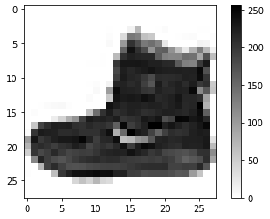

```python
import matplotlib.pyplot as plt 
from tensorflow import kerasas as ker
```


```python
minst=ker.datasets.fashion_mnist 
```


```python
(x_traning,x_label),(y_training,y_label)=minst.load_data()
```


```python
plt.figure() 
plt.imshow(x_traning[0],cmap=plt.cm.binary) 
plt.colorbar() 
plt.grid(False)
plt.show()
```





```python
calasses_name= ["T-short/top","Trouser","PullOver","Dress","Coat","Sanadal","Shirt","Sneaker","bag","Ankel"]
#we will make a normalization to the images 
```


```python
x_traning=x_traning/255.0
y_training=y_training/255.0
```


```python
plt.figure(figsize=(10,10))
for i in range(25) : 
    plt.subplot(5,5,i+1)
    plt.xticks([])
    plt.yticks([])
    plt.grid(False)
    plt.imshow(x_traning[i],cmap=plt.cm.binary)
    plt.xlabel(calasses_name[x_label[i]])
plt.show()
```


```python
model=ker.Sequential(
    [ker.layers.Flatten(input_shape=(28,28)) , 
    ker.layers.Dense(128,activation='relu') , 
     ker.layers.Dense(10,activation='softmax') ]
)

```


```python
#we bulid a model with tree layed input output and classifier
model.compile(optimizer='adam',
              loss='sparse_categorical_crossentropy',
             metrics=['accuracy'])
model.fit(x_traning,x_label,epochs=10)
```

    Train on 60000 samples
    Epoch 1/10
    60000/60000 [==============================] - 8s 127us/sample - loss: 0.5014 - accuracy: 0.8231
    Epoch 2/10
    60000/60000 [==============================] - 5s 85us/sample - loss: 0.3813 - accuracy: 0.8630
    Epoch 3/10
    60000/60000 [==============================] - 5s 87us/sample - loss: 0.3386 - accuracy: 0.8762
    Epoch 4/10
    60000/60000 [==============================] - 5s 87us/sample - loss: 0.3152 - accuracy: 0.8856
    Epoch 5/10
    60000/60000 [==============================] - 5s 87us/sample - loss: 0.2973 - accuracy: 0.8912
    Epoch 6/10
    60000/60000 [==============================] - 5s 88us/sample - loss: 0.2832 - accuracy: 0.8956
    Epoch 7/10
    60000/60000 [==============================] - 6s 92us/sample - loss: 0.2726 - accuracy: 0.8995
    Epoch 8/10
    60000/60000 [==============================] - 5s 87us/sample - loss: 0.2611 - accuracy: 0.9024
    Epoch 9/10
    60000/60000 [==============================] - 5s 89us/sample - loss: 0.2532 - accuracy: 0.9052
    Epoch 10/10
    60000/60000 [==============================] - 5s 87us/sample - loss: 0.2411 - accuracy: 0.9106
    


    <tensorflow.python.keras.callbacks.History at 0x1e1bf85e948>


```python
#not we will evaluate the model in the testing image
test_loss,test_acc=model.evaluate(y_training,y_label,verbose=2)
print("\n Test accur",test_acc)
```

    10000/10000 - 1s - loss: 0.3797 - accuracy: 0.8666
    
     Test accur 0.8666
    


```python
import numpy as np 
predict=model.predict(y_training)
np.argmax(predict[6])
```


    4


```python

```
